.. _ERPyA: http://erpya.com

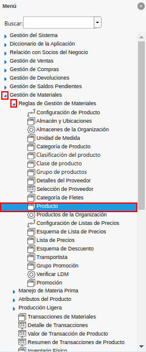
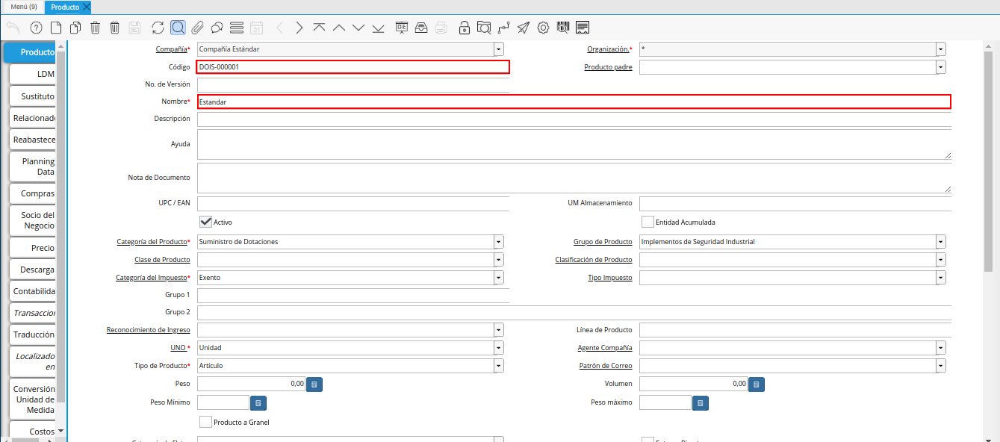
.. |configuración del producto| image:: resources/product-configuration.png
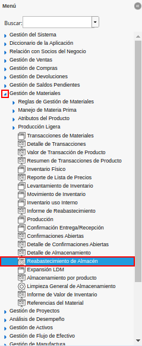
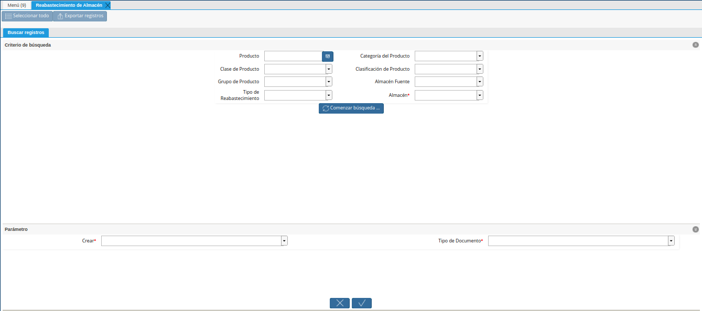
.. |campo producto de la ventana reabastecimiento de almacén| image:: resources/product-field-of-warehouse-replenishment-window.png
.. |campo categoría del producto de la ventana reabastecimiento de almacén| image:: resources/product-category-field-of-the-warehouse-replenishment-window.png
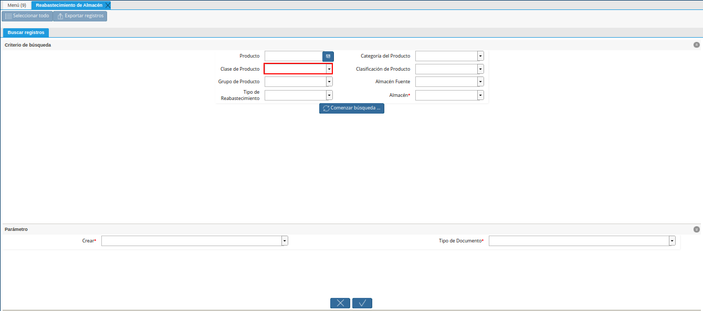
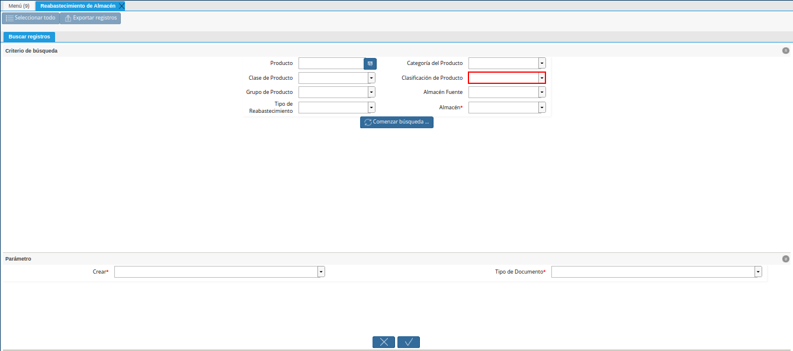
.. |campo grupo de producto de la ventana reabastecimiento de almacén| image:: resources/warehouse-replenishment-window-product-group-field.png
.. |campo almacén fuente de la ventana reabastecimiento de almacén| image:: resources/field-warehouse-source-window-warehouse-replenishment.png
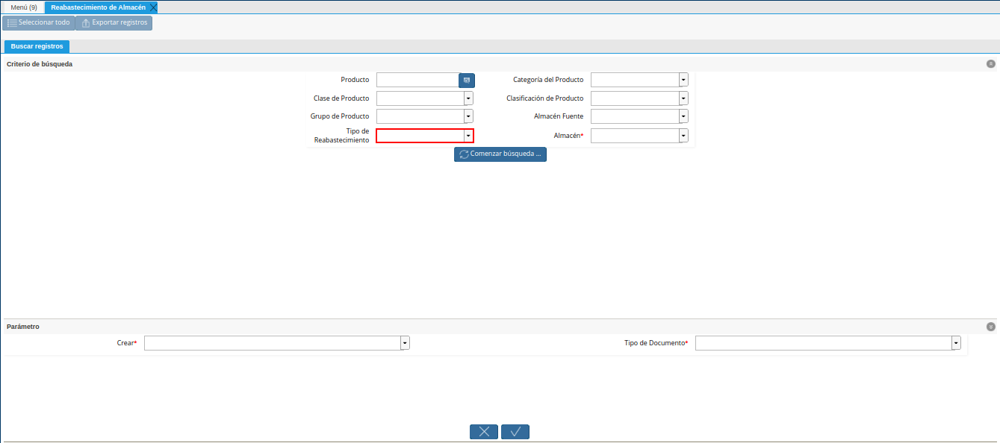
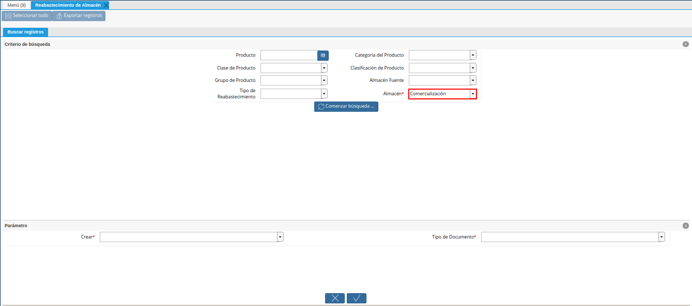
.. |opción comenzar búsqueda de la ventana reabastecimiento de almacén| image:: resources/option-start-search-of-warehouse-replenishment-window.png
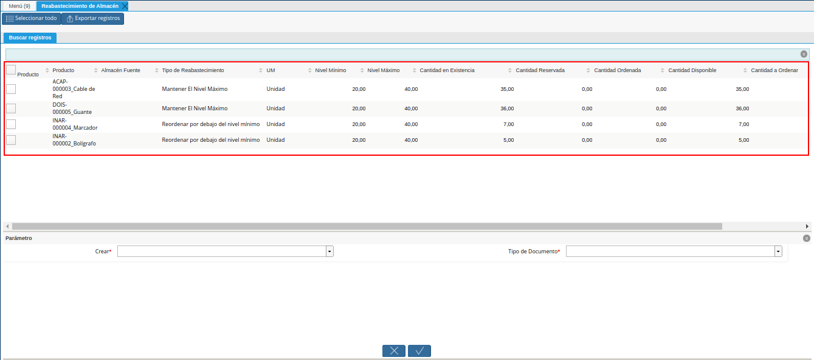
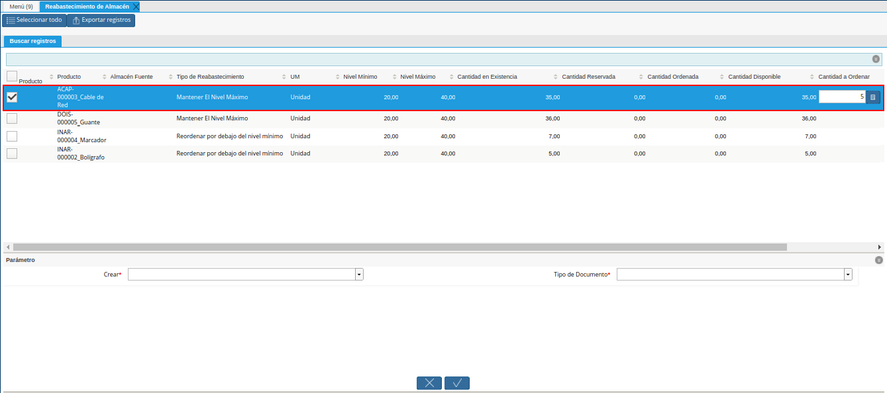
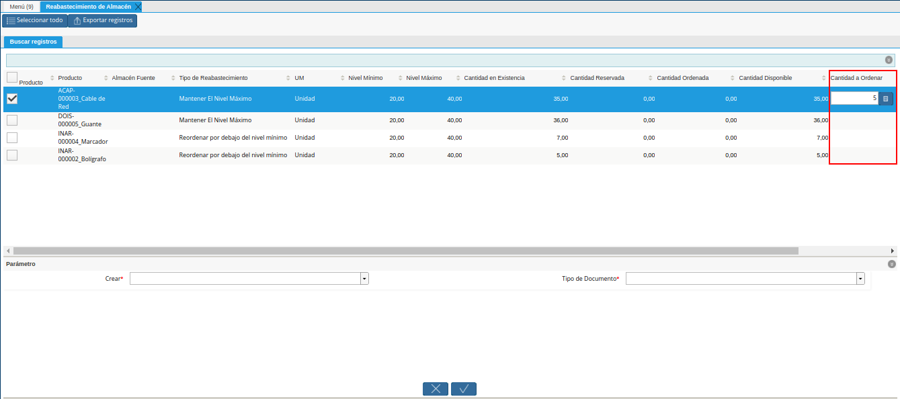
.. |campo crear de la ventana reabastecimiento de almacén| image:: resources/create-field-of-warehouse-replenishment-window.png
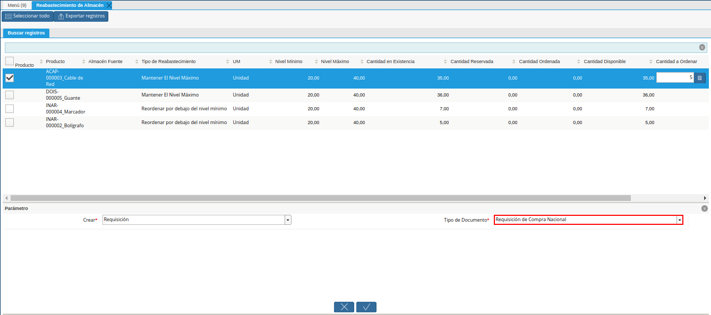
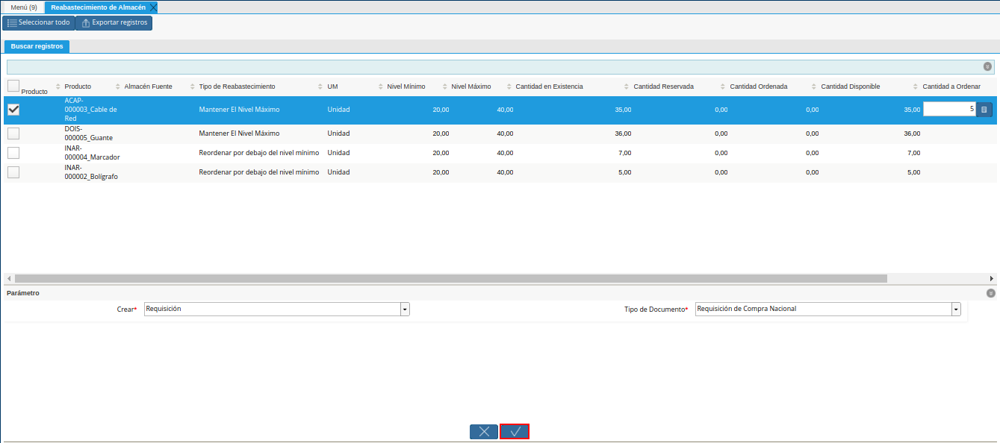
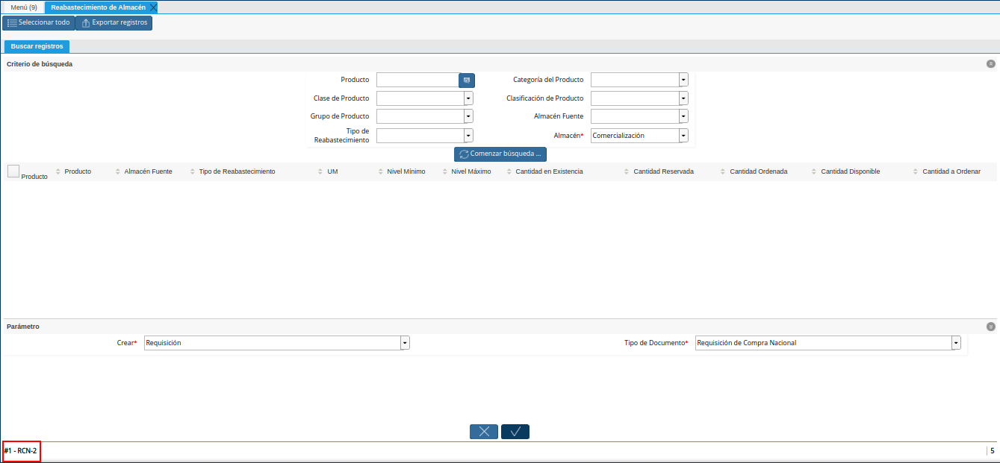
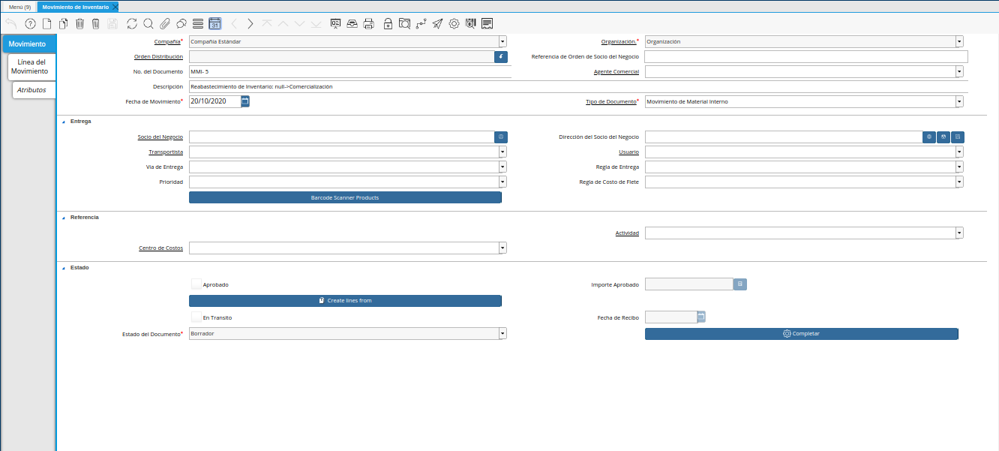
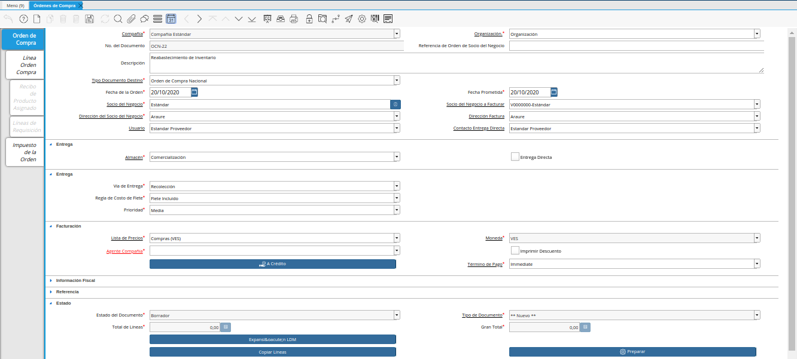
.. |consulta de orden de distribución| image:: resources/distribution-order-query.png
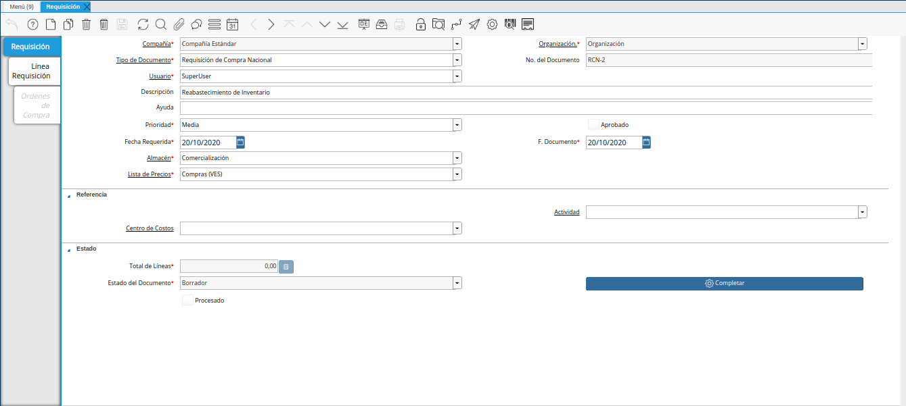

.. _documento/reabastecer-productos:

**Proceso de Reabastecimiento**
===============================

El proceso de reabastecimiento permite generar los respectivos documentos de movimiento de material, requisición, orden de compra, o de distribución, en estado "**Borrador**". El comportamiento del proceso consta en el tipo de reabastecimiento seleccionado en la configuración del producto. ADempiere permite utilizar los siguientes tipos de reabastecimiento:

    - **Mantener El Nivel Máximo**
    - **Manual**
    - **Personalizado**
    - **Reordenar por debajo del nivel mínimo**
    - **Plan de reabastecimiento calculado**

    Para simular el proceso de reabastecimiento, se presentan los siguientes datos como ejemplo:

    +-------------------------------+-------------------+---------------------------------------+-------+-----------------+-----------------+---------------------------+-----------------------+----------------------+
    | **Producto**                  | **Almacén Fuente**| **Tipo de Reabastecimiento**          | **UM**| **Nivel Mínimo**| **Nivel Máximo**| **Cantidad en Existencia**| **Cantidad a Ordenar**| **Socio del Negocio**|
    +===============================+===================+=======================================+=======+=================+=================+===========================+=======================+======================+
    |DOIS-000001_Estandar           |                   |Mantener El Nivel Máximo               |Unidad |20               |40               |60                         |0                      | Estándar             |
    +-------------------------------+-------------------+---------------------------------------+-------+-----------------+-----------------+---------------------------+-----------------------+                      +
    |ACAP-000003_Cable de Red       |                   |Mantener El Nivel Máximo               |Unidad |20               |40               |41                         |0                      |                      |
    +-------------------------------+-------------------+---------------------------------------+-------+-----------------+-----------------+---------------------------+-----------------------+                      +
    |Estándar_Estándar              |                   |Mantener El Nivel Máximo               |Unidad |20               |40               |35                         |5                      |                      |
    +-------------------------------+-------------------+---------------------------------------+-------+-----------------+-----------------+---------------------------+-----------------------+                      +
    |DOIS-000005_Guante             |                   |Mantener El Nivel Máximo               |Unidad |20               |40               |36                         |4                      |                      |
    +-------------------------------+-------------------+---------------------------------------+-------+-----------------+-----------------+---------------------------+-----------------------+                      +
    |INAR-000001_Hoja tamaño carta  |                   |Reordenar por debajo del nivel mínimo  |Unidad |20               |40               |20                         |0                      |                      |
    +-------------------------------+-------------------+---------------------------------------+-------+-----------------+-----------------+---------------------------+-----------------------+                      +
    |INAR-000002_Bolígrafo          |                   |Reordenar por debajo del nivel mínimo  |Unidad |20               |40               |5                          |15                     |                      |
    +-------------------------------+-------------------+---------------------------------------+-------+-----------------+-----------------+---------------------------+-----------------------+                      +
    |INAR-000003_Cuaderno           |                   |Reordenar por debajo del nivel mínimo  |Unidad |20               |40               |25                         |0                      |                      |
    +-------------------------------+-------------------+---------------------------------------+-------+-----------------+-----------------+---------------------------+-----------------------+                      +
    |INAR-000004_Marcador           |                   |Reordenar por debajo del nivel mínimo  |Unidad |20               |40               |7                          |13                     |                      |
    +-------------------------------+-------------------+---------------------------------------+-------+-----------------+-----------------+---------------------------+-----------------------+----------------------+

Para ejecutar correctamente el proceso de reabastecimiento de almacén, es necesario que se realicen los procedimientos que a continuación se explican.

**Configuración Esencial**
--------------------------

#. Ubique y seleccione en el menú de ADempiere, la carpeta "**Gestión de Materiales**", luego seleccione la carpeta "**Reglas de Gestión de Materiales**", por último seleccione la ventana "**Producto**". 

    |menú de producto|

    Menú de ADempiere

#. Podrá visualizar la ventana "**Producto**", con todos los registros de los productos en ADempiere, en la cual debe ubicar el registro del producto involucrado en el proceso de reabastecimiento, para realizar la configuración esencial del mismo.

    |producto a configurar|

    Imagen 2. Producto a Configurar

#. Seleccione la pestaña "**Reabastecer**", ubicada del lado izquierdo de la ventana "**Producto**" y realice el procedimiento explicado en el proceso :ref:`paso/reabastecer-producto`, del documento :ref:`documento/producto`,  elaborado por `ERPyA`_. Para el ejemplo del presente documento, se tienen las siguientes restricciones:

    - "**Almacén**": Comercialización
    - "**Tipo de Reabastecimiento**": Mantener El Nivel Máximo ó Reordenar por debajo del nivel mínimo
    - "**Nivel Mínimo**": 20
    - "**Nivel Máximo**": 40

    |configuración del producto|

    Imagen 3. Configuración del Producto

**Ejecución del Proceso**
-------------------------

#. Ubique y seleccione en el menú de ADempiere, la carpeta "**Gestión de Materiales**", luego seleccione la ventana de búsqueda inteligente "**Reabastecimiento de Almacén**".

    |menú reabastecimiento de almacén|

    Imagen 4. Menú Reabastecimiento de Almacén

#. Podrá visualizar la ventana "**Reabastecimiento de Almacén**", con diferentes campos que permiten filtrar la información para generar el documento requerido.

    |ventana reabastecimiento de almacén|

    Imagen 5. Ventana Reabastecimiento de Almacén

#. Seleccione en el campo "**Producto**", el producto por el cual requiere filtrar la información.

    |campo producto de la ventana reabastecimiento de almacén|

    Imagen 6. Campo Producto de la Ventana Reabastecimiento de Almacén

#. Seleccione en el campo "**Categoría del Producto**", la categoría del producto por el cual requiere filtrar la información.

    |campo categoría del producto de la ventana reabastecimiento de almacén|

    Imagen 7. Campo Categoría del Producto de la Ventana Reabastecimiento de Almacén

#. Seleccione en el campo "**Clase de Producto**", la clase del producto por la cual requiere filtrar la información.

    |campo clase de producto de la ventana reabastecimiento de almacén|

    Imagen 8. Campo Clase de Producto de la Ventana Reabastecimiento de Almacén

#. Seleccione en el campo "**Clasificación de Producto**", la clasificación del producto por el cual requiere filtrar la información.

    |campo clasificación del producto de la ventana reabastecimiento de almacén|

    Imagen 9. Campo Clasificación de Producto de la Ventana Reabastecimiento de Almacén

#. Seleccione en el campo "**Grupo de Producto**", el grupo de producto por el cual requiere filtrar la información.

    |campo grupo de producto de la ventana reabastecimiento de almacén|

    Imagen 10. Campo Grupo de Producto de la Ventana Reabastecimiento de Almacén

#. Seleccione en el campo "**Almacén Fuente**", el almacén fuente por el cual requiere filtrar la información.

    |campo almacén fuente de la ventana reabastecimiento de almacén|

    Imagen 11. Campo Almacén Fuente de la Ventana Reabastecimiento de Almacén

#. Seleccione en el campo "**Tipo de Reabastecimiento**", el tipo de reabastecimiento por el cual requiere filtrar la información.

    |campo tipo de reabastecimiento de la ventana reabastecimiento de almacén|

    Imagen 12. Campo Tipo de Reabastecimiento de la Ventana Reabastecimiento de Almacén

#. Seleccione en el campo "**Almacén**", el almacén por el cual requiere filtrar la información.

    |campo almacén de la ventana reabastecimiento de almacén|

    Imagen 13. Campo Almacén de la Ventana Reabastecimiento de Almacén

#. Seleccione la opción "**Comenzar Búsqueda**", para filtar la información en base a lo seleccionado en los campos anteriormente explicados.

    |opción comenzar búsqueda de la ventana reabastecimiento de almacén|

    Imagen 14. Opción Comenzar Búsqueda de la Ventana Reabastecimiento de Almacén

#. Podrá visualizar los diferentes registros de configuración de reabastecimiento que contienen los productos.

    |listado de registro de configuración de productos|

    Imagen 15. Listado de Registro de Configuración de Productos

    #. Seleccione el registro del producto que requiere reabastecer.

        |selección de producto a reabastecer|

        Imagen 16. Selección de Producto a Reabastecer

    #. Al seleccionar el registro del produto, se habilita el campo de la columna "**Cantidad a Ordenar**", con el valor que se requiere para cumplir con la cantidad de productos establecida en la configuración del mismo.

        |cantidad a ordenar|

        Imagen 17. Campo Cantidad a Ordenar

#. Seleccione en el campo "**Crear**", el documento que requiere crear para reabastecer el producto en el almacén seleccionado.

    |campo crear de la ventana reabastecimiento de almacén|

    Imagen 18. Campo Crear de la Ventana Reabastecimiento de Almacén

    .. note::

        Cuando se requiere generar el documento "**Orden de Compra**", es obligatorio seleccionar el socio del negocio proveedor en la columna "**Socio del Negocio**" de la ventana "**Reabastecimiento de Almacén**".

#. Seleccione en el campo "**Tipo de Documento**", el tipo de documento con el que requiere que se genere el documento en estado "**Borrador**".

    |campo tipo de documento de la ventana reabastecimiento de almacén|

    Imagen 19. Campo Tipo de Documento de la Ventana Reabastecimiento de Almacén

#. Seleccione la opción "**OK**", para ejecutar el proceso "**Reabastecimiento de Almacén**".

    |opción ok de la ventana reabastecimiento de almacén|

    Imagen 20. Opción OK de la Ventana Reabastecimiento de Almacén

#. Podrá visualizar en la parte inferior izquierda de la ventana, el número de identificación del documento generado.

    |número de documento generado en la ventana reabastecimiento de almacén|

    Imagen 21. Número de Documento Generado en la Ventana Reabastecimiento de Almacén

**Resultado Obtenido**
----------------------

#. Si en el campo "**Crear**", de la ventana "**Reabastecimiento de Almacén**", es seleccionada la opción "**Mover Inventario**". La consulta del documento generado se realiza en la ventana "**Movimiento de Inventario**", con ayuda del número de documento generado al ejecutar el proceso.

    |consulta de mover inventario|

    Imagen 20. Consulta de Mover Inventario

#. Si en el campo "**Crear**", de la ventana "**Reabastecimiento de Almacén**", es seleccionada la opción "**Orden de Compra**". La consulta del documento generado se realiza en la ventana "**Órdenes de Compra**", con ayuda del número de documento generado al ejecutar el proceso.

    |consulta de orden de compra|

    Imagen 21. Consulta de Orden de Compra

#. Si en el campo "**Crear**", de la ventana "**Reabastecimiento de Almacén**", es seleccionada la opción "**Orden de Distribución**". La consulta del documento generado se realiza en la ventana "**Orden de Distribución**", con ayuda del número de documento generado al ejecutar el proceso.

    |consulta de orden de distribución|

    Imagen 22. Consulta de Orden de Distribución

#. Si en el campo "**Crear**", de la ventana "**Reabastecimiento de Almacén**", es seleccionada la opción "**Requisición**". La consulta del documento generado se realiza en la ventana "**Requisición**", con ayuda del número de documento generado al ejecutar el proceso.

    |consulta de requisición|

    Imagen 23. Consulta de Requisición