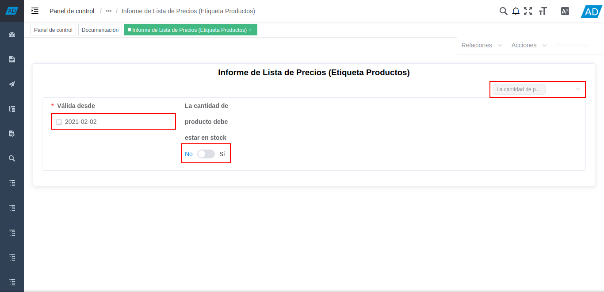
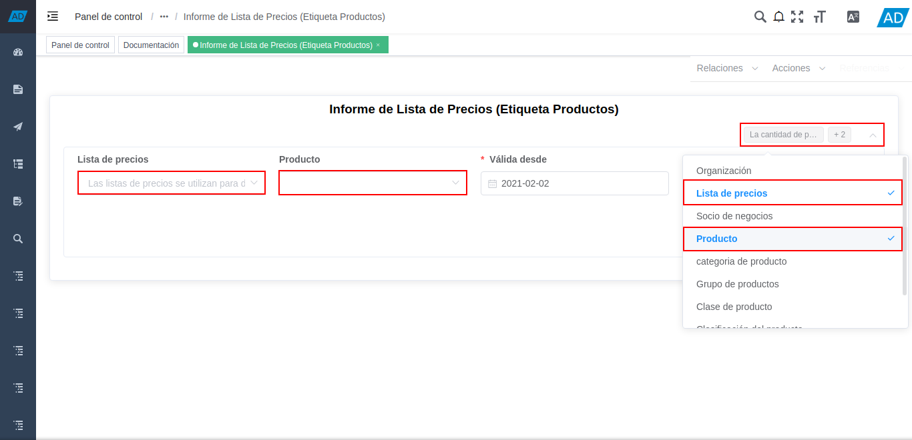
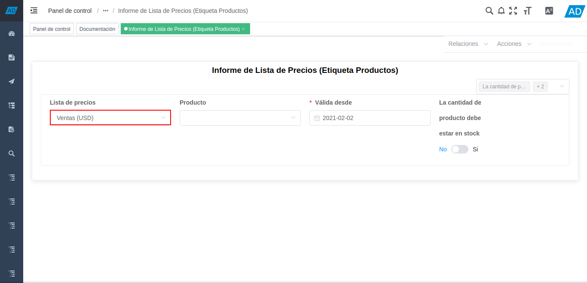
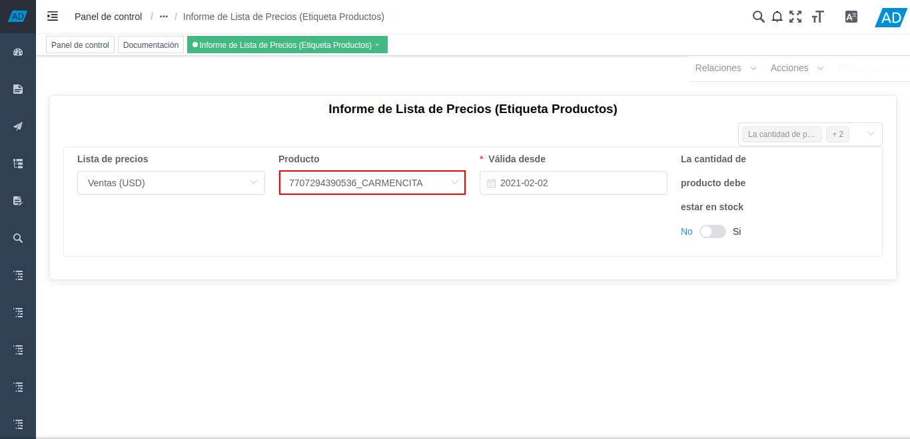
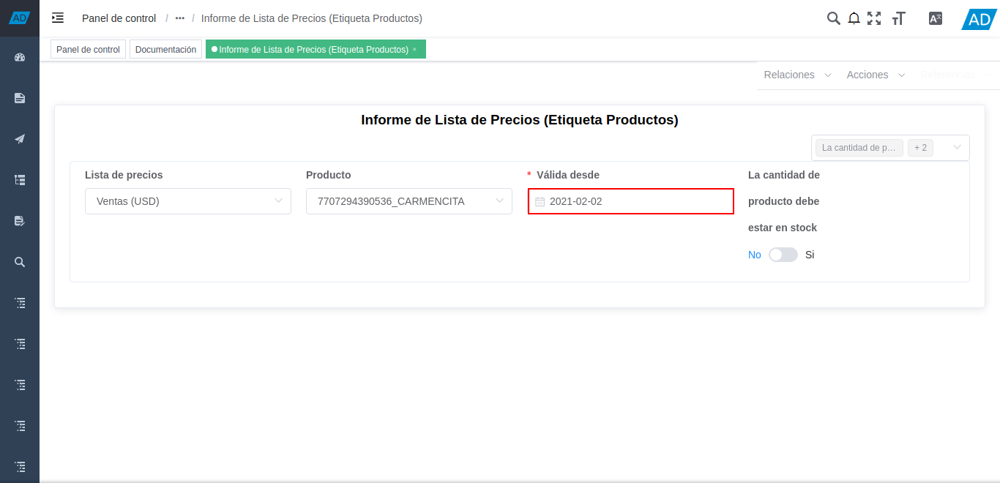
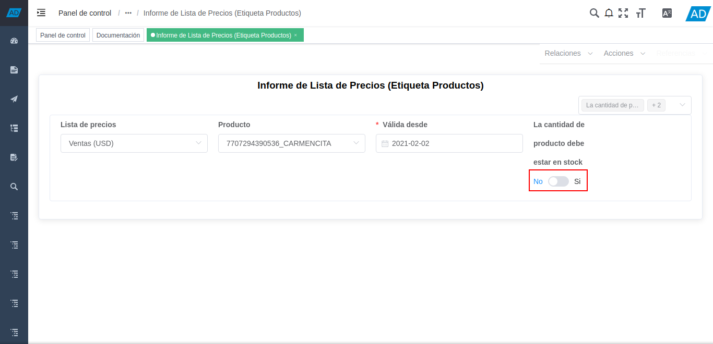
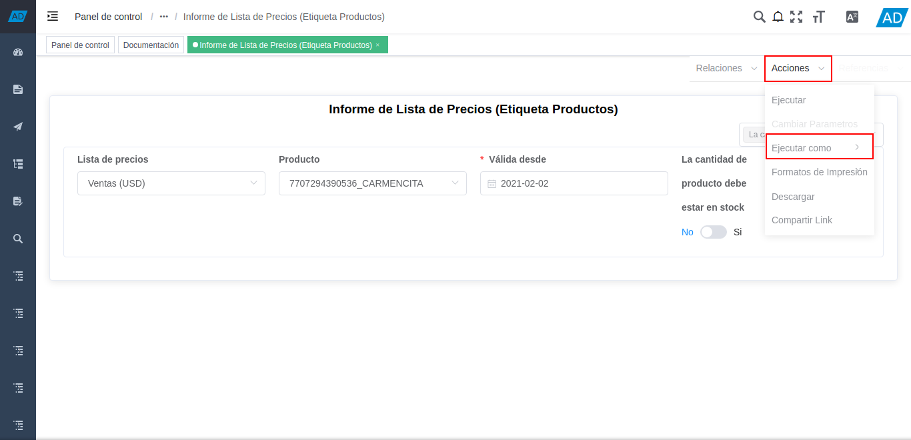
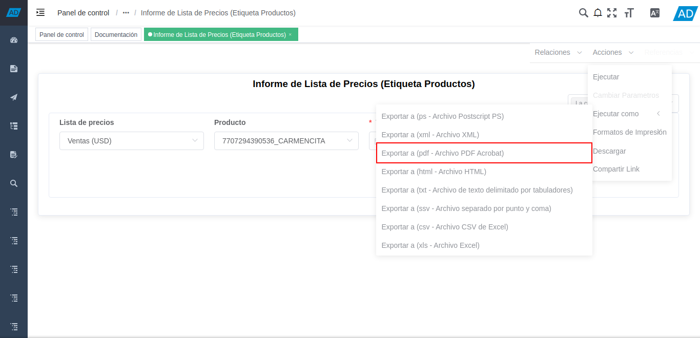
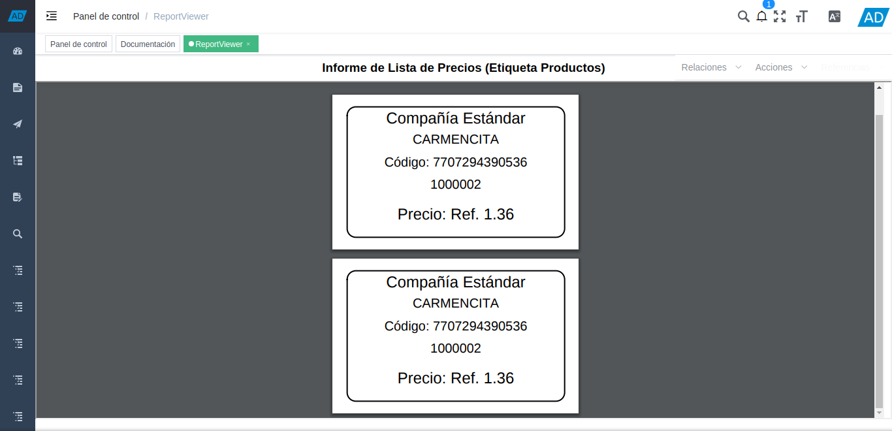

.. |menú de reportes de productos| image:: resources/product-reports-menu.png
.. |carpeta reportes de productos| image:: resources/product-reports-folder.png
.. |selección del informe de lista de precios etiqueta productos| image:: resources/price-list-report-selection-label-products.png

.. _documento/informe-de-lista-de-precios-etiqueta-productos:

**Informe de Lista de Precios (Etiqueta Productos)**
====================================================

#. Ubique y seleccione en el menú de ADempiere, la carpeta "**Gestión de Materiales**", luego seleccione la carpeta "**Reportes de Productos**".

    |menú de reportes de productos|

    Imagen 1. Menú de ADempiere

#. Podrá visualizar la carpeta "**Reportes de Productos**", con diferentes reportes de precios de productos.

    |carpeta reportes de productos|

    Imagen 2. Carpeta Reporte de Productos

#. Seleccione el reporte "**Informe de Lista de Precios (Etiqueta Productos)**", para generar un reporte con las etiquetas de los productos, con sus respectivos nombres, códigos, descripciones y precios.

    |selección de informe de lista de precios etiqueta productos|

    Imagen 3. Selección de Informe de Lista de Precios (Etiqueta Productos)

#. Podrá visualizar de la siguiente manera la ventana del reporte "**Informe de Lista de Precios (Etiqueta Productos)**", con el campo "**Columnas Opcionales**", que permite seleccionar los campos que el usuario puede utilizar como filtros de búsqueda para generar el reporte en base a lo requerido.

    Adicional a ello, la ventana del reporte cuenta con dos (2) campos obligatorios como lo son el campo "**Válidad Desde**" y el campo "**La cantidad de producto debe estar en stock**".

    |campo columnas opcionales del informe de lista de precios etiqueta productos|

    Imagen 4. Campo Columnas Opcionales

#. Seleccione en el campo "**Columnas Opcionales**", los diferentes campos requeridos para filtrar la búsqueda de información.

    Al seleccionar las diferentes opciones que presenta el campo, se puede visualizar en la ventana de manera automática, el campo seleccionado previamente.

    |campos o filtros de búsqueda para el informe de lista de precios etiqueta productos|

    Imagen 5. Campos o Filtros de Búsqueda

    .. note::

        Para el presente ejemplo se agregan los campos "**Producto**" y "**Lista de Precios**".

#. Seleccione en el campo "**Lista de Precios**", la lista de precios por la cual requiere filtrar la información del reporte.

    |campo lista de precios para el informe de lista de precios etiqueta productos|

    Imagen 6. Campo Lista de Precios

#. Seleccione en el campo "**Producto**", el producto por el cual requiere filtrar la información del reporte.

    |campo producto para el informe de lista de precios etiqueta productos|

    Imagen 7. Campo Producto

#. Seleccione en el campo "**Válida Desde**", la fecha de inicio del periodo de validez del precio del producto seleccionado previamente.

    |campo válida desde para el informe de lista de precios etiqueta productos|

    Imagen 8. Campo Válida Desde

#. Indique en el campo "**La cantidad de producto debe estar en stock**", si requiere que la cantidad del producto debe estar en stock.

    |campo la cantidad de producto debe estar en stock para el informe de lista de precios etiqueta productos|

    Imagen 9. Campo La cantidad de producto debe estar en stock

#. Posicione el cursor sobre la opción "**Acciones**" y luego sobre la opción "**Ejecutar Como**", desplegada de la misma.

    |opción acciones y ejecutar como para el informe de lista de precios etiqueta productos|

    Imagen 10. Opción Acciones y Opción Ejecutar Como

#. Finalmente, seleccione la opción "**Exportar a (pdf - Archivo PDF Acrobat)**".

    |opción exportar archivo a pdf para el informe de lista de precios etiqueta productos|

    Imagen 11. Opción Exportar Archivo a PDF

#. Podrá visualizar el reporte "**Etiquetas para Productos**" de la siguiente manera.

    |informe de lista de precios etiqueta productos|

    Imagen 12. Reporte Etiquetas para Productos

.. note::

    Recuerde que el resultado del reporte va a depender de los campos o filtros de búsqueda utilizados al momento de generar el mismo.