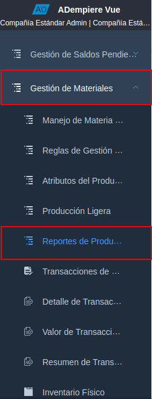
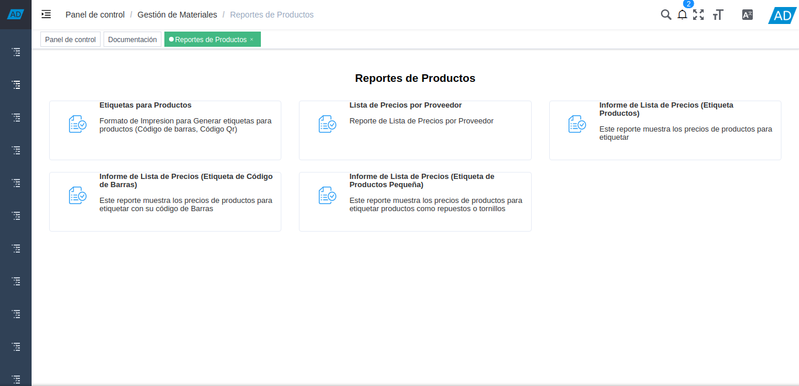
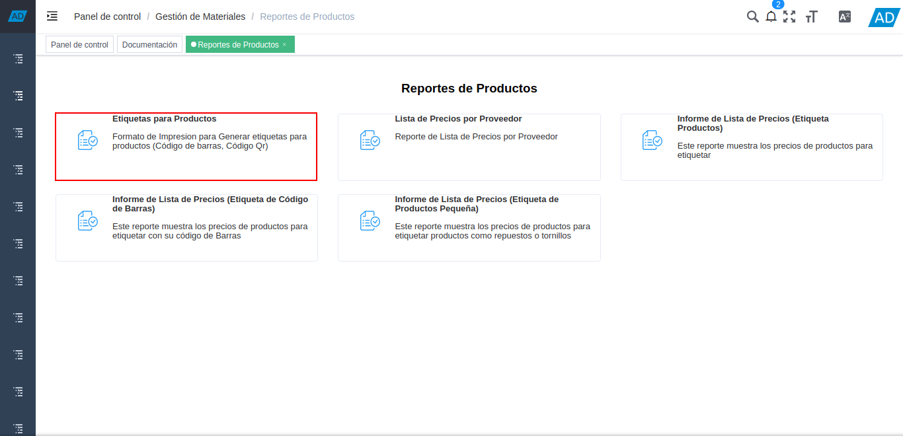
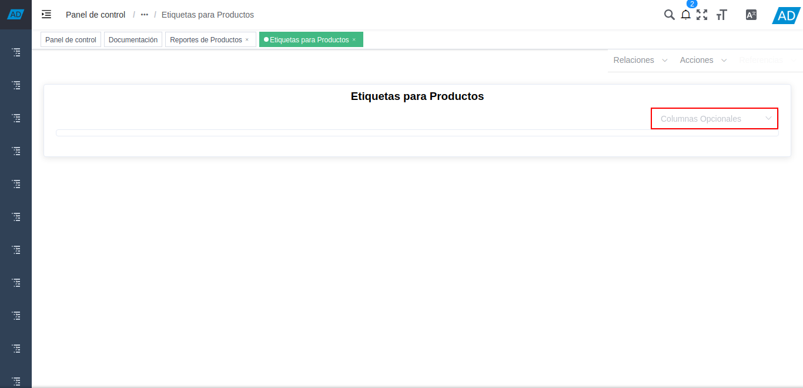
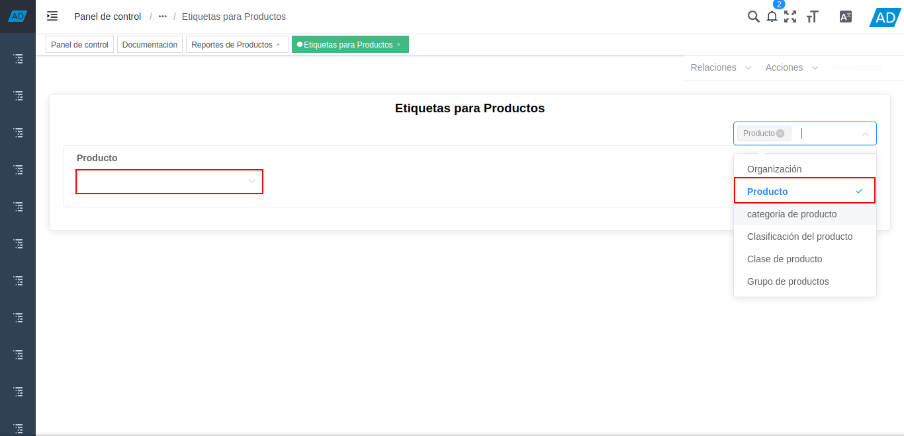
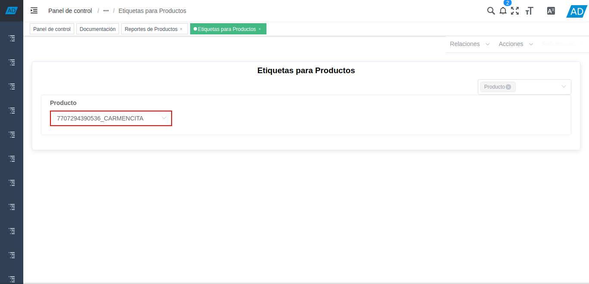
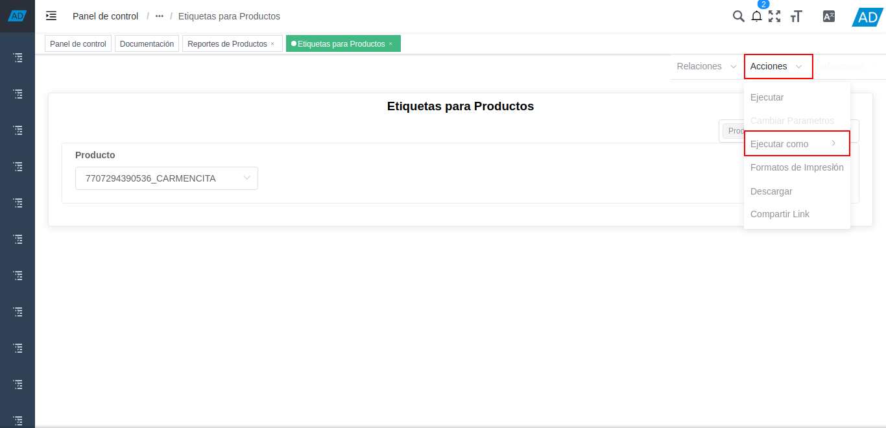
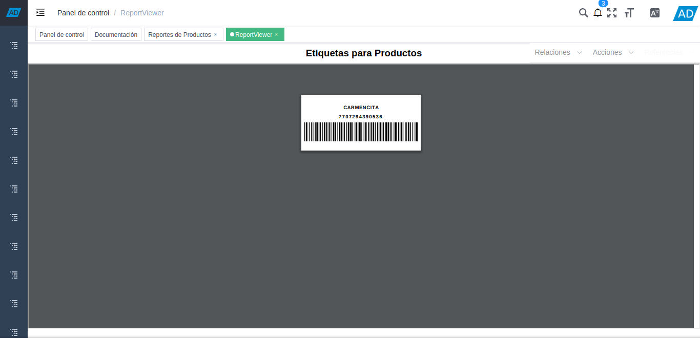

.. |opción exportar archivo a pdf| image:: resources/option-export-file-to-pdf.png

.. _documento/etiquetas-para-productos:

**Etiquetas para Productos**
============================

#. Ubique y seleccione en el menú de ADempiere, la carpeta "**Gestión de Materiales**", luego seleccione la carpeta "**Reportes de Productos**".

    |menú de reportes de productos|

    Imagen 1. Menú de ADempiere

#. Podrá visualizar la carpeta "**Reportes de Productos**", con diferentes reportes de precios de productos.

    |carpeta reportes de productos|

    Imagen 2. Carpeta Reporte de Productos

#. Seleccione el reporte "**Etiquetas para Productos**", para generar un reporte con las etiquetas de los productos, con sus respectivos código de barra o código Qr.

    |selección de reporte de etiquetas para productos|

    Imagen 3. Selección de Reporte de Etiquetas para Productos

#. Podrá visualizar de la siguiente manera la ventana del reporte "**Etiquetas para Productos**", con el campo "**Columnas Opcionales**", que permite seleccionar los campos que el usuario puede utilizar como filtros de búsqueda para generar el reporte en base a lo requerido.

    |campo columnas opcionales del reporte etiquetas para productos|

    Imagen 4. Campo Columnas Opcionales

#. Seleccione en el campo "**Columnas Opcionales**", los diferentes campos requeridos para filtrar la búsqueda de información.

    Al seleccionar las diferentes opciones que presenta el campo, se puede visualizar en la ventana de manera automática, el campo seleccionado previamente.

    |campos o filtros de búsqueda para el reporte etiquetas para productos|

    Imagen 5. Campos o Filtros de Búsqueda

    .. note::
    
        Para el presente ejemplo, se agrega solamente el campo "**Producto**", para generar el reporte en base a un producto en específico.

#. Seleccione en el campo "**Producto**", el producto por el cual requiere filtrar la información del reporte.

    |campo producto para el reporte etiquetas para productos|

    Imagen 6. Campo Producto

#. Posicione el cursor sobre la opción "**Acciones**" y luego sobre la opción "**Ejecutar Como**", desplegada de la misma.

    |opción acciones y ejecutar como|

    Imagen 7. Opción Acciones y Opción Ejecutar Como

#. Finalmente, seleccione la opción "**Exportar a (pdf - Archivo PDF Acrobat)**".

    |opción exportar archivo a pdf|

    Imagen 8. Opción Exportar Archivo a PDF

#. Podrá visualizar el reporte "**Etiquetas para Productos**" de la siguiente manera.

    |reporte etiquetas para productos|

    Imagen 9. Reporte Etiquetas para Productos

.. note::

    Recuerde que el resultado del reporte va a depender de los campos o filtros de búsqueda utilizados al momento de generar el mismo.