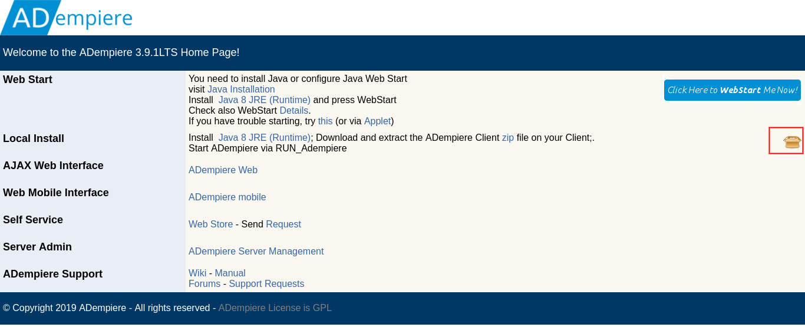

**Pasos a Seguir para Implementar el Pack In**
==============================================

Los Paquetes a migrar se deben migrar con el orden indicado, Además se
deben descomprimir los Archivos.

Siguiendo los pasos descritos a continuación.

1. Descargar La Versión de Escritorio de ADempiere (Swing) a Través de
   el icono mostrado en la imagen a continuación:

   Descargar Interfaz de Escritorio

2. Ingresar Con el Rol System Administrator en ADempiere.

3. Acceder a la carpeta diccionario de aplicación del menú e ingresar en
   la carpeta Empaquetado de aplicación .

4. Ingresar a la Ventana Importar Paquete (PackIn).

5. Llenar los campos según el orden indicado.

.. figure:: img/packin.png
   :alt: Ventana Pack In

   Ventana Pack In

-  En el Campo Tipo Paquete Fuente: Seleccionar Archivo.

-  En el Campo Fuente Paquete: Agregar archivo comprimido ZIP.

-  Directorio de Paquete: Agregar el directorio del archivo comprimido
   ZIP.

!!! note "Nota"

::

     El Proceso se debe repetir por cada uno de los paquetes a importar.

!!! warning "Confirmada la Importación Exitosa"

::

     Para visualizar las ventanas y su traducción es necesario aplicar los siguientes procesos:
     
     - Con el Rol System Administrator: Sincronizar Terminología
     
     - Con el Rol Asignado: Actualización de Rol
