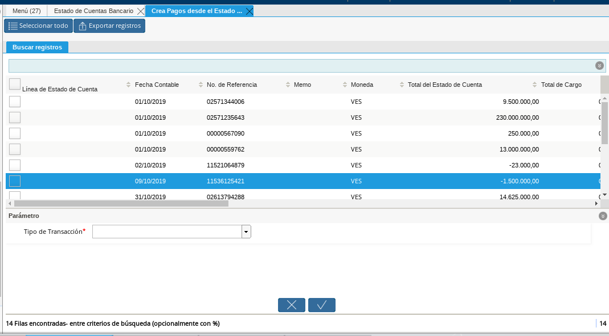

.. _documento/pagos-cobros-sin-Identificar:
.. _ERPyA: http://erpya.com

.. |Estado de Cuenta| image:: resources/Estado_Cuenta.png

**Pagos o Cobros sin Identificar**
~~~~~~~~~~~~~~~~~~~~~~~~~~~~~~~~~~

Al momento de hacer la conciliaciòn bancaria la mayorìa de las veces suelen haber movimientos en el extracto bancario qué se desconocen de donde provienen, y para ADempiere todos los movimiento qué tiene el extracto bancario deben ser identificados ó asociados a un **"Pago/Cobro"** ya qué  de no ser identificados ADempiere  no permitirá completar la conciliación bancaria, el cual implica qué dentro de ADempiere no se ha realizado ninguna conciliación.

Para los movimientos bancarios qué se desconocen de dónde proviene, en ADempiere se llevan a pagos/cobros no identificados, para poder completar e identificar todos esos movimientos qué posee el extracto bancario.

.. note ::

	Los **"Pago/Cobro"**qué se pasen a ser no identificados, luego podrán ser identificados una vez se verifique su procedencia.

Para poder llevar estas transacciones bancarias a **"Pagos o Cobros sin Identificar"**  se debe realizar los siguientes pasos:

#. Debe dirigirse a la ventana padre **”Estado de Cuenta Bancario”** .

      |Estado de Cuenta|

      Imagen 1. Estado de Cuenta

#. Seleccione el icono **”Proceso”**, en la barra de herramientas de ADempiere.

      .. figure:: resources/iconoproceso.png
         :alt: Icono Proceso

         Imagen 2. Icono Proceso

#. Seleccione la opción **”Crear Pago desde Estado de Cuenta”**.

      .. figure:: resources/crearpago.png
         :alt: Opción Crear Pago desde Estado de Cuenta

         Imagen 3. Opción Crear Pago desde Estado de Cuenta

#. Podrá observar la ventana de búsqueda inteligente donde se muestran todos los movimientos bancarios qué no se les encontró una coincidencia al momento de hacer la conciliación automática.

      |movimientos|

      Imagen 4. Movimientos

#. Seleccione el o los **"Pago/Cobro"** con procedencia desconocida.

#. Seleccione en el campo "**Tipo de Transacción**" la opción "**Pago Sin Identificar**".

      .. figure:: resources/pagosinident.png
         :alt: Campo Tipo de Transacción

         Imagen 17. Campo Tipo de Transacción

#. Seleccione la opción "**OK**" para generar automáticamente el documento de **"Pago/Cobro"** en ADempiere y esté pueda ser asociado con el movimiento bancario desconocido.

      .. figure:: resources/okcaso2.png
         :alt: Opción OK

         Imagen 18. Opción OK

..  note :: 

      Al seleccionar la opción "**OK**"  ADempiere a  lo llevará a la ventana padre **”Estado de Cuenta Bancario”**; ADempiere creará un **"Pago/Cobro"** con las mismas características del movimiento bancario desconocido en cuanto monto, fecha , y moneda.

#. Podrá visualizar el **"Pago/Cobro"** no identificado en la pestaña **”Línea Estado de Cuentas”** el cual contará con las siguientes caracteristicas:

#. La descripción de la **“Línea Estado de Cuenta”** debe tener como descripción **””
Pago no identificado””**

#. En el campo **”Pago”**  debe tener asociado el N° del documento del **"Pago/Cobro"** qué se creó al momento de aplicar el proceso **”Pago Sin Identificar”**

.. note ::

      El n° de documento a mostrar debe coincidir con el n° qué se muestra el campo **”N° de Referencia”** el cual es el número de la referencia bancaria de ese movimiento.

#. En el grupo de campos **“Referencia”**  debe aparecer como **”Socio de Negocio**””  **”Pagos/Cobros Sin Identificar”**, este es un socio de negocio qué tomará temporalmente el **"Pago/Cobro"** sin identificar.

.. note ::

      El socio de negocio **”Pagos/Cobros Sin Identificar”** es un socio de negocio qué toma temporalmente el **"Pago/Cobro"**"** sin identificar, el cual más adelante será modificado una vez se desee identificar ese **"Pago/Cobro"**
