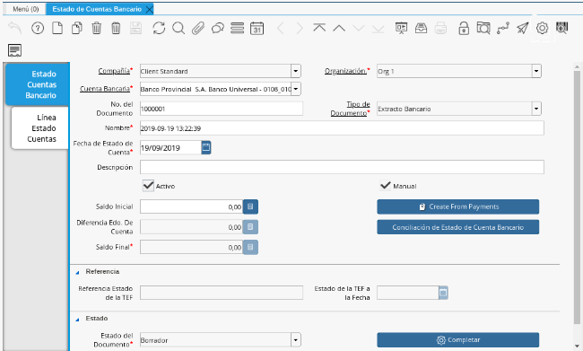
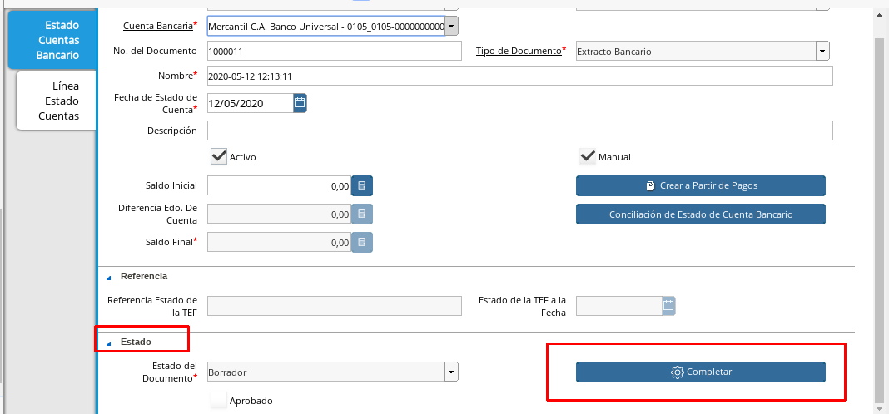

.. _documento/crear-pagos-desde-estado-de-cuenta:
.. _ERPyA: http://erpya.com

.. |Botón Completar| image:: resources/Boton_Completar.png

**Crear pagos desde Estado de Cuenta**
--------------------------------------

El proceso "**Crear pagos desde Estado de Cuenta**" es realizado por consecuencia de la existencia de pagos/cobros que se encuentran en el extracto bancario y al momento de la conciliación y no se encuentra ninguna coincidencia con los movimientos registrados en ADempiere; el mismo parte del proceso de conciliación automática, donde ADempiere al importar el extracto bancario  verificar los movimientos registrado en ADempiere este realiza una verificación de coincidencias de pagos/cobros en ambos lados, mayormente se encuentran muchos movimientos en el extracto bancario que no han sido registrados en ADempiere y no solo es por que no se lleve un buen control de los registros si no que los extractos bancarios poseen detalladamente otros tipo de transacciones como comisiones bancarias que en algunos casos no son regisrados en ADempiere, pero para este tipo de caso, se encuentra este proceso, ya que es muy importante que todos los movimientos bancarios concidan en su totalidad con los regisros en ADempiere o que los mismos logren ser identificados, ya que de lo contrario la conciliación no podra ser completada en ADempiere.

El presente material elaborado por `ERPyA`_ pretende ofrecerle una explicación eficiente a nuestros clientes del procedimiento a seguir para la creación de pagos y cobros sin registros en ADempiere, partiendo desde el registro de pagos / cobros existentes en el extracto bancario importado, obteniendo un resultado exitoso al momento de conciliación de cuentas en la versión 3.9.2 de ADempiere en la localización Venezuela.

.. _paso/cobros-sin-registros:

**Pagos/Cobros sin registros en ADempiere**
-------------------------------------------

Los pagos o cobros sin registro en ADempiere pueden presentarse en las empresas a causa de diferentes motivos los cuales pueden ser que no fueron resgitrados a tiempo o correctamente o la cuenta bancaria a recibido un cobro por adelantado y este no ha sido notificado al personal que lleva los registros de los pagos/cobros en ADempiere, el registro de los mismos puede realizarce de tres formas explicadas a continuación.

#. Luego de realizar el proceso de conciliación, ubique la "**Línea Estado Cuentas**".

      .. figure:: resources/lineacaso1.png
         :alt: Pago o Cobro de Comisiones

         Imagen 1. Pago o Cobro de Comisiones

#. Seleccione el icono "**Proceso**", en la barra de herramientas de ADempiere.

      .. figure:: resources/iconoproceso.png
         :alt: Icono Proceso

         Imagen 2. Icono Proceso

#. Seleccione la opción "**Crear Pago desde Estado de Cuenta**".

      .. figure:: resources/crearpago.png
         :alt: Opción Crear Pago desde Estado de Cuenta

         Imagen 3. Opción Crear Pago desde Estado de Cuenta

   #. Podrá visualizar la siguiente ventana de busqueda inteligente con los "**Pagos/Cobros**" que no tuvieron coincidencias al momento de conciliar.

      .. figure:: resources/ventana.png
         :alt: Ventana de Busqueda Inteligente

         Imagen 4. Ventana de Busqueda Inteligente

    #. Hasta este punto solo se puede visualizar los movimientos bancarios sin conciliar, pero la mayoria de estos movimientos bancarios pertenecen a otros tipos de transacciones como lo son los  "**Cargos Bancarios**", "**Otro Tipo de Pagos**" y  los "**Pagos sin Identificar**", estas transacciones bancarias deben ser identificadas para poder completar la conciliación bancaria.
".

**Pagos o Cobros de Comisiones**
~~~~~~~~~~~~~~~~~~~~~~~~~~~~~~~~

Para las transacciones bancarias que pertenezcan a **"Cargos Bancarios"** ya estando dentro de la opción "**Crear Pago desde Estado de Cuenta**" se debe realizar loz siguientes pasos:

#. En la ventana de busqueda inteligente del "**Crear Pago desde Estado de Cuenta**" seleccione el o los pagos/cobros correspondientes a las comisiones.

      .. figure:: resources/seleccioncaso1.png
         :alt: Selección de Pagos/Cobros

         Imagen 5. Selección de Pagos/Cobros

#. Seleccione en el campo "**Tipo de Transacción**" la opción "**Cargo Bancario**".

      .. figure:: resources/cargobancario.png
         :alt: Campo Tipo de Transacción

         Imagen 6. Campo Tipo de Transacción

#. Seleccione en el campo "**Cargo**" el cargo de comisión correspondiente, para este ejemplo el cargo utilizado es "**Comisión FLAT**".

      .. figure:: resources/cargocaso1.png
         :alt: Campo Cargo

         Imagen 7. Campo Cargo

#. Seleccione la opción "**OK**" para generar automáticamente el documento de pago/cobro en ADempiere.

      .. figure:: resources/okcaso1.png
         :alt: Opción OK

         Imagen 8. Opción OK

      .. warning::

            Si ADempiere refleja el error "* No encontrado * Factura / Socio del Negocio", es porque esta buscando una factura asignada al pago/cobro o un socio del negocio asociado al banco y no existe registro de ello. En este caso, es necesario abrir registro del banco y seleccionar un socio del negocio.

#. Al buscar el registro podrá visualizar el documento "**Pago/Cobro**" creado automáticamente desde el proceso "**Crear Pagos desde Estado de Cuentas**".

      .. figure:: resources/pagocaso1.png
         :alt: Documento de Pago/Cobro Creado desde el Proceso

         Imagen 9. Documento de Pago/Cobro Creado desde el Proceso

**Otros Tipos de Pagos o Cobros**
~~~~~~~~~~~~~~~~~~~~~~~~~~~~~~~~~

Para las transacciones bancarias que pertenezcan a **"Otro tipo de Pagos o Cobros"** ya estando dentro de la opción "**Crear Pago desde Estado de Cuenta**" se debe realizar loz siguientes pasos:

#. En la ventana de busqueda inteligente seleccione el o los pagos/cobros correspondientes a otros tipos de pagos.

      .. figure:: resources/seleccioncaso3.png
         :alt: Selección de Pagos/Cobros

         Imagen 10. Selección de Pagos/Cobros

#. Seleccione en el campo "**Tipo de Transacción**" la opción "**Otro Tipo de Pago**".

      .. figure:: resources/otrotipopago.png
         :alt: Campo Tipo de Transacción

         Imagen 11. Campo Tipo de Transacción

#. Seleccione el socio del negocio en el campo "**Socio del Negocio**", para este ejemplo el socio a utilizar es "**Banco Provincial S.A. Banco Universal**".

      .. figure:: resources/sociocaso3.png
         :alt: Campo Socio del Negocio

         Imagen 12. Campo Socio del Negocio

#. Seleccione en el campo "**Cargo**" el cargo correspondiente al pago/cobro, para este ejemplo el cargo utilizado es "**IGTF**".

      .. figure:: resources/cargocaso3.png
         :alt: Campo Cargo

         Imagen 13. Campo Cargo

#. Seleccione la opción "**OK**" para generar automaticamente el documento de pago/cobro en ADempiere.

      .. figure:: resources/okcaso3.png
         :alt: Opción OK

         Imagen 14. Opción OK

#. Al buscar el registro podrá visualizar el documento "**Pago/Cobro**" creado automáticamente desde el proceso "**Crear Pagos desde Estado de Cuentas**".

      .. figure:: resources/pagocaso3.png
         :alt: Documento de Pago/Cobro Creado desde el Proceso

         Imagen 15. Documento de Pago/Cobro Creado desde el Proceso

**Pagos o Cobros sin Identificar**
~~~~~~~~~~~~~~~~~~~~~~~~~~~~~~~~~~
Para las transacciones bancarias que pertenezcan a **"Pagos o Cobros sin Identificar"** ya estando dentro de la opción "**Crear Pago desde Estado de Cuenta**" se debe realizar loz siguientes pasos:

#. En la ventana de busqueda inteligente seleccione el o los pagos/cobros con procedencia desconocida.

      .. figure:: resources/seleccioncaso2.png
         :alt: Selección de Pagos/Cobros

         Imagen 16. Selección de Pagos/Cobros

#. Seleccione en el campo "**Tipo de Transacción**" la opción "**Pago Sin Identificar**".

      .. figure:: resources/pagosinident.png
         :alt: Campo Tipo de Transacción

         Imagen 17. Campo Tipo de Transacción

#. Seleccione la opción "**OK**" para generar automaticamente el documento de pago/cobro en ADempiere.

      .. figure:: resources/okcaso2.png
         :alt: Opción OK

         Imagen 18. Opción OK

#. Al buscar el registro podrá visualizar el documento "**Pago/Cobro**" creado automáticamente desde el proceso "**Crear Pagos desde Estado de Cuentas**".

      .. figure:: resources/pagocaso2.png
         :alt: Documento de Pago/Cobro Creado desde el Proceso

         Imagen 19. Documento de Pago/Cobro Creado desde el Proceso

**Completar Conciliación Bancaria**
  ~~~~~~~~~~~~~~~~~~~~~~~~~~~~~~~

    Una vez identificado todos los movimientos bancarios y concialiado correctamente se puede completar la conciliación Bancaria, para ello debe seguir los siguientes pasos:

#. Debe posicionarse en la ventana padre **"Estado de Cuenta Bancario"**.

    |Estado de Cuenta|

      Imagen 20. Estado de Cuenta

#. Ubicar al finalizar la ventana en el grupo de campo **"Estado"** y el botón que debe tener por nombre **"Completar"**

    |Grupo de Estado|

    Imagen 21. Grupo de Estado

.. note ::

    El nombre del botón cambiará dependiendo del estado en el que se encuentre el documento si el documento se ecnuentra en estado **"Borrador"**  la acción a mostrar en el botón es **"Completar"** caso que se está aplicando para este documento, si el estado del documento esta en estado **"Completo"** el botón cambiara su nombre a la posible siguiente acción que se pueda aplicar en el documento.

#. Dar click a botón **"Completar"** y tildar *Ok** para la acción de documento seleccionada.

    |Botón Completar|

      Imagen 21. Botón Completar

Al aplicar esta acción **"Completar"** el documento pasara a esta completo y este no podra ser modificado.

.. note ::

    Es muy importante tener en cuanta que todo documento transaccional una vez se culmine con el llenado de los datos debe ser completado, para que ADempiere tome como válido los datos cargados en el documento.
