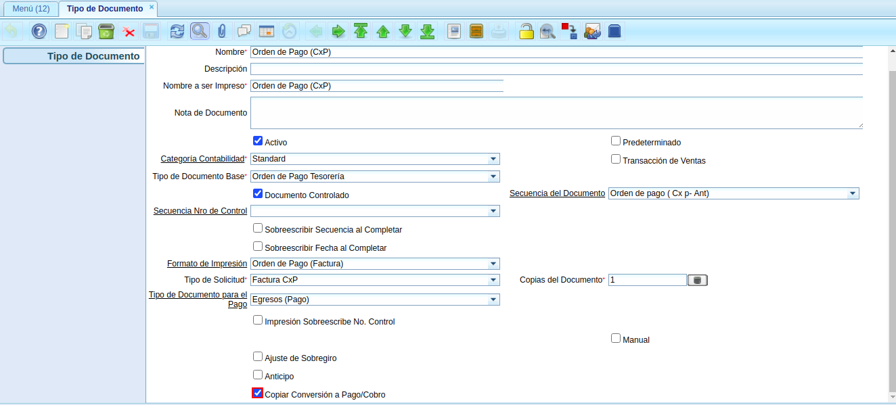
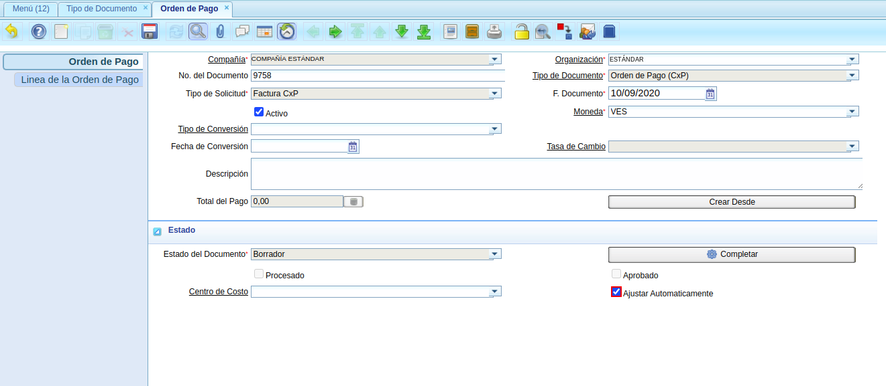

.. _documento/ajuste-automático-orden-de-pago:

**Ajuste Automático Orden de Pago**
===================================

El presente material elaborado por ERPyA pretende ofrecerle una explicación eficiente a nuestros clientes para realizar el "**Ajuste Automático a una Orden de Pago**" en la versión 3.7.0 de ADempiere. 

El cambio fue realizado con la finalidad de dar de baja las facturas con monto en moneda "**VES**", cuyo pago es procesado en divisas. En estos casos ocurre muy frecuentemente que la tasa de cambio a la fecha del pago suele ser menor y como consecuencia la factura queda con un monto abierto como diferencia entre el pago y la factura.

Este proceso garantiza la ejecución de manera automática del proceso "**Dar de Baja**", sin importar el monto remanente.

**Configuración Inicial**
-------------------------

#. Para la ejecución del proceso "**Ajuste Automático**" es necesario ubicar el tipo de documento "**Orden de Pago**" correspondiente al documento que requiere generar. Luego, se debe tildar el checklist "**Copiar Conversión a Pago/Cobro**".

    |checklist copiar conversión a pago cobro del tipo de documento orden de pago|

    Imagen 1. Checklist Copiar Conversión a Pago/Cobro del Tipo de Documento Orden de Pago

    El checklist "**Copiar Conversión a Pago/Cobro**" tiene el siguiente comportamiento.
    
    - Cuando se encuentra tildado, copia la tasa de cambio desde la orden de pago hasta el pago. 
    - En caso contrario, toma la tasa de cambio predeterminada.

**Ejecución del Proceso**
-------------------------

#. Durante la elaboración de la orden de pago, se debe tildar el checklist "**Ajustar Automáticamente**", de este modo, al completar la misma será generada una asignación para dar de baja la factura.

    |checklist ajustar automáticamente del documento orden de pago|

    Imagen 2. Checklist Ajustar Automáticamente del Documento Orden de Pago

.. note::

    Recuerde cargar la tasa de cambio asociada al tipo de conversión que requiere. En caso contrario, la asignación generada por concepto de ajuste para dar de baja a la factura no será generada.
