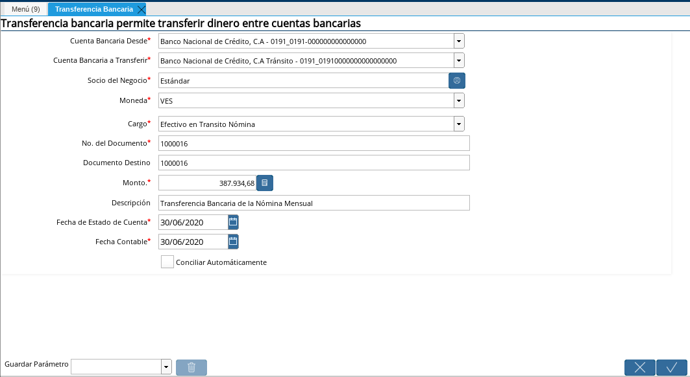
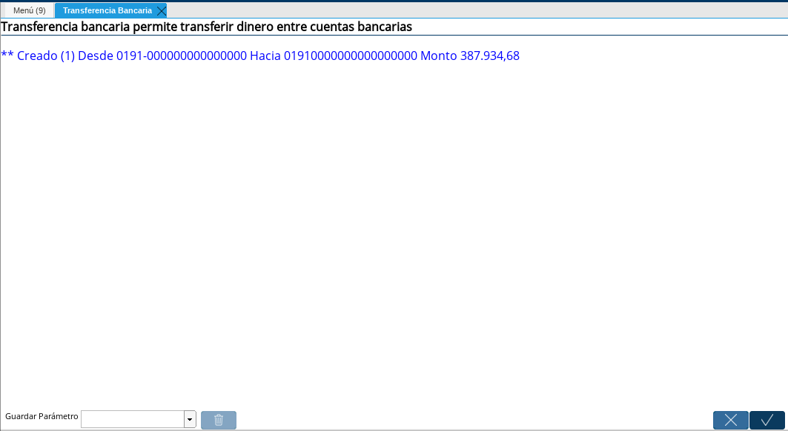

.. |Opción Ok| image:: resources/oktransferencia.png

.. _documento/transferencia-bancaria-de-nómina:

**Transferencia Bancaria de Nómina**
=====================================

Luego de completar la selección de pago y de generar los pagos de nómina en la ventana imprimir exportar pagos procedemos a realizar la transferencia bancaria, ubicamos en el menú de ADempiere, la carpeta "**Gestión de Saldos Pendientes**", luego seleccione "**Transferencia Bancaria**". Este proceso es realizado con la finalidad que la empresa cancele a la cuenta de caja el monto total cancelado a los empleados por la nómina procesada..

Cabe acotar que debe realizar la transferencia según el monto transferido a cada empleado

    Si usted utiliza un txt para transferirle a todo el personal puede realizar una transferencia por el monto total del pago a los trabajadores.
    Si usted paga particularmente a cada uno de sus empleados debe realizar una transferencia por cada pago que fué realizado para cada uno de sus empleados.

.. warning::

        Recuerde que al realizar la transferencia usted esta es registrando cada uno de los pagos que salen del banco. Por tal motivo debe tener especial cuidado en cuanto a monto y a número de referencia

Seleccione en el campo "**Cuenta Bancaria Desde**" el nombre la cuenta bancaria original que utiliza la compañía para cancelar la nómina a los empleado. Esa será la cuenta que emitirá la transferencia bancaria.

Seleccione en el campo "**Cuenta Bancaria a Transferir**" el nombre de la cuenta de la caja, esa cuenta es igual a la cuenta bancaria que usted seleccionó en su selección de pago, la cual se identifica al final del nombre con la palabra tránsito. Esa cuenta representará la cuenta que recibirá la transferencia bancaria.

Seleccione en el campo "**Socio de Negocio**", el socio de negocio registrado con los datos de su compañía.

Seleccione en el campo  "**Moneda**" debe registrar la moneda con la cual se está cancelando la nómina, en este caso será bolívares (VES).

Seleccione en el campo "**Cargo**" el cargo denominado Efectivo en Tránsito Nómina, esté cargo se utiliza para indicar contablemente el registro del pago de la nómina.

Seleccione en el campo "**No. del Documento**" debe registrar el mismo número de documento que le generó la selección de pago creada para la cancelación de su proceso de nómina. En caso de que realice transferencia bancarias particulares debe registrar el número de referencia de la transferencia.

Seleccione en el campo "**Documento Destino**" el mismo número de documento que registró en el campo Nro. del Documento.

Seleccione en el campo "**Monto**" el monto total de la selección de pago que realizó anteriormente, ubique en la selección de pago el campo total total y allí encontrará el monto total de la selección de pago.

Seleccione en el campo "**Descripción**" una breve descripción de la transferencia realizada.
	
Seleccione en el campo "**Fecha de Estado de Cuenta**" la misma fecha con la que registró su selección de pago.

Seleccione en el campo "**Fecha Contable**" la misma fecha con la que registró su selección de pago.

    |Transferencia Bancaria| 

    Imagen 1. Transferencia Bancaria 

    .. warning::

        Por favor NO tildar el check que dice conciliación automática 

Luego de que tenga todos los datos correctos proceda a culminar el proceso de transferencia bancaria tildando la opción de "**OK**"

    |Opción OK|

    Imagen 2. Opción OK 

Después de esto le aparecerá una ventana indicando que su transferencia bancaria fué creada

    |Transferencia Creada|

    Imagen 3. Transferencia Creada
