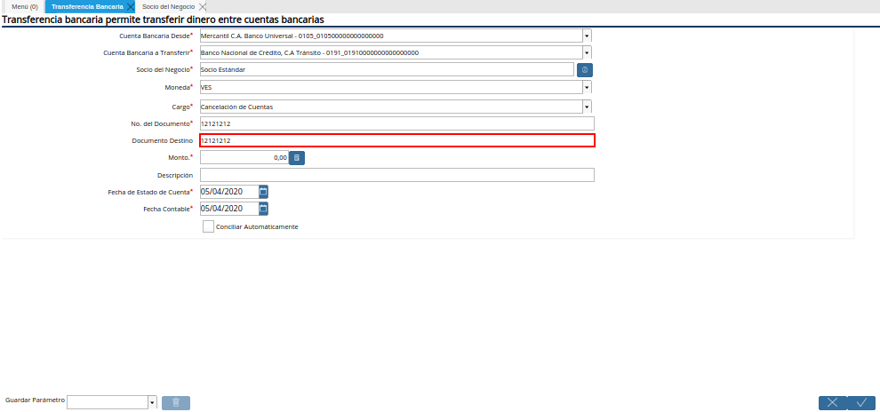
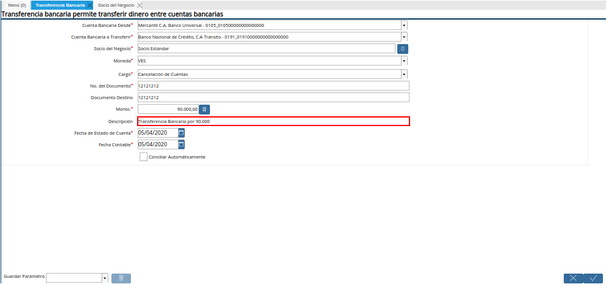
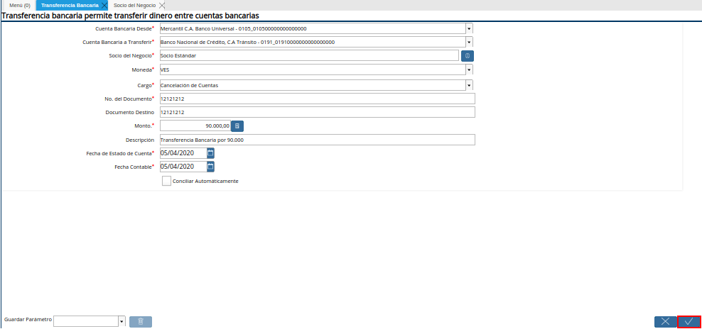
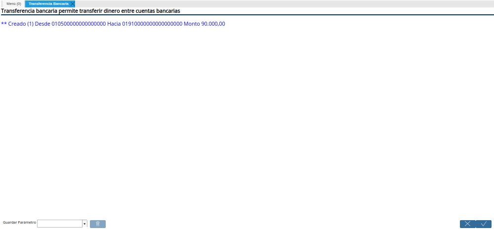
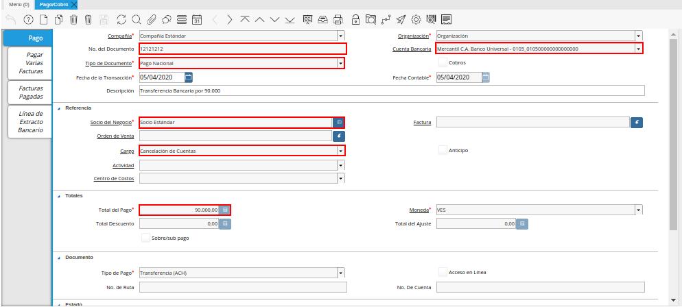

.. |Menú de ADempiere| image:: resources/menu-transferencia.png
.. |Ventana Transferencia Bancaria| image:: resources/vent-transf-bancaria.png
.. |Campo Cuenta Bancaria Desde| image:: resources/campo-cuenta-desde.png
.. |Campo Cuenta Bancaria a Transferir| image:: resources/campo-cuenta-hasta.png
.. |Campo Socio del Negocio| image:: resources/campo-socio-transferencia.png
.. |Campo Moneda| image:: resources/campo-moneda.png
.. |Campo Cargo| image:: resources/campo-cargo.png
.. |Campo No. del Documento| image:: resources/campo-n-documento.png

.. |Campo Monto| image:: resources/campo-monto.png

.. |Campo Fecha de Estado de Cuenta| image:: resources/campo-fecha-estado-cuenta.png
.. |Campo Fecha Contable| image:: resources/campo-fecha-contable.png

.. |Documento Ingreso Generado en Caja| image:: resources/documneto-en-caja.png

.. _documento/procedimiento-para-realizar-una-transferencia-bancaria:

**Registro de Transferencia Bancaria en ADempiere**
===================================================

#. Ubique y seleccione en el menú de ADempiere, la carpeta "**Gestión de Saldos Pendientes**", luego seleccione el proceso "**Transferencia Bancaria**".
    
    |Menú de ADempiere|

    Imagen 1. Menú de ADempiere

#. Podrá visualizar la ventana del proceso "**Transferencia Bancaria**" y proceder al llenado de los campos correspondientes.

    |Ventana Transferencia Bancaria|

    Imagen 2. Ventana Transferencia Bancaria

#.  Seleccione en el campo "**Cuenta bancaria desde**", la cuenta a debitar el monto de la transferencia realizada.

    |Campo Cuenta Bancaria Desde|

    Imagen 3. Campo Cuenta Bancaria Desde

#.  Seleccione en el campo "**Cuenta Bancaria a Transferir**", la cuenta a acreditar el monto de la transferencia realizada.

    |Campo Cuenta Bancaria a Transferir|

    Imagen 4. Campo Cuenta Bancaria a Transferir

#.  Seleccione en el campo "**Socio del Negocio**", el socio del negocio titular de la cuenta seleccionada.

    |Campo Socio del Negocio|

    Imagen 5. Campo Socio del Negocio

#.  Seleccione en el campo "**Moneda**", la moneda en la cual fue realizada la transferencia.

    |Campo Moneda|

    Imagen 6. Campo Moneda

#.  Seleccione en el campo "**Cargo**", el cargo correspondiente a la transferencia entre cuentas que se está realizando.

    |Campo Cargo|

    Imagen 7. Campo Cargo

#.  Introduzca en el campo "**No. del Documento**", la referencia correspondiente a la transferencia bancaria realizada.

    |Campo No. del Documento|

    Imagen 8. Campo No. del Documento

#.  Introduzca en el campo "**Documento Destino**", la referencia correspondiente a la transferencia bancaria realizada.

    |Campo Documento Destino|

    Imagen 9. Campo Documento Destino 

#.  Introduzca en el campo "**Monto**", el monto total de la transferencia bancaria realizada.

    |Campo Monto|

    Imagen 10. Campo Monto 

#.  Introduzca en el campo "**Descripción**", una breve descripción referente a la transferencia entre cuentas que está realizando.

    |Campo Descripción|

    Imagen 11. Campo Descripción

#. Introduzca en el campo "**Fecha de Estado de Cuenta**", la fecha de la transferencia bancaria realizada.

    |Campo Fecha de Estado de Cuenta|

    Imagen 12. Campo Fecha de Estado de Cuenta

#. Introduzca en el campo "**Fecha Contable**", la fecha de la transferencia bancaria realizada.

    |Campo Fecha Contable|

    Imagen 13. Campo Fecha Contable

#. Seleccione la opción "**OK**", para generar en ADempiere la transferencia entre cuentas bancarias.

    |Opción OK|

    Imagen 14. Opción OK 

#. Podrá apreciar el resultado del proceso de la siguiente manera.

    |Resultado de Transferencia|

    Imagen 15. Resultado de Transferencia

.. note::

   Al realizar el proceso de transferencia bancaria, es generado un egreso en la cuenta seleccionada en el campo "**Cuenta bancaria desde**" y un ingreso en la cuenta seleccionada en el campo "**Cuenta Bancaria a Transferir**". 
   
   De igual manera, es creado un documento de cobro en la ventana "**Caja**" reflejando el ingreso a la cuenta seleccionada en el campo "**Cuenta Bancaria a Transferir**" y un pago en la ventana "**Pago/Cobro**" reflejando el egreso de la cuenta seleccionada en el campo "**Cuenta bancaria desde**".

**Consultar Ingreso Generado en Caja**
======================================

#. Al consultar el ingreso generado en la caja de la cuenta bancaria seleccionada en el campo "**Cuenta Bancaria a Transferir**", en la ventana "**Transferencia**", se tiene el siguiente registro del documento número "**12121212**" en la ventana "**Caja**".

   |Documento Ingreso Generado en Caja|

   Imagen 16. Documento Ingreso Generado en Caja 

**Consultar Egreso Generado en Banco**
======================================

#. Al consultar el egreso generado en banco de la cuenta bancaria seleccionada en el campo "**Cuenta bancaria desde**", en la ventana "**Transferencia**", se tiene el siguiente registro del documento número "**12121212**" en la ventana "**Pago/Cobro**".

   |Documento Egreso Generado en Banco|

   Imagen 17. Documento Egreso Generado en Banco
