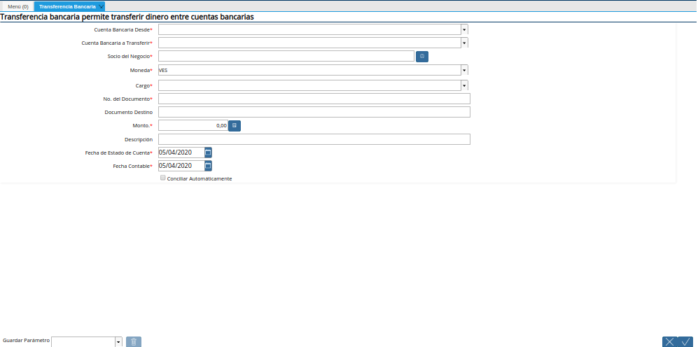
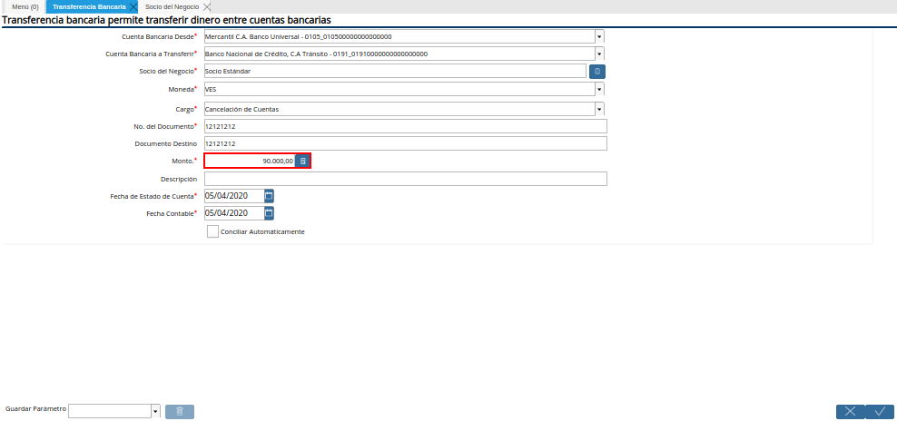
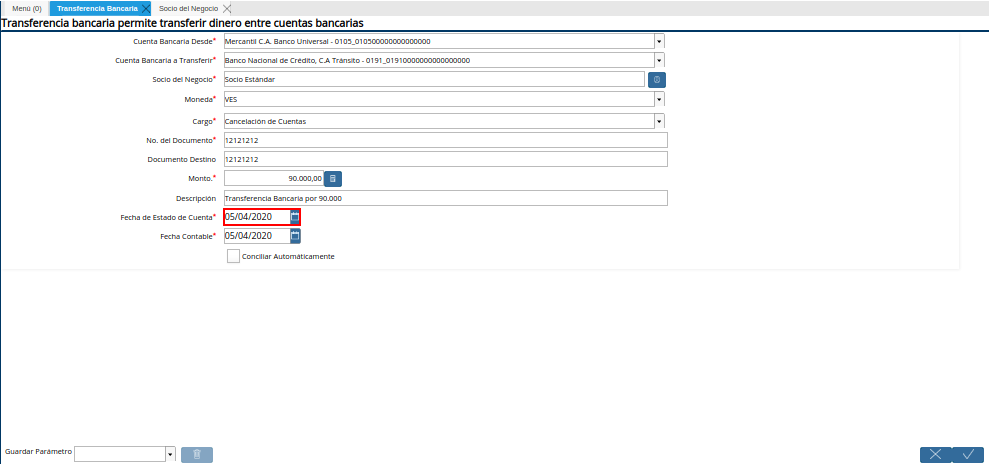
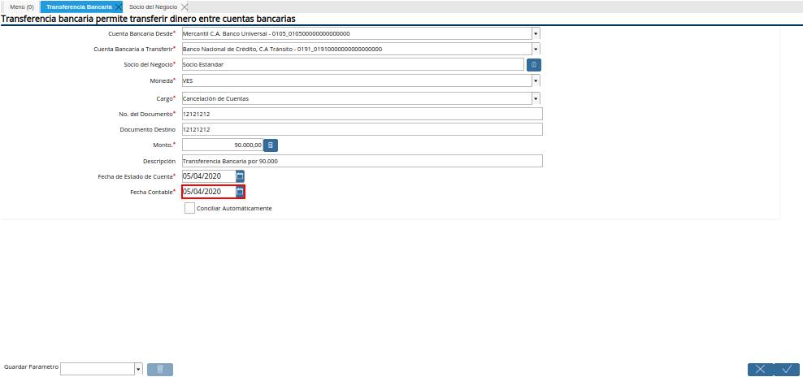

.. |Menú de ADempiere| image:: resources/menu-transferencia.png

.. |Campo Cuenta Bancaria a Transferir| image:: resources/campo-cuenta-hasta.png
.. |Campo Socio del Negocio| image:: resources/campo-socio-transferencia.png
.. |Campo Moneda| image:: resources/campo-moneda.png

.. |Campo No. del Documento| image:: resources/campo-n-documento.png

.. |Campo Conciliar Automáticamente| image:: resources/field-reconcile-automatically.png
.. |acciones y ejecutar| image:: resources/actions-and-execute.png

.. _documento/procedimiento-para-realizar-una-transferencia-bancaria:

**Registro de Transferencia Bancaria**
======================================

Para realizar una transferencia bancaria en ADempiere deben seguir los siguientes pasos:

#. Ubique y seleccione en el menú de ADempiere, la carpeta "**Gestión de Saldos Pendientes**", luego seleccione el proceso "**Transferencia Bancaria**".
    
    |Menú de ADempiere|

    Imagen 1. Menú de ADempiere

#. Podrá visualizar la ventana del proceso "**Transferencia Bancaria**" y proceder al llenado de los campos correspondientes.

    |Ventana Transferencia Bancaria|

    Imagen 2. Ventana Transferencia Bancaria

#.  Seleccione en el campo "**Cuenta Bancaria Desde**", la cuenta a debitar el monto de la transferencia realizada.

    |Campo Cuenta Bancaria Desde|

    Imagen 3. Campo Cuenta Bancaria Desde

    .. note::

        La cuenta a debitar desde es la cuenta bancaria de donde saldrá la transferencia.

#.  Seleccione en el campo "**Cuenta Bancaria a Transferir**", la cuenta a acreditar el monto de la transferencia realizada.

    |Campo Cuenta Bancaria a Transferir|

    Imagen 4. Campo Cuenta Bancaria a Transferir

    .. note::

        La cuenta bancaria a transferir, es la cuenta en donde caerá la transferencia.

#.  Seleccione en el campo "**Socio del Negocio**", el socio del negocio titular de la cuenta seleccionada.

    |Campo Socio del Negocio|

    Imagen 5. Campo Socio del Negocio

#.  Seleccione en el campo "**Moneda**", la moneda en la cual fue realizada la transferencia.

    |Campo Moneda|

    Imagen 6. Campo Moneda

#.  Seleccione en el campo "**Cargo**", el cargo correspondiente a la transferencia entre cuentas que se está realizando.

    |Campo Cargo|

    Imagen 7. Campo Cargo

    .. note::

        El cargo a colocar en la transferencia bancaria depenrá de que tipo de transferencia se este realizando.

#.  Introduzca en el campo "**No. del Documento**", la referencia correspondiente a la transferencia bancaria realizada.

    |Campo No. del Documento|

    Imagen 8. Campo No. del Documento

    .. note::

        El número de documento a colocar en este campo es el número de la transferencia bancaria realizada del banco.

#.  Introduzca en el campo "**Monto**", el monto total de la transferencia bancaria realizada.

    |Campo Monto|

    Imagen 10. Campo Monto 

#. Introduzca en el campo "**Fecha de Estado de Cuenta**", la fecha de la transferencia bancaria realizada.

    |Campo Fecha de Estado de Cuenta|

    Imagen 12. Campo Fecha de Estado de Cuenta

#. Introduzca en el campo "**Fecha Contable**", la fecha de la transferencia bancaria realizada.

    |Campo Fecha Contable|

    Imagen 13. Campo Fecha Contable

#. Si desea que los pagos/cobros que se generen de esta transferencia bancarias se concilien de una vez puede tildar la opción **"Conciliar Automáticamente"**, si no tilda esta opción los pagos/cobros no se conciliaran y deberán ser conciliados a través del proceso "**Conciliación Automática**".

    |Campo Conciliar Automáticamente|

    Imagen 14. Campo Conciliar Automáticamente

#. Para completar el proceso, se debe posicionar sobre el campo "**Acciones**" y luego se debe posicionar sobre la opción "**Ejecutar**", para generar en ADempiere la transferencia entre cuentas bancarias.

    |acciones y ejecutar|

    Imagen 15. Campo Acciones y Opción Ejecutar 
