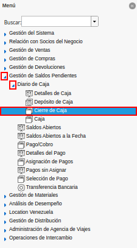
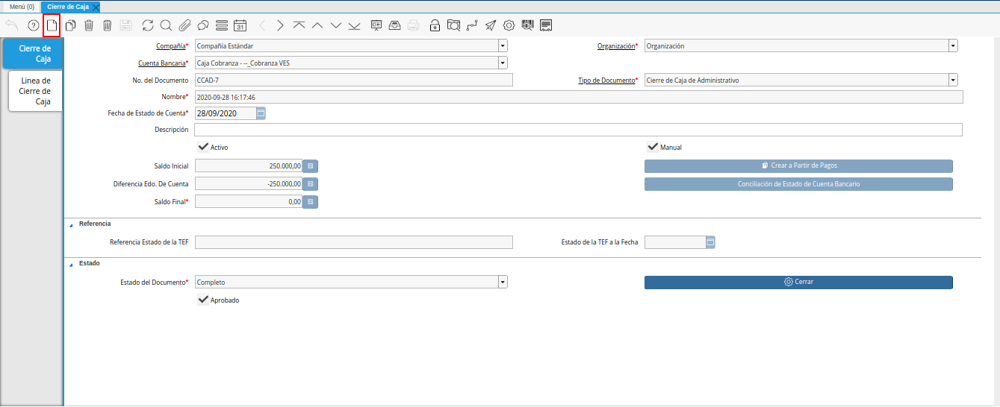
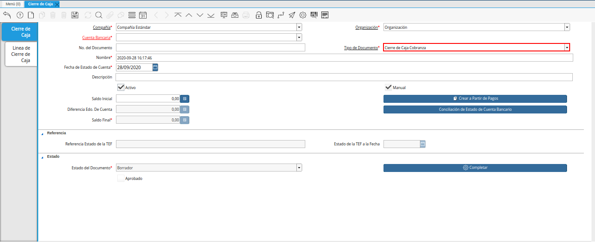
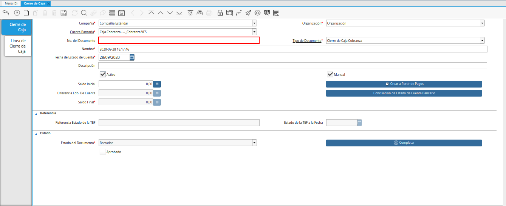
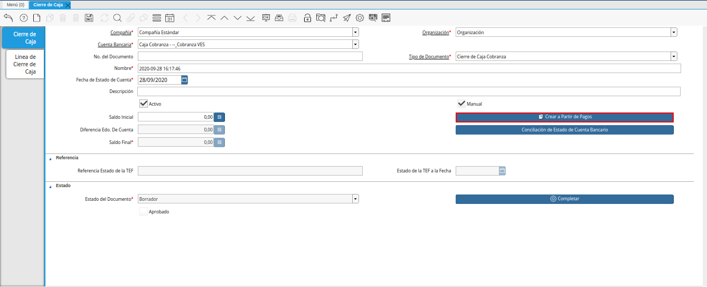

.. _ERPyA: http://erpya.com

.. |Campo Organización| image:: resources/organization-field.png

.. |Campo Cuenta Bancaria| image:: resources/bank-account-field.png

.. |Campo Nombre| image:: resources/field-name.png
.. |fecha de estado de cuenta| image:: resources/account-statement-date-field.png
.. |Campo Descripción| image:: resources/description-field.png

.. |Ventana de Búsqueda Inteligente y Selección de Opción Comenzar Búsqueda| image:: resources/smart-search-window-and-option-selection-start-search.png
.. |Selección de movimiento y Opción OK| image:: resources/movement-selection-and-option-ok.png
.. |Icono Refrescar| image:: resources/refresh-icon.png
.. |Opción Completar| image:: resources/option-complete.png
.. |Acción Completar y Opción OK| image:: resources/action-complete-and-option-ok.png

.. _documento/procedimiento-para-realizar-un-cierre-de-caja:

**Registro de Cierre de Caja**
==============================

#. Ubique y seleccione en el menú de ADempiere, la carpeta "**Gestión de Saldos Pendientes**", luego seleccione la ventana "**Diario de Caja**", por último seleccione la ventana "**Cierre de Caja**".

    |Menú de ADempiere|

    Imagen 1. Menú de ADempiere

#. Podrá visualizar la ventana "**Cierre de Caja**", donde debe seleccionar el icono "**Registro Nuevo**" y proceder al llenado de los campos correspondientes.

    |Ventana Cierre de Caja|

    Imagen 2. Ventana Cierre de Caja y Selección de Icono Registro Nuevo

#. Seleccione en el campo "**Organización**", la organización para la cual está realizando el cierre de caja.

    |Campo Organización|

    Imagen 3. Campo Organización

#. Seleccione el tipo de documento a generar en el campo "**Tipo de Documento**", la selección de este define el comportamiento del documento que se está elaborando, dicho comportamiento se encuentra explicado en el documento **Tipo de Documento** elaborado por `ERPyA`_.

    |Campo Tipo de Documento|

    Imagen 4. Campo Tipo de Documento

#. Seleccione en el campo "**Cuenta Bancaria**", la cuenta bancaria a la cual se le realizará el cierre de caja.

    |Campo Cuenta Bancaria|

    Imagen 5. Campo Cuenta Bancaria

#. Introduzca en el campo "**No. del Documento**", el número de documento correspondiente a la secuencia del tipo de documento seleccionado.

    |Nro del Documento|
    
    Imagen 6. Campo No. del Documento

#. Introduzca en el campo "**Nombre**", el nombre de referencia del cierre de caja que está realizando.

    |Campo Nombre|

    Imagen 7. Campo Nombre

#. Seleccione en el campo "**Fecha de Estado de Cuenta**", la fecha en la cual se encuentra realizando la transacción.

    |fecha de estado de cuenta|

    Imagen 8. Campo Fecha de Estado de Cuenta

#. Introduzca en el campo "**Descripción**", una breve descripción referente al documento que está realizando.

    |Campo Descripción|

    Imagen 9. Campo Descripción

#. Seleccione la opción "**Crear a partir de Pagos**", para realizar el cierre de caja desde un ingreso generado anteriormente, este puede ser un cobro en caja, una selección de pago o una transferencia bancaria.

    |Opción Crear a Partir de Pagos|

    Imagen 10. Opción Crear a Partir

#. Podrá visualizar la siguiente ventana de búsqueda inteligente, donde debe seleccionar la opción "**Comenzar Búsqueda**" para buscar las transferencias entre cuentas realizadas.

    |Ventana de Búsqueda Inteligente y Selección de Opción Comenzar Búsqueda|

    Imagen 9. Ventana de Búsqueda Inteligente y Selección de Opción Comenzar Búsqueda

#. Seleccione el registro del movimiento creado anteriormente y la opción "**OK**", para cargar la información a la pestaña "**Línea de Cierre de Caja**".

    |Selección de movimiento y Opción OK|

    Imagen 10. Selección de Movimiento y Opción OK

#. Seleccione el icono "**Refrescar**" en la barra de herramientas de ADempiere, para refrescar el registro en la ventana "**Cierre de Caja**".

    |Icono Refrescar|

    Imagen 11. Icono Refrescar

#. Seleccione la opción "**Completar**", ubicada en la parte inferior del documento.

    |Opción Completar|

    Imagen 12. Opción Completar

#. Seleccione la acción "**Completar**" y la opción "**OK**", para completar el documento.

    |Acción Completar y Opción OK|

    Imagen 13. Acción Completar y Opción OK

.. note::

    Recuerde que el procedimiento para gestionar el cierre de caja debe realizarce diariamente.