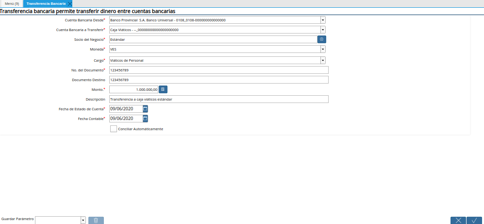
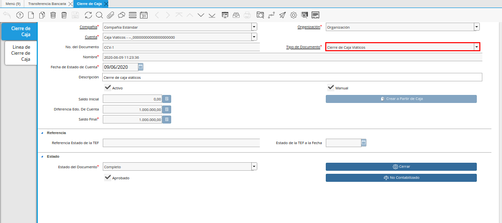

.. _ERPyA: http://erpya.com

.. |Orden de Pago| image:: resources/
.. |Selección de Pago| image:: resources/
.. |Imprimir Exportar Pagos| image:: resources/
.. |Pestaña Pago Generado| image:: resources/
.. |Registo en Caja Viáticos| image:: resources/
.. |Transferencia Bancaria| image:: resources/
.. |Último Cierre de Caja Viáticos| image:: resources/
.. _documento/caja-viaticos:

**Registro de Caja Viáticos**
==============================

#. Realice el procedimiento regular para generar una transferencia bancaria, explicado en el documento :ref:`documento/procedimiento-para-realizar-una-transferencia-bancaria`, elaborado por `ERPyA`_.

   |Transferencia Bancaria|

   Imagen 1. Transferencia Bancaria

#. Realice el procedimiento regular para generar un cierre de caja, explicado en el documento :ref:`documento/procedimiento-para-realizar-un-cierre-de-caja`, elaborado por `ERPyA`_, seleccionando en el campo "**Tipo de Documento**" la opción "**Cierre de Caja Viáticos**".

   |Primer Cierre de Caja Viáticos|

   Imagen 2. Cierre de Caja Viáticos

   .. note::

      Al realizar el proceso de transferencia bancaria, es generado un egreso de banco y un ingreso a caja viáticos. De igual manera, es creado un cobro en caja y un pago en pago/cobro.

#. Realice el procedimiento regular para generar una orden de pago, explicado en el documento :ref:`documento/orden-de-pago`, elaborado por `ERPyA`_.

   |Orden de Pago|

   Imagen 3. Orden de Pago

#. Luego realice el procedimiento regular para generar una selección de pago, igualmente explicado en el documento :ref:`documento/selección-de-pago`, elaborado por `ERPyA`_.

   |Selección de Pago|

   Imagen 4. Selección de Pago

#. Por último, realice el procedimiento regular para generar un imprimir/exportar pagos, explicado en el documento :ref:`documento/Imprimir-Exportar`, elaborado por `ERPyA`_.

   |Imprimir Exportar Pagos|

   Imagen 5. Imprimir Exportar Pagos

   .. note::

      Al realizar el proceso de selección de pago, es generado un egreso de caja viáticos por el monto ingresado en el documento "**Selección de Pago**".

   #. Al consultar la pestaña "**Pago Generado**", de la ventana "**Selección de Pago**", se puede apreciar el registro del pago en la caja viáticos seleccionada en la selección de pago.

      |Pestaña Pago Generado|
      
      Imagen 6. Pestaña Pago Generado

   #. Al consultar el registro creado en caja, se puede apreciar el registro de la selección de pago de la siguiente manera.

      |Registo en Caja Viáticos|

      Imagen 7. Registo en Caja Viáticos

   .. warning::

      Si el monto total de la transferencia bancaria realizada anteriormente a la caja viáticos del empleado es mayor al monto total gastado por el mismo, es necesario que se realice una transferencia bancaria por el excedente del monto, antes de realizar el cierre de la caja viáticos del empleado nuevamente. 

#. Realice el procedimiento regular para generar una transferencia bancaria, explicado en el documento :ref:`documento/procedimiento-para-realizar-una-transferencia-bancaria`, elaborado por `ERPyA`_.

   |Transferencia Bancaria|

   Imagen 8. Transferencia Bancaria

#. Realice el procedimiento regular para generar un cierre de caja, explicado en el documento :ref:`documento/procedimiento-para-realizar-un-cierre-de-caja`, elaborado por `ERPyA`_, seleccionando en el campo "**Tipo de Documento**" la opción "**Cierre de Caja Viáticos**".

   .. note::
         
      Se selecciona el registro de la selección de pago realizada anteriormente con el monto total de la factura. Adicional a ello, se selecciona el registro de la transferencia bancaria realizada desde la cuenta caja viáticos, por el monto restante abierto en dicha caja. Lo anterior, con la finalidad de llevar la cuenta caja viáticos a su monto inicial, para este ejemplo el monto inicial es cero (0).

   |Último Cierre de Caja Viáticos|

   Imagen 2. Cierre de Caja Viáticos

.. note::

   Al realizar el proceso de transferencia bancaria, es generado un ingreso a banco y un egreso de caja viáticos. De igual manera, es creado un pago en caja y un cobro en pago/cobro.
