.. _ERPyA: http://erpya.com

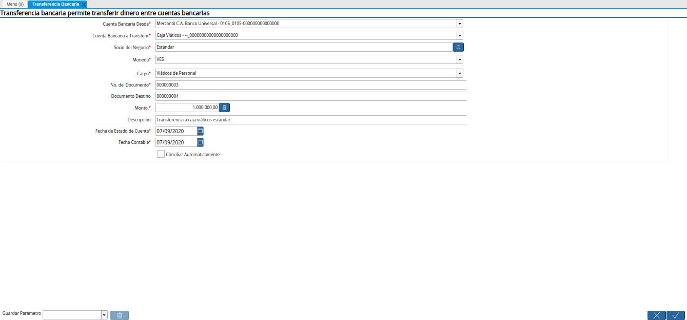

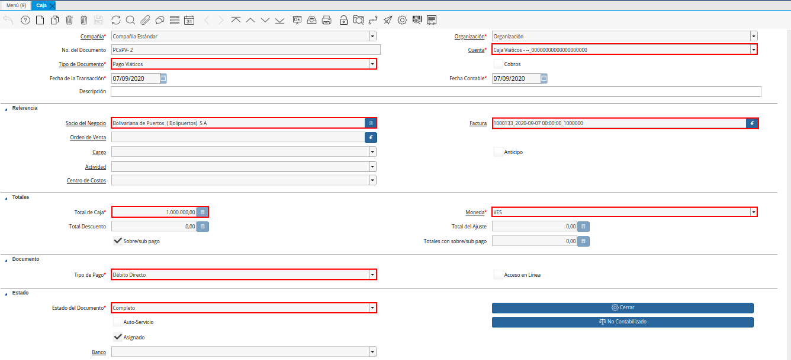
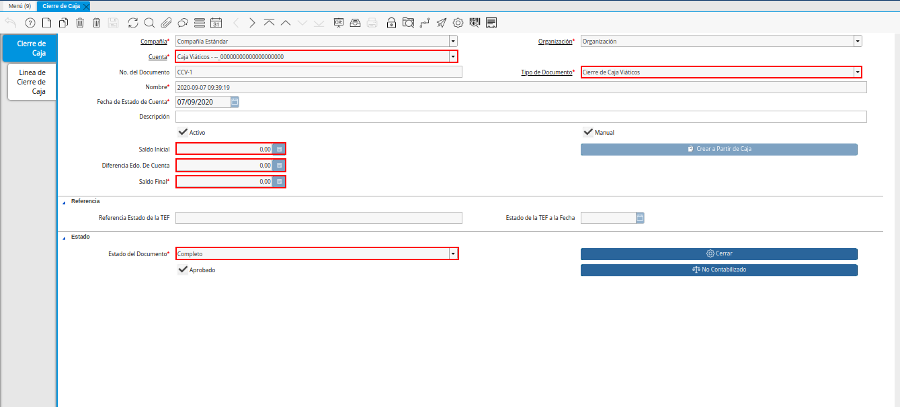

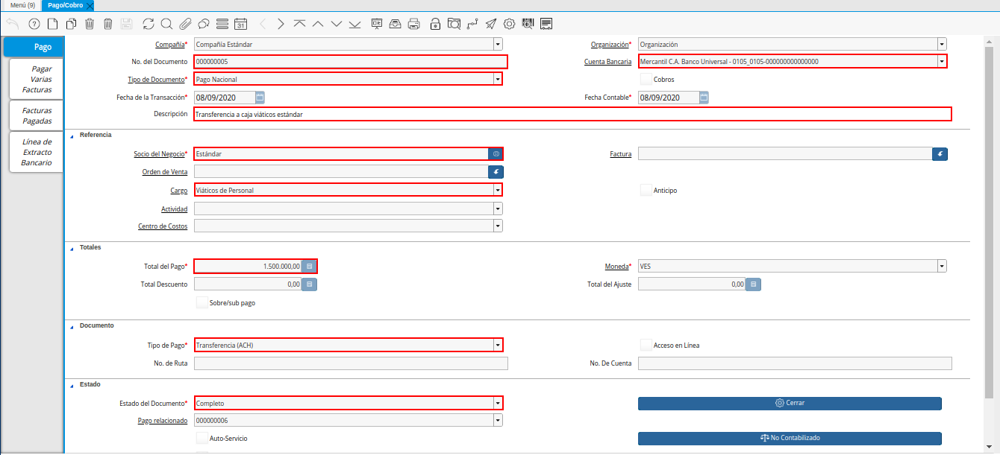
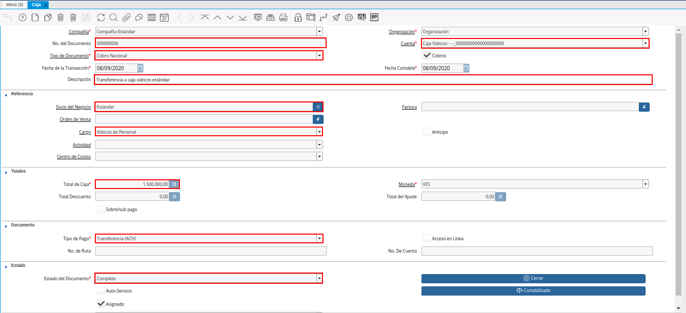
.. |relación de factura viáticos mayor al gasto| image:: resources/per-diem-bill-ratio-greater-than-expense.png
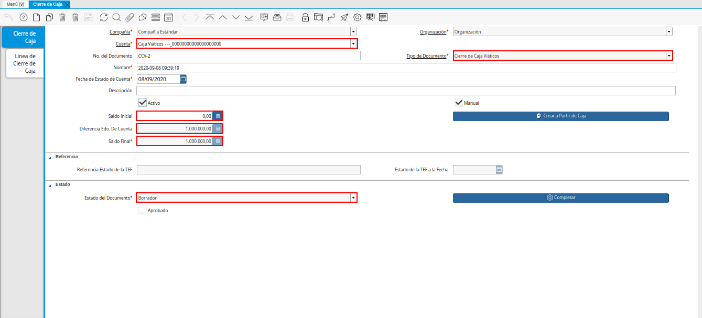
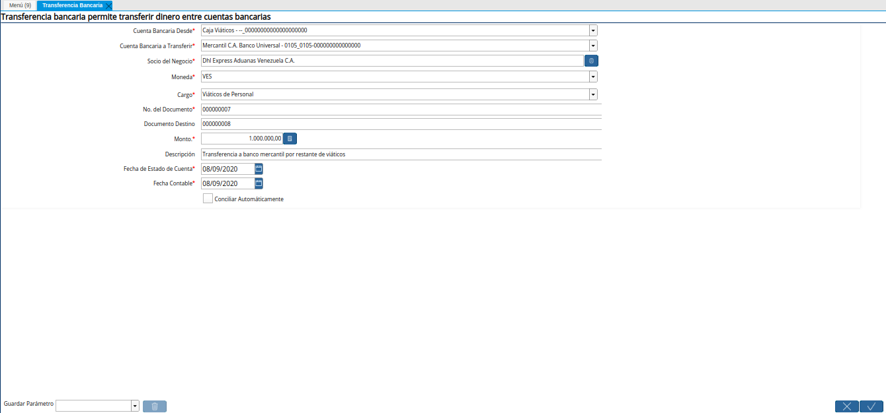
.. |egreso de caja por restante viáticos mayor al gasto| image:: resources/cash-outflow-for-the-remaining-per-diem-greater-than-the-expense.png
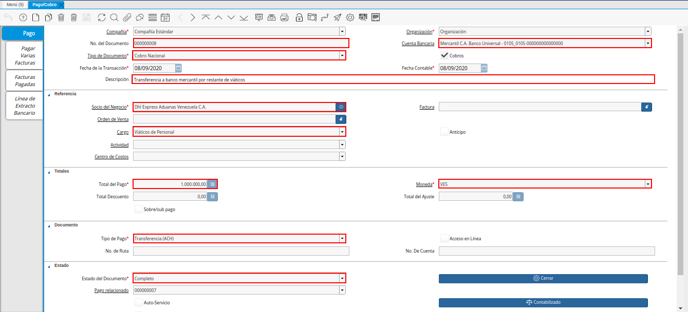
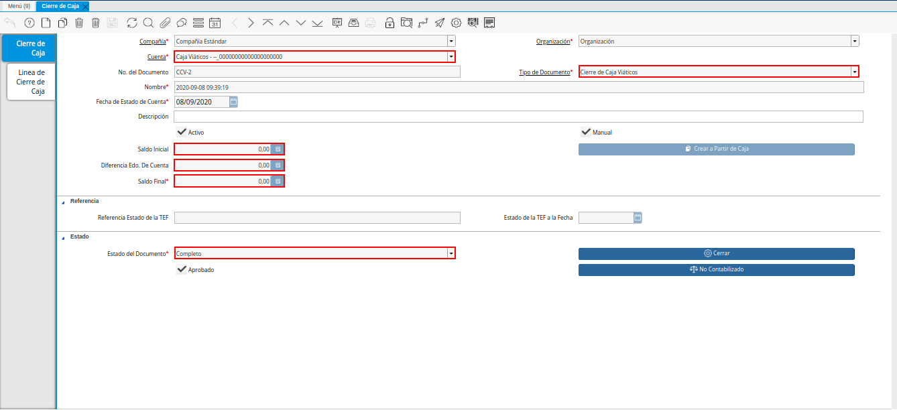

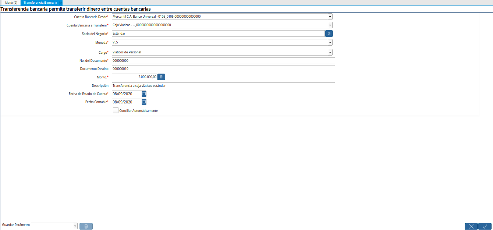

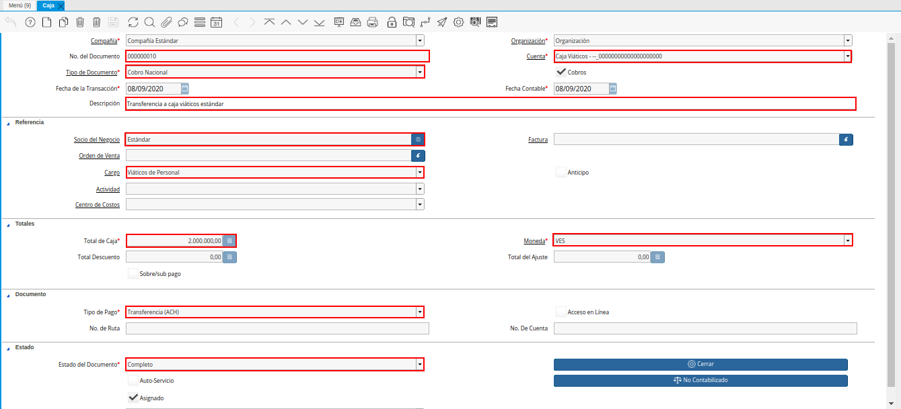
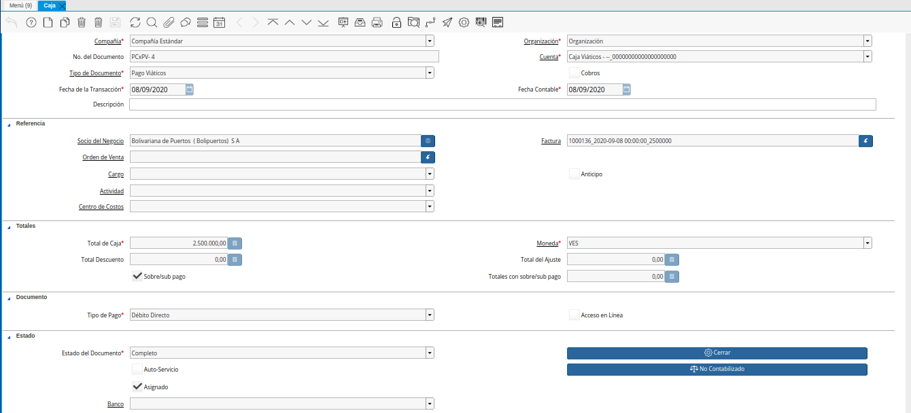

.. |primer cierre de caja gasto mayor a viáticos| image:: resources/first-cash-closing-expense-greater-than-per-diem.png
.. |registro de caja por monto no reembolsable gasto mayor a viáticos| image:: resources/cash-register-for-non-refundable-amount-expense-greater-than-per-diem.png
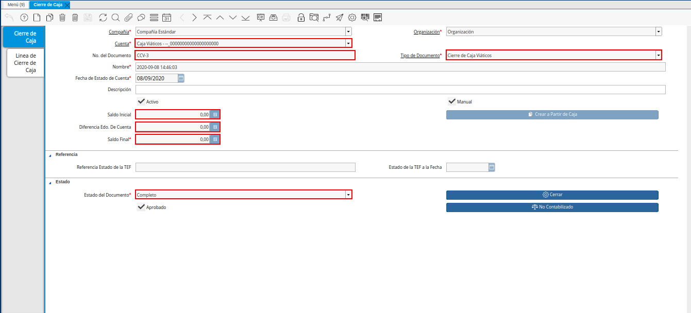

.. _documento/caja-viaticos:

**Registro de Caja Viáticos**
==============================

En el registro de caja viáticos de una empresa u organización, se pueden presentar diversos acontecimientos que permiten ejecutar el proceso de diferentes maneras. Siendo uno de ellos, el registro de caja viáticos cuando el monto de los viáticos resulta igual que el monto de los gastos. Otro caso puede ser, cuando el monto de los viáticos resulta mayor al monto de los gastos. Finalmente, se puede presentar el caso en el que el monto de los viáticos resulta menor al monto de los gastos. 

ADempiere permite controlar la caja viáticos en cualquiera de los acontecimientos expuestos anteriormente, para ello se debe seguir los procedimientos que se presentan a continuación.

**Viáticos Igual al Gasto**
---------------------------

El proceso de registro de caja viáticos para el caso en el que el monto total de los viáticos resulta igual al monto total del gasto, debe ser realizado de la siguiente manera:

**Transferencia Bancaria por Viáticos**
***************************************

 Se realiza la transferencia bancaria a caja viáticos por el monto correspondiente. Para ello, se debe ejecutar el procedimiento explicado en el documento :ref:`documento/procedimiento-para-realizar-una-transferencia-bancaria`, elaborado por `ERPyA`_.

    |transferencia viáticos igual al gasto|

    Imagen 1. Transferencia Bancaria por Viáticos

    .. note::

        Al realizar el proceso de transferencia bancaria, es generado un egreso de banco y un ingreso a caja viáticos. De igual manera, es creado un cobro en caja y un pago en pago/cobro.

 Al consultar el egreso de banco en la ventana "**Pago/Cobro**", se puede visualizar el mismo de la siguiente manera.

    |egreso de banco viáticos igual al gasto|

    Imagen 2. Egreso de Banco por Viáticos

 Al consultar el ingreso a caja viáticos en la ventana "**Caja**", se puede visualizar el mismo de la siguiente manera.

    |ingreso a caja viáticos igual al gasto|

    Imagen 3. Ingreso a Caja por Viáticos

**Relación de Facturas**
************************

 Se realiza la relación de factura por el monto correspondiente. Para ello, se debe ejecutar el procedimiento explicado en el documento :ref:`documento/relación-de-facturas-o-justificación-de-gastos`, elaborado por `ERPyA`_.

    |relación de factura viáticos igual al gasto|

    Imagen 4. Relación de Facturas de Gastos

**Cierre de Caja**
******************

 Se realiza el procedimiento regular para generar un cierre de caja, seleccionando la cuenta "**Caja Viáticos**" y el tipo de documento "**Cierre de Caja Viáticos**". Para ello, se debe ejecutar el procedimiento explicado en el documento :ref:`documento/procedimiento-para-realizar-un-cierre-de-caja`, elaborado por `ERPyA`_.

    |cierre de caja viáticos igual al gasto|

    Imagen 5. Cierre de Caja Viáticos

    .. note::

        Se selecciona el registro de la relación de factura realizada anteriormente con el monto total de la factura. Adicional a ello, se selecciona el registro de la transferencia bancaria realizada anteriormente. Lo anterior, con la finalidad de llevar la cuenta caja viáticos a su monto inicial, para este ejemplo el monto inicial es cero (0).

**Viáticos Mayor al Gasto**
---------------------------

El proceso de registro de caja viáticos para el caso en el que el monto total de los viáticos resulta mayor al monto total del gasto, debe ser realizado de la siguiente manera:

**Transferencia Bancaria por Viáticos**
***************************************

 Se realiza la transferencia bancaria a caja viáticos por el monto correspondiente. Para ello, se debe ejecutar el procedimiento explicado en el documento :ref:`documento/procedimiento-para-realizar-una-transferencia-bancaria`, elaborado por `ERPyA`_.

    |transferencia bancaria viáticos mayor al gasto|

    Imagen 6. Transferencia Bancaria por Viáticos

    .. note::

        Al realizar el proceso de transferencia bancaria, es generado un egreso de banco y un ingreso a caja viáticos. De igual manera, es creado un cobro en caja y un pago en pago/cobro.

 Al consultar el egreso de banco en la ventana "**Pago/Cobro**", se puede visualizar el mismo de la siguiente manera.

    |egreso de banco viáticos mayor al gasto|

    Imagen 7. Egreso de Banco por Viáticos

 Al consultar el ingreso a caja viáticos en la ventana "**Caja**", se puede visualizar el mismo de la siguiente manera.

    |ingreso a caja viáticos mayor al gasto|

    Imagen 8. Ingreso a Caja por Viáticos

**Relación de Facturas**
************************

 Se realiza la relación de factura por el monto correspondiente. Para ello, se debe ejecutar el procedimiento explicado en el documento :ref:`documento/relación-de-facturas-o-justificación-de-gastos`, elaborado por `ERPyA`_.

    |relación de factura viáticos mayor al gasto|

    Imagen 9. Relación de Facturas de Gastos

**Cierre de Caja En Borrador**
******************************

 Realice el procedimiento regular para generar un cierre de caja, explicado en el documento :ref:`documento/procedimiento-para-realizar-un-cierre-de-caja`, elaborado por `ERPyA`_, seleccionando la cuenta "**Caja Viáticos**" y el tipo de documento "**Cierre de Caja Viáticos**".

    .. note::

        Se selecciona el registro de la relación de factura realizada anteriormente con el monto total de la factura. Adicional a ello, se selecciona el registro de la transferencia bancaria realizada anteriormente. Lo anterior, con la finalidad de llevar la cuenta caja viáticos a su monto inicial, para este ejemplo el monto inicial es cero (0).

    |primer cierre de caja viáticos mayor al gasto|

    Imagen 10. Cierre de Caja Viáticos

    .. warning::

        Si el monto total de la transferencia bancaria realizada anteriormente a la caja viáticos del empleado es mayor al monto total gastado por el mismo, es necesario que el cierre de caja se genere en estado "**Borrador**" y se proceda a realizar una transferencia bancaria por el excedente del monto, antes de realizar el cierre de la caja viáticos del empleado nuevamente. 

**Transferencia Bancaria por Excedente**
****************************************

 Realice el procedimiento regular para generar una transferencia bancaria, explicado en el documento :ref:`documento/procedimiento-para-realizar-una-transferencia-bancaria`, elaborado por `ERPyA`_.

    |transferencia bancaria por restante viáticos mayor al gasto|

    Imagen 11. Transferencia Bancaria por Excedente de Viáticos

    .. note::

        Al realizar el proceso de transferencia bancaria, es generado un egreso de caja viáticos y un ingreso a banco. De igual manera, es creado un pago en caja y un cobro en pago/cobro.

 Al consultar el egreso de caja viáticos en la ventana "**Caja**", se puede visualizar el mismo de la siguiente manera.

    |egreso de caja por restante viáticos mayor al gasto|

    Imagen 12. Egreso de Caja por Excedente de Viáticos

 Al consultar el ingreso a banco en la ventana "**Pago/Cobro**", se puede visualizar el mismo de la siguiente manera.

    |ingreso a banco por restante viáticos mayor al gasto|

    Imagen 13. Ingreso a Banco por Excedente de Viáticos

**Completar Cierre de Caja**
****************************

 Ubique el registro del cierre de caja "**CCV-2**", generado anteriormente en estado "**Borrador**" y seleccione la opción "**Crear a Partir de Caja**", para seleccionar el registro de la transferencia bancaria realizada con el excedente de los viáticos. Finalmente, complete el cierre de caja para llevar la caja viáticos a su saldo inicial. Recuerde que el procedimiento regular para generar un cierre de caja, se encuentra explicado en el documento :ref:`documento/procedimiento-para-realizar-un-cierre-de-caja`, elaborado por `ERPyA`_.

    |último cierre de caja viáticos mayor al gasto|

    Imagen 14. Cierre de Caja Viáticos

    .. note::
            
        Se selecciona el registro de la transferencia bancaria realizada desde la cuenta caja viáticos, por el monto restante abierto en dicha caja. Lo anterior, con la finalidad de llevar la cuenta caja viáticos a su monto inicial, para este ejemplo el monto inicial es cero (0).

**Gasto Mayor a Viáticos**
--------------------------

El proceso de registro de caja viáticos para el caso en el que el monto total de los gastos resulta mayor al monto total de los viáticos, debe ser realizado de la siguiente manera:

**Transferencia Bancaria por Viáticos**
***************************************

 Se realiza la transferencia bancaria a caja viáticos por el monto correspondiente. Para ello, se debe ejecutar el procedimiento explicado en el documento :ref:`documento/procedimiento-para-realizar-una-transferencia-bancaria`, elaborado por `ERPyA`_.

    |transferencia bancaria gasto mayor a viáticos|

    Imagen 15. Transferencia Bancaria por Viáticos

    .. note::

        Al realizar el proceso de transferencia bancaria, es generado un egreso de banco y un ingreso a caja viáticos. De igual manera, es creado un cobro en caja y un pago en pago/cobro.

 Al consultar el egreso de banco en la ventana "**Pago/Cobro**", se puede visualizar el mismo de la siguiente manera.

    |egreso de banco gasto mayor a viáticos|

    Imagen 16. Egreso de Banco por Viáticos

 Al consultar el ingreso a caja viáticos en la ventana "**Caja**", se puede visualizar el mismo de la siguiente manera.

    |ingreso a caja viáticos gasto mayor a viáticos|

    Imagen 17. Ingreso a Caja por Viáticos

**Relación de Facturas**
************************

 Se realiza la relación de factura por el monto correspondiente. Para ello, se debe ejecutar el procedimiento explicado en el documento :ref:`documento/registros-de-montos-no-reembolsables-para-viáticos-y-reembolsos`. Finalmente, se debe ejecutar el procedimiento explicado en el documento :ref:`documento/relación-de-facturas-o-justificación-de-gastos`, elaborado por `ERPyA`_.

    |relación de factura gasto mayor a viáticos|

    Imagen 18. Relación de Facturas de Gastos

**Cierre de Caja En Borrador**
******************************

 Realice el procedimiento regular para generar un cierre de caja, explicado en el documento :ref:`documento/procedimiento-para-realizar-un-cierre-de-caja`, elaborado por `ERPyA`_, seleccionando la cuenta "**Caja Viáticos**" y el tipo de documento "**Cierre de Caja Viáticos**".

    .. note::

        Se selecciona el registro de la relación de factura realizada anteriormente con el monto total de la factura. Adicional a ello, se selecciona el registro de la transferencia bancaria realizada anteriormente. Lo anterior, con la finalidad de llevar la cuenta caja viáticos a su monto inicial, para este ejemplo el monto inicial es cero (0).

    |primer cierre de caja gasto mayor a viáticos|

    Imagen 19. Cierre de Caja Viáticos

    .. warning::

        Si el monto total de la transferencia bancaria realizada anteriormente a la caja viáticos del empleado es menor al monto total gastado por el mismo, es necesario que el cierre de caja se genere en estado "**Borrador**" y se proceda a realizar una caja con el cargo "**Monto no Reembolsable**", reflejando el monto total gastado de más, antes de realizar el cierre de la caja viáticos del empleado nuevamente.

**Relación de Montos no Reembolsables**
***************************************

 Se registra una caja utilizando el tipo de documento "**Cobro Viáticos**" y el cargo "**Monto no Reembolsable**", con el monto correspondiente. Para ello, se debe ejecutar el procedimiento explicado en el documento :ref:`documento/relación-de-facturas-o-justificación-de-gastos`, elaborado por `ERPyA`_, donde se indica como registrar una caja utilizando un cargo en lugar de una factura.

    |registro de caja por monto no reembolsable gasto mayor a viáticos|

    Imagen 20. Registro de Caja con Cargo

**Completar Cierre de Caja**
****************************

 Ubique el registro del cierre de caja "**CCV-3**", generado anteriormente en estado "**Borrador**" y seleccione la opción "**Crear a Partir de Caja**", para seleccionar el registro de la caja realizada con el monto gastado de más. Finalmente, complete el cierre de caja para llevar la caja viáticos a su saldo inicial. Recuerde que el procedimiento regular para generar un cierre de caja, se encuentra explicado en el documento :ref:`documento/procedimiento-para-realizar-un-cierre-de-caja`, elaborado por `ERPyA`_.

    |último cierre de caja gasto mayor a viáticos|

    Imagen 21. Cierre de Caja Viáticos

    .. note::

        Se selecciona el registro de la transferencia bancaria realizada desde la cuenta caja viáticos, por el monto restante abierto en dicha caja. Lo anterior, con la finalidad de llevar la cuenta caja viáticos a su monto inicial, para este ejemplo el monto inicial es cero (0).
