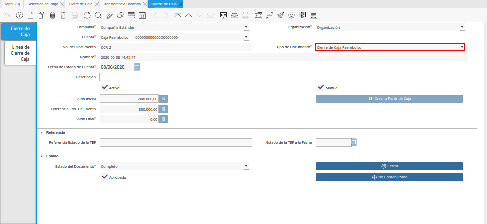

.. _ERPyA: http://erpya.com

.. _documento/caja-reembolso:

**Registro de Caja Reembolso**
==============================

#. Realice el procedimiento regular para generar una orden de pago, explicado en el documento :ref:`documento/orden-de-pago`, elaborado por `ERPyA`_.

   |Orden de Pago|

   Imagen 1. Orden de Pago

#. Luego realice el procedimiento regular para generar una selección de pago, igualmente explicado en el documento :ref:`documento/selección-de-pago`, elaborado por `ERPyA`_.

   |Selección de Pago|

   Imagen 2. Selección de Pago

#. Por último, realice el procedimiento regular para generar un imprimir/exportar pagos, explicado en el documento :ref:`documento/Imprimir-Exportar`, elaborado por `ERPyA`_.

   |Imprimir Exportar Pagos|

   Imagen 3. Imprimir Exportar Pagos

   #. Al consultar la pestaña "**Pago Generado**", de la ventana "**Selección de Pago**", se puede apreciar el registro del pago en la caja reembolso seleccionada en la selección de pago.

      |Pestaña Pago Generado|
      
      Imagen 4. Pestaña Pago Generado

   #. Al consultar el registro creado en caja, se puede apreciar el registro de la selección de pago de la siguiente manera.

      |Registo en Caja Reembolso|

      Imagen 5. Registo en Caja Reembolso

#. Realice el procedimiento regular para generar un cierre de caja, explicado en el documento :ref:`documento/procedimiento-para-realizar-un-cierre-de-caja`, elaborado por `ERPyA`_, seleccionando en el campo "**Tipo de Documento**" la opción "**Cierre de Caja Reembolso**".

   |Primer Cierre de Caja Reembolso|

   Imagen 6. Cierre de Caja Reembolso

#. Realice el procedimiento regular para generar una transferencia bancaria, explicado en el documento :ref:`documento/procedimiento-para-realizar-una-transferencia-bancaria`, elaborado por `ERPyA`_.

   |Transferencia Bancaria|

   Imagen 7. Transferencia Bancaria

   .. note::

      Al realizar el proceso de transferencia bancaria, es generado un egreso de banco y un ingreso a caja. De igual manera, es creado un cobro en caja y un pago en pago/cobro. Adicional a ello, el monto de la caja reembolso queda en cero (0).

#. Realice el procedimiento regular para generar un cierre de caja, explicado en el documento :ref:`documento/procedimiento-para-realizar-un-cierre-de-caja`, elaborado por `ERPyA`_, seleccionando en el campo "**Tipo de Documento**" la opción "**Cierre de Caja Reembolso**".

   |Cierre de Caja Final|

   Imagen 8. Cierre de Caja Reembolso
