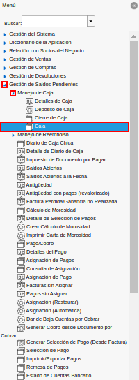
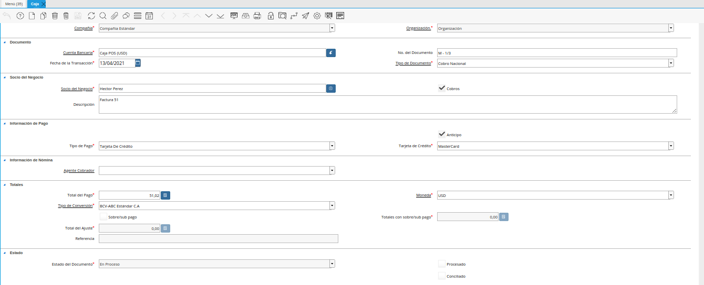
.. |icono registro nuevo de la ventana caja| image:: resources/new-register-icon-from-the-box-window.png
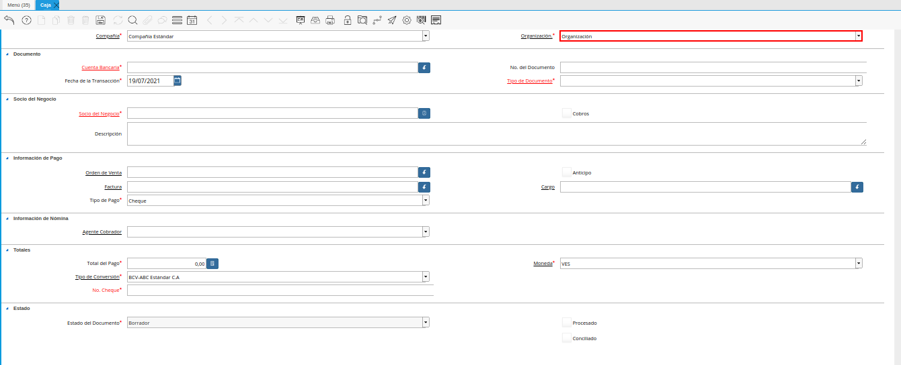
.. |campo tipo de documento de la ventana caja| image:: resources/document-type-field-of-the-box-window.png
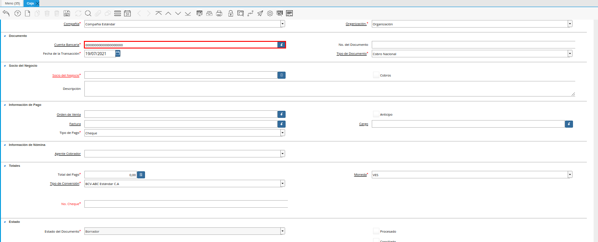
.. |campo número de documento de la ventana caja| image:: resources/box-window-document-number-field.png
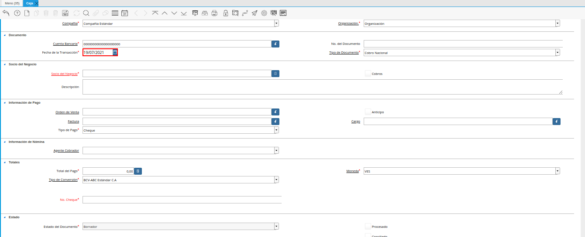
.. |campo socio del negocio de la ventana caja| image:: resources/business-partner-field-window-box.png
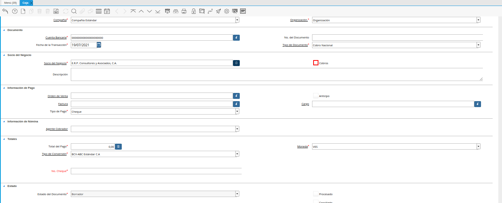
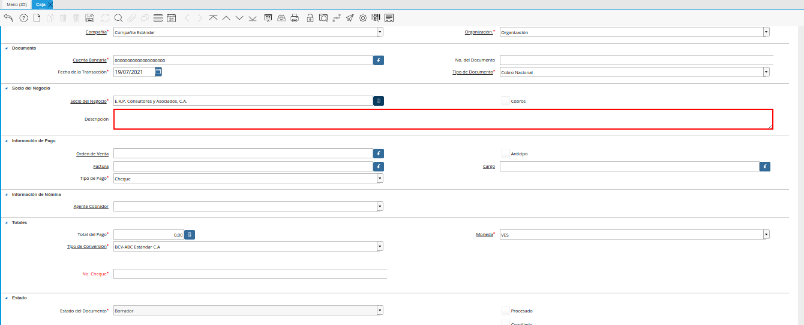
.. |campo orden de venta de la ventana caja| image:: resources/field-sales-order-box-window.png
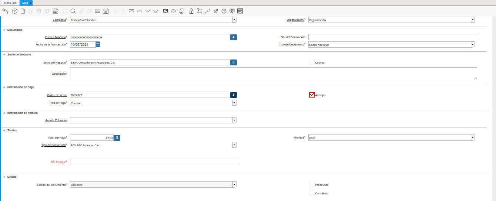
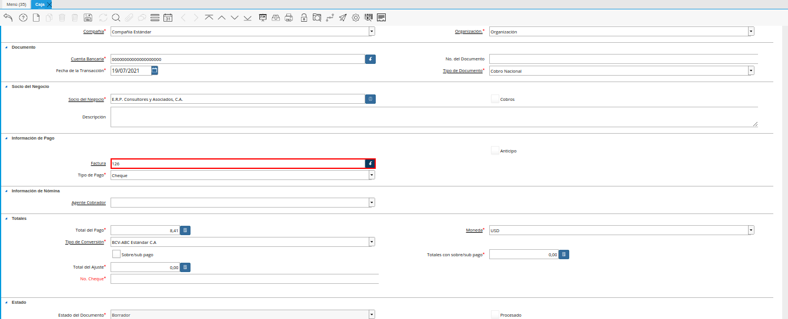
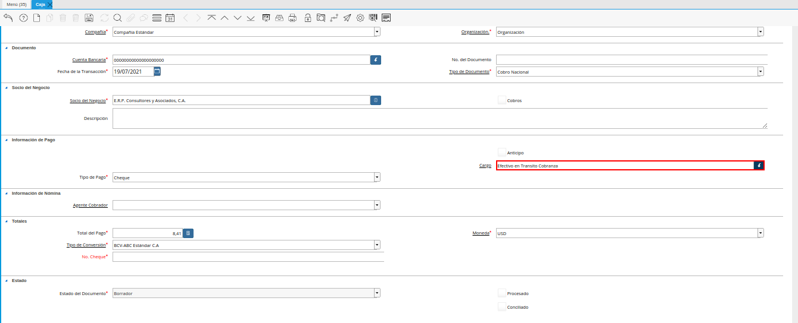
.. |campo tipo de pago de la ventana caja| image:: resources/payment-type-field-of-the-cash-window.png
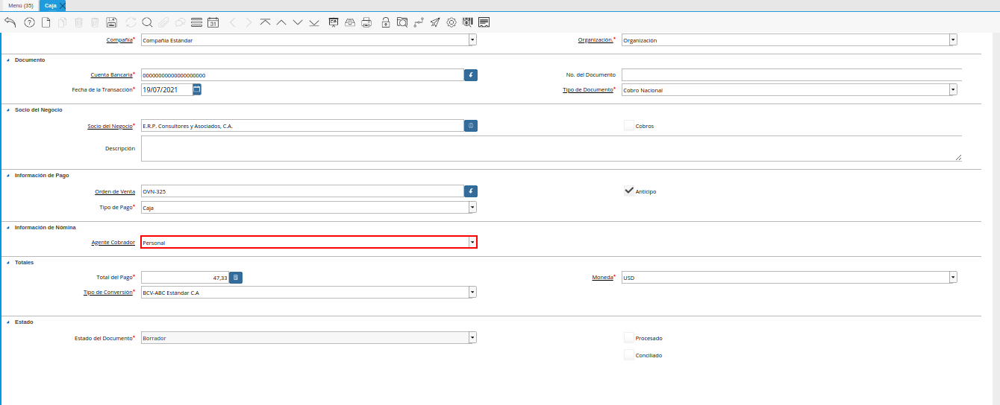
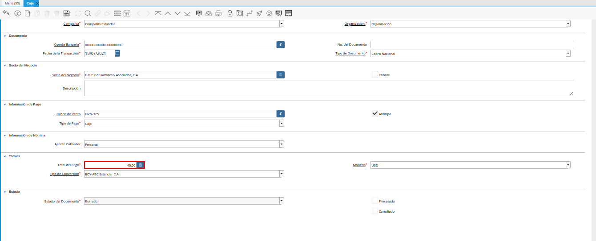
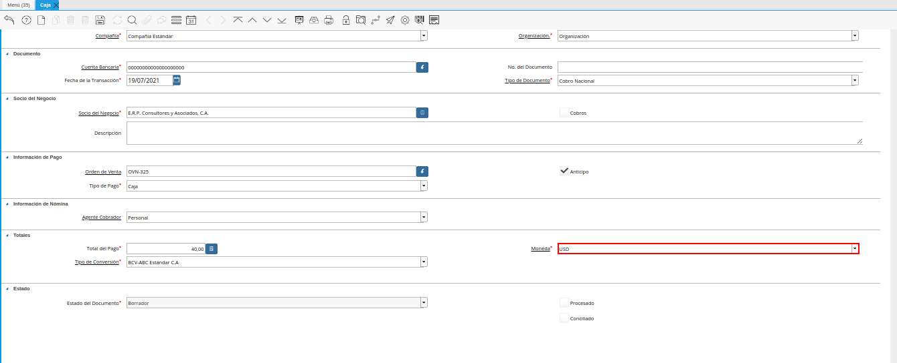
.. |campo tipo de conversión de la ventana caja| image:: resources/box-window-conversion-type-field.png
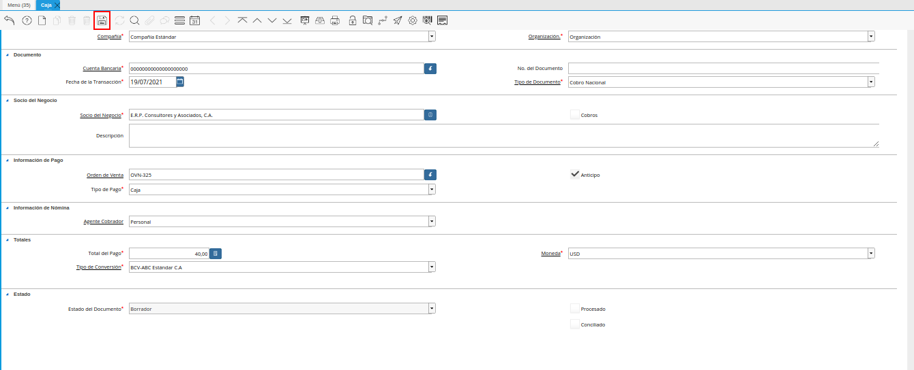
.. |icono proceso de la ventana caja| image:: resources/icon-window-process-box.png
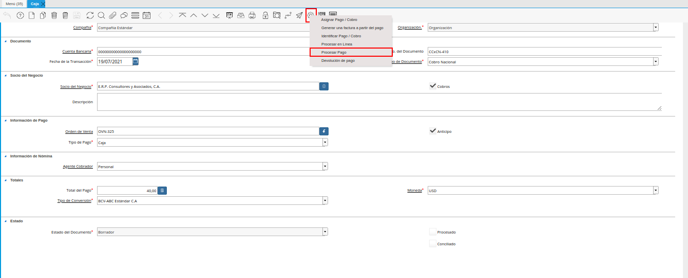
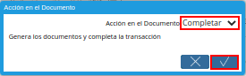
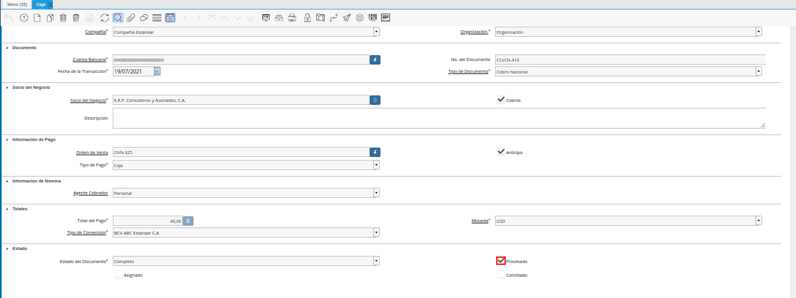
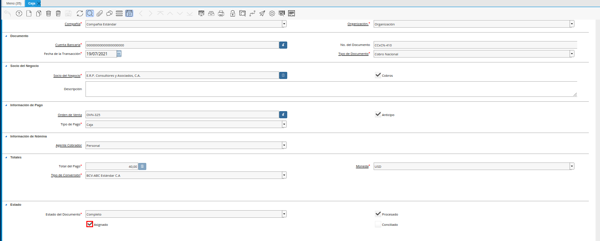
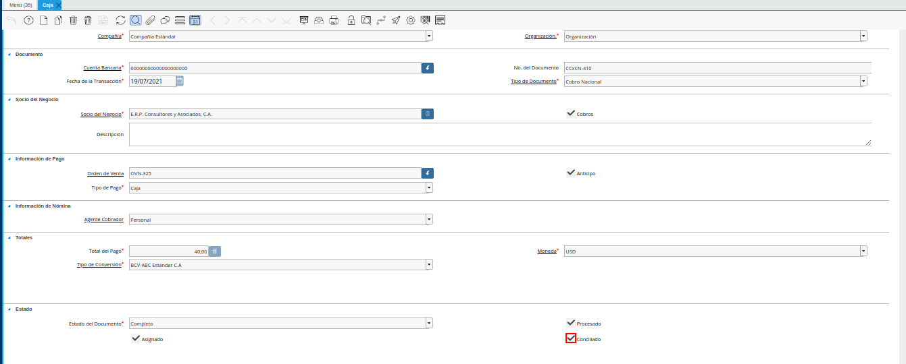

.. _documento/registro-de-caja:

**Registro de Caja**
====================

Ubique y seleccione en el menú de ADempiere, la carpeta "**Gestión de Saldos Pendientes**", luego seleccione la carpeta "**Manejo de Caja**", por último seleccione la ventana "**Caja**".

    |menú de caja|

    Imagen 1. Menú de ADempiere

Podrá visualizar la ventana "**Caja**", con todos los registros creados en la misma.

    |ventana caja|

    Imagen 2. Ventana Caja

Seleccione el icono "**Registro Nuevo**", ubicado en la barra de herramientas de ADempiere y proceda al llenado de los campos correspondientes.

    |icono registro nuevo de la ventana caja|

    Imagen 3. Icono Registro Nuevo

Seleccione en el campo "**Organización**", la organización para la cual requiere generar el registro.

    |campo organización de la ventana caja|

    Imagen 4. Campo Organización

Seleccione en el campo "**Tipo de Documento**", el tipo de documento que requiere generar. La selección de este campo define el comportamiento del documento.

    |campo tipo de documento de la ventana caja|

    Imagen 5. Campo Tipo de Documento

Seleccione en el campo "**Cuenta Bancaria**", la cuenta caja en la cual será asociado el registro que se encuentra realizando.

    |campo cuenta bancaria de la ventana caja|

    Imagen 6. Campo Cuenta Bancaria

Introduzca en el campo "**No. del Documento**", el número de documento correspondiente al registro que se encuentra realizando. Al no ingresar ningún valor en este campo, ADempiere asignará al guardar el registro, el número de correlativo establecido en el tipo de documento seleccionado.

    |campo número de documento de la ventana caja|

    Imagen 7. Campo No del Documento

Seleccione en el campo "**Fecha de la Transacción**", la fecha con la cual requiere que se genere el registro.

    |campo fecha de la transacción de la ventana caja|

    Imagen 8. Campo Fecha de la Transacción

Seleccione en el campo "**Socio del Negocio**", el socio del negocio que requiere asociar al registro que se encuentra realizando.

    |campo socio del negocio de la ventana caja|

    Imagen 9. Campo Socio del Negocio

El check "**Cobro**", indica que el documento pertenece a una transacción de ventas.

    |check cobro de la ventana caja|

    Imagen 10. Check Cobro

Introduzca en el campo "**Descripción**", una breve descripción referente al registro que se encuentra realizando.

    |campo descripción de la ventana caja|

    Imagen 11. Campo Descripción

Seleccione en el campo "**Orden de Venta**", la orden de venta que requiere asociar al registro que se encuentra realizando.

    |campo orden de venta de la ventana caja|

    Imagen 12. Campo Orden de Venta

    .. note::

        Al seleccionar algún registro en el campo "**Orden de Venta**", se inactivan los campos "**Factura**" y "**Cargo**".

El check "**Anticipo**", indica que el registro es generado como un anticipo.

    |check anticipo de la ventana caja|

    Imagen 13. Check Anticipo

Seleccione en el campo "**Factura**", la factura que requiere asociar al registro que se encuentra realizando.

    |campo factura de la ventana caja|

    Imagen 14. Campo Factura

    .. note::

        Al seleccionar algún registro en el campo "**Factura**", se inactivan los campos "**Orden de Venta**" y "**Cargo**".

Seleccione en el campo "**Cargo**", el cargo que requiere asociar al registro que se encuentra realizando.

    |campo cargo de la ventana caja|

    Imagen 15. Campo Cargo

    .. note::

        Al seleccionar algún registro en el campo "**Cargo**", se inactivan los campos "**Orden de Venta**" y "**Factura**".

Seleccione en el campo "**Tipo de Pago**", el método de pago utilizado para el registro que se encuentra realizando.

    |campo tipo de pago de la ventana caja|

    Imagen 16. Campo Tipo de Pago

Seleccione en el campo "**Agente Cobrador**", el agente cobrador del registro que se encuentra realizando.

    |campo agente comercial de la ventana caja|

    Imagen 17. Campo Agente Cobrador

Introduzca en el campo "**Total del Pago**", el monto total del registro que se encuentra realizando.

    |campo total del pago de la ventana caja|

    Imagen 18. Campo Total del Pago

Seleccione en el campo "**Moneda**", la moneda correspondiente al registro que se encuentra realizando.

    |campo moneda de la ventana caja|

    Imagen 19. Campo Moneda

Seleccione en el campo "**Tipo de Conversión**", el tipo de conversión correspondiente al registro que se encuentra realizando.

    |campo tipo de conversión de la ventana caja|

    Imagen 20. Campo Tipo de Conversión

Seleccione el icono "**Guardar Cambios**", ubicado en la barra de herramientas de ADempiere.

    |icono guardar cambios de la ventana caja|

    Imagen 21. Icono Guardar Cambios

Para completar el registro de la caja, seleccione el icono "**Proceso**", ubicado en la barra de herramientas de ADempiere.

    |icono proceso de la ventana caja|

    Imagen 22. Icono Proceso

Seleccione la opción "**Procesar Pago**", ubicado en el menú desplegado al seleccionar el icono "**Proceso**".

    |opción procesar pago de la ventana caja|

    Imagen 23. Opción Procesar Pago

Por último, seleccione en la ventana desplegada "**Acción en el Documento**", la opción "**Completar**" en el campo "**Acción en el Documento**" y la opción "**OK**" para completar el registro.

    |acción completar y opción ok de la ventana caja|

    Imagen 24. Acción Completar y Opción OK

Luego de completar el registro, se activa de manera automática el check "**Procesado**".

    |check procesado de la ventana caja|

    Imagen 25. Check Procesado

Al asignar el registro de la ventana "**Caja**" a un documento por pagar o cobrar, según sea el caso, se activa de manera automática el check "**Asignado**".

    |check asignado de la ventana caja|

    Imagen 26. Check Asignado

De igual manera, al incluir el registro de la ventana "**Caja**" en un cierre de caja y completar dicho cierre, se activa de manera automática el check "**Conciliado**".

    |check conciliado de la ventana caja|

    Imagen 26. Check Conciliado