.. _ERPyA: http://erpya.com
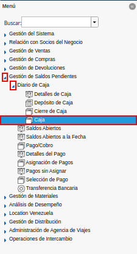
.. |Icono Registro Nuevo 1| image:: resources/new-record-icon.png
.. |Campo Organización 1| image:: resources/organization-field.png
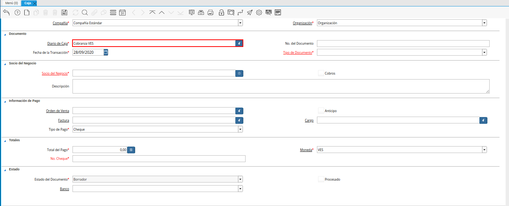
.. |campo nro del documento| image:: resources/document-number-field.png
.. |campo fecha de la transacción| image:: resources/transaction-date-field.png
.. |Campo Tipo de Documento 1| image:: resources/document-type-field.png
.. |campo socio del negocio| image:: resources/business-partner.png
.. |campo descripción| image:: resources/description-field.png
.. |campo factura| image:: resources/invoice-field.png
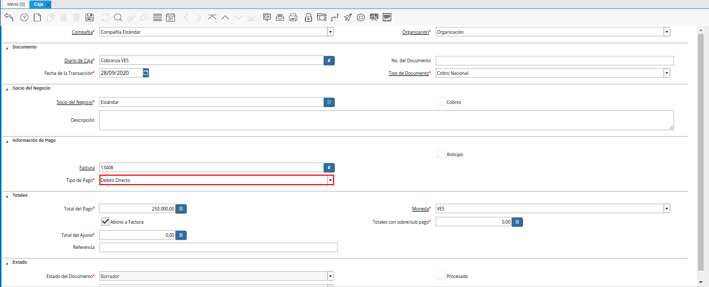
.. |total del pago| image:: resources/total-payment.png
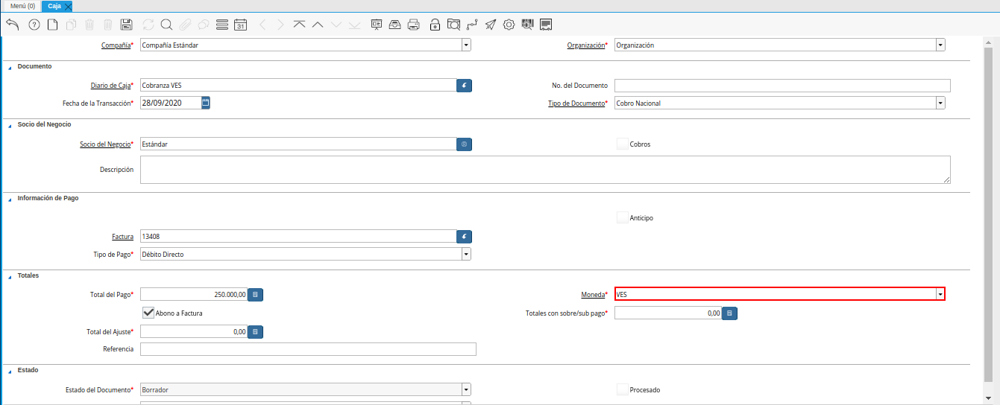
.. |abono a factura| image:: resources/payment-to-invoice.png
.. |totales con sobre sub pagos| image:: resources/totals-with-overpayments.png
.. |total del ajuste| image:: resources/total-fit.png
.. |referencia| image:: resources/reference.png
.. |estado del documento| image:: resources/document-status.png
.. |banco| image:: resources/bank.png
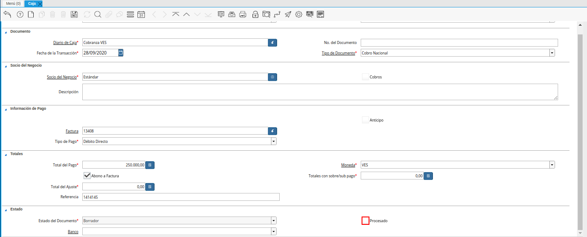
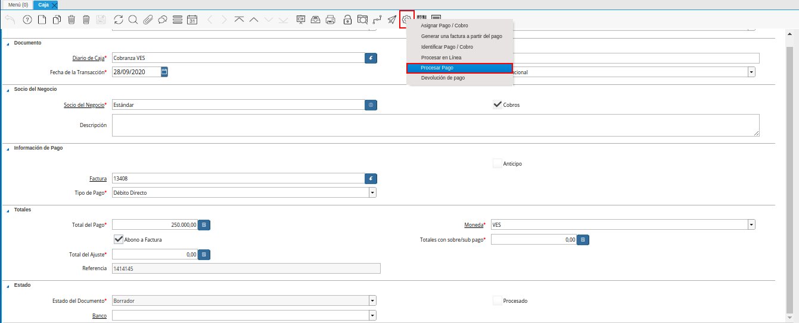
.. |Acción Completar| image:: resources/action-complete.png
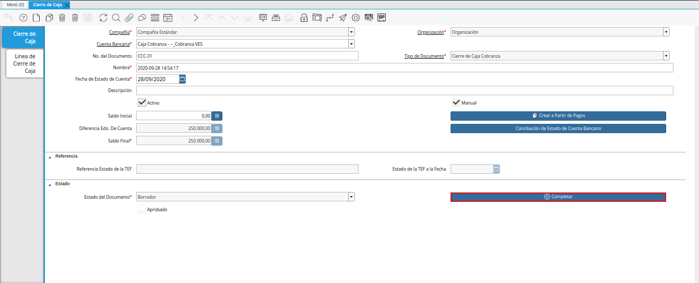
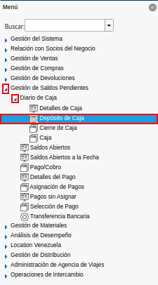
.. |Ventana de Búsqueda Inteligente Depósito de Caja 1| image:: resources/smart-search-window-cash-deposit.png
.. |Campo Cuenta Bancaria| image:: resources/bank-account-field.png
.. |Opción Comenzar Búsqueda 2| image:: resources/option-start-search.png
.. |Ventana de Búsqueda Inteligente Depósito de Caja 2| image:: resources/records-associated-with-the-account.png
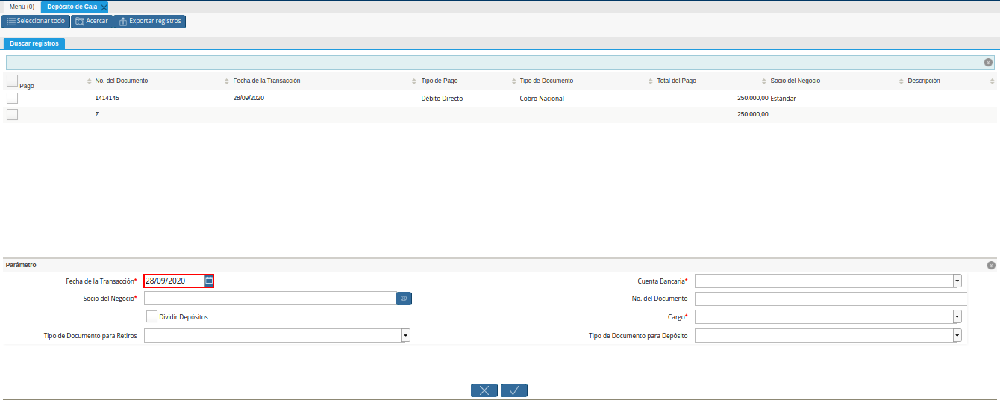
.. |Campo Socio del Negocio 1| image:: resources/business-partner-field.png
.. |Checklist Dividir Depósitos Destildado| image:: resources/checklist-divide-deposits-distilled.png
.. |Checklist Dividir Depósitos Tildado| image:: resources/checklist-split-deposits-checked.png
.. |Tipo de Documento para Retiros| image:: resources/document-type-field-for-withdrawals.png
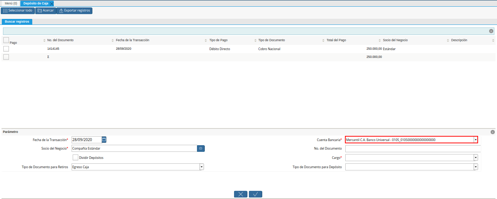
.. |No. del Documento| image:: resources/document-number.png
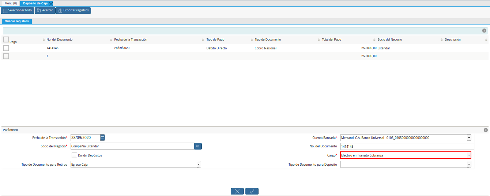
.. |Tipo de Documento para Depósito| image:: resources/type-of-document-for-deposit.png
.. |Selección de Caja y Opción OK| image:: resources/box-selection-and-option-ok.png
.. |Números de Documentos Generados| image:: resources/generated-document-numbers.png
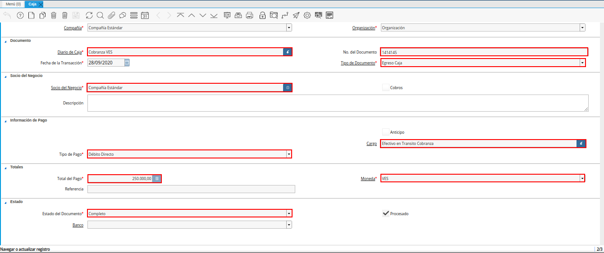
.. |Documento de Cobro Generado en Pago cobro| image:: resources/collection-document-generated-in-payment-collection.png
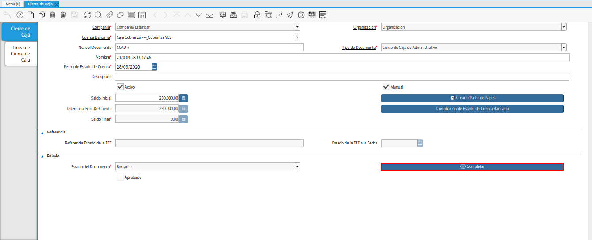

.. _documento/caja-cobranza:

**Registro de Caja Cobranza**
=============================

#. Ubique y seleccione en el menú de ADempiere, la carpeta "**Gestión de Saldos Pendientes**", luego seleccione la carpeta "**Diario de Caja**", por último seleccione la ventana "**Caja**".

    |Menú de ADempiere 1|

    Imagen 1. Menú de ADempiere

#. Luego podrá visualizar la ventana "**Caja**", donde debe seleccionar el icono "**Registro Nuevo**" ubicado en la barra de herramientas de ADempiere para crear un nuevo registro en caja.

    |Icono Registro Nuevo 1|

    Imagen 2. Icono Registro Nuevo

    #. Seleccione en el campo "**Organización**", la organización para la cual esta realizando el documento "**Caja**".

        |Campo Organización 1|

        Imagen 3. Campo Organización

    #. Seleccione en el campo "**Diario de Caja**", la caja correspondiente al registro que se encuentra realizando.

        |campo diario de caja|

        Imagen 4. Campo Diario de Caja

    #. Introduzca en el campo "**No. del Documento**", el número de documento correspondiente a la secuencia del tipo de documento que se encuentra realizando.

        |campo nro del documento|

        Imagen 5. Campo Nro del Documento

    #. Seleccione en el campo "**Fecha de la Transacción**", la fecha en la que se encuentra realizando el registro.

        |campo fecha de la transacción|

        Imagen 6. Campo Fecha de la Transacción

    #. Seleccione el tipo de documento a generar en el campo "**Tipo de Documento**", la selección de este define el comportamiento del documento que se esta elaborando, dicho comportamiento se encuentra explicado en el documento "**Tipo de Documento**" elaborado por `ERPyA`_. Para ejemplificar el registro es utilizada la opción "**Cobro Nacional**".

        |Campo Tipo de Documento 1|

        Imagen 7. Campo Tipo de Documento

    #. Seleccione en el campo "**Socio del Negocio**", el socio del negocio relacionado al registro que se encuentra realizando.

        |campo socio del negocio|

        Imagen 8. Campo Socio del Negocio

    #. Introduzca en el campo "**Descripción**", una breve descripción referente al registro que se encuentra realizando.

        |campo descripción|

        Imagen 9. Campo Descripción

    #. Seleccione en el campo "**Factura**", la factura relacionada al registro que se encuentra realizando.

        |campo factura|

        Imagen 10. Campo Factura

        .. note:: 

            Al seleccionar la factura, se carga automáticamente el campo "**Total del Pago**", con la información contenida en la factura seleccionada. 

    #. Seleccione en el campo "**Tipo de Pago**", la forma de pago utilizada por el socio del negocio seleccionado anteriormente.

        |Tipo de Pago 1|

        Imagen 11. Campo Tipo de Pago 

    #. Al seleccionar la factura se carga de forma automática el monto de la misma en el campo "**Total del Pago**".

        |total del pago|

        Imagen 12. Campo Total del Pago

        .. note::

            Este campo se refiere al monto total del pago realizado por el socio del negocio cliente, correspondiente al abono o anticipo del mismo.

    #. Seleccione en el campo "**Moneda**", la moneda asociada al registro que se encuentra realizando.

        |moneda|
        
        Imagen 13. Campo Moneda

    #. El checklist "**Abono a Factura**", determina si se está realizando un abono a la factura correspondiente o simplemente se cancela completamente y el restante se ajusta.

        |abono a factura|
        
        Imagen 14. Campo Abono a Factura

    #. Podrá visualizar en el campo "**Totales con sobre/sub pago**", el total de sobre pago (no contabilizado) o sub pago (pago parcial).

        |totales con sobre sub pagos|

        Imagen 15. Campo Totales con Sobre/Sub Pagos 

    #. Podrá visualizar en el campo "**Total del Ajuste**", el total a ser ajustado como incobrable.

        |total del ajuste|

        Imagen 16. Total del Ajuste 

    #. Introduzca en el campo "**Referencia**", la referencia de pago que indica el pago.

        |referencia|
        
        Imagen 17. Referencia 

    #. El campo "**Estado del Documento**", indica el estado del documento en este momento, para cambiar el estado del documento utilice la opción "**Procesar Pago**", desplegada por el icono "**Proceso**", ubicado en la barra de herramientas de ADempiere.

        |estado del documento|

        Imagen 18. Campo Estado del Documento

    #. Seleccione en el campo "**Banco**", el banco para esta organización o para un socio del negocio con quien esta organización efectúa transacciones.

        |banco|

        Imagen 19. Campo Banco

    #. El checklist "**Procesado**", indica que un documento ha sido procesado.

        |procesado|

        Imagen 20. Checklist Procesado

#. Seleccione la opción "**Procesar Pago**", desplegada por el icono "**Proceso**", ubicado en la barra de herramientas de ADempiere.

    |Opción Completar 1|

    Imagen 21. Opción Procesar Pago

#. Seleccione la acción "**Completar**" y la opción "**OK**", para completar el documento "**Caja**".

    |Acción Completar|

    Imagen 22. Acción Completar

#. Realice el procedimiento regular para generar un cierre de caja, explicado en el documento :ref:`documento/procedimiento-para-realizar-un-cierre-de-caja`, elaborado por `ERPyA`_, seleccionando en el campo "**Tipo de Documento**" la opción "**Cierre de Caja Cobranza**".

   |Cierre de Caja Cobranza|

   Imagen 23. Cierre de Caja Cobranza

#. Ubique y seleccione en el menú de ADempiere, la carpeta "**Gestión de Saldos Pendientes**", luego seleccione la carpeta "**Diario de Caja**", por último seleccione la ventana "**Depósito de Caja**".

    |Menú de ADempiere 3|

    Imagen 24. Menú de ADempiere

#. Luego podrá visualizar la ventana de búsqueda inteligente "**Depósito de Caja**", con diferentes campos o filtros para realizar la búsqueda de información en base a lo requerido por el usuario.

    |Ventana de Búsqueda Inteligente Depósito de Caja 1|

    Imagen 25. Ventana de Búsqueda Inteligente Depósito de Caja

    #. Seleccione en el campo "**Cuenta Bancaria**", la caja cobranza seleccionada en el campo "**Cuenta**" de la ventana "**Caja**". Para ejemplificar el registro es utilizada la cuenta bancaria "**Caja Cobranza - --_Cobranza VES**".

        |Campo Cuenta Bancaria|

        Imagen 26. Campo Cuenta Bancaria

    #. Seleccione la opción "**Comenzar Búsqueda**", para filtar búsqueda de la información en base a lo seleccionado.

        |Opción Comenzar Búsqueda 2|

        Imagen 27. Opción Comenzar Búsqueda

    #. Podrá visualizar la ventana de búsqueda inteligente "**Depósito de Caja**", con los diferentes registros asociados a la cuenta bancaria seleccionada.

        |Ventana de Búsqueda Inteligente Depósito de Caja 2|

        Imagen 28. Ventana de Búsqueda Inteligente Depósito de Caja

    #. Seleccione en el campo "**Fecha de la Transacción**", la fecha contable de la caja de la cual se va a realizar el depósito.

        |Campo Fecha para la Transacción 1|

        Imagen 28. Campo Fecha de la Transacción

    #. Seleccione en el campo "**Socio del Negocio**", la compañía para la cual realizó los documentos "**Caja**", "**Cierre de Caja**" y para la cual va a realizar el "**Depósito de Caja**".

        |Campo Socio del Negocio 1|

        Imagen 29. Campo Socio del Negocio

    #. El checklist "**Dividir Depósitos**" destildado, permite visualizar el campo "**No. del Documento**" para ingresar el número de referencia del pago realizado por el socio del negocio y es utilizado cuando se tienen varios registros de caja con el mismo número de referencia, generando un (1) documento de egreso en "**Caja**" y un (1) documento de cobro en "**Pago/Cobro**". 

        |Checklist Dividir Depósitos Destildado|

        Imagen 30. Checklist Dividir Depósitos Destildado

        #. Adicional a ello, al tildar el checklist "**Dividir Depósitos**" no puede ser visualizado el campo "**No. del Documento**", esta acción permite que sea generado un (1) documento de egreso en "**Caja**", con la sumatoria de todos los registros de documentos "**Caja**" que sean seleccionados en la ventana de búsqueda inteligente "**Depósito de Caja**" y un (1) documento de cobro en "**Pago/Cobro**", por cada uno de los registros seleccionados en dicha ventana. 

            |Checklist Dividir Depósitos Tildado|

            Imagen 31. Checklist Dividir Depósitos Tildado

    #. Seleccione en el campo "**Tipo de Documento para Retiros**", el tipo de documento que será generado en la ventana "**Caja**". Para ejemplificar el registro, el tipo de documento para retiros utilizado es "**Egreso Caja**".

        |Tipo de Documento para Retiros|

        Imagen 32. Campo Tipo de Documento para Retiros

    #. Seleccione en el campo "**Cuenta Bancaria**", la cuenta bancaria a la cual será realizado el depósito de caja.

        |Cuenta Bancaria|

        Imagen 33. Campo Cuenta Bancaria

    #. Introduzca en el campo "**No. del Documento**", el número de referencia del pago realizado por el socio del negocio cliente.

        |No. del Documento|

        Imagen 34. Campo Número del Documento

    #. Seleccione en el campo "**Cargo**", el cargo correspondiente al procedimiento que se esta realizando. Para ejemplificar el registro es utilizado el cargo "**Efectivo en Transito Cobranza**".

        |Cargo|

        Imagen 35. Campo Cargo

    #. Seleccione en el campo "**Tipo de Documento para Depósitos**", el tipo de documento que será generado en la ventana "**Pago/Cobro**". Para ejemplificar el registro, el tipo de documento para depósito utilizado es "**Cobro Nacional**". 

        |Tipo de Documento para Depósito|

        Imagen 36. Campo Tipo de Documento para Depósito

    #. Seleccione los diferentes registros de caja que pertenezcan a un mismo banco y la opción "**OK**" para ejecutar el proceso "**Depósito de Caja**" con la información ingresada en la ventana de búsqueda inteligente "**Depósito de Caja**". Para ejemplificar el registro es seleccionado solo el registro de caja "**1414145**".

        |Selección de Caja y Opción OK|

        Imagen 37. Selección de Caja y Opción OK

    .. note::

        Se deben seleccionar solo los registros que se conozca que pertencen al banco seleccionado en el campo "**Cuenta Bancaria**".

#. Podrá visualizar los números de documentos en la parte inferior izquierda de la ventana de búsqueda inteligente "**Depósito de Caja**". Dichos números de documentos pueden ser utilizados para ubicar los documetos generados.

    |Números de Documentos Generados|

    Imagen 27. Números de Documento Generados 

#. Al consultar del documento de egreso generado en la ventana "**Caja**", con ayuda del número de documento generado en la parte inferior izquierda de la ventana de búsqueda inteligente "**Depósito de Caja**", se puede visualizar el registro de la siguiente manera.

    |Documento de Egreso Generado en Caja|

    Imagen 28. Documento de Egreso Generado en Caja 

#. Al consultar del documento de ingreso generado en la ventana "**Pago/Cobro**", con ayuda del número de documento generado en la parte inferior izquierda de la ventana de búsqueda inteligente "**Depósito de Caja**", se puede visualizar el registro de la siguiente manera.

    |Documento de Cobro Generado en Pago cobro|

    Imagen 29. Documento de Cobro Generado en Pago/Cobro 

#. Realice el procedimiento regular para generar un cierre de caja, explicado en el documento :ref:`documento/procedimiento-para-realizar-un-cierre-de-caja`, elaborado por `ERPyA`_, seleccionando en el campo "**Tipo de Documento**" la opción "**Cierre de Caja Administrativo**".

   |Cierre de Caja Administrativo|

   Imagen 30. Cierre de Caja Administrativo

.. note::

    Para identificar los cobros sin registros en ADempiere, se debe realizar el procedimiento explicado en el proceso :ref:`paso/cobros-sin-registros` del documento "**Conciliaciones Automáticas**".