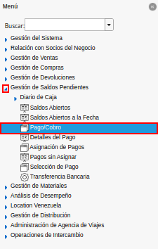
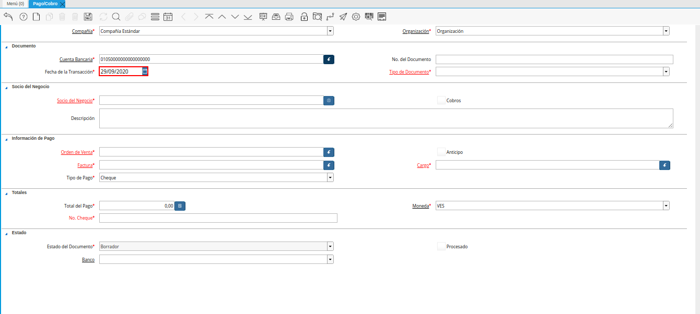
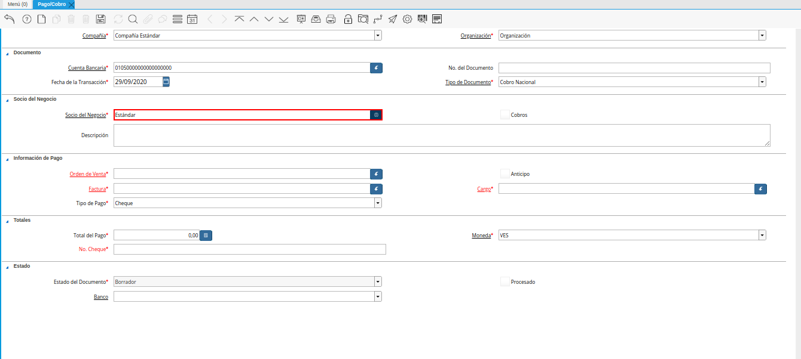
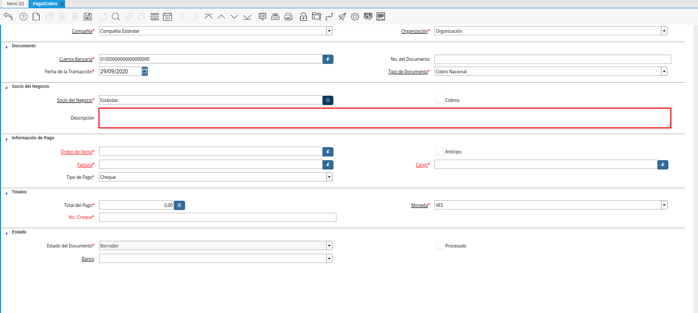
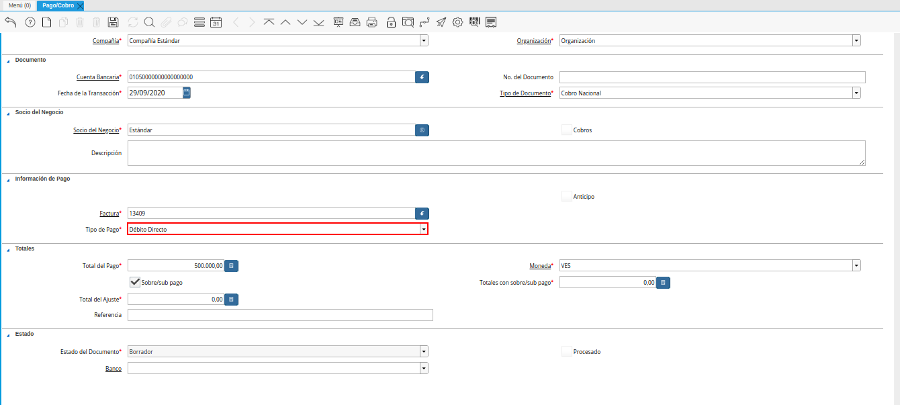
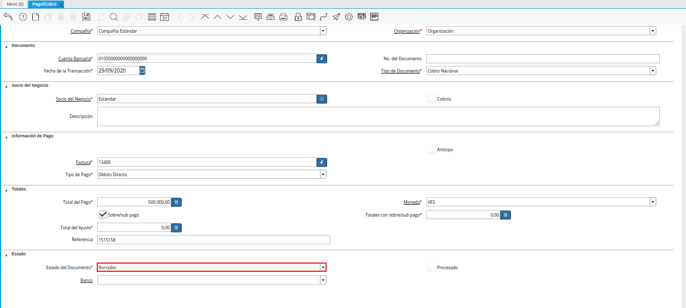
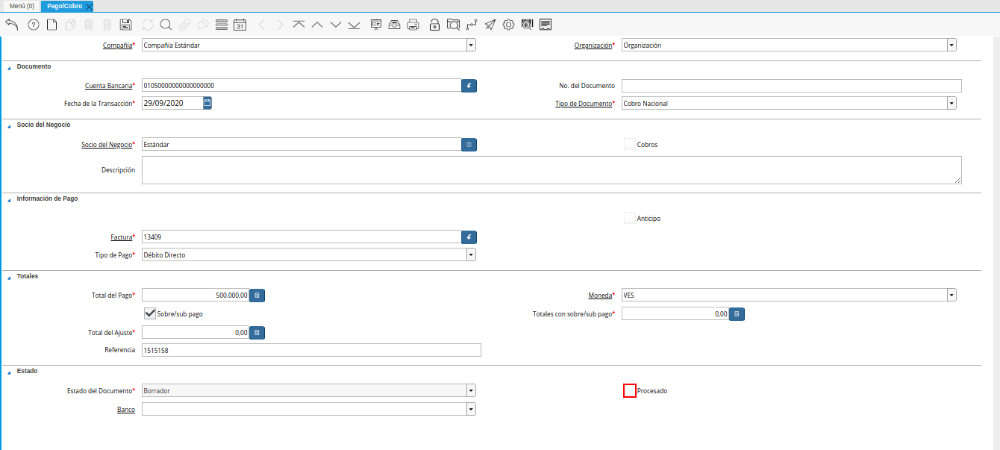
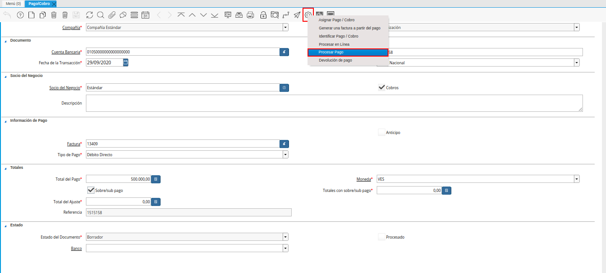
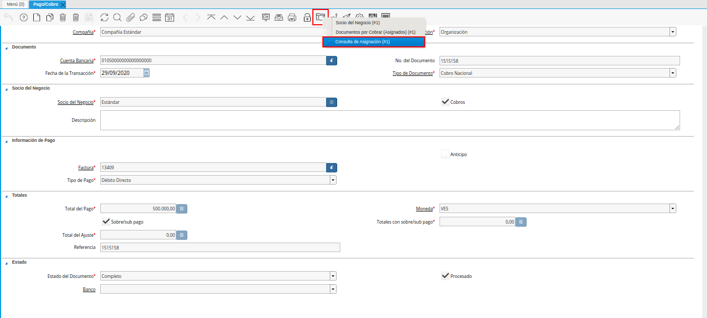

.. _ERPyA: http://erpya.com
.. |Factura a Cobrar| image:: resources/invoice-to-collect.png

.. |Icono Registro Nuevo| image:: resources/new-record-icon.png
.. |Campo Organización| image:: resources/organization-field.png
.. |Campo Cuenta Bancaria| image:: resources/bank-account-field.png
.. |Campo nro del documento| image:: resources/document-number-field.png

.. |Campo Tipo de Documento| image:: resources/document-type-field.png

.. |Identificador del Campo Factura| image:: resources/invoice-field-identifier.png
.. |Selección de Factura y Opción OK| image:: resources/invoice-selection-and-option-ok.png

.. |Campo Total del Pago| image:: resources/total-payment-field.png
.. |Campo Moneda| image:: resources/currency-field.png
.. |Campo Referencia| image:: resources/reference-field.png

.. |Campo Banco| image:: resources/field-bank.png

.. |Acción Completar| image:: resources/action-complete.png

.. |Pestaña Asignación| image:: resources/assignment-tab.png
.. |Pestaña Asignaciones| image:: resources/assignments-tab.png

.. _documento/cobro:

**Registro de Cobro**
=====================

Para ejemplificar el procedimiento de generar un cobro en ADempiere, es utilizada la factura por cobrar "**13409**".

    |Factura a Cobrar|

    Imagen 1. Factura por Cobrar

#. Ubique y seleccione en el menú de ADempiere, la carpeta "**Gestión de Saldos Pendientes**", luego seleccione la ventana "**Pago/Cobro**".

    |Menú de ADempiere|

    Imagen 2. Menú de ADempiere

#. Luego podrá visualizar la ventana "**Pago/Cobro**", donde debe seleccionar el icono "**Registro Nuevo**" que se encuentra ubicado en la barra de herramientas de ADempiere para crear un nuevo registro en la ventana "**Pago/Cobro**".

    |Icono Registro Nuevo|

    Imagen 3. Icono Registro Nuevo

    #. Seleccione en el campo "**Organización**", la organización para la cual esta realizando el documento "**Cobro**".

        |Campo Organización|

        Imagen 4. Campo Organización

    #. Seleccione en el campo "**Cuenta Bancaria**", la cuenta bancaria de la recepción del cobro que será realizado.

        |Campo Cuenta Bancaria|

        Imagen 5. Campo Cuenta Bancaria

    #. Introduzca en el campo "**No. del Documento**", el número de documento correspondiente a la secuencia del tipo de documento que se encuentre realizando.

        |Campo nro del documento|

        Imagen 6. Campo No. del Documento

    #. Seleccione en el campo "**Fecha de la Transacción**", la fecha en la que se encuentra realizando la transacción del cobro.

        |Campo fecha de la transacción|

        Imagen 7. Campo Fecha de la Transacción

    #. Seleccione el tipo de documento a generar en el campo "**Tipo de Documento**", la selección de este define el comportamiento del documento que se esta elaborando, dicho comportamiento se encuentra explicado en el documento "**Tipo de Documento**" elaborado por `ERPyA`_. 

        |Campo Tipo de Documento|

        Imagen 8. Campo Tipo de Documento

    #. Seleccione en el campo "**Socio del Negocio**", el socio del negocio cliente al cual le será realizado el cobro. 

        |Campo Socio del Negocio Cliente|

        Imagen 9. Campo Socio del Negocio

    #. Introduzca en el campo "**Descripción**", una breve descripción referente al cobro que será realizado.

        |Campo Descripción|

        Imagen 10. Campo Descripción

    #. Seleccione la factura a cobrar en el campo "**Factura**", la misma puede ser seleccionada con ayuda del identificador de dicho campo.

        |Identificador del Campo Factura|

        Imagen 11. Identificador del Campo Factura

    #. Podrá visualizar la siguiente ventana de información de factura, donde debe seleccionar la factura a cobrar y la opción "**OK**" para cargar los datos a la ventana "**Pago/Cobro**".

        |Selección de Factura y Opción OK|

        Imagen 12. Selección de Factura y Opción OK

    #. Seleccione en el campo "**Tipo de Pago**", la forma de pago utilizada por el socio del negocio cliente para cancelar la factura seleccionada.

        |Campo Tipo de Pago|

        Imagen 13. Campo Tipo de Pago

    #. Podrá visualizar en el campo "**Total del Pago**" el monto total de la factura, mismo monto total que se va a cancelar con el documento "**Cobro**" que se esta realizando.

        |Campo Total del Pago|

        Imagen 14. Campo Total del Pago

    #. Seleccione en el campo "**Moneda**", la moneda correspondiente al cobro que se esta realizando. 

        |Campo Moneda|

        Imagen 15. Campo Moneda

    #. Introduzca en el campo "**Referencia**" la referencia correspondiente a la transacción generada por la forma de pago utilizada.

        |Campo Referencia|

        Imagen 16. Campo Referencia

    #. El campo "**Estado del Documento**", indica el estado del documento en este momento, para cambiar el estado del documento utilice la opción "**Procesar Pago**", desplegada por el icono "**Proceso**", ubicado en la barra de herramientas de ADempiere.

        |Campo Estado del Documento|

        Imagen 17. Campo Estado del Documento

    #. Seleccione en el campo "**Banco**", el banco para esta organización o para un socio del negocio con quien esta organización efectúa transacciones.

        |Campo Banco|

        Imagen 18. Campo Banco

    #. El checklist "**Procesado**", indica que un documento ha sido procesado.

        |Checklist Procesado|

        Imagen 19. Checklist Procesado

    #. Seleccione la opción "**Procesar Pago**", desplegada por el icono "**Proceso**", ubicado en la barra de herramientas de ADempiere.

        |Opción Procesar Pago del Icono Proceso|

        Imagen 20. Opción Procesar Pago del Icono Proceso

    .. note::

        Recuerde guardar el registro de los campos seleccionando el icono "**Guardar Cambios**", ubicado en el barra de herramientas de ADempiere.

#. Seleccione la opción "**Completar**", ubicada en la parte inferior derecha de la ventana.

    |Opción Completar|

    Imagen 21. Opción Completar Documento

    #. Seleccione la accion "**Completar**" y la opción "**OK**", para completar el documento "**Cobro**" que esta realizando.

        |Acción Completar|

        Imagen 22. Acción Completar Documento

**Consultar Asignación**
========================

#. Seleccione el icono "**Visualiza Detalle**" en el documento "**Cobro**" generado anteriormente, para visualizar donde es usado el documento. Luego seleccione la opción "**Consulta de Asignación**" en el menú desplegado por el icono "**Visualiza Detalle**".

    |Icono Visualiza Detalle|

    Imagen 23. Icono Visualiza Detalle

#. Podrá visualizar la ventana "**Consulta de Asignación**", con el registro nuevo de la asignación de pago generado al completar el documento "**Cobro**".

    |Pestaña Asignación|

    Imagen 24. Pestaña Asignación

#. En la pestaña "**Asignaciones**" podrá visualizar la información de asignación de pago de la factura por cobrar seleccionada en el documento "**Cobro**" y el cobro realizado anteriormente.

    |Pestaña Asignaciones|

    Imagen 25. Pestaña Asignaciones