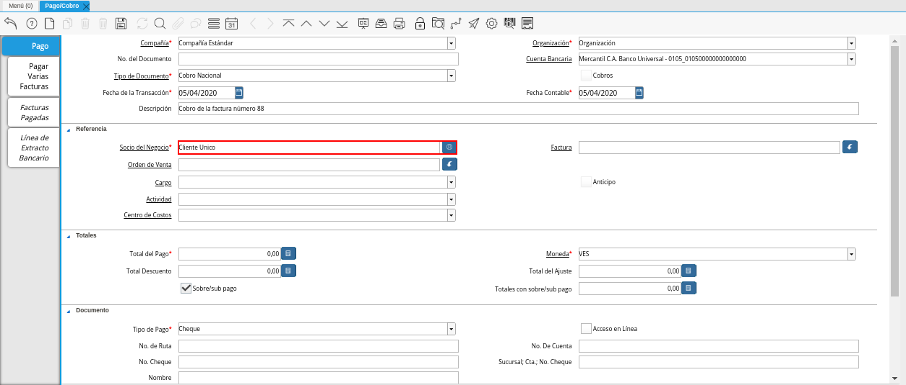

.. _ERPyA: http://erpya.com
.. |Factura a Cobrar| image:: resources/vent-documento-por-cobrar.png

.. |Opción Completar| image:: resources/opcion-completar.png

.. _documento/cobro:

**Registro de Cobro**
=====================

Para ejemplificar el procedimiento de generar un cobro en ADempiere, es utilizada la factura por cobrar "**88**".

    |Factura a Cobrar|

    Imagen 1. Factura por Cobrar

#. Ubique y seleccione en el menú de ADempiere, la carpeta "**Gestión de Saldos Pendientes**", luego seleccione la ventana "**Pago/Cobro**".

    |Menú de ADempiere|

    Imagen 2. Menú de ADempiere

#. Luego podrá visualizar la ventana "**Pago/Cobro**", donde debe seleccionar el icono "**Registro Nuevo**" que se encuentra ubicado en la barra de herramientas de ADempiere para crear un nuevo registro en la ventana "**Pago/Cobro**".

    |Icono Registro Nuevo|

    Imagen 3. Icono Registro Nuevo

#. Seleccione en el campo "**Organización**", la organización para la cual esta realizando el documento "**Cobro**".

    |Campo Organización|

    Imagen 4. Campo Organización

#. Seleccione el tipo de documento a generar en el campo "**Tipo de Documento**", la selección de este define el comportamiento del documento que se esta elaborando, dicho comportamiento se encuentra explicado en el documento :ref:`documento/tipo-documento` elaborado por `ERPyA`_. 

    |Campo Tipo de Documento|

    Imagen 5. Campo Tipo de Documento

#. Seleccione en el campo "**Cuenta Bancaria**", la cuenta bancaria de la recepción del cobro que será realizado.

    |Campo Cuenta Bancaria|

    Imagen 6. Campo Cuenta Bancaria

#. Introduzca en el campo "**Descripción**", una breve descripción referente al cobro que será realizado.

    |Campo Descripción|

    Imagen 7. Campo Descripción

#. Seleccione en el campo "**Socio del Negocio**", el socio del negocio cliente al cual le será realizado el cobro. 

    |Campo Socio del Negocio Cliente|

    Imagen 8. Campo Socio del Negocio

#. Seleccione la factura a cobrar en el campo "**Factura**", la misma puede ser seleccionada con ayuda del identificador de dicho campo.

    |Identificador del Campo Factura|

    Imagen 9. Identificador del Campo Factura

#. Podrá visualizar la siguiente ventana de información de factura, donde debe seleccionar la factura a cobrar y la opción "**OK**" para cargar los datos a la ventana "**Pago/Cobro**".

    |Selección de Factura y Opción OK|

    Imagen 10. Selección de Factura y Opción OK

#. Podrá visualizar en el campo "**Total del Pago**" el monto total de la factura, mismo monto total que se va a cancelar con el documento "**Cobro**" que se esta realizando.

    |Campo Total del Pago|

    Imagen 11. Campo Total del Pago

#. Seleccione en el campo "**Moneda**", la moneda correspondiente al cobro que se esta realizando. 

    |Campo Moneda|

    Imagen 12. Campo Moneda

#. Seleccione en el campo "**Tipo de Pago**", la forma utilizada para el cobro.

    |Campo Tipo de Pago|

    Imagen 13. Campo Tipo de Pago

    .. note::

        Recuerde guardar el registro de los campos seleccionando el icono "**Guardar Cambios**", ubicado en el barra de herramientas de ADempiere.

#. Seleccione la opción "**Completar**", ubicada en la parte inferior derecha de la ventana.

    |Opción Completar|

    Imagen 15. Opción Completar Documento

    #. Seleccione la accion "**Completar**" y la opción "**OK**", para completar el documento "**Cobro**" que esta realizando.

        |Acción Completar|

        Imagen 16. Acción Completar Documento

**Consultar Asignación**
========================

#. Seleccione el icono "**Visualiza Detalle**" en el documento "**Cobro**" generado anteriormente, para visualizar donde es usado el documento. Luego seleccione la opción "**Consulta de Asignación**" en el menú desplegado por el icono "**Visualiza Detalle**".

    |Icono Visualiza Detalle|

    Imagen 17. Icono Visualiza Detalle

#. Podrá visualizar la ventana "**Consulta de Asignación**", con el registro nuevo de la asignación de pago generado al completar el documento "**Cobro**".

    |Pestaña Asignación|

    Imagen 18. Pestaña Asignación

#. En la pestaña "**Asignaciones**" podrá visualizar la información de asignación de pago de la factura por cobrar seleccionada en el documento "**Cobro**" y el cobro realizado anteriormente.

    |Pestaña Asignaciones|

    Imagen 19. Pestaña Asignaciones