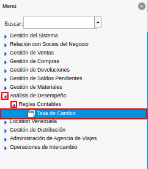
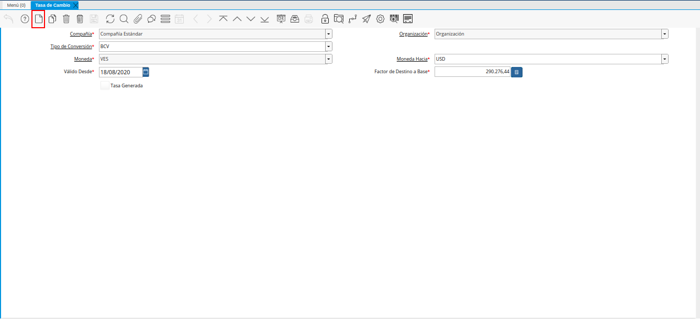
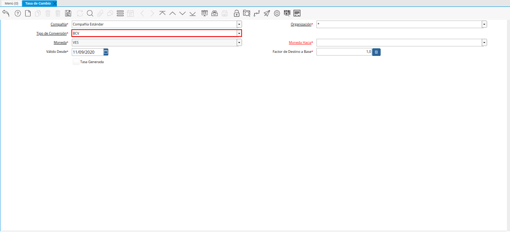

.. |Ventana Tasa de Cambio| image:: resources/exchange-rate-window.png

.. |Campo Moneda de la Ventana Tasa de Cambio| image:: resources/currency-field-of-the-exchange-rate-window.png
.. |Campo Moneda Hacia de la Ventana Tasa de Cambio| image:: resources/currency-to-field-of-the-exchange-rate-window.png
.. |Campo Válido Desde de la Ventana Tasa de Cambio| image:: resources/field-valid-from-exchange-rate-window.png
.. |Campo Factor de Destino a Base de la Ventana Tasa de Cambio| image:: resources/target-factor-field-based-on-the-exchange-rate-window.png

.. _documento/conversión-monetaria-manual:

**Conversión Manual**
=====================

#. Ubique y seleccione en el menú de ADempiere, la carpeta "**Análisis de Desempeño**", luego seleccione la carpeta "**Reglas Contables**", por último seleccione la ventana "**Tasa de Cambio**".

    |Menú de ADempiere|

    Imagen 1. Menú de ADempiere

#. Podrá visualizar la ventana "**Tasa de Cambio**", con los diferentes registros de tasas de cambio que posee ADempiere.

    |Ventana Tasa de Cambio|

    Imagen 2. Ventana Tasa de Cambio

    #. Seleccione el icono "**Registro Nuevo**", ubicado en la barra de herramientas de ADempiere para registrar una nueva tasa de cambio.

        |Icono Registro Nuevo de la Ventana Tasa de Cambio|

        Imagen 3. Icono Registro Nuevo de la Ventana Tasa de Cambio

    #. Seleccione en el campo "**Tipo de Conversión**", el tipo de conversión a utilizar. Para este caso es utilizado el tipo de conversión "**BCV**", creado anteriormente.

        |Campo Tipo de Conversión de la Ventana Tasa de Cambio|

        Imagen 4. Campo Tipo de Conversión de la Ventana Tasa de Cambio

        .. warning::

            La tasa de cambio se crea de moneda nacional a divisas y ADempiere crea de manera automática la tasa de cambio de divisas a nacional.

    #. Podrá visualizar en el campo "**Moneda**", la moneda origen del dinero.

        |Campo Moneda de la Ventana Tasa de Cambio|

        Imagen 5. Campo Moneda de la Ventana Tasa de Cambio

    #. Seleccione en el campo "**Moneda Hacia**", la moneda para la cual requiere convertir el dinero.

        |Campo Moneda Hacia de la Ventana Tasa de Cambio|

        Imagen 6. Campo Moneda Hacia de la Ventana Tasa de Cambio

    #. Seleccione en el campo "**Válido Desde**", la fecha desde la cual es válida la tasa de conversión monetaria que se encuentra realizando.

        |Campo Válido Desde de la Ventana Tasa de Cambio|

        Imagen 7. Campo Válido Desde de la Ventana Tasa de Cambio

    #. Introduzca en el campo "**Factor de Destino a Base**", la tasa por la que serán multiplicados los montos de las transacciones donde sea utilizado el tipo de conversión seleccionado anteriormente. Para ejemplificar el registro es utilizada la tasa "**300.000,00**".

        |Campo Factor de Destino a Base de la Ventana Tasa de Cambio|

        Imagen 12. Campo Factor de Destino a Base de la Pestaña Tasas de Cambio

.. note:: 

    Recuerde guardar los cambios realizados seleccionando el icono "**Guardar Cambios**", ubicado en la barra de herramientas de ADempiere.
