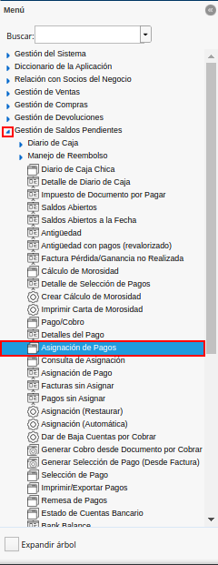
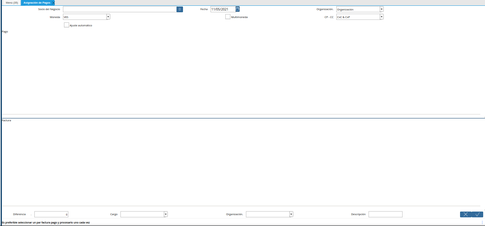
.. |campo socio del negocio de la ventana asignación de pagos| image:: resources/business-partner-field-of-the-payment-assignment-window.png
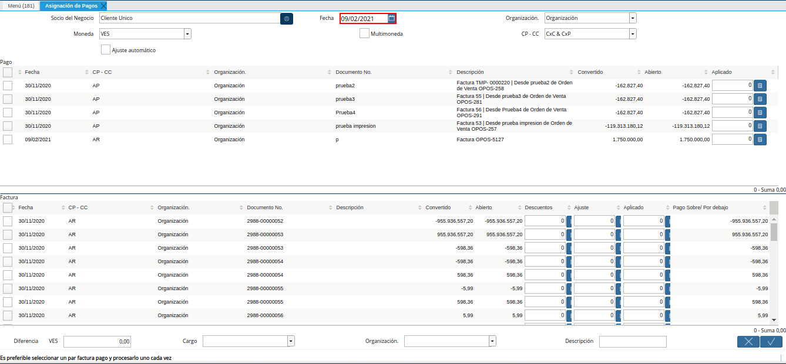
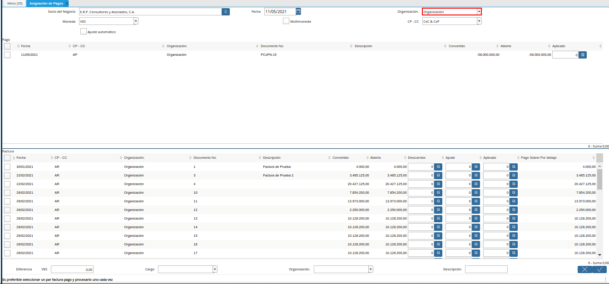
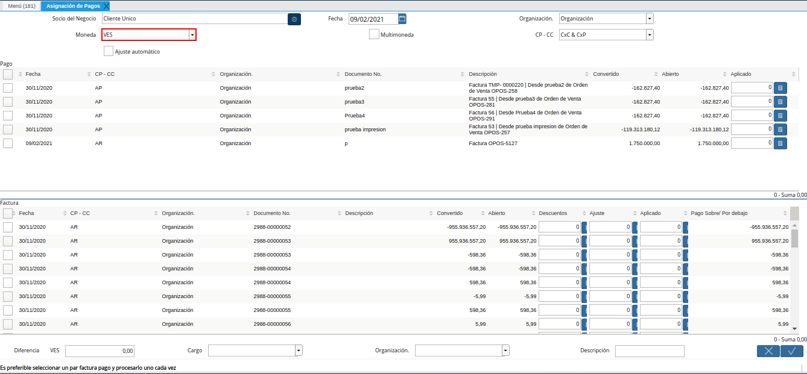
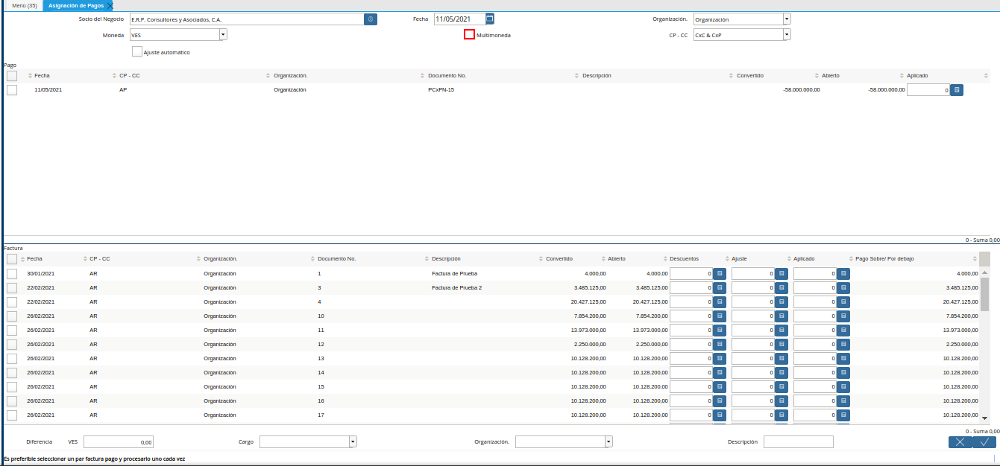
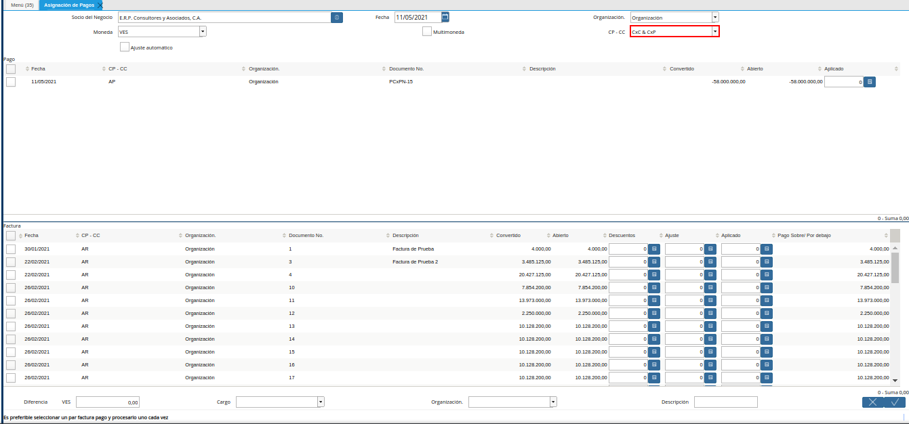

.. |panel pago de la ventana asignación de pagos| image:: resources/payment-panel-of-the-payment-assignment-window.png
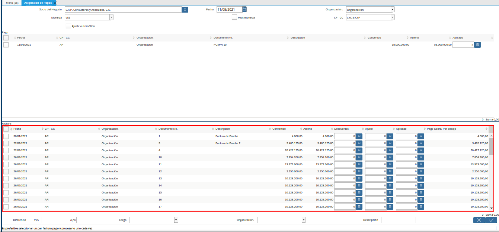
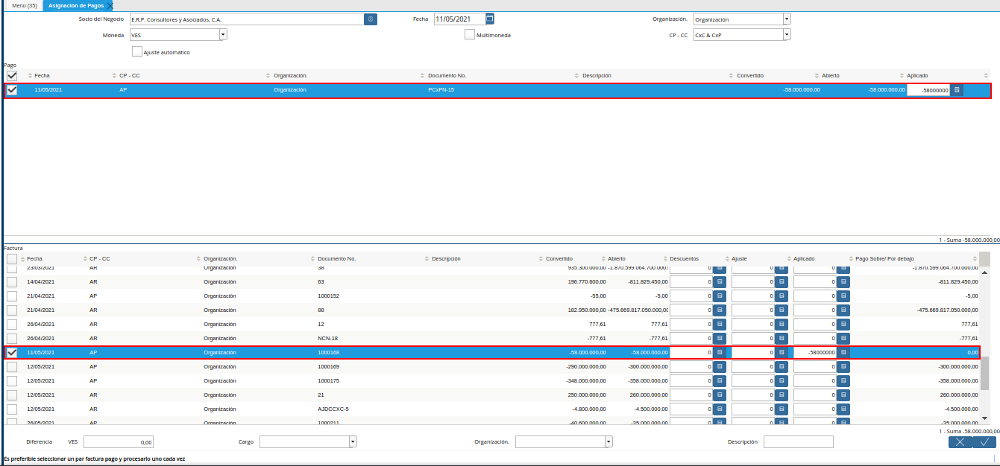
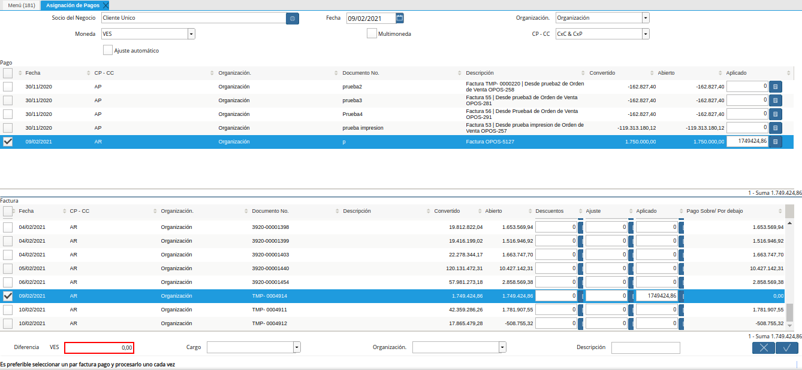
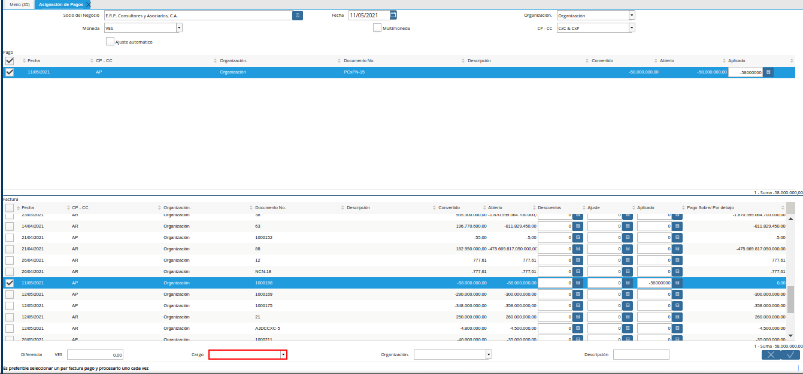
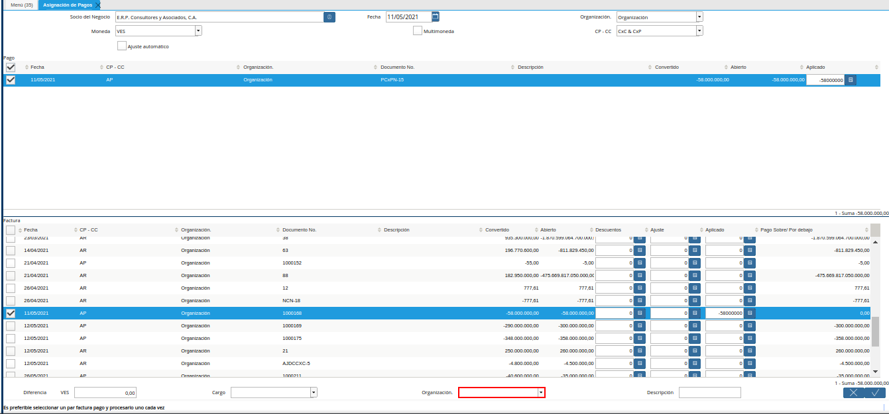
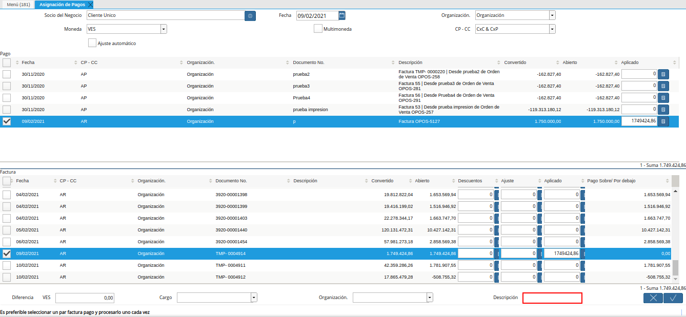
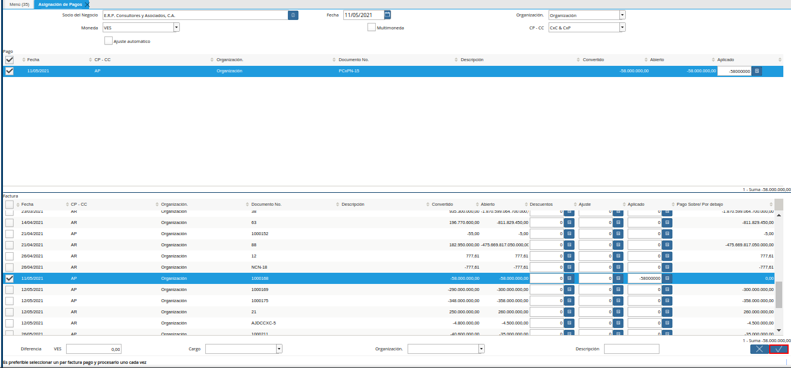
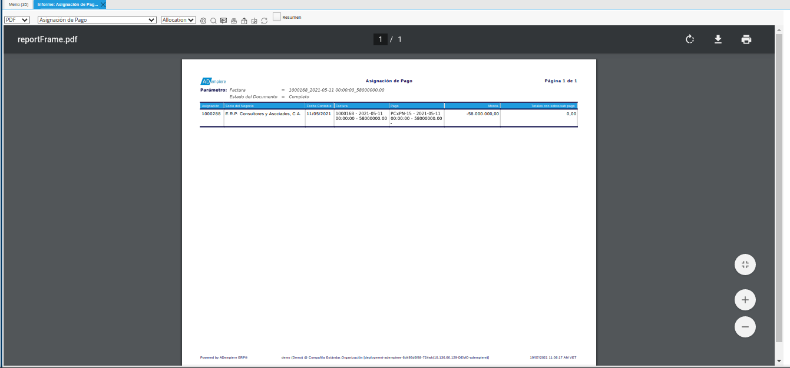
.. |check pagado del documento por pagar o cobrar| image:: resources/check-paid-of-the-document-to-pay-or-collect.png
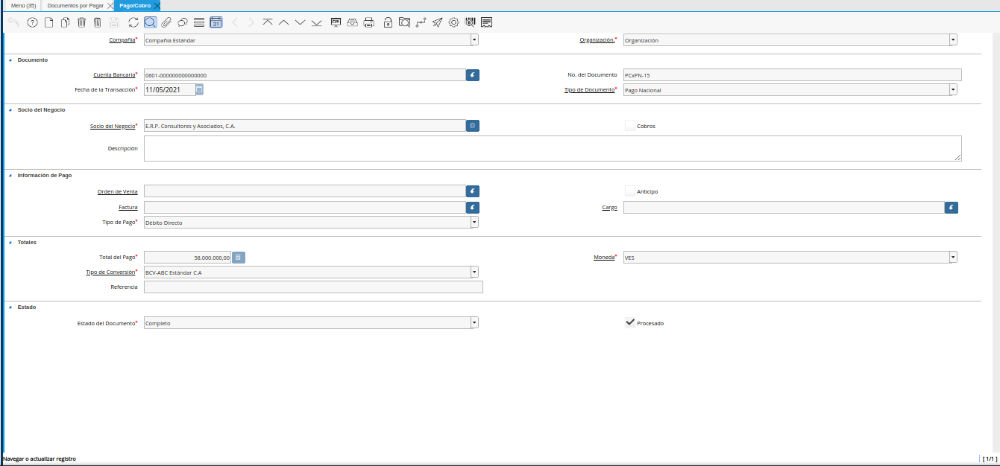

.. _documento/asignación-de-pagos-o-cobros-a-documentos-x-c-o-p:

**Asignación de Pagos/Cobros a Documentos por Pagar o Cobrar**
==============================================================

Una vez registrado el pago u cobro en la ventana "**Pago/Cobro**" y el documento ya sea por pagar o cobrar, se puede proceder a asignar dichos documentos, teniendo en cuenta el siguiente escenario donde se debe asociar un pago registrado en ADempiere antes de que el proveedor emita la factura , dicho pago saldará por completo la cuenta por pagar  que tiene la factura registrada de un proveedor, para ubicar y hacer el cruce se deben realizar los siguientes pasos:

Ubique y seleccione en el menú de ADempiere, la carpeta "**Gestión de Saldos Pendientes**", luego seleccione la ventana "**Asignación de Pagos**".

    |menú de asignación de pagos|

    Imagen 1. Menú de ADempiere

Podrá visualizar la ventana del proceso "**Asignación de Pagos**", con diferentes campos que permiten filtrar la información en base a lo requerido.

    |ventana asignación de pagos|

    Imagen 2. Ventana ASignación de Pagos

Al desplegar dicha ventana se puede ubicar los pagos y documentos a través de los siguientes criterios de búsqueda.

Seleccione en el campo "**Socio del Negocio**", el socio del negocio por el cual requiere filtrar la información.

    .. note::

        Al utilizar este criterio de búsqueda, ADempiere solo ubicará en dicha ventana los documentos que no tengan asignaciones y que posean un saldo abierto de ese socio de negocio.

    |campo socio del negocio de la ventana asignación de pagos|

    Imagen 3. Campo Socio del Negocio

Seleccione en el campo "**Fecha**", la fecha de la asignación.

    |campo fecha de la ventana asignación de pagos|

    Imagen 4. Campo Fecha

Seleccione en el campo "**Organización**", la organización de la asignación.

    |campo organización de la ventana asignación de pagos|

    Imagen 5. Campo Organización

Seleccione en el campo "**Moneda**", la moneda de la asignación.

    .. note::

        Si en este punto se encuentra activo el check "**Multimoneda**" y se predetermina una moneda en este campo, la ventana asignación de pagos convertirá sus saldos de aquellos registros que se encuentre con una moneda diferente a la moneda predeterminada, respetando el tipo de conversión y la tasa cargada a la fecha de cada registro.

    |campo moneda de la ventana asignación de pagos|

    Imagen 6. Campo Moneda

Seleccione el check "**Multimoneda**", para generar la asignación en multimoneda.

    .. note::

        Este check permite visualizar registros de diferentes monedas a la factura.

    |check multimoneda de la ventana asignación de pagos|

    Imagen 7. Check Multimoneda

Seleccione en el campo "**CP - CC**", el tipo de cuenta por la cual requiere filtrar la información.

    .. note::

        Esta opción permite indicarle a ADempiere que documentos requiere visualizar, si són solo de la parte de compras, solo de la parte de ventas, o ambos. Para ello, se estable de la siguiente manera:

        - **CxC & CxP**: Muestra tanto cobros, pagos, documentos por pagar y documentos por cobrar.

        - **CxC**: Muestra solo cobros y documentos por cobrar

        - **CxP**: Muestra solo pagos y documentos por pagar

    |campo cp cc de la ventana asignación de pagos|

    Imagen 8. Campo CP - CC

El check "**Ajuste Automático**", permite asignar automáticamente los pagos/cobros hacia los documentos por pagar o cobrar, tomando coincidencias de saldos entre los saldos abiertos.

    |check ajuste automático de la ventana de pagos|

    Imagen 9. Check Ajuste Automático

Podrá visualizar en el panel "**Pago**", el resultado de todos los "**Pagos/Cobros**" con coincidencia por la búsqueda. 

    |panel pago de la ventana asignación de pagos|

    Imagen 10. Panel Pago

Podrá visualizar en el panel "**Factura**", el resultado de todas las facturas con coincidencia por la búsqueda.

    |campo factura de la ventana asignación de pagos|

    Imagen 11. Panel Factura

Seleccione los registros de pago/cobro y factura que requiere asociar. Dicha selección se debe realizar considerando lo siguiente.

    Cuando el monto total del pago/cobro es mayor al monto total de la factura se debe seleccionar primero el registro de la factura. Esto con el propósito de que en la asignación se indique que el monto a saldar o a tomar del pago debe ser igual al de la factura, ejemplo:

        - Se tiene un pago de 5.000.00,00 y una factura de CxP de 2.000.000,00 , el monto que se desea cruzar contra la factura deben ser los 2.000.000,00 para poder saldarla en sus totalidad y se necesita tener los otros 3.000.000,00 disponibles del pago para cruzarlos a asignarlos contra otra factura que envie el proveedor ;para este caso se tilda primero la factura,luego el pago y se tilda la opción "Ok" de la ventana, en este punto se salda esos 2.000.000,00 del documento por pagar y quedan del movimiento del pago 3.000.000,00 abiertos para ser asignados contra otro documento.

    Cuando el monto total del pago/cobro es mayor al monto total de la factura se puede seleccionar primero el pago y luego la factura, o primero la factura y luego el pago, de las dos formas se puede aplicar la asignación, ejemplo:

        - Se tiene un pago de 5.000.000,00 y un documento por pagar de 5.000.000,00 el cual se desea asignar por su totalidad para ello se puede asignar primero el pago y luego la factura o viceversa , de igual forma ambos documentos se van a asignar por su totalidad

    Cuando el monto total del pago/cobro es menor al monto total de la factura se debe seleccionar primero el registro del pago/cobro y luego la factura, ejemplo:

        - Se tiene un pago de 5.200.000,00 y una factura de 5.800.000,00 el proveedor en su momento había realizado un anticipo del monto total sin retenciones el cual da 5.200.000,00 y factura hasta los momentos tiene un saldo abierto de 5.800.000,00 por que no se le ha aplicado la retención del IVA de 75%, para este caso el monto que se debe asignar a la factura es el monto del pago y para ello se tilda primero el pago y luego la factura y se tilda la opción "OK"

    |selección de registros para cruces de cuentas|

    Imagen 12. Selección de registros para cruce de cuentas

    .. warning::

        Si requiere asociar más de un registro a la factura, debe seleccionar todos los registros que requiera asociar la factura.

En el campo "**Diferencia**", será visualizado el monto de diferencia resultante del cruce entre la factura y los pagos/cobros.

    |campo diferencia de la ventana asignación de pagos|

    Imagen 13. Campo Diferencia

En el campo "**Cargo**", podrá visualizar los diferentes cargos disponibles que pueden ser utilizados para justificar el proceso que se encuentra realizando.

    |campo cargo de la ventana asignación de pagos|

    Imagen 14. Campo Cargo

En el campo "**Organización**", la organización para la cual se encuentra realizando el proceso.

    |campo organización para generar de la ventana asignación de pagos|

    Imagen 15. Campo Organización

En el campo "**Descripción**", puede agregar una breve descripción referente al proceso que se encuentra realizando.

    |campo descripción de la ventana asignación de pagos|

    Imagen 16. Campo Descripción

Seleccione la opción "**OK**", para ejecutar el proceso.

    |opción ok de la ventana asignación de pagos|

    Imagen 17. Opción OK

.. warning::

    Si el escenario se presenta con los documentos por cobrar, se aplica el mismo procedimiento pero con la diferencia de que estos son cobros contra documentos por cobrar.

Para verificar los pagos/cobros que estén asociado a un documento por pagar o por cobrar, se puede generar el reporte :ref:`documento/reporte-de-asignación-de-pago`, donde se observa que pagos/cobros han sido asociados a los documentos por pagar o por cobrar y si queda un saldo abierto.

    |reporte de asignación de pagos|

    Imagen 18. Reporte de Asignación de Pagos

Por otra parte, una observación muy peculiar en los documentos que han sido saldado en su totalidad es el check "**Pagado**" que se encuentra en toda ventana de documento por pagar o documentos por cobrar. Al estar activo check "**Pagado**" es por que la factura se saldo en su totalidad, de no ser así y el pago fue parcial hasta que no se complete el pago por el "**Gran Total**" de la factura no se tildara como "**Pagado**".

    |check pagado del documento por pagar o cobrar|

    Imagen 19. Check Pagado del Documento por Pagar o Cobrar

Se puede comprobar con que pago o cobro se asigno el "**Documento por Pagar**" o "**Documento por Cobrar**", seleccionando el icono "**Visualiza Detalle (Donde es Usado)**" ubicado en la barra de herramientas de ADempiere, de la ventana "**Documento por Pagar**" o "**Documento por Cobrar**". Luego se debe seleccionar la opción "**Pagos Asignados**". Al seleccionar dicha opción, ADempiere acercará la ventana del pago asociado, confirmando así que los documentos fueron vinculados correctamente.

    |consulta de vínculo de pago cobro con factura|

    Imagen 20. Consulta de Vínculo

    .. note::

        Esta función sólo aplica con aquellos pagos/cobros que han sido registrados a través de la ventana "**Pago/Cobro**", si los pagos/cobros fueron registrados a través de la ventana "**Caja**" no funcionará correctamente esta opción y para ubicarlos se debe ir a la ventana caja, para más información de los registros de pagos/cobros desde la ventana "**Pago/Cobro**" o ventana "**Caja**", puede consultar los respectivos documentos :ref:`src/adempiere/open-items/payment`, :ref:`src/adempiere/open-items/collection` y :ref:`documento/registro-de-caja`.