.. _ERPyA: http://erpya.com
.. |Menú de ADempiere| image:: resources/payment-selection-menu.png
.. |Icono Registro Nuevo 1| image:: resources/icono-nuevo1.png
.. |Campo Organización 1| image:: resources/org1.png
.. |Campo Tipo de Documento 1| image:: resources/tipo-doc1.png
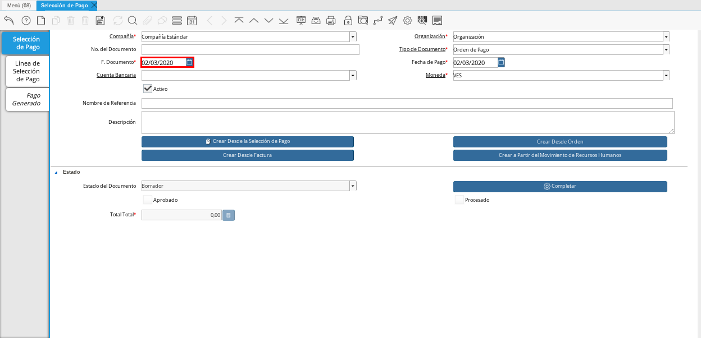
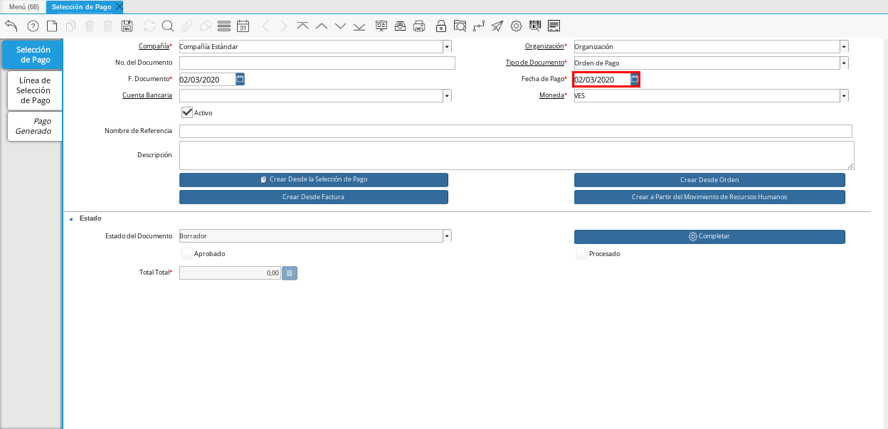
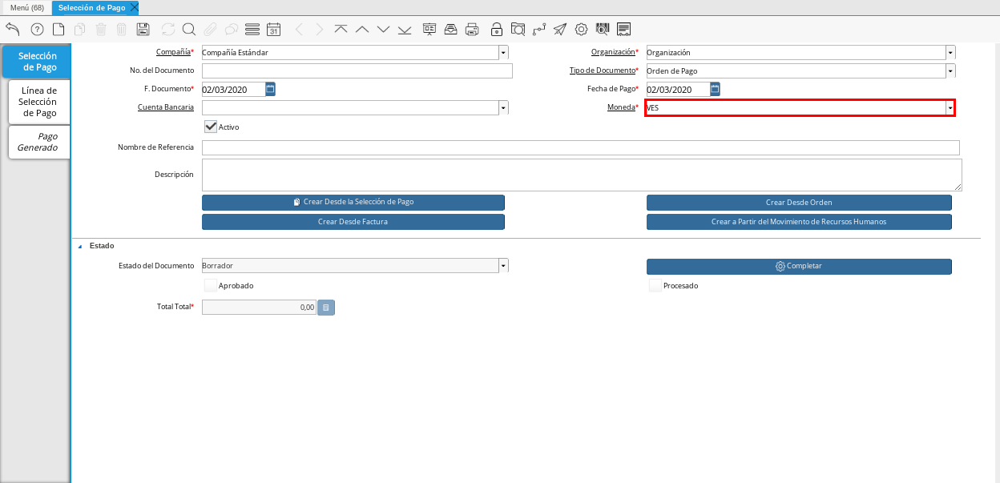
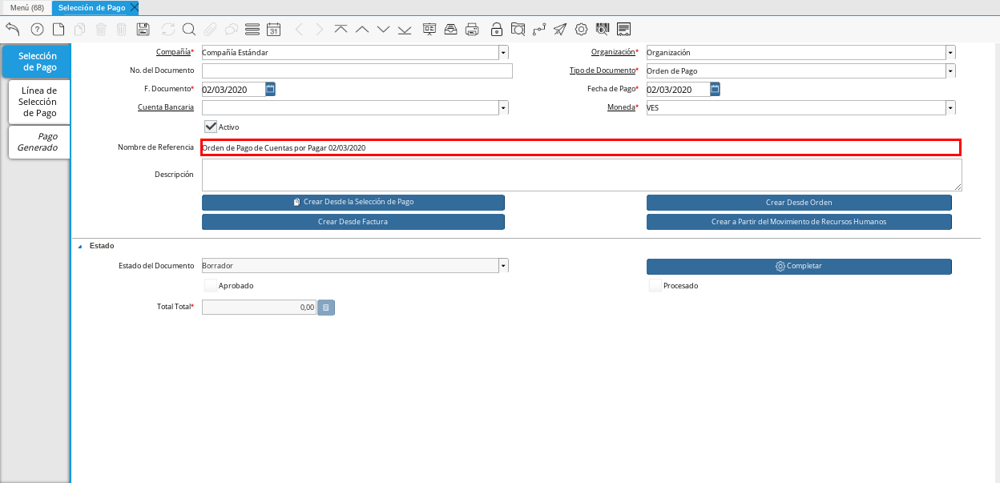
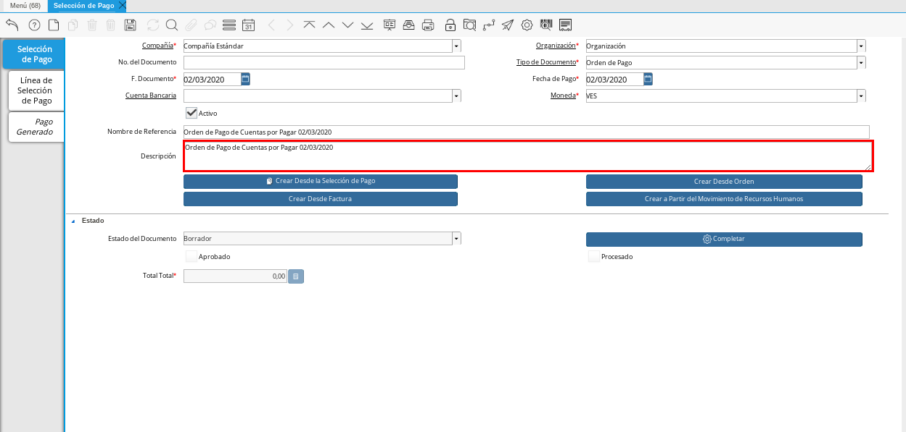
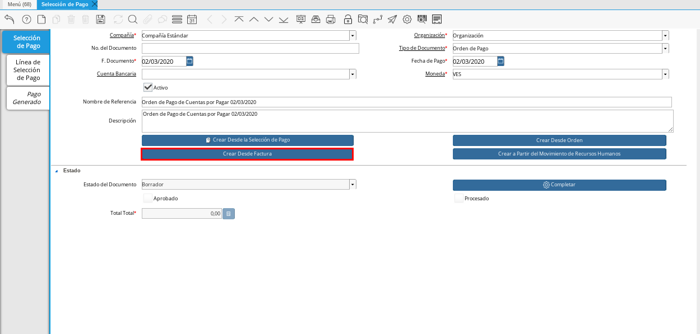
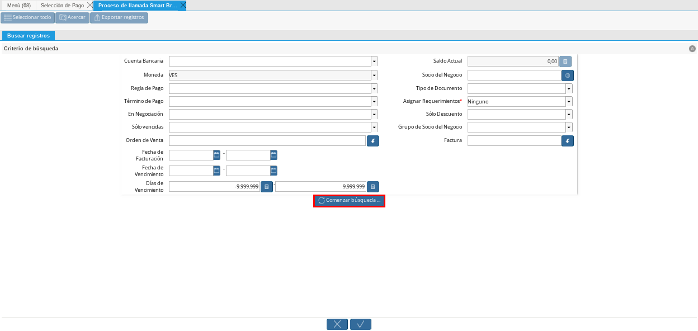
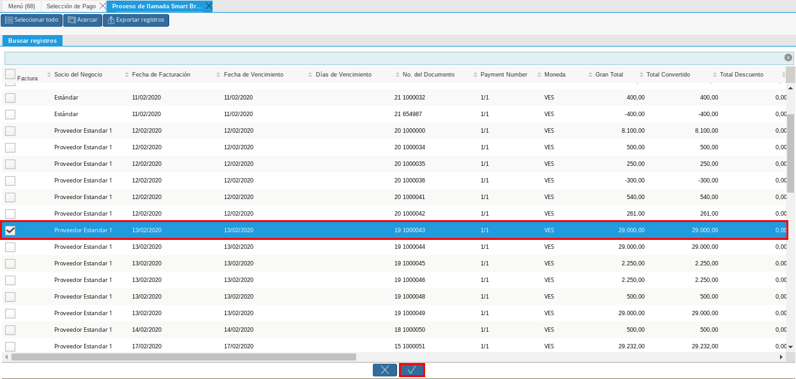
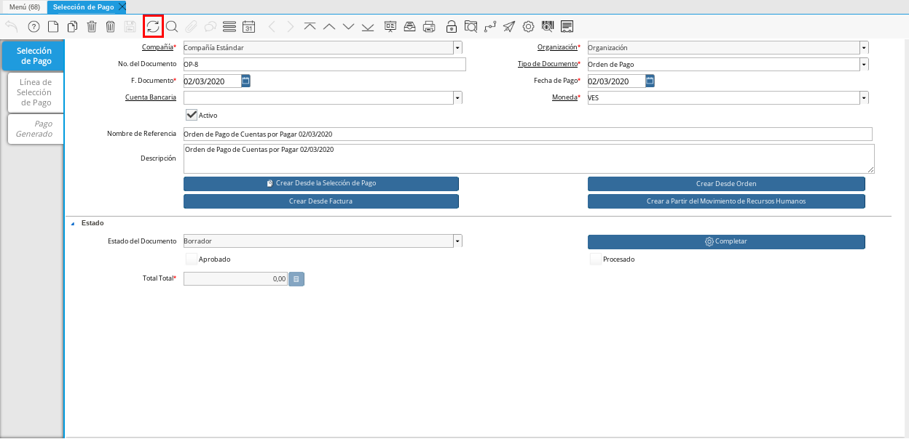
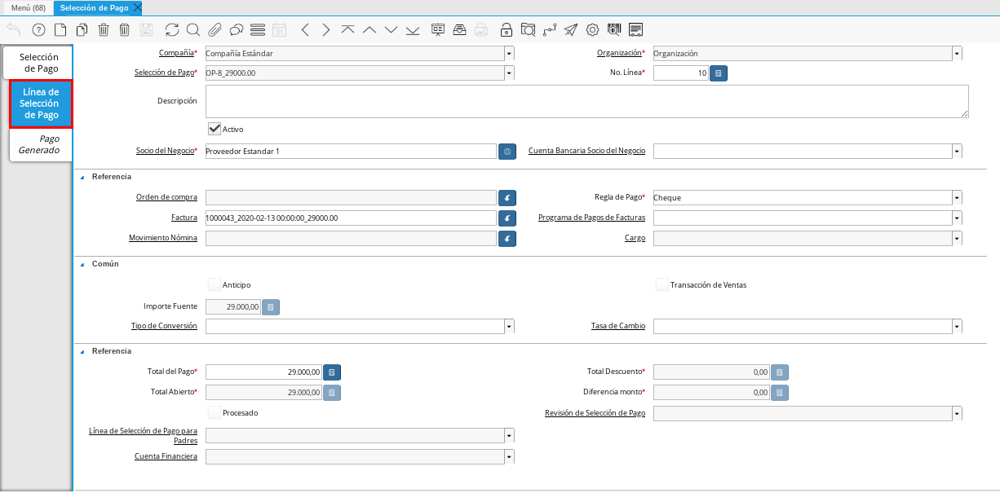
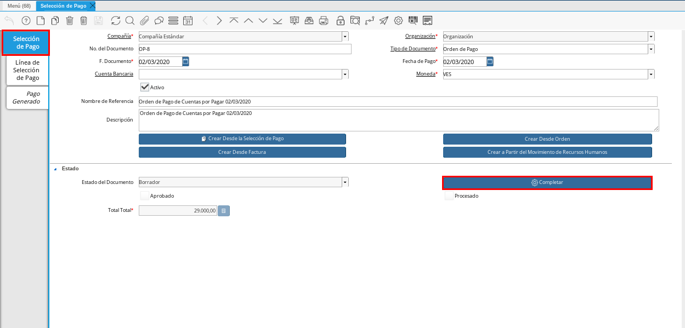
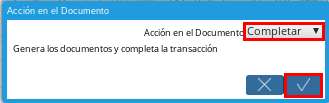
.. |Smart Browser| image:: resources/
.. |Listado de Facturas| image:: resources/
.. |Socio de Negocio Factura| image:: resources/
.. |Factura Cuentas por Pagar| image:: resources/
.. |Total de Pago| image:: resources/
.. |Total de Abierto| image:: resources/
.. |Diferencia Monto| image:: resources/
.. |Total a Cancelar| image:: resources/
..  |Grupo de Estado| image:: resources/
..  |Botón Completar| image:: resources/

.. _documento/orden-de-pago:

**Registro desde Factura**
==========================

Para realizar una orden de pagos de las facturas que estén pendientes por pagar se deben aplicar los siguientes pasos:

#. Ubique y seleccione en el menú de ADempiere, la carpeta "**Gestión de Saldos Pendientes**", luego seleccione la ventana "**Selección de Pagos**".

    |Menú de ADempiere|

    Imagen 1. Menú de ADempiere

    #. Podrá visualizar la ventana "**Selección de Pago**", en la cual debe seleccionar el icono "**Registro Nuevo**" ubicado en la barra de herramientas de ADempiere.

        |Icono Registro Nuevo 1|

        Imagen 2. Icono Registro Nuevo

    #. Seleccione en el campo "**Organización**", la organización para la cual está realizando el documento "**Orden de Pago**".

        |Campo Organización 1|

        Imagen 3. Campo Organización

    #. Seleccione el tipo de documento a generar en el campo "**Tipo de Documento**", la selección de este define el comportamiento del documento que se está elaborando, dicho comportamiento se encuentra explicado en el documento :ref:`documento/tipo-documento` elaborado por `ERPyA`_. Para ejemplificar el registro es utilizado el tipo de documento "**Orden de Pago**".

        |Campo Tipo de Documento 1|

        Imagen 4. Campo Tipo de Documento

    #. Seleccione en el campo "**F. Documento**", la fecha en la cual se está generando el documento de orden de pago.

        |Campo F. Documento 1|

        Imagen 5. Campo F. Documento

    #. Seleccione en el campo "**Fecha de Pago**", la fecha en la cual se debe realizar el pago.

        |Campo Fecha de Pago 1|

        Imagen 6. Campo Fecha de Pago

    #. Seleccione en el campo "**Moneda**", la moneda para realizar la orden de pago.

        |Campo Moneda 1|

        Imagen 7. Campo Moneda

    #. Introduzca en el campo "**Nombre de Referencia**", un nombre de referencia para la orden de pago que está realizando.

        |Campo Nombre de Referencia 1|

        Imagen 8. Campo Nombre de Referencia

    #. Introduzca en el campo "**Descripción**", una breve descripción referente a la orden de pago que está realizando.

        |Campo Descripción 1|

        Imagen 9. Campo Descripción

         .. note::

            La referencia a colocar en este campo queda a criterio del usuario.

    #. Seleccione la opción "**Crear Desde Factura**", para crear la orden de pago desde la factura.

        |Campo Crear Desde Factura 1|

        Imagen 10. Opción Crear desde factura

    #. Podrá observar la siguiente ventana de búsqueda inteligente  una serie de campos para ser utilizados como criterio de búsqueda.

        |Smart Browser|

        Imagen 11. Smart Browser

        #. Dependiendo del criterio de búsqueda seleccionado tilde la opción "**Comenzar Búsqueda**", para buscar las facturas de los socios del negocio proveedores.

            |Opción Comenzar Búsqueda 1|

            Imagen 12. Opción Comenzar Búsqueda

        #. Al tildar la opción "**Comenzar Búsqueda**", se desplegará en la parte inferior de la ventana las facturas que están pendientes por pagar.

            |Listado de Facturas|

            Imagen 13. Listado de Facturas 

            .. note::

                Las facturas que se visualicen dependerá del criterio de búsqueda que se utilice, ejemplo:
               
                    - Si se utiliza un criterio de búsqueda por socio del negocio, las facturas a mostrar sería solo y únicamente por ese socio de negocio.

                    - Si se utiliza un criterio de búsqueda por fecha, se mostrarán todas las facturas que estén bajo la fecha seleccionada.

        #. Seleccione las facturas que deseen asociar a la "**Orden de Pago**". 
        
            |Seleccionar Factura y Opción OK 1|

            Imagen 14. Seleccionar Factura y Opción OK

        #. Al seleccionar la factura indique cual es el total que se desea cancelar al proveedor de esa factura.

            |Total a Cancelar|

            Imagen 15. Total a Cancelar
        
        #. Seleccione la opción "**OK**", para cargar a la pestaña "**Línea de Selección de Pago**" la información de las facturas seleccionadas.

    #. Seleccione el icono "**Refrescar**", ubicado en la barra de herramientas de ADempiere para refrescar la ventana y pueda visualizar la información cargada desde la opción "**Crear Desde Factura**".

        |Icono Refrescar 1|

        Imagen 16. Icono Refrescar

#. Seleccione la pestaña "**Línea de Selección de Pago**", para verificar que la información cargada desde la opción "**Crear Desde Factura**" sea correcta.

    |Pestaña Línea de Selección de Pago 1|

    Imagen 17. Pestaña Línea de Selección de Pago

    .. note::

        En la pestaña "**Línea de Selección de Pago**" deberán aparecer las misma cantidad de facturas seleccionadas desde la opción "**Crear Desde Factura**".

    #. Podrá observar que en cada registro de la pestaña "**Línea de Selección de Pago**" aparecerán las siguientes características:

        #. En el campo **"Socio del Negocio"** debe aparecer el socio de negocio de la factura que se encuentra asociada al registro de la línea.

            |Socio de Negocio Factura|

            Imagen 18. Socio de Negocio Factura

        #. En el campo **"Factura"** debe aparecer el número del documento de la factura seleccionada desde opción "**Crear Desde Factura**".

            |Factura Cuentas por Pagar|

            Imagen 19. Factura Cuentas por Pagar

        #. En el campo **"Total del Pago"** debe aparecer el monto a pagar de la factura, este monto puede ser editado ya que en algunos casos las facturas suelen ser pagadas de forma parcial, todo dependerá del acuerdo de pagos que tenga la compañía con el proveedor.

            |Total de Pago|

            Imagen 20. Total de Pago

        #. En el campo **"Total Abierto"** debe aparecer el total abierto que tiene la factura, si la factura ha sido pagada de manera parcial el total pendiente por pagar aparecerá en este campo.

            |Total de Abierto|

            Imagen 21. Total de Abierto

        #. En el campo **"Diferencia monto"** debe aparecer la diferencia que pueda tener una factura entre el total abierto y el total a pagar.

            |Diferencia Monto|

            Imagen 22. Diferencia Monto

            .. note::

                El resultado o valor a mostrar en este campo dependerá de los valores colocados en el campo **"Total del Pago"** y **"Total Abierto"**, si los valores de saldo en ambos campos son iguales este campo debe estar en cero (0).

#. Una vez definido el monto que se desea pagar en cada factura y verificado que las facturas seleccionadas desde la opción "**Crear Desde Factura**" estén en la pestaña "**Línea de Selección de Pago**" se puede completar la **"Orden de Pago"** para ello regrese a la ventana principal "**Selección de Pago**" .

#. Ubique al finalizar la ventana en el grupo de campo "**Estado**" y el botón que debe tener por nombre "**Completar**"

    |Grupo de Estado|

    Imagen 23. Grupo de Estado

    .. note::

        El nombre del botón cambiará dependiendo del estado en el que se encuentre el documento si el documento se encuentra en estado "**Borrador**"  la acción a mostrar en el botón es "**Completar**" caso que se está aplicando para este documento, si el estado del documento está en estado "**Completo**" el botón cambiará su nombre a la  siguiente acción que se pueda aplicar en el documento.

#. Dar click a botón "**Completar**" y tildar "**Ok**" para la acción de documento seleccionada.

    |Botón Completar|

    Imagen 24. Botón Completar

Al aplicar esta acción "**Completar**" el documento pasará a esta completo y este no podrá ser modificado.

.. note::

    Es muy importante tener en cuenta que todo documento transaccional una vez se culmine con el llenado de los datos debe ser completado, para que ADempiere tome como válido los datos cargados en el documento.

