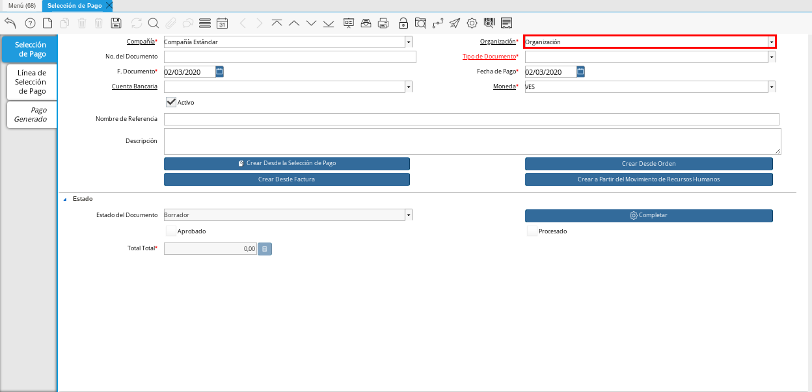

.. _ERPyA: http://erpya.com

.. |Menú de ADempiere| image:: resources/menu.png
.. |Icono Registro Nuevo 1| image:: resources/icono-nuevo1.png

.. |Campo Tipo de Documento 1| image:: resources/tipo-doc1.png
.. |Campo F. Documento 1| image:: resources/fec-doc1.png
.. |Campo Fecha de Pago 1| image:: resources/fec-pago1.png
.. |Campo Moneda 1| image:: resources/moneda1.png
.. |Campo Nombre de Referencia 1| image:: resources/nom-ref1.png
.. |Campo Descripción 1| image:: resources/desc-ref1.png
.. |Campo Crear Desde Factura 1| image:: resources/crear-des-fact1.png
.. |Opción Comenzar Búsqueda 1| image:: resources/com-bus1.png
.. |Seleccionar Factura y Opción OK 1| image:: resources/selec-ok1.png

.. |Acción Completar| image:: resources/accion-completar.png
.. |Smart Browser| image:: resources/
.. |Listado de Facturas| image:: resources/
.. |Socio de Negocio Factura| image:: resources/
.. |Factura Cuentas por Pagar| image:: resources/
.. |Total de Pago| image:: resources/
.. |Total de Abierto| image:: resources/
.. |Diferencia Monto| image:: resources/
.. |Total a Cancelar| image:: resources/
.. |Grupo de Estado| image:: resources/
.. |Botón Completar| image:: resources/
.. |Regla de Pago| image:: resources/
.. |Campo Búsqueda Cuenta Bancaria| image:: resources/
.. |Campo de búsqueda Moneda| image:: resources/
.. |Campo de Búsqueda Regla de Pago “Facturas”| image:: resources/
.. |Campo de Búsqueda Término de Pago“Facturas”| image:: resources/
.. |Campo de Búsqueda en Negociación| image:: resources/
.. |Campo de Búsqueda Sólo Vencidas| image:: resources/
.. |Campo de Búsqueda Orden de Venta “Factura”| image:: resources/
.. |Campo de búsqueda Fecha Facturación| image:: resources/
.. |Campo de búsqueda Fecha de Vencimiento| image:: resources/
.. |Campo de búsqueda Días de Vencimiento| image:: resources/
.. |Campo de Búsqueda Socio de Negocio “Factura”| image:: resources/
.. |Campo de Búsqueda Tipo de Documento Facturas| image:: resources/
.. |Campo de Búsqueda Asignar Requerimientos| image:: resources/
.. |Campo de Búsqueda Sólo Descuento| image:: resources/
.. |Campo de Búsqueda Grupo de Socio del Negocio| image:: resources/
.. |Campo de Búsqueda Factura| image:: resources/

.. _documento/orden-de-pago:

**Registro desde Factura**
==========================

Para realizar una **”Orden de Pagos”** en ADempiere el cual permite montar una solicitud de  todas aquellas  facturas que estén pendientes por pagar, se deben aplicar los siguientes pasos:

#. Ubique y seleccione en el menú de ADempiere, la carpeta "**Gestión de Saldos Pendientes**", luego seleccione la ventana "**Selección de Pagos**".

    |Menú de ADempiere|

    Imagen 1. Menú de ADempiere

#. Podrá visualizar la ventana "**Selección de Pago**", en la cual debe seleccionar el icono "**Registro Nuevo**" ubicado en la barra de herramientas de ADempiere.

    |Icono Registro Nuevo 1|

    Imagen 2. Icono Registro Nuevo

#. Seleccione en el campo "**Organización**", la organización para la cual está realizando el documento "**Orden de Pago**".

    Al seleccionar la organización con la que trabajará el registro a crear bajo estará disponible únicamente bajo esa organización  seleccionada, aunque la decisión de la organización a trabajar quedará al momento que inicie sesión en ADempiere. 

    |Campo Organización 1|

    Imagen 3. Campo Organización

#. Seleccione el tipo de documento a generar en el campo "**Tipo de Documento**", la selección de este define el comportamiento del documento que se está elaborando, dicho comportamiento se encuentra explicado en el documento :ref:`documento/tipo-documento` elaborado por `ERPyA`_. Para ejemplificar el registro es utilizado el tipo de documento "**Orden de Pago**".

    |Campo Tipo de Documento 1|

    Imagen 4. Campo Tipo de Documento

#. Seleccione en el campo "**F. Documento**", la fecha en la cual se está generando el documento de orden de pago.

    |Campo F. Documento 1|

    Imagen 5. Campo F. Documento

#. Seleccione en el campo "**Fecha de Pago**", la fecha en la cual se debe realizar el pago.

    |Campo Fecha de Pago 1|

    Imagen 6. Campo Fecha de Pago

#. Seleccione en el campo "**Moneda**", la moneda para realizar la orden de pago.

    |Campo Moneda 1|

    Imagen 7. Campo Moneda

#. Introduzca en el campo "**Nombre de Referencia**", un nombre de referencia para la orden de pago que está realizando.

    La información a colocar en este campo es una pequeña referencia de la orden pago que se esté creando por ejemplo : **”Pago proveedores Servicios”**.

    |Campo Nombre de Referencia 1|

    Imagen 8. Campo Nombre de Referencia

#. Introduzca en el campo "**Descripción**", una breve descripción referente a la orden de pago que está realizando.

    La información a colocar en este campo es una pequeña descripción de la orden de pago que se esté realizando por ejemplo: **”Pagos a proveedores primera semana de Junio”**

    |Campo Descripción 1|

    Imagen 9. Campo Descripción

#. Seleccione la opción "**Crear Desde Factura**", para crear la orden de pago desde la factura.

    |Campo Crear Desde Factura 1|

    Imagen 10. Opción Crear desde factura

#. Al seleccionar el botón "**Crear Desde Factura**", se desplegará otra ventana llamada Smart Browser (Ventana de Búsqueda Inteligente) donde podrá ubicar a las facturas que estén pendientes por pagar.

    #. Podrá observar la siguiente ventana de búsqueda inteligente  una serie de campos para ser utilizados como criterio de búsqueda.

        |Smart Browser|

        Imagen 11. Smart Browser

#. Los campos a visualizar en el smart browser son los siguientes:

    #. Campo de búsqueda **”Cuenta Bancaria”**, este es un campo tipo lista donde aparecerá el listado de las cuentas bancarias cargadas en ADempiere.

        |Campo Búsqueda Cuenta Bancaria|

        Imagen 12. Campo Búsqueda Cuenta Bancaria

    #. Campo de búsqueda  **”Moneda”**, este campo se encuentra solo lectura y la moneda a mostrar dependerá de la moneda seleccionada en la ventana padre **”Selección de Pago”**; la moneda que aparezca en ese campo dentro del smart browser le indica a ADempiere que los documentos a buscar deben estar bajo esa moneda, ejemplo : 

        - Si el valor en el campo **”Moneda”* es **”VES”** (Bolívar) cuando se realice la búsqueda los documentos ADempiere mostrara  únicamente los que estén creados bajo esa moneda.

        - Si  el valor en el campo **”Moneda”** es **USD”** (Dólar) cuando se realice la búsqueda los documentos ADempiere mostrara  únicamente los que estén creados bajo esa moneda.

        |Campo de búsqueda Moneda|

        Imagen 13. Campo de búsqueda Moneda

    #. Campo de búsqueda **”Regla de Pago”**, este es un campo de búsqueda tipo lista  el cual al tildarlo mostrará una serie de opciones de reglas de pagos, la opción a seleccionar en esté campo le indicará a ADempiere qué al momento de realizar la búsqueda ubique y muestre solo las facturas de compras que estén bajo la regla de pago seleccionada en ese campo,como por ejemplo:

        Si se selecciona la regla de pago **” A Crédito”** y tengo creadas una o varias facturas que tienen establecida esa regla de pago, al realizar la búsqueda desde el smart browser ADempiere mostrará las facturas que éste únicamente con esa regla de pago, si no existen facturas con esa regla de pago ADempiere no mostrará nada.

        |Campo de Búsqueda Regla de Pago “Facturas”|

        Imagen 14. Campo de Búsqueda Regla de Pago “Facturas”

    #. Campo de búsqueda **” Término de Pago”** este es un campo de búsqueda tipo lista  el cual al tildarlo mostrará una serie de opciones de término de pago, la opción a seleccionar en esté campo le indicará a ADempiere qué al momento de realizar la búsqueda ubique y muestre solo las facturas de compras que estén bajo ese término de pago, seleccionado en ese campo,como por ejemplo:

        Si se selecciona el término de pago **”Contado”** y tengo creadas una o varias facturas que tienen establecido ese término de pago, al realizar la búsqueda desde el smart browser ADempiere mostrará las facturas que éste únicamente con ese término de pago, si no existen facturas con ese término de pago ADempiere no mostrará nada.

        |Campo de Búsqueda Término de Pago“Facturas”|

        Imagen 15.  Campo de Búsqueda Término de Pago “Facturas”

    #. Campo de búsqueda **”En negociación”** este campo es un campo tipo lista donde al seleccionar cualquiera de las opciones (Sí / No) ubicará las facturas que estén en negociación. 

        |Campo de Búsqueda en Negociación|

        Imagen 16. Campo de Búsqueda en Negociación

    #. Campo de búsqueda **”Sólo Vencidas”**  este campo es un campo tipo lista donde al seleccionar cualquiera de las opciones (Sí / No) ubicará las facturas que estén o no estén vencidas.

        |Campo de Búsqueda Sólo Vencidas|

        Imagen 17. Campo de Búsqueda Sólo Vencidas

    #. Campo de búsqueda **”Orden de Venta”**, en este campo tipo búsqueda al seleccionar una orden ya sea de venta o de compra , ubicara las facturas asociadas a esa orden.

        |Campo de Búsqueda Orden de Venta “Factura”|

        Imagen 18. Campo de Búsqueda Orden de Venta “Factura”

    #. Campo de búsqueda **” Fecha Facturación”**, este campo es un campo tipo fecha el cual cuenta con dos recuadros con calendarios, el primero es para ser utilizada como fecha facturación**”Desde”** y el segundo como fecha facturación **”Hasta”**, al colocar una fecha en cualquiera de estas dos opciones (Fecha desde / Fecha hasta) ADempiere mostrará únicamente las facturas que están asociadas bajo ese rango de fechas, como por ejemplo:  

        Si se coloca en el campo fecha desde la fecha **”18/06/2020”** y el campo fecha hasta **”20/06/2020”**, ADempiere mostrar las facturas que estén bajo ese rango de fechas.

        |Campo de búsqueda Fecha Facturación|

        Imagen 19. Campo de búsqueda Fecha Facturación

        .. note::

	        Para saber más sobre el campo **”Fecha Facturación”** y qué acción implica sobre una orden de compra, visitar el documento  :ref:`documento/documento-por-pagar`.

    #. Campo de búsqueda **”Fecha de Vencimiento”** este campo es un campo tipo fecha el cual cuenta con dos recuadros con calendarios, el primero es para ser utilizada como fecha de vencimiento **”Desde”** y el segundo como fecha de vencimiento **”Hasta”**, al colocar una fecha en cualquiera de estas dos opciones (Fecha desde / Fecha hasta) ADempiere mostrará únicamente las facturas que están asociadas bajo ese rango de fechas, como por ejemplo:  

        Si se coloca en el campo fecha desde, la fecha **”18/06/2020”** y el campo fecha hasta **”20/06/2020”**, ADempiere mostrar las facturas que estén bajo ese rango de fechas; la fecha de vencimiento de una factura aplica más que todo para aquellas facturas las cuales cuentan con una regla de pago.

        |Campo de búsqueda Fecha de Vencimiento|

        Imagen 20. Campo de búsqueda Fecha de Vencimiento

    #. Campo de búsqueda **”Días de Vencimiento”** este campo es utilizado para colocar los días de vencimiento de una factura; estos días de vencimiento son configurados en la factura y aplica más que todo para aquellas facturas las cuales cuentan con una regla  de pago a crédito.
 
        |Campo de búsqueda Días de Vencimiento|

        Imagen 21. Campo de búsqueda Días de Vencimiento

    #. Campo de búsqueda **”Socio de Negocio”**, este campo puede ser utilizado si desea ubicar las facturas que estén asociadas a un socio de negocio en específico.

        |Campo de Búsqueda Socio de Negocio “Factura”|

        Imagen 22. Campo de Búsqueda Socio de Negocio “Factura”

     #. Campo de búsqueda **”Tipo de Documento”**, este es un campo de búsqueda tipo lista  el cual al tildarlo mostrará una serie de opciones de los tipos de documentos que se encuentran asociados para los documentos de cuentas por pagar, la opción a seleccionar en este campo le indicará a ADempiere qué al momento de realizar la búsqueda ubique y muestre solo las facturas que estén bajo el tipo de documento seleccionado en ese campo, como por ejemplo:

        Si se selecciona el tipo de documento **”Factura de Cuentas por Pagar Nacional”** ADempiere mostrará cuando se realice la búsqueda únicamente las facturas que estén asociadas a ese tipo de documento.

        |Campo de Búsqueda Tipo de Documento Facturas|

        Imagen 23. Campo de Búsqueda Tipo de Documento Facturas

    #. Campo de búsqueda **”Asignar Requerimientos”** este es un campo tipo lista, el cual contiene una serie de opciones el cual indica a ADempiere que dependiendo del requerimiento seleccionado ADempiere ubicara las facturas,  dentro de los requerimientos de este campo están:

        **Ninguno:** Si se selecciona este criterio de búsqueda, ADempiere ubicara todas las facturas en ADempiere , es decir ubicar las facturas que estén con órdenes o sin órdenes con recepciones o sin recepciones.

        ** Orden de Compra**:  si se selecciona este criterio de búsqueda, ADempiere ubicara solo y únicamente las facturas que estén asociadas a una orden de compra, de lo contrario no mostrará ninguna factura.

        **Orden de Compra y Recibo:** si se selecciona este criterio de búsqueda, ADempiere ubicara solo y únicamente las facturas que tengan asociada una orden de compra y una recepción , de lo contrario no mostrará ninguna factura.

        **Recibo:** Si se selecciona este criterio de búsqueda, ADempiere ubicara solo y únicamente las facturas que tengan asociada una recepción, de lo contrario no mostrará ninguna factura.

        |Campo de Búsqueda Asignar Requerimientos|

        Imagen 24. Campo de Búsqueda Asignar Requerimientos

    #. Campo de búsqueda **”Sólo Descuento”** Este campo es un campo tipo lista el cual indica sí requiere aplicar para la condición de búsqueda que muestre solo las facturas con descuento o que no muestre ninguna factura que contenga aplicado un descuento.

        |Campo de Búsqueda Sólo Descuento|

        Imagen 25. Campo de Búsqueda Sólo Descuento
 
    #. Campo de búsqueda **”Grupo de Socio del Negocio”** este es un campo tipo lista el cual al seleccionar cualquiera de las opciones a mostrar de un grupo de socio del negocio, se mostrará solo y únicamente las facturas que estén asociada a ese grupo de socio del negocio.

        |Campo de Búsqueda Grupo de Socio del Negocio|

        Imagen 26. Campo de Búsqueda Grupo de Socio del Negocio

    #. Campo de búsqueda **”Factura”** esté campo tipo búsqueda permite ubicar una factura en específico , para que al momento de tildar la opción comenzar la búsqueda esté muestre únicamente la información de la factura ubicada dentro de esté campo de búsqueda.

        |Campo de Búsqueda Factura|

        Imagen 27. Campo de Búsqueda Factura

    #. Dependiendo del criterio de búsqueda seleccionado tilde la opción "**Comenzar Búsqueda**", para buscar las facturas de los socios del negocio proveedores.

            |Opción Comenzar Búsqueda 1|

            Imagen 28. Opción Comenzar Búsqueda

    #. Al tildar la opción "**Comenzar Búsqueda**", se desplegará en la parte inferior de la ventana las facturas que están pendientes por pagar.
    
            |Listado de Facturas|

            Imagen 29. Listado de Facturas 

    #. Seleccione las facturas que deseen asociar a la "**Orden de Pago**". 
        
        |Seleccionar Factura y Opción OK 1|

        Imagen 30. Seleccionar Factura y Opción OK

    #. Al seleccionar la factura indique cual es el total que se desea cancelar al proveedor de esa factura.

        |Total a Cancelar|

        Imagen 40. Total a Cancelar
        
    #. Seleccione la opción "**OK**", para cargar a la pestaña "**Línea de Selección de Pago**" la información de las facturas seleccionadas.

    #. Seleccione el icono "**Refrescar**", ubicado en la barra de herramientas de ADempiere para refrescar la ventana y pueda visualizar la información cargada desde la opción "**Crear Desde Factura**".

        |Icono Refrescar 1|

        Imagen 41. Icono Refrescar

#. Seleccione la pestaña "**Línea de Selección de Pago**", para verificar que la información cargada desde la opción "**Crear Desde Factura**" sea correcta.

    |Pestaña Línea de Selección de Pago 1|

    Imagen 42. Pestaña Línea de Selección de Pago

    .. note::

        En la pestaña "**Línea de Selección de Pago**" deberán aparecer las misma cantidad de facturas seleccionadas desde la opción "**Crear Desde Factura**".

#. Podrá observar que en cada registro de la pestaña "**Línea de Selección de Pago**" aparecerán las siguientes características:

    #. Campo **”Selección de Pago”** debe aparecer el número de la selección de pago con la que se está trabajando, este número es el número de documento de la orden de pago.

        |Campo Selección de Pago|

        Imagen 43. Campo Selección de Pago

    #. Campo **”No. Línea”** este campo define el número de línea de cada registro asociado a la pestaña **”Lńea Selección de Pago”**, cada número de línea va incrementando de 10 en 10, es decir que sí existen 3 registros asociados en la pesta cada registro estar en 10, 20 y 30.

        |Campo N° Línea|

        Imagen 44. Campo N° Línea

    #. Campo **”Descripción”** este campo puede ser utilizado si se requiere dar una descripción en el registro de la línea.

        |Campo Descripción en Línea Selección|

        Imagen 45. Campo Descripción en Línea Selección

    #. Check **”Activo”** esté check indica si el registro de la línea está activo o no.

        |Check Activo en Línea Selección|

        Imagen 46. Check Activo en Línea Selección

    #. En el campo **"Socio del Negocio"** debe aparecer el socio de negocio de la factura que se encuentra asociada al registro de la línea.

        |Socio de Negocio Factura|

        Imagen 47. Socio de Negocio Factura

    #. Campo **”Cuenta Bancaria Socio del Negocio”**, en este campo tipo lista deben aparecer las cuentas bancarias asociadas al socio del negocio, las cuentas bancarias a aparecer en este campo dependerá de las cuentas asociadas al momento de crear :ref:`documento/socio-proveedor`.

        La selección de la cuenta bancaria en este campo dependerá de las reglas del negocio que tenga la compañía  con los proveedores.

        |Campo Cuenta Bancaria Socio del Negocio|

        Imagen 48. Campo Cuenta Bancaria Socio del Negocio

    #. Campo **"Orden de Compra"**para este caso no debe aparecer ninguna información ya que se está trabajando son con facturas, sí requiere realizar una **”Orden de Pago”** y asociar órdenes verificar el instructivo :ref:`_documento/orden-de-pago-desde-orden`

        |Campo Orden de Compra desde Línea Selección|

        Imagen 49. Campo Orden de Compra desde Línea Selección

    #. En el campo **"Factura"** debe aparecer el número del documento de la factura seleccionada desde opción "**Crear Desde Factura**".

        |Factura Cuentas por Pagar|

        Imagen 50. Factura Cuentas por Pagar

    #. Campo **”Movimiento Nómina”** para este caso no debe aparecer ninguna información ya que se está trabajando son con órdenes de compras, sí requiere realizar una **”Orden de Pago”** y asociar a un movimiento de nómina verificar el instructivo :ref:``

        |Campo Movimento de Nómina “Factura”|

        Imagen 51. Campo Movimento de Nómina “Factura”

   #. Campo **”Regla de Pago”** se debe seleccionar la regla de pago con la que se emitirá el pago al proveedor.

        ADempiere cuenta cuenta con cinco (5) reglas de pagos, las cuales son:

            **- A crédito:** esta regla de pago indica que dicho documento cuenta con un crédito de pago, sin embargo es crédito no es reflejado en la orden de pago si  no en la regla de pago que tenga establecida el **”Socio del Negocio”** o la **”Orden de Compra”**
             
            **- Débito directo.** está regla de pago indica que el pago a generar es un débito directo, lo cual en pocas palabras es una transferencia bancaria. 

            **- Depósito directo:** está regla de pago indica que el pago a generar es un depósito directo, está regla también entraría dentro de transferencia bancaria.

            **- Cheque:** está regla de pago indica qué el pago a generar es a través de cheques bancarios.

            **- Tarjeta de crédito:** está regla de pago indica qué el pago a generar es a través de tarjeta de crédito.

	    |Campo Regla de Pago Factura|
	
	    Imagen 52. Campo Regla de Pago Factura

    #. Campo **”Programa de Pago de Factura”** se debe seleccionar el programa de pago que posea la factura.

        |Campo Programa de Pago “Orden”|

        Imagen 53. Campo Programa de Pago “Orden”

    #. Campo **” Cargo”** se debe seleccionar el cargo qué desee asociar al registro de la línea de la selección de pago.

        |Campo Cargo “Orden”|

        Imagen 54. Campo Cargo “Orden”

    #. Check **”Anticipo”** aparecerá tildado cuando el documento que se encuentre en la línea sea una orden de compra, de lo contrario no aparecerá tildado.

	    |Check Anticipo “Orden”|

	    Imagen 55. Check Anticipo “Orden”

    #. Check **”Transacción de Ventas”** esté check aparecerá tildado cuando en la línea se encuentre un documento  de ventas o CxC.

        |Check Transacción de Ventas “Orden”|

        Imagen 56. Check Transacción de Ventas “Orden”

    #. Campo **”Importe Fuente”** en este campo debe aparecer el total de la abierto de la orden.

        |Campo Importe Fuente| 

        Imagen 57. Campo Importe Fuente

    #. Campo **”Tipo de Conversión”**, este campo tipo lista mostrará los tipos de conversión que se encuentren registrados en ADempiere, el tipo de conversión no es más que el tipo de índice el cual se le asociará el valor de las tasa o conversiones de monedas.  

        |Campo Tipo de Conversión “Orden”|

        Imagen 58. Campo tipo de Conversión “Orden”

    #. Campo **”Tasa de Cambio”** , este campo tipo lista mostrará las tasas de cambios que se encuentren asociadas al tipo de cambio seleccionado en el campo  **”Tipo de Conversión”**, la tasa de cambio no es más que la conversión de una moneda con otra en un fecha determinada.

        |Campo Tasa de Cambio “Orden”|

        Imagen 59. Campo Tasa de Cambio “Orden”

        .. note::

            Estos dos campos **”Tasa de Cambio”** y **” Tipo deConversióń”** son utilizados en el caso de que se esté trabajando con documentos en moneda extranjera y se necesiten realizar los pagos con la moneda Nacional.

    #. En el campo **"Total del Pago"** debe aparecer el monto a pagar de la factura, este monto puede ser editado ya que en algunos casos las facturas suelen ser pagadas de forma parcial, todo dependerá del acuerdo de pagos que tenga la compañía con el proveedor.

        |Total de Pago|

        Imagen 60. Total de Pago

    #. En el campo **"Total Abierto"** debe aparecer el total abierto que tiene la factura, si la factura ha sido pagada de manera parcial el total pendiente por pagar aparecerá en este campo.

        |Total de Abierto|

        Imagen 61. Total de Abierto

   #. Check **”Procesado”**, esté al momento de crear la orden no estará tildado,cuando se generen los pagos desde el proceso :ref:`documento/Imprimir-Exportar`, esté check aparecerá tildado.

        |Check Procesado “Orden”|

        Imagen 62. Check Procesado “Orden”

    #. Campo **”Total de Descuento”** en este campo mostrará si la orden tiene un descuento o no.

        |Campo Total de Descuento “Orden”|

        Imagen 63. Campo Total de Descuento “Orden”

    #. En el campo **"Diferencia monto"** debe aparecer la diferencia que pueda tener una factura entre el total abierto y el total a pagar.

        |Diferencia Monto|

        Imagen 64. Diferencia Monto

        .. note::

             El resultado o valor a mostrar en este campo dependerá de los valores colocados en el campo **"Total del Pago"** y **"Total Abierto"**, si los valores de saldo en ambos campos son iguales este campo debe estar en cero (0).

#. Una vez definido el monto que se desea pagar en cada factura y verificado que las facturas seleccionadas desde la opción "**Crear Desde Factura**" estén en la pestaña "**Línea de Selección de Pago**" se puede completar la **"Orden de Pago"** para ello regrese a la ventana principal "**Selección de Pago**" .

#. Ubique al finalizar la ventana en el grupo de campo "**Estado**" y el botón que debe tener por nombre "**Completar**"

    |Grupo de Estado|

    Imagen 65. Grupo de Estado

    .. note::

        El nombre del botón cambiará dependiendo del estado en el que se encuentre el documento si el documento se encuentra en estado "**Borrador**"  la acción a mostrar en el botón es "**Completar**" caso que se está aplicando para este documento, si el estado del documento está en estado "**Completo**" el botón cambiará su nombre a la  siguiente acción que se pueda aplicar en el documento.

#. Dar click a botón "**Completar**" y tildar "**Ok**" para la acción de documento seleccionada.

    |Botón Completar|

    Imagen 66. Botón Completar

#. Al aplicar esta acción "**Completar**" el documento pasará a estar completo y este no podrá ser modificado.

    .. note::

        Es muy importante tener en cuenta que todo documento transaccional una vez se culmine con el llenado de los datos debe ser completado, para que ADempiere tome como válido los datos cargados en el documento.

Hasta este punto llegaría el registro de factura a través de la ventana **”Selección de Pago”** con el tipo de documento **”Orden de Pago”** ya que solo se está creando la solicitud de los facturas que están pendientes por pagar y necesitan ser canceladas, en este paso a pesar de que se complete el documento esto no quiere decir que se han generado los pagos, para poder generar los pagos correspondientes a las facturas asociadas a la **”Orden de Pago”** se necesita completar el procedimiento :ref:`documento/selección-de-pago` y el :ref:`documento/Imprimir-Exportar`

