.. _ERPyA: http://erpya.com
.. |Menú de ADempiere| image:: resources/payment-selection-menu.png
.. |Ventana Selección de Pago| image:: resources/payment-selection-window.png
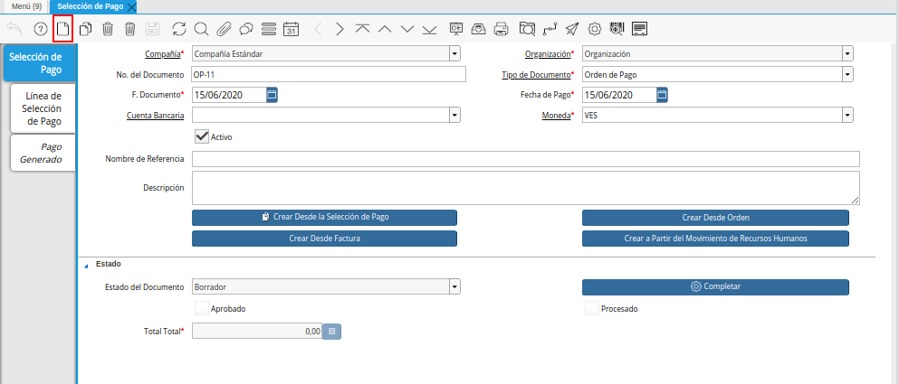
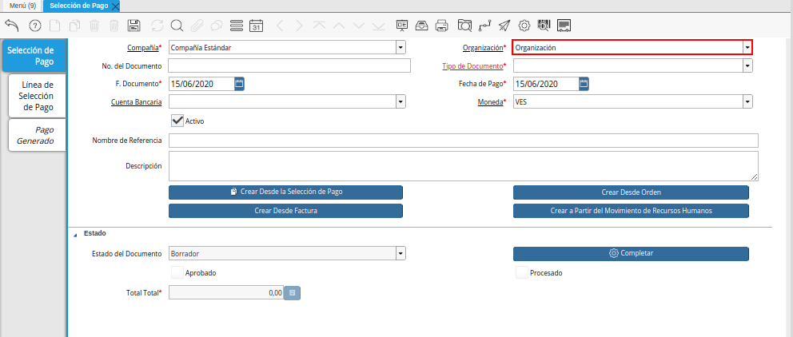
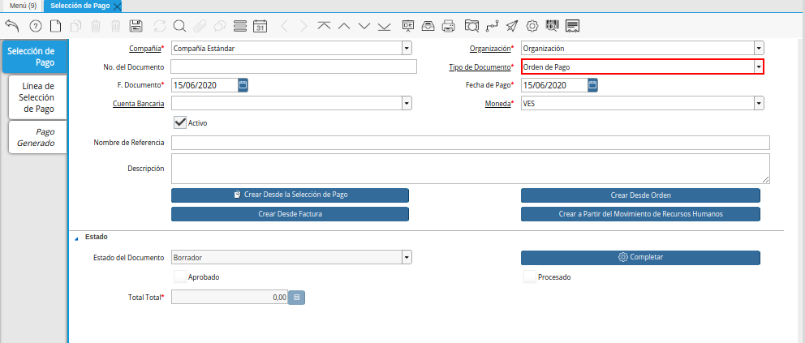
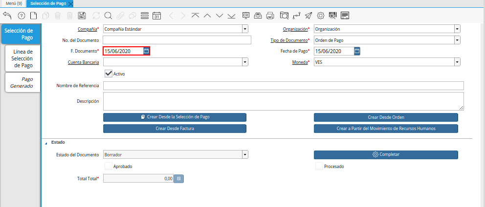
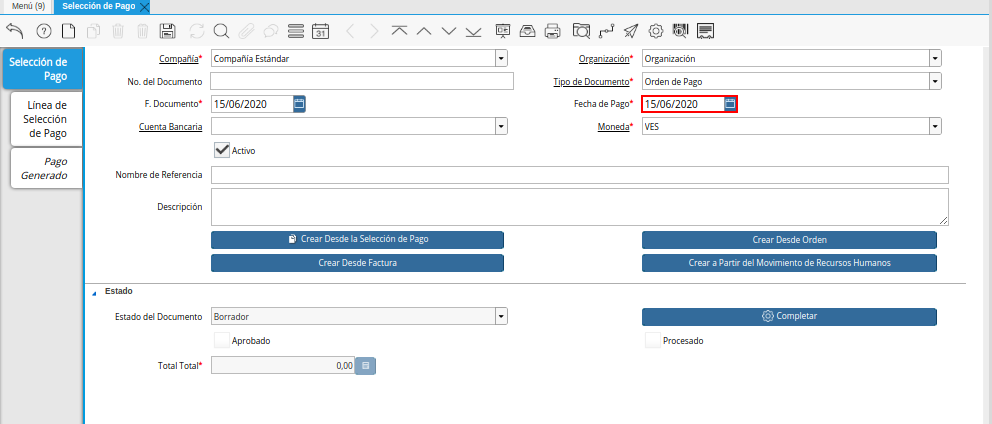
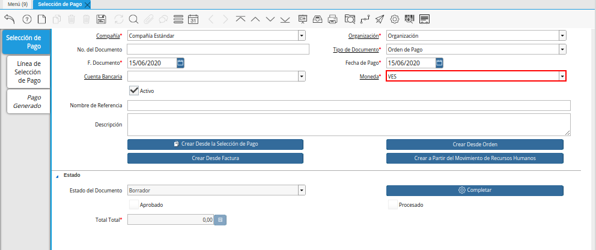
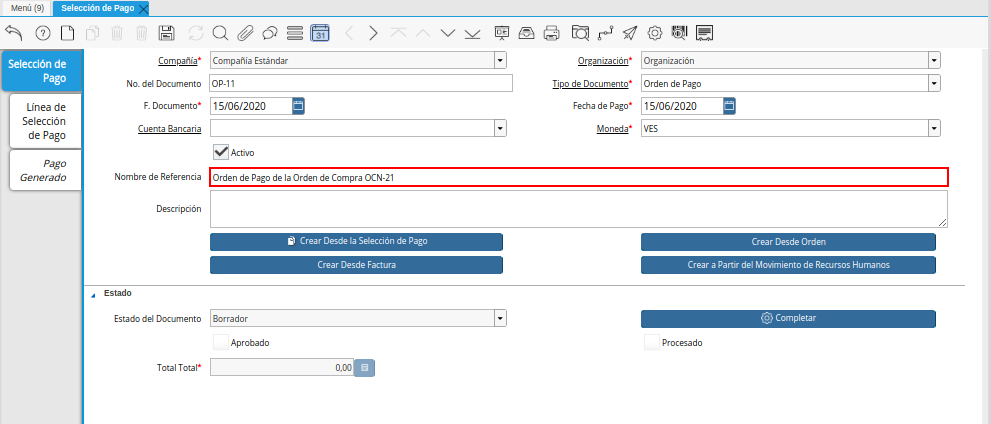
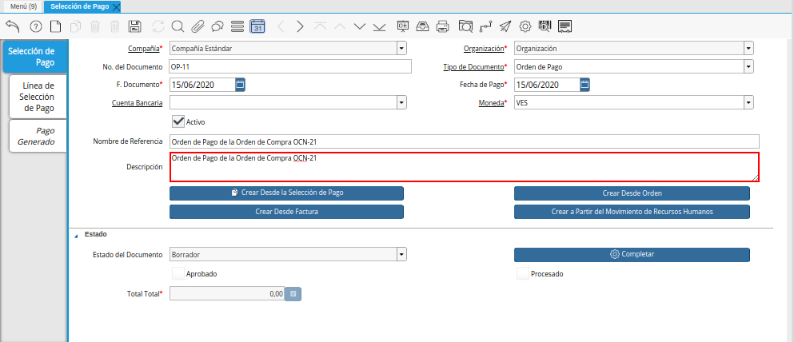
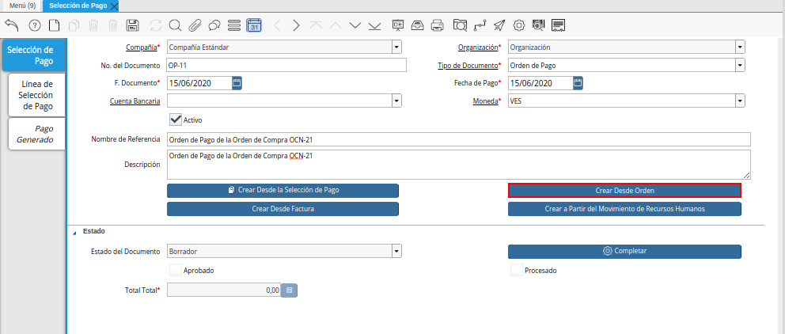
.. |Ventana de Búsqueda Inteligente del Proceso Crear Desde Orden| image:: resources/smart-search-window-of-create-from-order-process.png

.. |Selección de la Orden de Compra y Opción Ok| image:: resources/purchase-order-selection-and-option-ok.ong
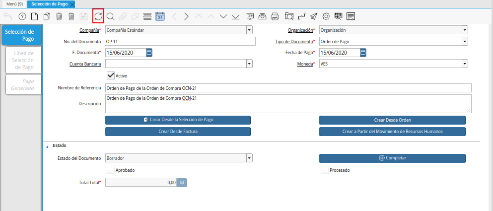
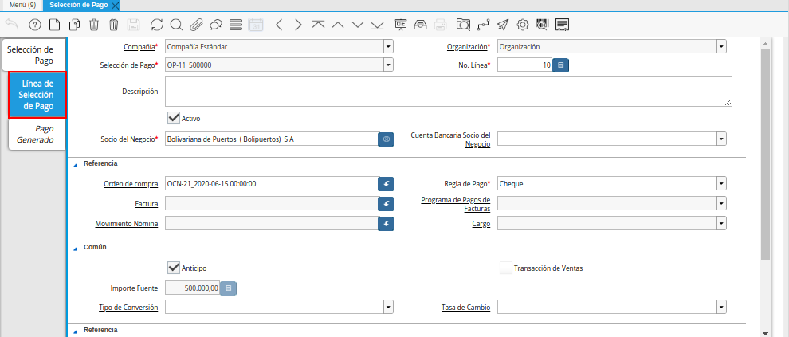
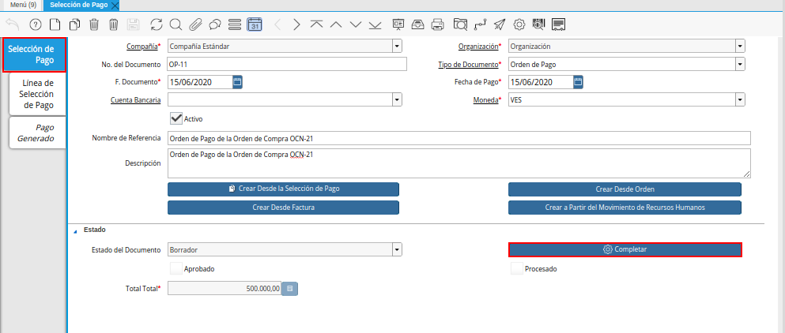
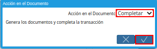
.. _documento/orden-de-pago-desde-orden:

**Registro desde Orden**
========================

#. Ubique y seleccione en el menú de ADempiere, la carpeta "**Gestión de Saldos Pendientes**", luego seleccione la ventana "**Selección de Pago**".

    |Menú de ADempiere|

    Imagen 1. Menú de ADempiere

#. Podrá visualizar la ventana "**Selección de Pago**", con los diferentes registros realizados en dicha ventana.

    |Ventana Selección de Pago|

    Imagen 2. Ventana Selección de Pago

#. Seleccione el icono "**Registro Nuevo**", ubicado en la barra de herramientas de ADempiere, para crear un nuevo registro en la ventana "**Selección de Pago**".

    |Icono Registro Nuevo de la Ventana Selección de Pago|

    Imagen 3. Icono Registro Nuevo de la Ventana Selección de Pago

    #. Seleccione en el campo "**Organización**", la organización para la cual esta realizando el documento "**Orden de Pago**".

        |Campo Organización de la Ventana Selección de Pago|

        Imagen 4. Campo Organización de la Ventana Selección de Pago

    #. Seleccione el tipo de documento a generar en el campo "**Tipo de Documento**", la selección de este define el comportamiento del documento que se está elaborando, dicho comportamiento se encuentra explicado en el documento :ref:`documento/tipo-documento` elaborado por `ERPyA`_. Para ejemplificar el registro es utilizado el tipo de documento "**Orden de Pago**". 

        |Campo Tipo de Documento de la Ventana Selección de Pago|

        Imagen 5. Campo Tipo de Documento de la Ventana Selección de Pago

    #. Seleccione en el campo "**F. Documento**", la fecha en la cual esta realizando el documento "**Orden de Pago**".

        |Campo F. Documento de la Ventana Selección de Pago|

        Imagen 6. Campo F. Documento de la Ventana Selección de Pago

    #. Seleccione en el campo "**Fecha de Pago**", la fecha en la cual se debe generar el pago.

        |Campo Fecha de Pago de la Ventana Selección de Pago|

        Imagen 7. Campo Fecha de Pago de la Ventana Selección de Pago

    #. Seleccione en el campo "**Moneda**", la moneda con la cual se requiere generar el pago.

        |Campo Moneda de la Ventana Selección de Pago|

        Imagen 8. Campo Moneda de la Ventana Selección de Pago

    #. Introduzca en el campo "**Nombre de Referencia**", un nombre de referencia para la identificación de la orden de pago que esta realizando.

        |Campo Nombre de Referencia de la Ventana Selección de Pago|

        Imagen 9. Campo Nombre de Referencia de la Ventana Selección de Pago

    #. Introduzca en el campo "**Descripción**", una breve descripción referente a la orden de pago que esta realizando.

        |Campo Descripción de la Ventana Selección de Pago|

        Imagen 10. Campo Descripción de la Ventana Selección de Pago

        .. note::

            Seleccione el icono "**Guardar Cambios**", ubicado en la barra de herramientas de ADempiere, para guardar el registro de los campos de la pestaña "**Selección de Pago**".
    
    #. Seleccione la opción "**Crear Desde Orden**", para crear la orden de pago desde la orden de compra.

        |Opción Crear Desde Orden de la Ventana Selección de Pago|

        Imagen 11. Opción Crear desde Orden de la Ventana Selección de Pago

        #. Podrá visualizar la ventana de búsqueda inteligente del proceso "**Crear Desde Orden**", con diferentes campos que le permiten al usuario filtrar la búsqueda de la información en base lo que seleccione en dichos campos.

            |Ventana de Búsqueda Inteligente del Proceso Crear Desde Orden|

            Imagen 12. Ventana de Búsqueda Inteligente del Proceso Crear Desde Orden
        
        #. Luego de establecer los filtros de búsqueda, seleccione la opción "**Comenzar Búsqueda**", para buscar los diferentes registros de órdenes de compra que se encuentran en ADempiere.

            |Opción Comenzar Búsqueda|

            Imagen 13. Opción Comenzar Búsqueda
        
        #. Ubique y seleccione la orden de compra desde la cual requiere realizar la orden de pago, luego seleccione la opción "**OK**" para cargar la información de la orden de compra a la pestaña "**Línea de Selección de Pago**".

            |Selección de la Orden de Compra y Opción Ok|

            Imagen 14. Selección de la Orden de Compra y Opción Ok

#. Seleccione el icono "**Refrescar**", ubicado en la barra de herramientas de ADempiere para refrescar la ventana "**Selección de Pago**" y pueda visualizar la información cargada desde la opción "**Crear Desde Orden**".

    |Icono Refrescar de la Ventana Selección de Pago|

    Imagen 15. Icono Refrescar de la Ventana Selección de Pago

#. Seleccione la pestaña "**Línea de Selección de Pago**", para verificar que la información cargada desde la opción "**Crear Desde Orden**" sea correcta.

    |Pestaña Línea de Selección de Pago|

    Imagen 16. Pestaña Línea de Selección de Pago

#. Regrese a la ventana principal "**Selección de Pago**" y seleccione la opción "**Completar**", ubicada en la parte inferior del documento.

    |Pestaña Selección de Pago y Opción Completar|

    Imagen 17. Pestaña Selección de Pago y Opción Completar

    #. Seleccione la acción "**Completar**" y la opción "**OK**", para completar el documento "**Orden de Pago**".

        |Acción Completar y Opción OK|

        Imagen 18. Acción Completar y Opción OK
