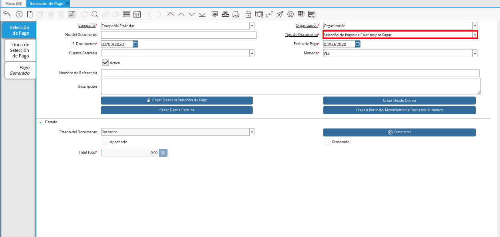

.. _ERPyA: http://erpya.com

.. |Menú de ADempiere| image:: resources/menu.png

.. |Campo F. Documento 1| image:: resources/fec-doc2.png

.. |Campo Descripción 1| image:: resources/desc-ref2.png
.. |Opción Crear Desde Selección de Pago 1| image:: resources/crear-des-orden1.png

.. |Seleccionar Factura y Opción OK 1| image:: resources/selec-ok2.png

.. |Pestaña Línea de Selección de Pago 1| image:: resources/pest-selec-pago1.png

.. |Acción Completar| image:: resources/accion-completar.png
.. |Smart Browser| image:: resources/
.. |Criterio de Búsqueda “Selección de Pago”| image:: resources/
.. |Opción Comenzar Búsqueda |  image:: resources/
.. |Opción OK| image:: resources/
.. |Socio de Negocio| image:: resources/
.. |Listado de Documento por Pagar| image:: resources/
.. |Seleccionar Factura y Opción OK| image:: resources/
.. |Factura Cuentas por Pagar| image:: resources/
.. |Orden de Compra| image:: resources/
.. |Regla de Pago| image:: resources/
.. |Check Anticipo| image:: resources/
.. |Total de Pago| image:: resources/
.. |Botón Completar| image:: resources/

.. _documento/selección-de-pago:

**Registro desde Selección de Pago**
====================================

Para realizar una **”Selección de Pago”** la cual se encarga de definir de qué cuenta bancaria de la compañía saldrán los pagos pendientes a proveedores se deben realizar los siguientes pasos:

    .. note:: 

        Es muy importante tener en cuenta que para poder seguir el paso a paso que se detalla a continuación se debe tener previamente cargada en ADempiere la **”Orden de Pago”** si  no se encuentra cargado en ADempiere pueden consultar el instructivo :ref:`documento/orden-de-pago`

#. Ubique y seleccione en el menú de ADempiere, la carpeta "**Gestión de Saldos Pendientes**", luego seleccione la ventana "**Selección de Pagos**".

    |Menú de ADempiere|

    Imagen 1. Menú de ADempiere

#. Podrá visualizar la ventana "**Selección de Pago**", en la cual debe seleccionar el icono "**Registro Nuevo**" ubicado en la barra de herramientas de ADempiere.

    |Icono Registro Nuevo 1|

    Imagen 2. Icono Registro Nuevo

#. Seleccione en el campo "**Organización**", la organización para la cual está realizando el documento "**Selección de Pago**".

    Al seleccionar la organización con la que trabajará el registro a crear  estará disponible únicamente bajo esa organización  seleccionada, aunque la decisión de la organización a trabajar quedará al momento que inicie sesión en ADempiere. 

    |Campo Organización 1|

    Imagen 3. Campo Organización

#. Seleccione el tipo de documento a generar en el campo "**Tipo de Documento**", la selección de este define el comportamiento del documento que se está elaborando, dicho comportamiento se encuentra explicado en el documento :ref:`tipo-documento` elaborado por `ERPyA`_. Para ejemplificar el registro es utilizado el tipo de documento "**Selección de Pagos de Cuentas por Pagar**".

    |Campo Tipo de Documento 1|

    Imagen 4. Campo Tipo de Documento

#. Seleccione en el campo "**F. Documento**", la fecha en la cual se está generando el documento de selección de pago.

    |Campo F. Documento 1|

    Imagen 5. Campo F. Documento

#. Seleccione en el campo "**Fecha de Pago**", la fecha en la cual se debe realizar el pago.

    |Campo Fecha de Pago 1|

    Imagen 6. Campo Fecha de Pago

#. Seleccione en el campo "**Cuenta Bancaria**", la cuenta bancaria desde la cual se le realizará el pago al socio del negocio proveedor. Para ejemplificar el registro es utilizada la cuenta "**Mercantil C.A. Banco Universal - 0105_0105-000000000000000**".

    |Campo Cuenta Bancaria 1|

    Imagen 7. Campo Cuenta Bancaria

#. Introduzca en el campo "**Nombre de Referencia**", un nombre de referencia de la selección de pago que está realizando.

    La información a colocar en este campo es una pequeña referencia de la selección de pago que se esté creando por ejemplo : **”Pago proveedores Servicios”**.

    |Campo Nombre de Referencia 1|

    Imagen 8. Campo Nombre de Referencia

#. Introduzca en el campo "**Descripción**", una breve descripción referente a la selección de pago que está realizando.

    La información a colocar en este campo es una pequeña descripción de la selección de pago que se esté realizando por ejemplo: **”Pagos a proveedores primera semana de Junio por el banco Banesco ”**

    |Campo Descripción 1|

    Imagen 9. Campo Descripción

#. Seleccione la opción "**Crear Desde Selección de Pago**", para crear la selección de pago desde la solicitud de pago creada anteriormente.

    |Opción Crear Desde Selección de Pago 1|

    Imagen 10. Opción Crear Desde Selección de Pago

#. Al seleccionar el botón "**Crear Desde Selección de Pago**", se desplegará otra ventana llamada Smart Browser (Ventana de Búsqueda Inteligente) donde podrá ubicar a las **”Órdenes de Pago”** cargadas en ADempiere.

#. Podrá observar la siguiente ventana de búsqueda inteligente  una serie de campos para ser utilizados como criterio de búsqueda.

    |Smart Browser|

    Imagen 11. Smart Browser

    #. Para este caso seleccione el criterio de búsqueda **”Selección de Pago”** para ubicar las **”Orden de Pago”** la cual tiene los documentos que necesitan ser cancelados.

        Al desplegar el campo “**Selección de Pago**” podrá observar las “**Órdenes de Pago**” qué se encuentran en estado completo,o también las “**Órdenes de Pago**”   que los documentos que posee aún no se encuentran asociados en su totalidad con una orden “**Selección de Pago**” ya que dependiendo de la forma de pago y el saldo con el que cuente el banco asociado a la selección de pago en la ventana padre se decide cuales son los documentos que serán cancelados por ese banco.

	    Criterio de Búsqueda “Selección de Pago”|

        Imagen 12.  Criterio de Búsqueda “Selección de Pago”

    #. Dependiendo del criterio de búsqueda seleccionado tilde la opción "**Comenzar Búsqueda**", para ubicar los documentos los cuales pertenecerán a la selección de pagos para ser cancelados.

        |Opción Comenzar Búsqueda |

        Imagen 13. Opción Comenzar Búsqueda

    #. Al tildar la opción "**Comenzar Búsqueda**", se desplegará en la parte inferior de la ventana los documentos asociados a la **”Orden de Pagos”** seleccionada anteriormente.

        |Listado de Documento por Pagar|

        Imagen 14.  Listado de Documento por Pagar|

    #. Seleccione los documentos  que deseen asociar a la "**Selección de Pago**". 

        La selección de los documentos dependerá de la toma de decisión que tenga el personal de tesorería, ya que dependiendo del banco asociado a la selección de pago ellos sabrán qué documentos podrán ser cancelados por ese banco y la regla de pago con la que contará ya que estos deben ser agrupados sí los pagos serán por transferencia solo se deben seleccionar los documentos que se les generarán los pagos por transferencia (Débito Directo) sí en tal caso serán cancelados por cheques deben ser seleccionado solo los que serán cancelados por esa regla de pago; si los documentos asociados a la “**Orden de Pago**” no son seleccionados en su totalidad para esta selección de pago, estos pueden ser asociados en otra seleccion de pago. 
        
        |Seleccionar Factura y Opción OK|

        Imagen 15. Seleccionar Factura y Opción OK

    #. Seleccione la solicitud de pago y la opción "**OK**", para cargar a la pestaña "**Línea de Selección de Pago**" la información de la solicitud de pago realizada anteriormente.

        |Seleccionar Factura y Opción OK 1|

        Imagen 16. Seleccionar Factura y Opción OK

#. Seleccione el icono "**Refrescar**", ubicado en la barra de herramientas de ADempiere para refrescar la ventana y pueda visualizar la información cargada desde la opción "**Crear Desde Selección de Pago**".

    |Icono Refrescar 1|

    Imagen 17. Icono Refrescar

#. Seleccione la pestaña "**Línea de Selección de Pago**", para verificar que la información cargada desde la opción "**Crear Desde Selección de Pago**" sea correcta.

    |Pestaña Línea de Selección de Pago 1|

    Imagen 18. Pestaña Línea de Selección de Pago

    .. note::

        En la pestaña "**Línea de Selección de Pago**" deberán aparecer las misma cantidad de los documentos  seleccionadas desde la opción "**Crear Desde Selección de Pago**".

#. Podrá observar que en cada registro de la pestaña "**Línea de Selección de Pago**" aparecerán las siguientes características:

    #. En el campo **"Socio del Negocio"** debe aparecer el socio de negocio del documento que se encuentra asociada al registro de la línea.

        |Socio de Negocio|

        Imagen 19. Socio de Negocio 

    #. Sí el documentos asociado pertenece a una factura en el campo **"Factura"** debe aparecer el número del documento de la factura seleccionada desde opción "**Crear Desde Selección de Pago**".

        |Factura Cuentas por Pagar|

        Imagen 20. Factura Cuentas por Pagar

    #. Sí el documentos asociado pertenece a una orden de compra en el campo **"Orden de Compra"** debe aparecer el número del documento de la orden seleccionada desde opción "**Crear Desde Selección de Pago**".

        |Orden de Compra|

        Imagen 21.  Orden de Compra

    #. En el campo **”Regla de Pago”** se debe seleccionar la regla de pago con la que se emitirá el pago al proveedor.

        ADempiere cuenta cuenta con cinco (5) reglas de pagos, las cuales debe ser utilizadas de las siguientes manera:

            Para lo pagos que serán generados a través de transferencia bancarias se deben tildar las siguientes reglas de pago:

                - A crédito.
                - Débito directo.
                - Depósito directo.

            Para los pagos que serán generados a través de cheques o tarjetas se deben utilizar las siguientes reglas de pago:
        
                - A crédito.
                - Cheque.
                - Tarjeta de crédito.
 
         En una **”Selección de Pagos de Cuentas por Pagar”** no se pueden mezclar los métodos de pagos es decir, si los pagos a realizar son solo transferencia bancaria solamente se deben seleccionar los documentos que se les realizará  los pagos por transferencia bancaria y asociar las reglas de pagos correspondientes, si los pagos a generar son a través de cheques o tarjetas sólo se deben crear una selección de pagos para este método de pago,  no se pueden asociar asociar un método de pago de transferencia con cheques ya que esto alteraría el proceso de :ref:`documento/Imprimir-Exportar`

	    |Regla de Pago|
	
	    Imagen 22. Regla de Pago

    #. El Check **”Anticipo”** aparecerá tildado cuando el documento que se encuentre en la línea sea una orden de compra, de lo contrario no aparecerá tildado.

	    |Check Anticipo|

	    Imagen 23. Check Anticipo

    #. En el campo **"Total del Pago"** debe aparecer el monto a pagar del documento asociado a la línea, el monto a mostrar es el mismo que fue establecido en la **”Orden de Pago”**
            
        |Total de Pago|

        Imagen 24. Total de Pago

    #. En el campo **"Total Abierto"** debe aparecer el total abierto que tiene la factura, si la factura ha sido pagada de manera parcial el total pendiente por pagar aparecerá en este campo.

        |Total de Abierto|

        Imagen 21. Total de Abierto

    #. En el campo **"Diferencia monto"** debe aparecer la diferencia que pueda tener una factura entre el total abierto y el total a pagar.

        |Diferencia Monto|

        Imagen 22. Diferencia Monto

        .. note::

            El resultado o valor a mostrar en este campo dependerá de los valores colocados en el campo **"Total del Pago"** y **"Total Abierto"**, si los valores de saldo en ambos campos son iguales este campo debe estar en cero (0).

#. Una  verificado los documentos seleccionadas desde la opción "**Crear Desde Selección de Pago**" estén en la pestaña "**Línea de Selección de Pago**" se puede completar la **"Selección de Pago"** para ello regrese a la ventana principal "**Selección de Pago**" .

#. Ubique al finalizar la ventana en el grupo de campo "**Estado**" y el botón que debe tener por nombre "**Completar**"

    |Grupo de Estado|

    Imagen 24. Grupo de Estado

    .. note::

        El nombre del botón cambiará dependiendo del estado en el que se encuentre el documento si el documento se encuentra en estado "**Borrador**"  la acción a mostrar en el botón es "**Completar**" caso que se está aplicando para este documento, si el estado del documento está en estado "**Completo**" el botón cambiará su nombre a la  siguiente acción que se pueda aplicar en el documento.

#. Dar click a botón "**Completar**" y tildar "**Ok**" para la acción de documento seleccionada.

    |Botón Completar|

    Imagen 25. Botón Completar

Al aplicar esta acción "**Completar**" el documento pasará a esta completo y este no podrá ser modificado.

.. note::

    Es muy importante tener en cuenta que todo documento transaccional una vez se culmine con el llenado de los datos debe ser completado, para que ADempiere tome como válido los datos cargados en el documento.

Hasta este punto llegaría el registro y la definición de los documentos que serán cancelados a través de una  **”Selección de Pago”**,  este paso a pesar de que se complete no garantiza que los pagos se han generados, para poder generar los pagos correspondientes a  cada uno de los documentos asociados se necesita completar el procedimiento :ref:`documento/Imprimir-Exportar`

