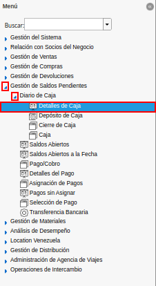
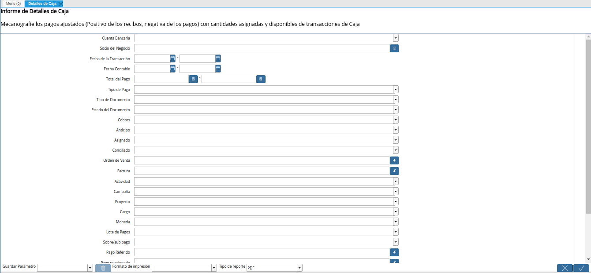
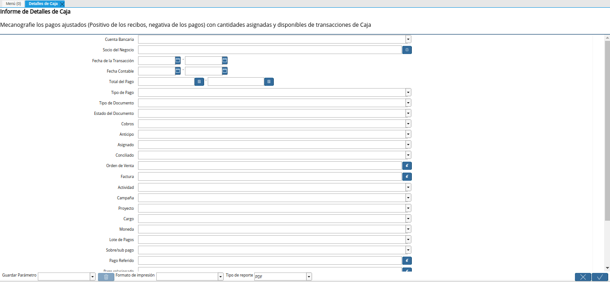

.. |campo socio del negocio de la ventana detalles de caja| image:: resources/business-partner-field-of-cash-details-window.png
.. |campo fecha de la transacción de la ventana detalles de caja| image:: resources/transaction-date-field-of-the-cash-details-window.png
.. |campo fecha contable de la ventana detalles de caja| image:: resources/accounting-date-field-of-the-cash-details-window.png
.. |campo total del pago de la ventana detalles de caja| image:: resources/total-payment-field-of-the-cash-details-window.png
.. |campo tipo de pago de la ventana detalles de caja| image:: resources/payment-type-field-of-the-cash-details-window.png
.. |campo tipo de documento de la ventana detalles de caja| image:: resources/document-type-field-of-the-cash-details-window.png
.. |campo estado del documento de la ventana detalles de caja| image:: resources/document-status-field-of-the-cash-details-window.png
.. |campo cobros de la ventana detalles de caja| image:: resources/cash-receipts-field-of-the-cash-details-window.png
.. |campo anticipo de la ventana detalles de caja| image:: resources/advance-field-of-the-cash-details-window.png
.. |campo asignado de la ventana detalles de caja| image:: resources/mapped-field-of-the-cash-details-window.png
.. |campo conciliado de la ventana detalles de caja| image:: resources/reconciled-field-of-cashier-details-window.png
.. |campo orden de venta de la ventana detalles de caja| image:: resources/field-sales-order-of-the-cash-details-window.png
.. |campo factura de la ventana detalles de caja| image:: resources/invoice-field-of-the-cash-details-window.png
.. |campo actividad de la ventana detalles de caja| image:: resources/activity-field-of-the-cash-details-window.png
.. |campo campaña de la ventana detalles de caja| image:: resources/field-campaign-box-details-window.png
.. |campo proyecto de la ventana detalles de caja| image:: resources/project-field-of-the-cash-details-window.png
.. |campo cargo de la ventana detalles de caja| image:: resources/charge-field-of-the-cash-details-window.png
.. |campo moneda de la ventana detalles de caja| image:: resources/currency-field-of-the-cash-details-window.png
.. |campo lote de pagos de la ventana detalles de caja| image:: resources/payment-batch-field-of-the-cash-details-window.png
.. |campo sobre sub pago de la ventana detalles de caja| image:: resources/field-on-sub-payment-of-the-cash-details-window.png
.. |campo pago referido de la ventana detalles de caja| image:: resources/referred-payment-field-of-the-cash-details-window.png
.. |campo pago relacionado de la ventana detalles de caja| image:: resources/related-payment-field-of-the-cash-details-window.png
.. |campo pago sin identificar de la ventana detalles de caja| image:: resources/unidentified-payment-field-of-the-cash-details-window.png
.. |campo grupo de ventas de la ventana detalles de caja| image:: resources/sales-group-field-of-the-cash-details-window.png
.. |campo tipo de cuenta de la ventana detalles de caja| image:: resources/account-type-field-of-the-cash-details-window.png
.. |campo segmento de la ventana detalles de caja| image:: resources/box-details-window-segment-field.png
.. |campo tipo de industria de la ventana detalles de caja| image:: resources/field-window-industry-type-box-details.png
.. |opción ok de la ventana detalles de caja| image:: resources/ok-option-of-the-box-details-window.png
.. |reporte detalles de caja| image:: resources/report-cash-details.png

.. _documento/detalles-de-caja:

**Detalles de Caja**
====================

#. Ubique y seleccione en el menú de ADempiere, la carpeta "**Gestión de Saldos Pendientes**", luego seleccione la carpeta "**Diario de Caja**", por último seleccione el reporte "**Detalles de Caja**".

    |menú detalles de caja|

    Imagen 1. Menú de ADempiere

#. Podrá visualizar la ventana "**Detalles de Caja**", con diferentes campos que le permiten al usuario filtrar la información en base a lo requerido por el mismo.

    |ventana detalles de caja|

    Imagen 2. Ventana Detalles de Caja

    #. Seleccione en el campo "**Cuenta Bancaria**", la cuenta caja por la cual requiere filtrar la información del reporte.

        |campo cuenta bancaria de la ventana detalles de caja|

        Imagen 3. Campo Cuenta Bancaria de la Ventana Detalles de Caja

    #. Seleccione en el campo "**Socio del Negocio**", el socio del negocio por el cual requiere filtrar la información del reporte.

        |campo socio del negocio de la ventana detalles de caja|

        Imagen 4. Campo Socio del Negocio de la Ventana Detalles de Caja

    #. Introduzca en el campo "**Fecha de la Transacción**", la fecha en la cual fue realizada la transacción por la cual requiere filtrar la información del reporte.

        |campo fecha de la transacción de la ventana detalles de caja|

        Imagen 5. Campo Fecha de la Transacción de la Ventana Detalles de Caja

    #. Introduzca en el campo "**Fecha Contable**", la fecha contable de la transacción por la cual requiere filtrar la información del reporte.

        |campo fecha contable de la ventana detalles de caja|

        Imagen 6. Campo Fecha Contable de la Ventana Detalles de Caja

    #. Introduzca en el campo "**Total del Pago**", el rango de pago correspondiente a la transacción por la cual requiere filtrar la información del reporte.

        |campo total del pago de la ventana detalles de caja|

        Imagen 7. Campo Total del Pago de la Ventana Detalles de Caja

    #. Seleccione en el campo "**Tipo de Pago**", la forma de pago utilizada para la transacción por la cual requiere filtrar la información del reporte.

        |campo tipo de pago de la ventana detalles de caja|

        Imagen 8. Campo Tipo de Pago de la Ventana Detalles de Caja

    #. Seleccione en el campo "**Tipo de Documento**", el tipo de documento utilizado para generar la transacción por la cual requiere filtrar la información del reporte.

        |campo tipo de documento de la ventana detalles de caja|

        Imagen 9. Campo Tipo de Documento de la Ventana Detalles de Caja

    #. Seleccione en el campo "**Estado del Documento**", el estado del documento en el que se encuentra la transacción por la cual requiere filtrar la información del reporte.

        |campo estado del documento de la ventana detalles de caja|

        Imagen 10. Campo Estado del Documento de la Ventana Detalles de Caja

    #. Indique en el campo "**Cobros**", si fue cobrada la transacción por la cual requiere filtrar la información del reporte.

        |campo cobros de la ventana detalles de caja|

        Imagen 11. Campo Cobros de la Ventana Detalles de Caja

    #. Indique en el campo "**Anticipo**", si posee un anticipo la transacción por la cual requiere filtrar la información del reporte.

        |campo anticipo de la ventana detalles de caja|

        Imagen 12. Campo Anticipo de la Ventana Detalles de Caja

    #. Indique en el campo "**Asignado**", si fue asignado el pago de la transacción por la cual requiere filtrar la información del reporte.

        |campo asignado de la ventana detalles de caja|

        Imagen 13. Campo Asignado de la Ventana Detalles de Caja

    #. Indique en el campo "**Conciliado**", si fue conciliada la transacción por la cual requiere filtrar la información del reporte.

        |campo conciliado de la ventana detalles de caja|

        Imagen 14. Campo Conciliado de la Ventana Detalles de Caja

    #. Seleccione en el campo "**Orden de Venta**", la orden de venta relacionada a la transacción por la cual requiere filtrar la información del reporte.

        |campo orden de venta de la ventana detalles de caja|

        Imagen 15. Campo Orden de Venta de la Ventana Detalles de Caja

    #. Seleccione en el campo "**Factura**", la factura relacionada a la transacción por la cual requiere filtrar la información del reporte.

        |campo factura de la ventana detalles de caja|

        Imagen 16. Campo Factura de la Ventana Detalles de Caja

    #. Seleccione en el campo "**Actividad**", la actividad relacionada a la transacción por la cual requiere filtrar la información del reporte.

        |campo actividad de la ventana detalles de caja|

        Imagen 17. Campo Actividad de la Ventana Detalles de Caja

    #. Seleccione en el campo "**Campaña**", la campaña de mercadeo relacionada a la transacción por la cual requiere filtrar la información del reporte.

        |campo campaña de la ventana detalles de caja|

        Imagen 18. Campo Campaña de la Ventana Detalles de Caja

    #. Seleccione en el campo "**Proyecto**", el proyecto relacionado a la transacción por la cual requiere filtrar la información del reporte.

        |campo proyecto de la ventana detalles de caja|

        Imagen 19. Campo Proyecto de la Ventana Detalles de Caja

    #. Seleccione en el campo "**Cargo**", el cargo relacionado a la transacción por la cual requiere filtrar la información del reporte.

        |campo cargo de la ventana detalles de caja|

        Imagen 20. Campo Cargo de la Ventana Detalles de Caja

    #. Seleccione en el campo "**Moneda**", la moneda relacionada a la transacción por la cual requiere filtrar la información del reporte.

        |campo moneda de la ventana detalles de caja|

        Imagen 21. Campo Moneda de la Ventana Detalles de Caja

    #. Seleccione en el campo "**Lote de Pagos**", el lote de pagos relacionado a la transacción por la cual requiere filtrar la información del reporte.

        |campo lote de pagos de la ventana detalles de caja|

        Imagen 22. Campo Lote de Pagos de la Ventana Detalles de Caja

    #. Indique en el campo "**Sobre/Sub Pago**", si contiene sobre/sub pago la transacción por la cual requiere filtrar la información del reporte.

        |campo sobre sub pago de la ventana detalles de caja|

        Imagen 23. Campo Sobre/Sub Pagos de la Ventana Detalles de Caja

    #. Seleccione en el campo "**Pago Referido**", el pago referido a la transacción por la cual requiere filtrar la información del reporte.

        |campo pago referido de la ventana detalles de caja|

        Imagen 24. Campo Pago Referido de la Ventana Detalles de Caja

    #. Seleccione en el campo "**Pago Relacionado**", el pago relacionado a la transacción por la cual requiere filtrar la información del reporte.

        |campo pago relacionado de la ventana detalles de caja|

        Imagen 25. Campo Pago Relacionado de la Ventana Detalles de Caja

    #. Indique en el campo "**Pago sin Identificar**", si se encuentra identificado el pago/cobro relacionado a la transacción por la cual requiere filtrar la información del reporte.

        |campo pago sin identificar de la ventana detalles de caja|

        Imagen 26. Campo Pago Sin Identificar de la Ventana Detalles de Caja

    #. Seleccione en el campo "**Grupo de Ventas**", el grupo de ventas al que pertenece la transacción por la cual requiere filtrar la información del reporte.

        |campo grupo de ventas de la ventana detalles de caja|

        Imagen 27. Campo Grupo de Ventas de la Ventana Detalles de Caja

    #. Seleccione en el campo "**Tipo de Cuenta**", el tipo de cuenta relacionada a la transacción por la cual requiere filtrar la información del reporte.

        |campo tipo de cuenta de la ventana detalles de caja|

        Imagen 28. Campo Tipo de Cuenta de la Ventana Detalles de Caja

    #. Seleccione en el campo "**Segmento**", el segmento relacionado a la transacción por la cual requiere filtrar la información del reporte.

        |campo segmento de la ventana detalles de caja|

        Imagen 29. Campo Segmento de la Ventana Detalles de Caja

    #. Seleccione en el campo "**Tipo de Industria**", el tipo de industria relacionada a la transacción por la cual requiere filtrar la información del reporte.

        |campo tipo de industria de la ventana detalles de caja|

        Imagen 30. Campo Tipo de Industria de la Ventana Detalles de Caja

#. Seleccione la opción "**OK**", para generar el reporte "**Detalles de Caja**", en base a lo seleccionado en los diferentes campos explicados anteriormente.

    |opción ok de la ventana detalles de caja|

    Imagen 31. Opción OK de la Ventana Detalles de Caja

#. Finalmente, podrá visualizar de la siguiente manera el reporte "**Detalles de Caja**".

    |reporte detalles de caja|

    Imagen 32. Reporte Detalles de Caja