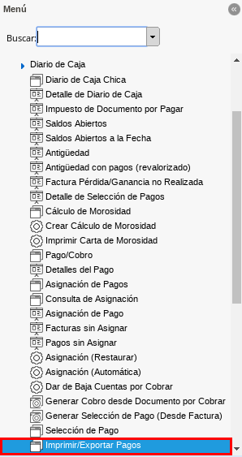
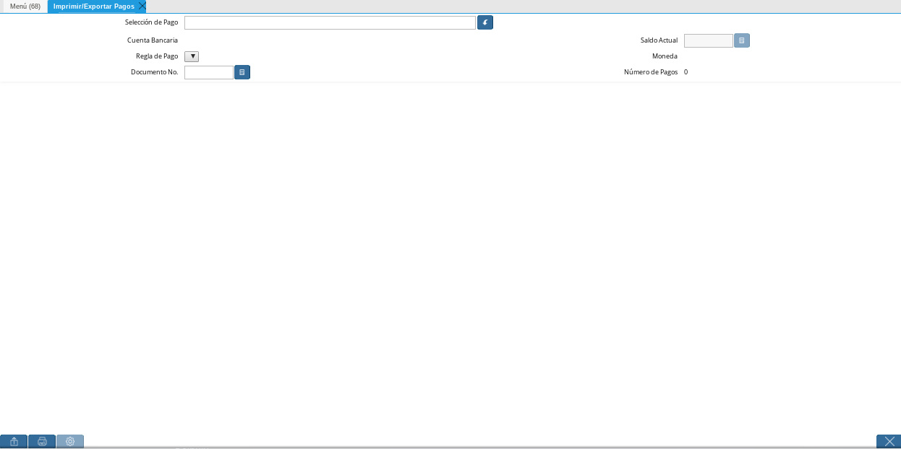
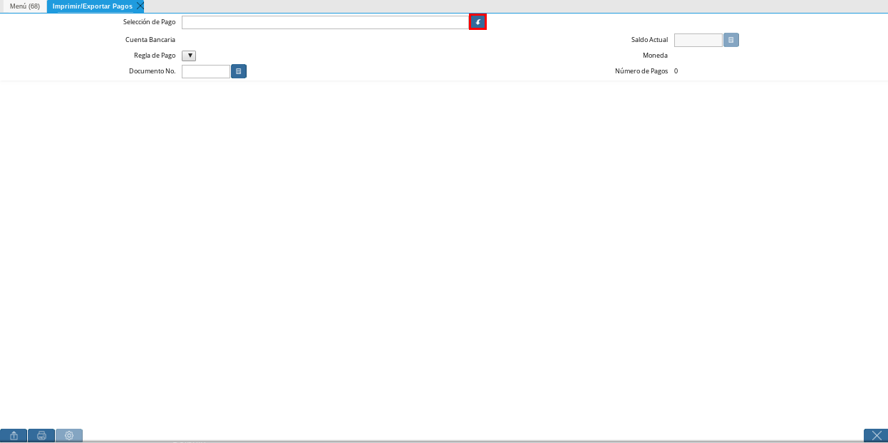
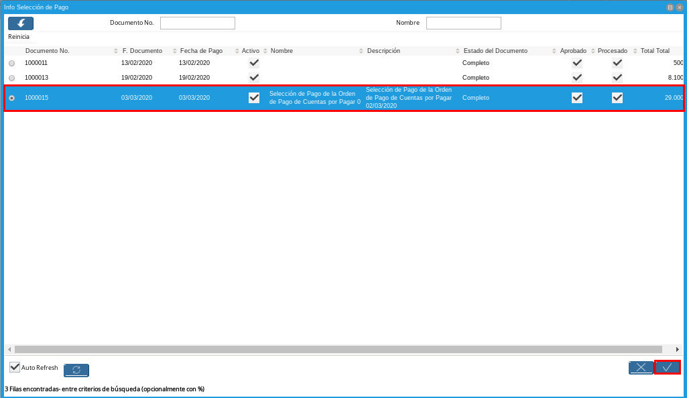
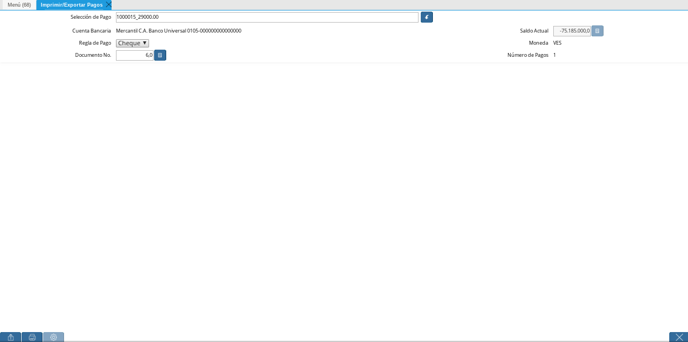
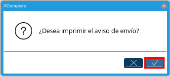
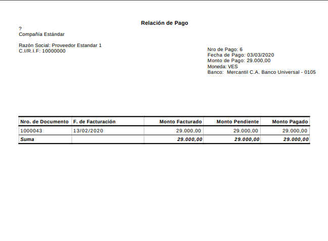
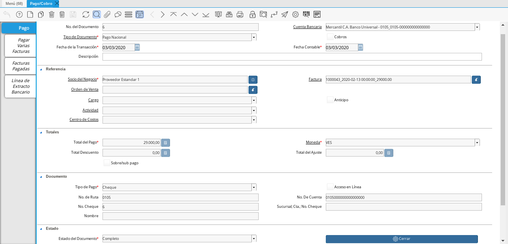

.. |Menú de ADempiere 2| image:: resources/menu-pago.png

.. _documento/Imprimir-Exportar:

**Registro de Imprimir / Exportar Pagos**
=========================================

#. Ubique y seleccione en el menú de ADempiere, la carpeta "**Gestión de Saldos Pendientes**", luego seleccione ventana "**Imprimir / Exportar Pagos**".

    |Menú de ADempiere|

    Imagen 1. Menú de ADempiere

    #. Podrá visualizar la ventana "**Imprimir / Exportar Pagos**" y proceder al llenado de los campos correspondientes.

        |Ventana Imprimir Exportar|

        Imagen 2. Ventana Imprimir / Exportar Pagos

    #. Seleccione el número del documento de la selección de pago realizada anteriormente, con ayuda del identificador del campo "**Selección de Pago**".

        |Identificador del Campo Selección de Pago|

        Imagen 3. Identificador del Campo Selección de Pago

        #. Podrá visualizar la ventana del identificador, en la cual debe seleccionar la selección de pago y la opción "**OK**" para cargar los datos de la selección de pago a la ventana "**Imprimir / Exportar Pagos**".

            |Seleccionar la Selección de Pago y Opción OK|

            Imagen 4. Campo Selección de Pago

    #. Podrá visualizar ventana "**Imprimir / Exportar Pagos**" con los registros cargados desde el identificador del campo "**Selección de Pago**".

        |Campos Cargados Desde la Selección de Pago|

        Imagen 5. Ventana de Registro guardado

    #. Seleccione la opción "**Imprimir Registros**", para imprimir el registro del pago realizado a la factura desde la selección de pago.

        |Opción Imprimir|

        Imagen 6. Opción Exportar Registros

        .. note::

            Se debe seleccionar la opción "**Imprimir**" solo si la regla de pago es "**Cheque**", de lo contrario se debe seleccionar la opción "**Exportar**.

        #. Podrá visualizar la siguiente ventana con el mensaje de confirmación, en la cual debe seleccionar la opción "**OK**".

            |Mensaje de Confirmación|

            Imagen 7. Ventana con Mensaje de Confirmación

    #. ADempiere genera el documento del registro del pago realizado a la factura desde la selección de pago.

        |Comprobante de Relación de Pago 1|

        Imagen 8. Comprobante de Relación de Pago

**Consultar Documento de Pago Generado**
----------------------------------------

#. Ubique y seleccione en el menú de ADempiere, la carpeta "**Gestión de Saldos Pendientes**", luego seleccione la ventana "**Pago/Cobro**".

    |Menú de ADempiere 2|

    Imagen 9. Menú de ADempiere

#. Al consultar el pago generado con el número de documento impreso en el campo "**Nro. de Pago**" del comprobante, se puede visualizar el registro del documento de la siguiente manera.

    |Pago Generado|

    Imagen 10. Pago Generado