.. |Menú de ADempiere| image:: resources/menu-print-export.png
.. |Ventana Imprimir Exportar| image:: resources/window-print-export.png
.. |Identificador del Campo Selección de Pago| image:: resources/payment-selection-field-identifier.png

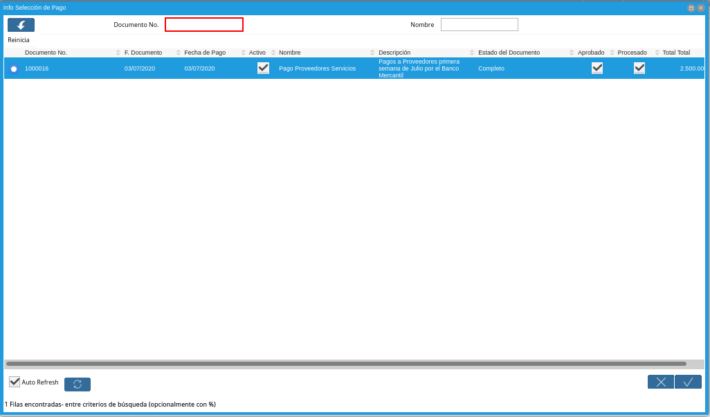
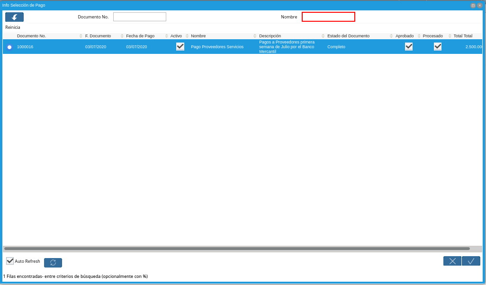
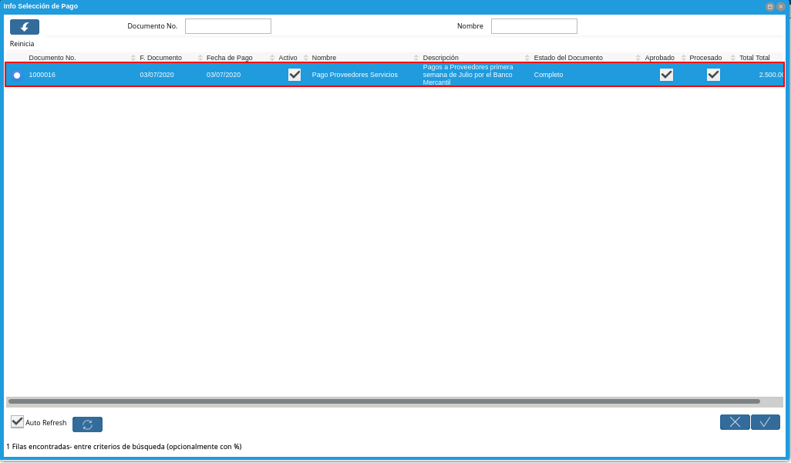
.. |Botón Ok| image:: resources/ok-button.png

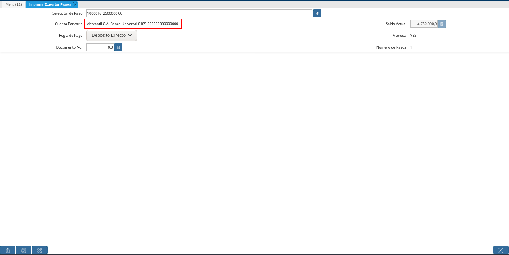
.. |Campo Regla de Pago| image:: resources/payment-rule-field.png
.. |Campo Documento Nro| image:: resources/document-field-number.png
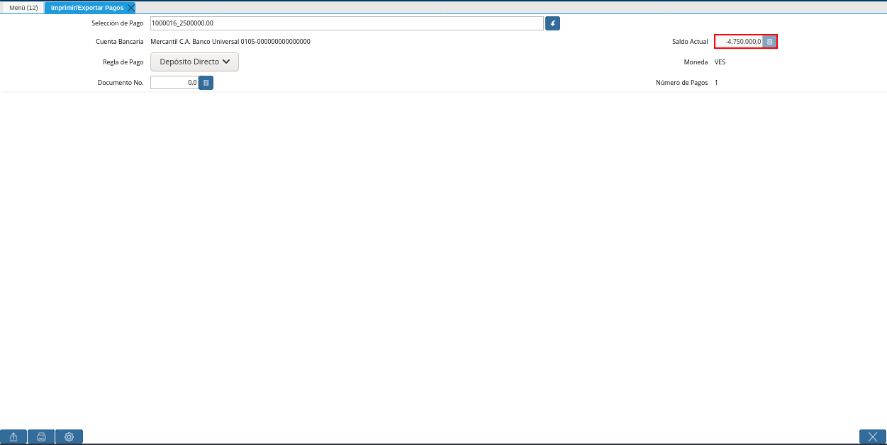
.. |Campo Moneda| image:: resources/currency-field.png
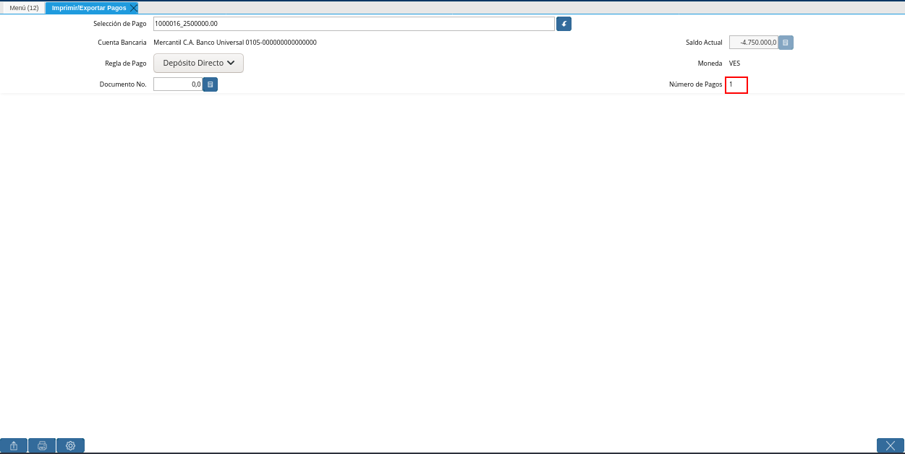
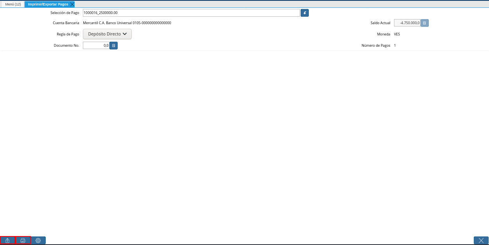
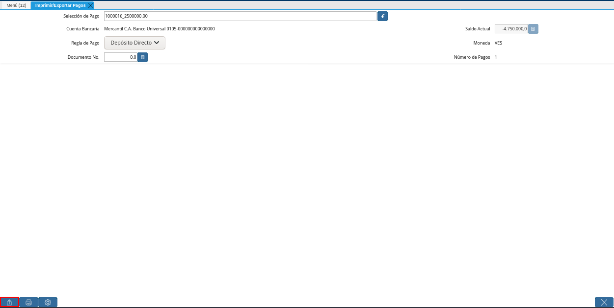
.. |Ventana para Ubicar el Txt| image:: resources/window-to-locate-the-txt.png
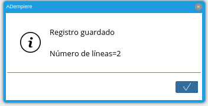
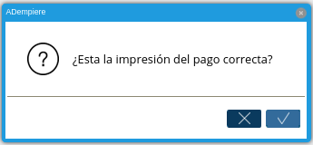
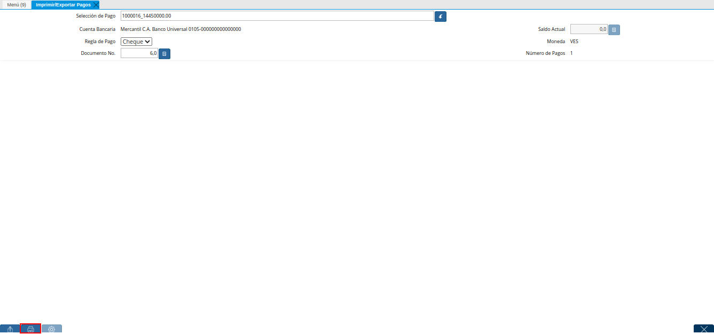
.. |Mensaje de Confirmación| image:: resources/confirmation-message.png
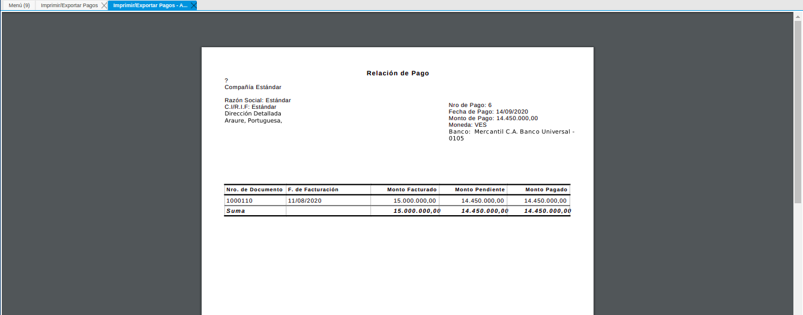
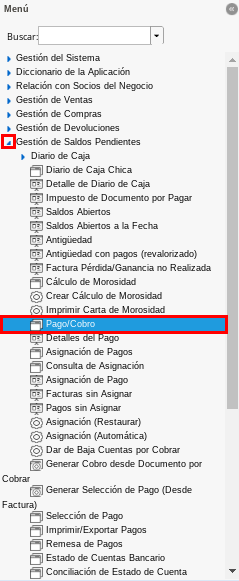
.. |Ventana Selección de Pago| image:: resources/payment-selection-window.png
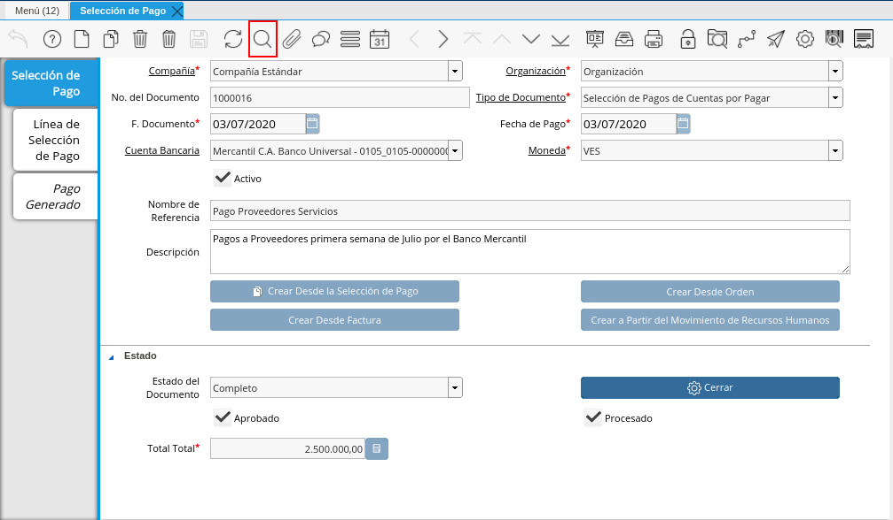
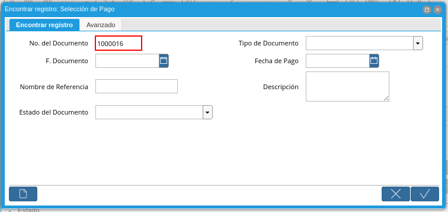
.. |Pestaña Pago Generado| image:: resources/payment-tab-generated.png
.. |Campo Pago de la Pestaña Pago Generado| image:: resources/payment-field-of-the-generated-payment-tab.png
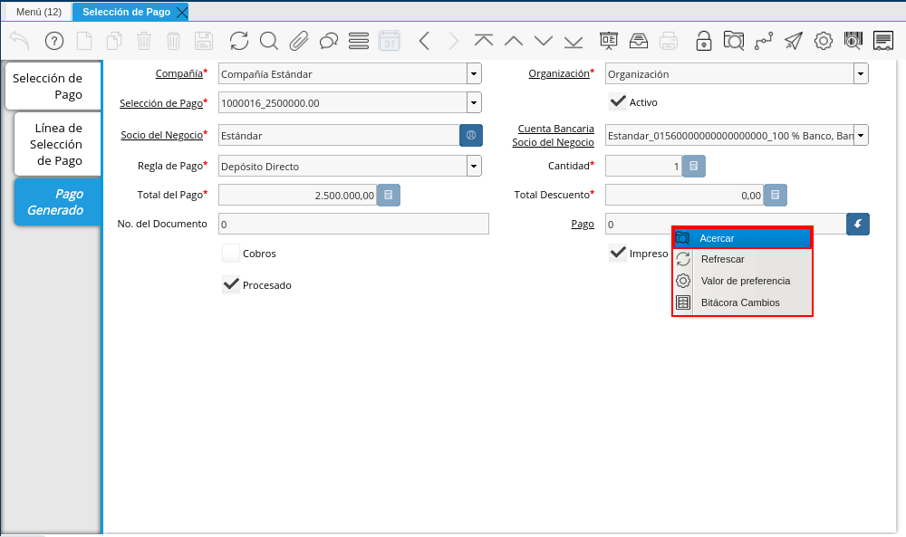
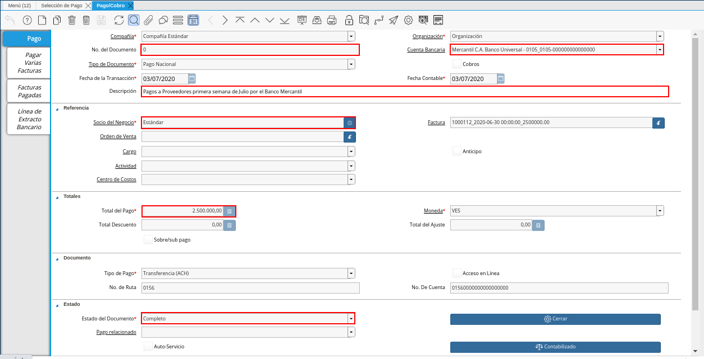

.. _documento/Imprimir-Exportar:

**Registro de Imprimir / Exportar Pagos**
=========================================

Para poder generar los pagos de los documentos asociados a una selección de pago, se deben realizar los siguientes pasos:

#. Ubique y seleccione en el menú de ADempiere, la carpeta "**Gestión de Saldos Pendientes**", luego seleccione ventana "**Imprimir / Exportar Pagos**".

    |Menú de ADempiere|

    Imagen 1. Menú de ADempiere

#. Podrá visualizar la ventana "**Imprimir / Exportar Pagos**" el cual cuenta con los siguientes campos:

    |Ventana Imprimir Exportar|

    Imagen 2. Ventana Imprimir / Exportar Pagos

#. Campo **”Selección de Pago”**,este es un campo tipo búsqueda el cual es utilizado para ubicar las selección de pagos de cuentas por pagar, el cual contiene los documentos los cuales se les generarán los pagos.

    |Identificador del Campo Selección de Pago|

    Imagen 3. Campo Selección de Pago

#. Para ubicar la selección de pago está se puede realizar de dos maneras:

#. La primera opción es colocar directamente dentro del campo **”Selección de Pago”** el número de documento de la **”Selección de Pagos de Cuentas por Pagar”**, al realizar dicho procedimiento en  ADempiere traerá automáticamente la selección de pago.

    |Búsqueda Selección de Pago Directa|

    Imagen 4. Búsqueda Selección de Pago Directa

#. La segunda opción es tildar el botón de búsqueda que se encuentra al finalizar el campo **”Selección de Pago”** el cual tiene un ícono de una flecha hacia abajo, al tildar está opción se desplegará una ventana de búsqueda inteligente el cual posee los siguientes campos de búsqueda, los cuales pueden ser utilizados para ubicar la selección de pagos de cuentas por pagar.

#. Campo **”N° de Documento”** en este campo se puede colocar el número de documento de la selección de pago.

    |Campo Nro de documento de ventana de búsqueda Selección de Pago|

    Imagen 5. Campo Nro de documento de ventana de búsqueda Selección de Pago

    .. note::

        Es importante recordar que ADempiere cuenta con un comodín de búsqueda el cual es signo porcentual “**(%)**” el cual puede ser utilizado dentro de un campo de búsqueda colocando un valor de búsqueda con el signo del porcentaje estando al inicio y final de la palabra o valor que se desea buscar ejemplo: %77%.

        Esto permite realizar búsquedas más extensa del valor que se esté colocando, es decir sí en el campo “**N° de Documento**” es colocado %77% ADempiere ubicará todas las selecciones de pagos que contengan ese valor en el número de documento, ya sea que se encuentre al iniciar , al final o en la parte central.

#. Campo **”Nombre”** 

    |Campo Nombre de ventana de búsqueda Selección de Pago|

    Imagen 6. Campo Nombre de ventana de búsqueda “Selección de Pago”

#. Dependiendo de la opción de búsqueda que se utilice, en la parte central de esta ventana se mostrará la o las selecciones de pagos que ubique ADempiere, tilde la selección de pago con la que desea trabajar.

    |Tildar selección de pago|

    Imagen 7. Tildar selección de pago

#. Al ubicar la selección de pago  presione el botón **“Ok”** de la ventana de búsqueda, al tildar el botón ADempiere lo llevará nuevamente a la ventana principal **”Imprimir/Exportar Pagos”**

    |Botón Ok|

    Imagen 8. Botón Ok

#. Podrá Observar que el campo  **”Selección de Pago”** se encuentra el número de documento de la selección de pago de cuentas por pagar.

    |Campos Cargados Desde la Selección de Pago|

    Imagen 9. Ventana de Registro guardado

#. Campo **”Cuenta Bancaria”** debe aparecer el banco con el que se encuentra trabajando la selección de pagos de cuentas por pagar qué ha sido ubicada en el campo **”Selección de Pago”**, por ejemplo:

    Sí al momento de crear la selección de pago de cuentas por pagar, fue asociada el banco **”Banco Provincial S.A. Banco Universal”** esté debe aparecer en este campo con el número de cuenta correspondiente a él. Este banco es el banco en donde se emitirán los pagos 

    |Campo Cuenta Bancaria|

    Imagen 10. Campo Cuenta Bancaria

    .. note::

        Para realizar la creación de una selección de pagos de cuentas por pagar visite el documento :ref:`documento/selección-de-pago`.

#. Campo **”Regla de Pago ”** este campo debe traer la regla de pago establecida en la selección de pagos de cuentas por pagar.
Cabe destacar, que dependiendo de la regla de pago con la que cuente la selección de pago se definirá la acción que se utilizará para generar los pagos.

    |Campo Regla de Pago|

    Imagen 11. Campo Regla de Pago

#. Campo **”Documento No.”** este campo mostrará el número de documento de la regla de pago con la que se esté trabajando, cada regla de pago tendrá un número de documento y esté irá incrementado a medida que se deseen generar los pagos desde esta ventana, como por ejemplo:

    Para las reglas de pagos **“Cheque”** si ADempiere está debidamente configurado está regla de pago bajo el banco con el que se esté trabajando, ADempiere irá incrementado su secuencia del número de documento con el número de cheque que realmente debe salir por ese banco.

        |Campo Documento Nro|

        Imagen 12. Documento No

#. Campo **”Saldo Actual”** este campo mostrará el saldo actual que posee el banco a mostrar en el campo **”Cuenta Bancaria”** qué es el mismo qué tiene asociada la selección de pago de cuentas por pagar.

    |Campo Saldo Actual|

    Imagen 13. Campo Saldo Actual

#. Campo **”Moneda”** es la moneda con la que se emitirán los pagos, la moneda a mostrar es la misma que tiene asociada selección de pago de cuentas por pagar.

    |Campo Moneda|

    Imagen 14. Campo Moneda

#. Campo **”Número de Pagos”** debe mostrar los pagos a generar por cada uno de los documentos asociados en la selección de pagos de cuentas por pagar,los pagos a generar dependen de las siguientes características:

    - Sí la selección de pago posee dos o más documentos  de un mismos socio de negocio y apuntan a una misma cuenta bancaria, ADempiere generará un pago a ese socio de negocio con la suma de los documentos de ese proveedor, ejemplo:

        - En la selección de pago se encuentra cuatro  (3) facturas asociadas, dos de esas facturas pertenecen a un mismo proveedor  **”Dhl Express Aduanas Venezuela C.A.”** 

            - La **”Factura N°1”**  tiene el total de pago 10.000,00 del socio del negocio **”Dhl Express Aduanas Venezuela C.A.”** a la cuenta bancaria **”100 % Banco, Banco Universal, C.A._0156 “**
            
            - La **”Factura N°2”** tiene un total pagado 30.000,00 con el mismo socio de negocio y la misma cuenta bancaria de la **”Factura N°1”**.
            
            - La factura **”Factura N°3”**  tiene un total de pago de 15.000,00 a otro socio de negocio con la cuenta bancaria **”Mercantil C.A. Banco Universal_0105”**.

        - El número a mostrar en el total de pagos será 2 , ya que la factura N°1 y la Factura N° 2 pertenecen a un mismo socio de negocio y apuntan a una misma cuenta bancaria, ADempiere realizará un pago para esas dos facturas, cuando se complete el procedimiento se generará los siguientes pagos:

            - El **”Pago N°1”** a la cuenta **”100 % Banco, Banco Universal, C.A._0156 “** del socio de negocio **”Dhl Express Aduanas Venezuela C.A.”** por un total de 40.000,00.

            - El **”Pago N°2”**  la cuenta bancaria **”Mercantil C.A. Banco Universal_0105”** del otro socio del negocio por un total de 15.000,00.

    - Sí la selección de pago posee dos o más documentos  de un mismos socio de negocio pero estos apuntan a diferentes cuentas bancarias, ADempiere generará el pago por la cantidad de documentos asociados a ese proveedor que contenga cuentas bancarias diferentes, ejemplo:

        - En la selección de pago se encuentra tres (3) facturas asociadas, dos de esas facturas pertenecen a un mismo proveedor  **”Dhl Express Aduanas Venezuela C.A.”** :

            - La **”Factura N° 1”**  tiene el total de pago 10.000,00 está asociada la cuenta bancaria **”100 % Banco, Banco Universal, C.A._0156 “**.

            - La **”factura N° 2”** es del mismos proveedor de la factura N°1 con un total pagado 30.000,00 y está asociada a la cuenta bancaria **”Mercantil C.A. Banco Universal_0105”**.

            - La **”Factura N°3”** se encuentra asociada a otro proveedor por un total de 40.000,00 al banco **”Mercantil C.A. Banco Universal_0105”**.

        - El número a mostrar en el total de pagos serán tres, a pesar de que esté posee dos facturas con un mismo socio de negocio en este caso no se unirán los pagos por qué en la selección de pago las facturas del socio de negocio que se repite poseen cuentas bancarias diferentes, entonces cuando se complete el procedimiento  ADempiere generará tres pagos:

            - El **”Pago N°1”** al socio del negocio **”Dhl Express Aduanas Venezuela C.A.”** a la cuenta bancaria **”100 % Banco, Banco Universal, C.A._0156 “**  por 10.000,00

            - El **”Pago N°2”** al socio del negocio  **”Dhl Express Aduanas Venezuela C.A.”** a la cuenta bancaria **”Mercantil C.A. Banco Universal_0105”** por 30.000,00.

            - El **”Pago N°3”** al otro socio de negocio a la cuenta bancaria **”Mercantil C.A. Banco Universal_0105”** por un total de 40.000,00.

    - Sí la selección de pagos posee documentos asociados con diferentes socios de negocios ADempiere generará un pago por cada uno de los documentos qué se encuentre asociados a la selección de pagos, ejemplo:

        - En la selección de pagos tienen tres facturas asociadas con diferentes socios de negocios el número a mostrar en el total de pagos serán tres, entonces cuando se complete el procedimiento ADempiere generará tres pagos.

    |Campo Número de Pagos|

    Imagen 15. Número de Pagos

#. Para generar los pagos de la selección de pago se pueden ADempiere cuenta con las siguientes opciones **"Exportar Registros"**, **"Imprimir"** dependiendo de la regla de pago con la que se encuentre trabajando la selección de pago se deben utilizar las siguientes opciones:

    |Opciones Imprimir Exportar Pagos|

    Imagen 16. Opciones Imprimir/Exportar Pagos

#. Para las selecciones de pago que cuenten con las reglas de pago  **"A crédito, Débito directo, Depósito directo"** se debe utilizar la opción **"Exportar Registros"**, esta opción genera los pagos de los documentos asociados a la selección de pago y le permitirá generar el archivo txt de esos pagos para poder ser cargado en el banco.

    |Opción Exportar Registros|

    Imagen 17. Opción Exportar Registros 

#. Al seleccionar la opción **"Exportar Registros"** ADempiere mostrará una ventana donde se observará las carpetas del equipo donde se encuentre trabajando, esto para que ubique y guarde el archivo txt que será llevado al banco.

    |Ventana para Ubicar el Txt|

    Imagen 18. Ventana para Ubicar el Txt

#. Podrá observar una vez guarde el archivo txt, un mensaje del número de registro de líneas guardadas, este número a mostrar dependerá de los registros asociados a cada una de las líneas de la selección de pago.

    |Mensaje Número de Registro de Líneas Guardadas|

    Imagen 19. Mensaje Número de Registro de Líneas Guardadas

#. Una vez tildada la opción ok de la ventana del número de registro de líneas guardadas, ADempiere mostrará el siguiente mensaje donde indica que la impresión ha sido correcta, es decir que los pagos se han generado correctamente.

    |Mensaje Impresión Correcta|

    Imagen 20. Mensaje Impresión Correcta 

#. Para las selecciones de pago que cuenten con las reglas de pago "**A crédito, Cheque, Tarjeta de crédito**" se debe utilizar la opción "**Imprimir**", esta opción genera los pagos de los documentos asociados a la selección de pago y le permitirá imprimir el cheque desde ADempiere.

    |Opción Imprimir Pagos|

    Imagen 21. Opción Imprimir

#. Podrá visualizar la siguiente ventana con el mensaje de confirmación, en la cual debe seleccionar la opción "**OK**".

    |Mensaje de Confirmación|

    Imagen 22. Ventana con Mensaje de Confirmación

#. ADempiere genera el documento del registro del pago realizado a la factura desde la selección de pago.

    |Comprobante de Relación de Pago|

    Imagen 23. Comprobante de Relación de Pago

**Consultar Documento de Pago Generado**
----------------------------------------

Para ubicar en ADempiere los pagos generados de una selección de pagos a través de la opción imprimir/exportar pago se pueden ubicar de la siguiente forma:

#. Una de las opciones es ubicar los pagos directamente de la ventana "**Pago/Cobro**", para ello realice los siguientes pasos:

#. Ubique y seleccione en el menú de ADempiere, la carpeta "**Gestión de Saldos Pendientes**", luego seleccione la ventana "**Pago/Cobro**".

    |Menú de ADempiere 2|

    Imagen 24. Menú de ADempiere

#. Ubique en la barra de herramientas de ADempiere la opción **"Encontrar Registro"**.

    |Opción Encontrar Registro|

    Imagen 25. Opción Encontrar Registro

#. Al tildar la opción de la barra de herramientas de ADempiere **"Encontrar Registro"** ADempiere mostrará una ventana de búsqueda la cual cuenta con varios criterios de búsquedas los cuales pueden ser utilizados para encontrar el pago o los pagos que se deseen ubicar.

    Para este caso se desea ubicar los pagos generados desde la opción imprimir/exportar pagos, si al momento de hacer la búsqueda sabe cual es el número de documento asociado a la selección de pago y ese documento es una factura puede utilizar el criterio de búsqueda **"Factura"**.

    Si no puede utilizar cualquiera de los criterios de búsqueda que le ofrece la ventana.

    |Ventana de búsqueda Encontrar Registros|

    Imagen 26. Ventana de búsqueda Encontrar Registros

#. Dependiendo de los criterios de búsqueda utilizados, podrá observar en la ventana el pago generado.

    |Ventana Pago Cobro desde el acercar|

    Imagen 27. Pago Generado

#. Otra opción de búsqueda es ubicar los pagos desde la ventana **"Selección de Pagos"**, para ello realice los siguientes pasos:

#. Ubique y seleccione en el menú de ADempiere, la carpeta "**Gestión de Saldos Pendientes**", luego seleccione la ventana "**Selección de Pagos**" y ubique la selección de pagos con la que trabajo en el proceso de imprimir/exportar pagos.

    |Ventana Selección de Pago|

    Imagen 28. Ventana Selección de Pago

    .. note::

        Recuerde que toda ventana en ADempiere cuenta en la barra de herramientas la opción de búsqueda "**Encontrar Registros**" la cual puede ser utilizada para ubicar la selección de pagos.

#. Una vez ubicada la selección de pago tilde la pestaña **"Pago Generado"**, dentro de esta pestaña podrá observar un resumen de los pagos generados por socios de negocios con los que cuenta la selección de pago.

    |Pestaña Pago Generado|

    Imagen 29. Pestaña Pago Generado

#. Para visualizar mejor el pago generado ubique dentro de la pestaña y dentro del registro del socio del negocio en el que se encuentre posicionado, el campo **"Pago"**, ese campo mostrará el número de documento del pago generado al socio del negocio, 

    |Campo Pago de la Pestaña Pago Generado|

    Imagen 30. Campo Pago de la Pestaña Pago Generado

#. Ubíquese dentro del campo **”Pago”**,  de click derecho y seleccione la opción acercar.

    |Opción acercar del campo Pago|

    Imagen 31. Opción acercar del campo Pago

#. Al tildar la opción acercar, ADempiere lo llevará a la ventana "**Pago/Cobro**" y podrá ver de manera detallada los datos asociados a ese pago.

    |Ventana Pago Cobro desde el acercar|

    Imagen 32. Ventana Pago/Cobro desde el acercar
