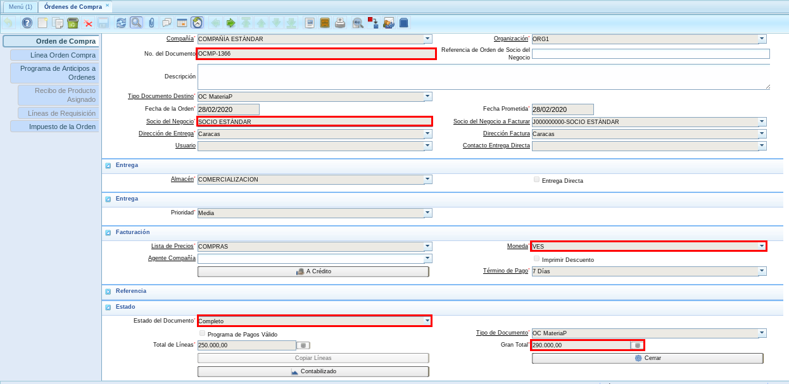
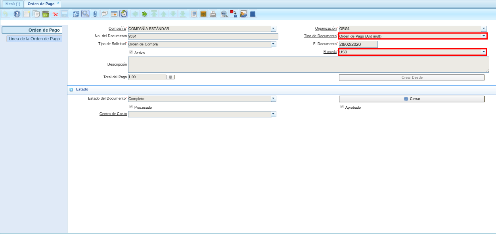
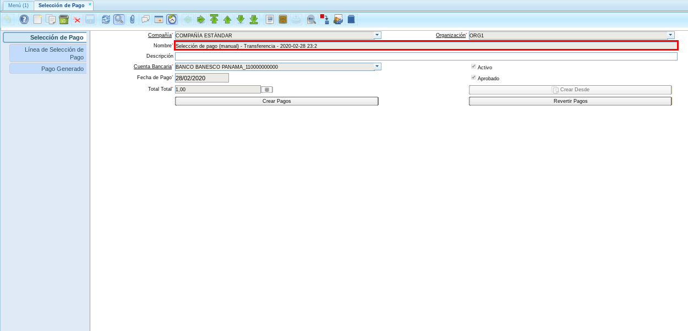
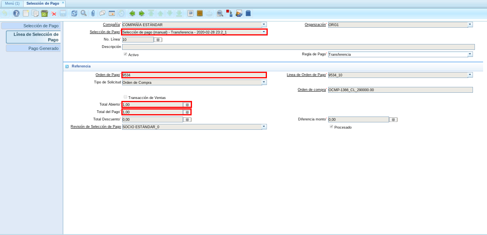
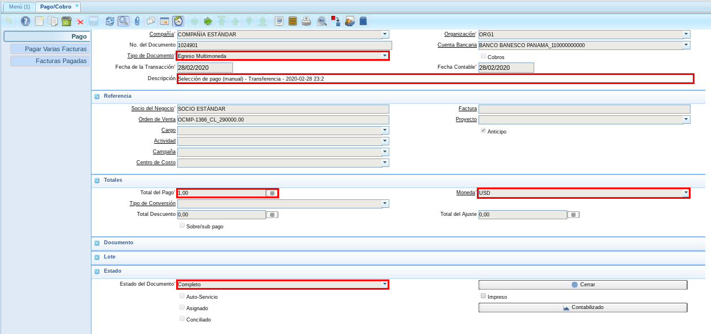
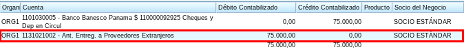

.. _documento/procedimiento-para-distribución-de-cuenta:

====================================================================================================
**Procedimiento para Distribución de Cuenta "Proveedores Nacionales a Proveedores Internacionales"**
====================================================================================================

El presente material elaborado por ERPyA pretende ofrecerle una explicación eficiente a nuestros clientes del procedimiento a seguir para realizar un "**Procedimiento para Distribución de Cuenta "Proveedores Nacionales a Proveedores Internacionales"**", en la versión 3.7.0 de ADempiere. El cambio fue realizado en ADempiere con la finalidad de reflejar en el mismo, los diferentes anticipos realizados en multimoneda.

**Orden de Compra**
===================

#. Para ejemplificar el cambio realizado es generada una "**Orden de compra**", con el socio del negocio "**SOCIO ESTÁNDAR**", en moneda "**VES**" y monto total "**290.000,00**", quedando el documento de la siguiente manera.

    |Orden de Compra|

    Imagen 1. Orden de Compra

**Orden de Pago**
=================

#. Al realizar el procedimiento regular para generar una "**Orden de Pago**", utilizando el tipo de documento "**Orden de Pago (Ant mult)**" y la moneda del anticipo "**USD**", el documento quedaría de la siguiente manera.

    |Orden de Pago|

    Imagen 2. Orden de Pago

.. note::

    Recuerde que la moneda seleccionada debe ser la moneda del anticipo.

**Selección de Pago**
=====================

#. Luego se procede a realizar el procedimiento regular para generar una "**Selección de Pago (Manual)**", obteniendo como resultado el siguiente documento.

    |Selección de Pago|

    Imagen 3. Selección de Pago

#. Podrá visualizar en la pestaña "**Línea de Selección de Pago**", la orden de pago creada anteriormente con su respectivo monto.

    |Línea de Selección de Pago|

    Imagen 4. Pestaña Línea de Selección de Pago

**Consultar Pago Generado con Resultado Contable**
==================================================

#. Al consultar el pago generado en la ventana "**Pago/Cobro**", podrá visualizar el pago generado por el monto del anticipo.

    |Pago Generado|

    Imagen 5. Pago Generado

    .. note::

        El pago es generado con la moneda "**USD**" del anticipo, aun cuando la orden de compra se encuentra con moneda "**VES**".

#. El resultado generado de la transacción contable quedaría de la siguiente manera.

    |Resultado Contable|

    Imagen 6. Resultado Contable del Pago

.. note::

    En caso de registrar el pago desde la ventana "**Pago/Cobro**", seleccionar el tipo de documento "**Egreso Multimoneda**".