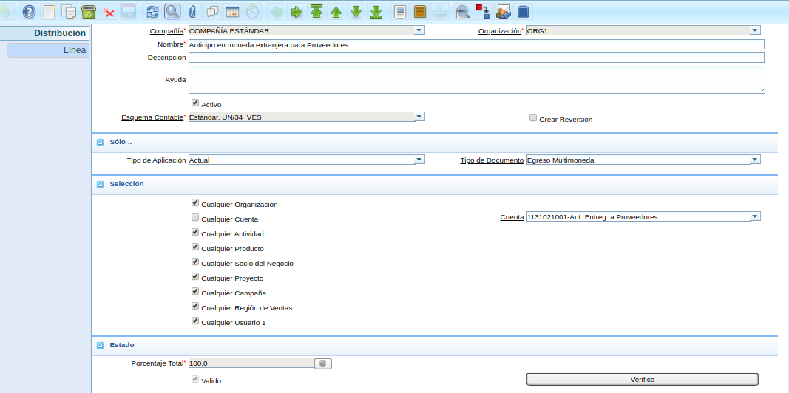
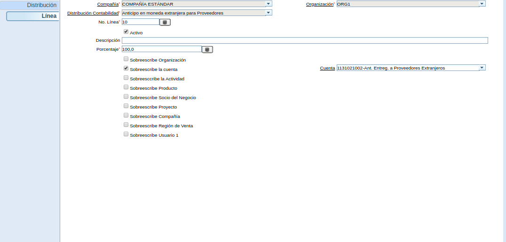

.. |Orden de Compra| image:: resources/orden-compra.png

.. |Línea de Selección de Pago| image:: resources/pest-linea.png

.. _documento/procedimiento-para-anticipos-en-multimonedas-con-distribución-contable:

==========================================================================
**Procedimiento para Anticipos en Multimonedas con Distribución Contable**
==========================================================================

El presente material elaborado por ERPyA pretende ofrecerle una explicación eficiente a nuestros clientes para realizar el "**Procedimiento para Anticipos en Multimoneda con Distribución Contable**", considerando la distribución entre cuentas nacionales e internacionales en la versión 3.7.0 de ADempiere. El cambio fue realizado en el mismo con la finalidad de reflejar los diferentes anticipos realizados en multimoneda en la cuenta contable correspondiente.

**Configuración de la Distribución Contable**
=============================================

#. ERPyA realizó la configuración de la distribución contable de la seguiente manera.

    |Configucación Contable|

    Imagen 1. Configucación Contable

    #. Podrá visualizar en la pestaña "**Línea**", los detalles de la línea de la distribución.

        |Pestaña Línea de la Distribución|

        Imagen 2. Pestaña Línea

**Procedimiento**
=================

**Orden de Compra**
-------------------

#. Para ejemplificar el cambio realizado es generada una "**Orden de compra**", con el socio del negocio "**SOCIO ESTÁNDAR**", en moneda "**VES**" y monto total "**290.000,00**", quedando el documento de la siguiente manera.

    |Orden de Compra|

    Imagen 3. Orden de Compra

**Orden de Pago**
-----------------

#. Al realizar el procedimiento regular para generar una "**Orden de Pago**", utilizando el tipo de documento "**Orden de Pago (Ant mult)**" y la moneda del anticipo "**USD**", el documento quedaría de la siguiente manera.

    |Orden de Pago|

    Imagen 4. Orden de Pago

.. note::

    Recuerde que la moneda seleccionada debe ser la moneda del anticipo y que la tasa de conversión debe estar actualizada.

**Selección de Pago**
---------------------

#. Luego se procede a realizar el procedimiento regular de "**Imprimir/Exportar**", obteniendo como resultado el siguiente documento.

    |Selección de Pago|

    Imagen 5. Selección de Pago

#. Podrá visualizar en la pestaña "**Línea de Selección de Pago**", la orden de pago creada anteriormente con su respectivo monto.

    |Línea de Selección de Pago|

    Imagen 6. Pestaña Línea de Selección de Pago

**Consultar Pago Generado con Resultado Contable**
--------------------------------------------------

#. Al consultar el pago generado en la ventana "**Pago/Cobro**", podrá visualizar el pago generado por el monto del anticipo.

    |Pago Generado|

    Imagen 7. Pago Generado

    .. note::

        El pago es generado con la moneda "**USD**" del anticipo, aun cuando la orden de compra se encuentra con moneda "**VES**".

#. El resultado generado de la transacción contable quedaría de la siguiente manera.

    |Resultado Contable|

    Imagen 8. Resultado Contable del Pago

.. note::

    En caso de registrar el pago desde la ventana "**Pago/Cobro**", seleccionar el tipo de documento "**Egreso Multimoneda**".