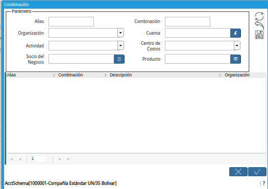

.. |Campo Alias| image:: resources/alias field of combination window
.. |Campo Organización| image:: resources/
.. |Campo Actividad| image:: resources/
.. |Campo Socio del Negocio| image:: resources/
.. |Campo Combinación| image:: resources/
.. |Campo Cuenta| image:: resources/
.. |Campo Alias| image:: resources/
.. |Campo Alias| image:: resources/
.. |Campo Centro de Costos| image:: resources/
.. |Campo Producto| image:: resources/
.. |Icono Guardar| image:: resources/
.. |Opción OK| image:: resources/

.. _documento/combinación-contable:

**Combinación Contable**
========================

Para realizar una configuración de combinación contable en ADempiere, se debe ingresar a la ventana a la cual se le va a configurar la combinación contable, siguiendo el procedimiento detallado a continuación.

#. Una vez ubicado en la ventana "**Combinación**", proceda al llenado de los campos correspondientes para definir la combinación contable.

    |Ventana Combinación|

    Imagen 1. Ventana Combinación

    #. Seleccione en el campo "**Alias**", el alias correspondiente a la combinación contable que esta configurando.

    #. Seleccione en el campo "**Organización**, la organización para la cual esta realizando la configuración contable.

    #. Seleccione en el campo "**Actividad**", la actividad para la cual esta realizando la configuración contable.

    #. Seleccione en el campo "**Socio del Negocio**", el socio del negocio para el cual esta realizando la configuración contable.

    #. Introduzca en el campo "**Combinación**", el nombre de la combinación contable que esta configurando. 

        .. note::

            Este campo no es obligatorio, ya que al agregar la cuenta y 

    #. Seleccione con ayuda del identificador del campo "**Combinación**", la cuenta afectada en el movimiento que se va a realizar.

        |Icono del Campo Combinación|

        Imagen 13. Icono del Campo Combinación

        #. Podrá visualizar la ventana "**Combinación**", donde debe seleccionar la cuenta en la que se desea hacer el movimiento, la misma puede ser seleccionada con ayuda del identificador del campo "**Cuenta**".

            |Ventana Combinación y Selección del Identificador del Campo Cuenta|

            Imagen 14. Identificador del Campo Cuenta

            #. Seleccione la cuenta en la que se desea hacer el movimiento y la opción "**OK**" para cargar la convinación de la misma a la ventana "**Combinación**".

                |Selección de Cuenta y Opción Ok|

                Imagen 15. Selección de Cuenta y Opción Ok
        
        #. Seleccione en el campo "**Organización**", la organización para la cual esta realizando la nota contable.

            |Campo Organización de la Ventana Combinación| 

            Imagen 16. Campo Organización de la Ventana Combinación

        #. Seleccione el icono "**Guardar**", ubicado del lado derecho de la ventana "**Combinación**".

            |Icono Guardar de la Ventana Combinación| 

            Imagen 17. Icono Guardar de la Ventana Combinación

        #. Seleccione la opción "**OK**", para cargar a la ventana "**Diario Contable**", la información ingresada en la ventana "**Combinación**".

            |Opción OK de la Ventana Combinación|

            Imagen 18. Opción OK de la Ventana Combinación

    #. Introduzca en el campo "**Descripción**", el nombre descriptivo del movimiento a realizar.

        |Campo Descripción de la Pestaña Línea|

        Imagen 19. Campo Descripción de la Pestaña Línea

.. topic:: Como puede decir usted

    Primera forma

    Segunda forma