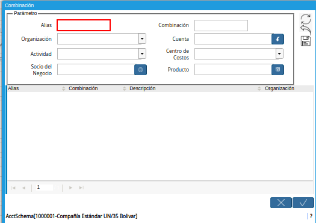

.. |Selección de Cuenta y Opción Ok| image:: resources/

.. _documento/combinación-contable:

**Combinación Contable**
========================

Para realizar una configuración de combinación contable en ADempiere, se debe ingresar a la ventana a la cual se le va a configurar la combinación contable, siguiendo el procedimiento detallado a continuación.

#. Una vez ubicado en la ventana "**Combinación**", proceda al llenado de los campos correspondientes para definir la combinación contable.

    |Ventana Combinación|

    Imagen 1. Ventana Combinación

    #. Seleccione en el campo "**Alias**", el alias correspondiente a la combinación contable que esta configurando.

        |Campo Alias|

        Imagen 2. Campo Alias

    #. Seleccione en el campo "**Organización**, la organización para la cual esta realizando la configuración contable.

        |Campo Organización|

        Imagen 3. Campo Organización

    #. Seleccione en el campo "**Actividad**", la actividad para la cual esta realizando la configuración contable.

        |Campo Actividad|

        Imagen 4. Campo Actividad

    #. Seleccione en el campo "**Socio del Negocio**", el socio del negocio para el cual esta realizando la configuración contable.

        |Campo Socio del Negocio|

        Imagen 5. Campo Socio del Negocio

    #. Introduzca en el campo "**Combinación**", el nombre de la combinación contable que esta configurando. 

        |Campo Combinación|

        Imagen 6. Campo Combinación

        .. note::

            Este campo no es obligatorio, ya que al agregar la cuenta y 

    #. Seleccione con ayuda del identificador del campo "**Cuenta**", la cuenta en la cual se van a reflejar los movimientos que se van a realizar.

        |Campo Cuenta|

        Imagen 7. Campo Cuenta

            #. Seleccione la cuenta en la que se desea hacer el movimiento y la opción "**OK**" para cargar la convinación de la misma a la ventana "**Combinación**".

                |Selección de Cuenta y Opción Ok|

                Imagen 8. Selección de Cuenta y Opción Ok

    #. Seleccione en el campo "**Centro de Costos**", el centro de costos definido para los movimientos que se van a realizar en la cuenta seleccionada.

        |Campo Centro de Costos|

        Imagen 9. Campo Centro de Costos

    #. Seleccione en el campo "**Producto**", el producto al cual le será aplicado la combinación contable que esta configurando.

        |Campo Producto|

        Imagen 10. Campo Producto

        #. Seleccione el icono "**Guardar**", ubicado del lado derecho de la ventana "**Combinación**".

            |Icono Guardar|

            Imagen 11. Icono Guardar de la Ventana Combinación

        #. Seleccione la opción "**OK**", para cargar a la ventana "**Diario Contable**", la información ingresada en la ventana "**Combinación**".

            |Opción OK|

            Imagen 12. Opción OK de la Ventana Combinación

