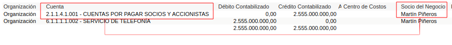

.. _ERPyA: http://erpya.com
.. |Ejemplo de Dimensión| image:: resources/ previous-accounting-dimension.png

.. |Dimensión Socio de Negocio| image:: resources/ current-accounting-dimension.png

.. _documento/dimensiones-contable:

=========================
**Dimensiones Contables**
=========================

La dimensión contable es una funcionalidad incorporada por ADempiere utilizada para unir información haciendo un recuento de los hechos contables que componen cada entidad. De esta forma, se define dimensiones primarias o secundarias respecto a las principales, esto quiere decir, que puede existir una dimensión acumulativa que derive a su vez múltiples dimensiones que posibilitan la implementación de métricas sumarias de cada una o agrupadas por la dimensión padre.

Estas dimensiones contables sustituyen cuentas auxiliares utilizadas comúnmente por los contadores para visualizar en detalle saldos, por ejemplo de socios de negocios que actúan como accionistas, para entenderlo mejor veamos el siguiente ejemplo:

    Imaginemos una empresa que requiere ver el saldos contable de los pasivos de cada accionista de la empresa, para esto la empresa ha definido una cuentas llamada "**CUENTAS POR PAGAR SOCIOS Y ACCIONISTAS-MARTÍN PIÑEROS**" que muestra el detalle del pasivo del accionista **Martín Piñeros**. Así mismo, se agrega un nivel más al plan de cuentas, agregando tantas cuentas como accionistas existan, quedando de la siguiente forma:

        |Ejemplo de Dimensión|

        Imagen 1. Plan de cuentas con dimensiones

Sin embargo, ADempiere contempla una visión holística y minimalista, que elimina la creación de múltiples cuentas contables para el detalle y a su vez las sustituye por las dimensiones contables, creando una combinación entre la cuenta contable y la dimensión, quedando de la siguiente forma:

    |Dimensión Socio de Negocio|

    Imagen 2. Dimensión Contable de Socio de Negocio

Por su parte, al crear una transacción con esta dimensión contable el resultado será el siguiente:

    |Dimensión Contable|

    Imagen 3. Dimensión Contable ADempiere

Las entidades con las que ADempiere permite dimensionar los diferentes hechos contables son las siguientes:

    #. **Organización**: Representa una entidad legal dentro de la empresa, generalmente estructurada de forma dependiente a la compañía principal, esta puede ser una sucursal, tienda o franquicia.

    #. **Socio de negocio**: Representa un sujeto jurídico o natural con el que la organización establece una alianza temporal o permanente, este puede ser un proveedor, cliente, accionista o empleado. Para profundizar más este tema vaya a el documento: :ref:`documento/socio-negocio`.

    #. **Producto**: Representa el resultado obtenido de una producción, que es utilizado durante la compra o la venta,  este puede ser servicio o artículo. Para profundizar más este tema vaya a el documento: :ref:`documento/producto`.

    #. **Región de Venta**: Representa una zona de venta o conjunto de clientes o prospectos que son asignados a un vendedor y con las que la empresa puede establecer un negocio. Para profundizar más este tema vaya a el documento: :ref:`documento/region-ventas`.

    #. **Actividad**: Representa las actividades realizadas en la empresa, generalmente un departamento, permitiendo determinar el costo o el gasto de cada actividad. Para profundizar más este tema vaya a el documento: :ref:`documento/actividad`.

    #. **Proyecto**: Representa la planificación de actividades relacionadas al cumplimiento de un objetivo específico, generalmente delimitado por fases y tareas. Para profundizar más este tema vaya a el documento: :ref:`documento/proyecto`.

    #. **Campaña**: Representa la agrupación de actividades realizadas con la finalidad de lograr un determinado objetivo. Para profundizar más este tema vaya a el documento: :ref:`documento/campaña`.

    #. **Elementos Personalizados:** A menudo los clientes han preguntado ¿Cómo hacemos si nosotros manejamos una dimensión u otro elemento para medir nuestro desempeño?.

    Pues bien, ADempiere deja a disposición del cliente cinco campos para personalizar a su criterio, los mismos, funcionan exactamente igual a las dimensiones anteriormente explicadas, estos son:

        #. Usuario1

        #. Usuario2

        #. Usuario3

        #. Usuario4

        #. Usuario5

Se puede decir entonces que una dimensión es el respaldo que da una entidad a un hecho contable, este sustituye la segmentación de cuentas contables mediante creación de cuentas detalles, en consecuencia, los asientos contables son generados a partir de las transacciones en las cuales intervienen las entidades consideradas dimensiones.

Finalmente, esta funcionalidad es implementada desde los reportes contables detallados hasta los informes financieros, permitiendo esquematizar la información de forma segmentada por entidad.
