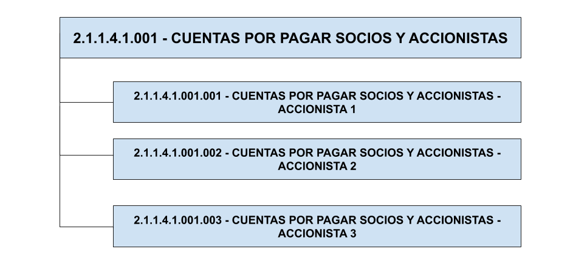

.. _ERPyA: http://erpya.com

.. |Dimensión Contable| image:: resources/Dimension-Accounting.png
.. _documento/dimensiones-contable:

=========================
**Dimensiones Contables**
=========================

La dimensión contable es una funcionalidad incorporada por ADempiere utilizada para asociar información haciendo un recuento de los elementos que componen cada dimensión. Puede definir dimensiones primarias o secundarias respecto a las principales para implementar metricas sumarias de cada una.

Estas dimensiones contables sustituyen cuentas auxiliares utilizadas comunmente por los contadores para visualizar en detalle saldos por ejemplo de socios de negocios que actuan como accionistas, para entenderlo mejor veamos el siguiente ejemplo:

Imaginemos una empresa que requiere ver el saldos contable de los pasivos de cada accionista de la empresa, para esto la empresa ha definido una cuentas llamada "**CUENTAS POR PAGAR SOCIOS Y ACCIONISTAS-MARTÍN PIÑEROS**" que muestra el detalle del pasivo del accionista **Martín Piñeros**. De esta forma, se agrega un nivel más al plan de cuentas, agregando tantas cuentas como accionistas existan, quedando de la siguiente forma:

    |Ejemplo de Dimensión|

    Imagen 1. Plan de cuentas con dimensiones

Sin embargo, ADempiere contempla una visión holistica y minimalista, que elimina la creación de las multiples cuentas detalles y a su vez sustituyendolas por las dimensiones contables, quedando de la siguiente forma:

    |Dimensión Contable|

    Imagen 2. Dimensión Contable

Las entidades con las que ADempiere permite dimensionar son las siguientes:

    #. Organización

    #. Socio de negocio

    #. Producto

    #. Región de Venta

    #. Actividad

    #. Proyecto

    #. Campaña

    #. Usuario1 (**Definición a criterio del cliente**)

    #. Usuario2 (**Definición a criterio del cliente**)

    #. Usuario3 (**Definición a criterio del cliente**)
