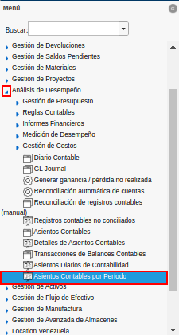
.. |Ventana Asientos Contables por Período| image:: resources/accounting-entries-by-period-window.png
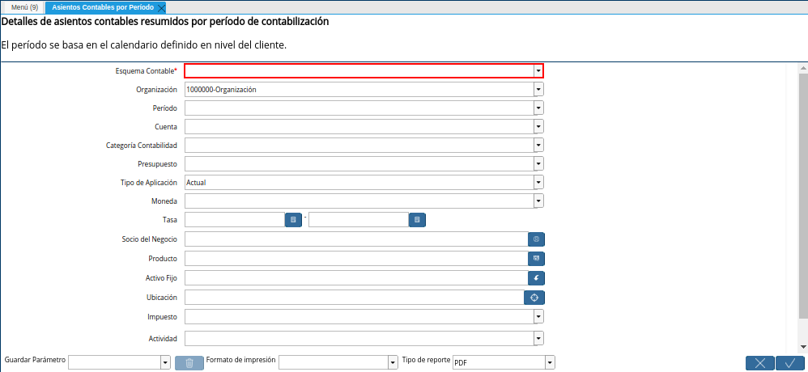
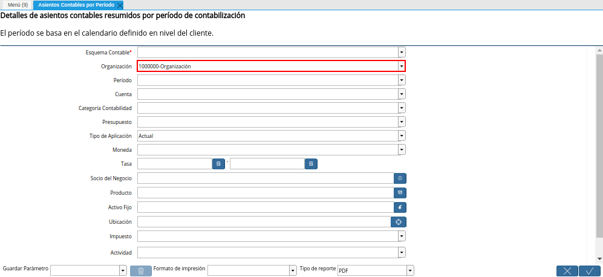
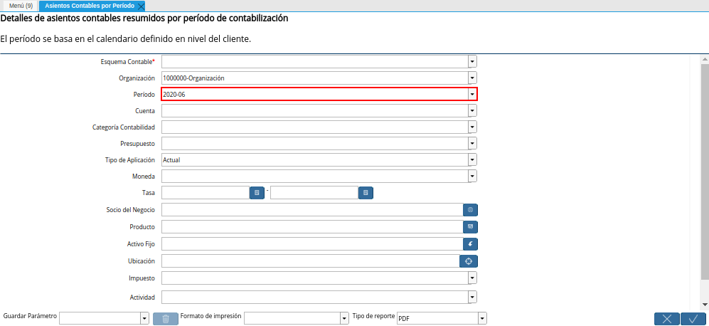
.. |Campo Cuenta de la Ventana Asientos Contables por Período| image:: resources/field-account-window-accounting-entries-by-period.png
.. |Campo Categoría Contabilidad de la Ventana Asientos Contables por Período| image:: resources/field-accounting-category-window-accounting-entries-by-period.png
.. |Campo Presupuesto de la Ventana Asientos Contables por Período| image:: resources/budget-field-of-the-accounting-entries-by-period-window.png
.. |Campo Tipo de Aplicación de la Ventana Asientos Contables por Período| image:: resources/field-application-type-of-the-accounting-entries-by-period-window.png
.. |Campo Moneda de la Ventana Asientos Contables por Período| image:: resources/field-currency-window-accounting-entries-by-period.png
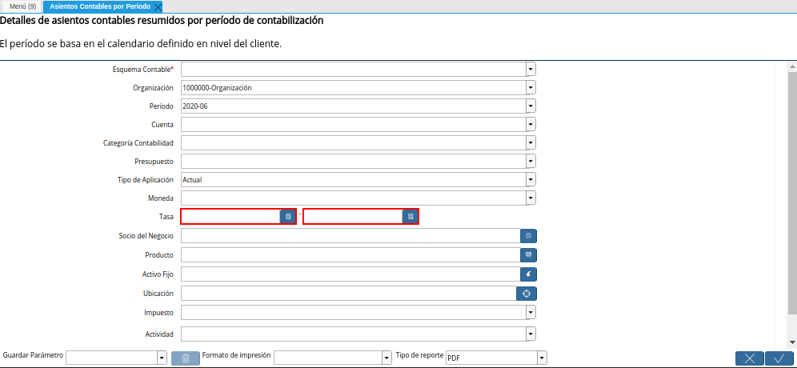
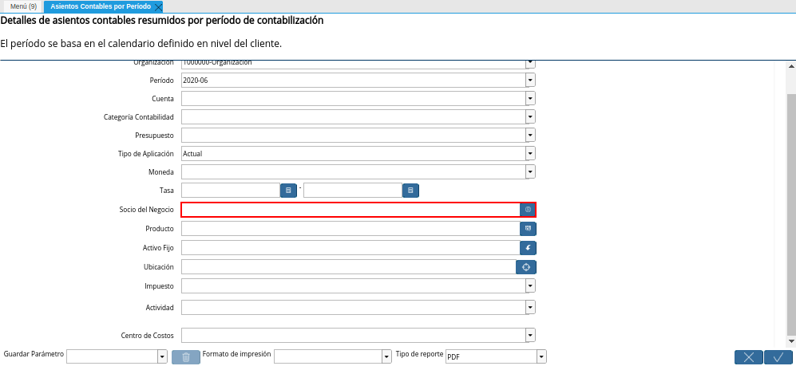
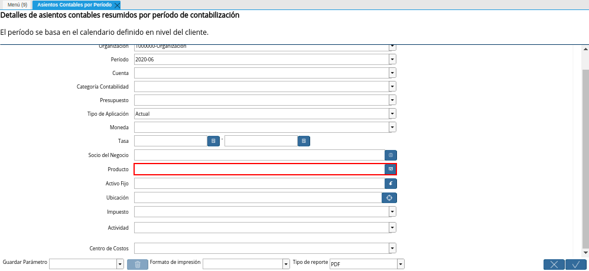
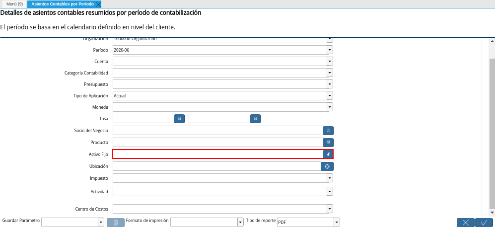
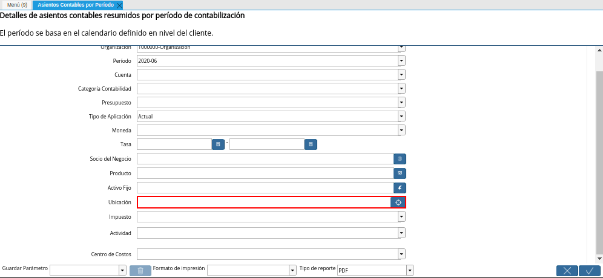
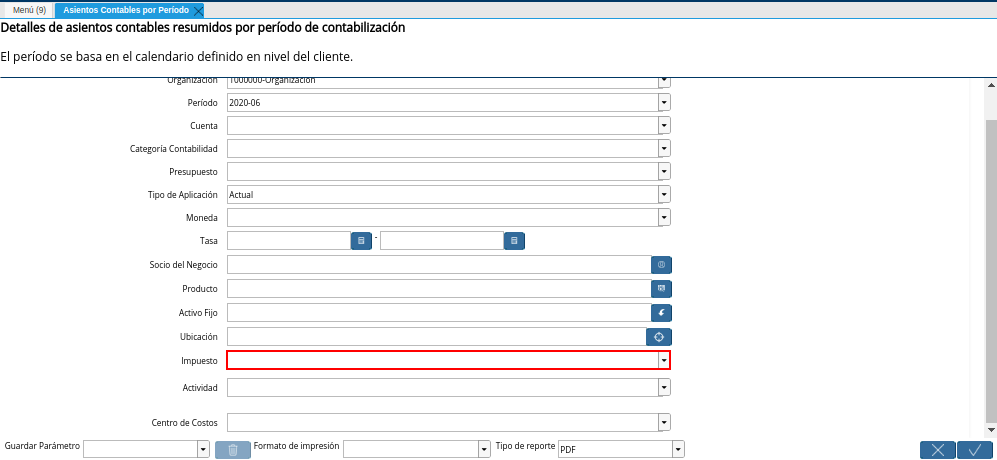
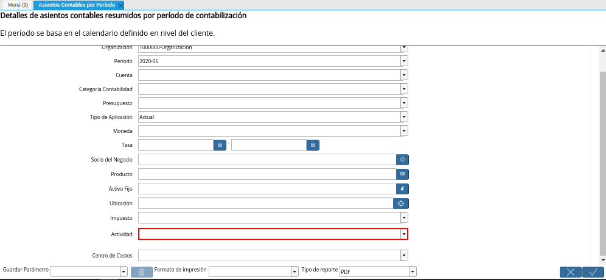
.. |Campo Centro de Costos de la Ventana Asientos Contables por Período| image:: resources/cost-center-window-field-journal-entries-by-period.png
.. |Opción OK de la Ventana Asientos Contables por Período| image:: resources/ok-option-of-the-accounting-entries-by-period-window.png
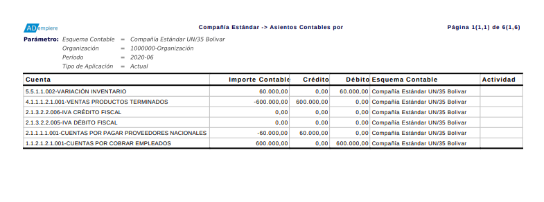

.. _documento/asiento-contable-por-período:

**Asientos Contables por Período**
==================================

 Ubique y seleccione en el menú de ADempiere, la carpeta "**Análisis de Desempeño**", luego seleccione el reporte "**Asientos Contables por Período**".

    |Menú de ADempiere|

    Imagen 1. Menú de ADempiere

 Podrá visualizar la ventana "**Asientos Contables por Período**", con diferentes campos que permiten filtrar la búsqueda de la información para generar el reporte requerido por el usuario.

    |Ventana Asientos Contables por Período|

    Imagen 2. Ventana Asientos Contables por Período

 Seleccione en el campo "**Esquema Contable**", el esquema contable por el cual requiere filtrar la búsqueda de la información.

    |Campo Esquema Contable de la Ventana Asientos Contables por Período|

    Imagen 3. Campo Esquema Contable de la Ventana Asientos Contables por Período

 Seleccione en el campo "**Organización**", la organización de la cual requiere generar el reporte "**Asientos Contables por Período**".

    |Campo Organización de la Ventana Asientos Contables por Período|

    Imagen 4. Campo Organización de la Ventana Asientos Contables por Período

 Seleccione en el campo "**Período**", el período por el cual requiere filtrar la búsqueda de la información.

    |Campo Período de la Ventana Asientos Contables por Período|

    Imagen 5. Campo Período de la Ventana Asientos Contables por Período

 Seleccione en el campo "**Cuenta**", la cuenta por la cual requiere filtrar la búsqueda de la información.

    |Campo Cuenta de la Ventana Asientos Contables por Período|

    Imagen 6. Campo Cuenta de la Ventana Asientos Contables por Período

 Seleccione en el campo "**Categoría Contabilidad**", la categoría de contabilidad por la cual requiere filtrar la búsqueda de la información.

    |Campo Categoría Contabilidad de la Ventana Asientos Contables por Período|

    Imagen 7. Campo Categoría Contabilidad de la Ventana Asientos Contables por Período

 Seleccione en el campo "**Presupuesto**", el presupuesto por el cual requiere filtrar la búsqueda de la información.

    |Campo Presupuesto de la Ventana Asientos Contables por Período|

    Imagen 8. Campo Presupuesto de la Ventana Asientos Contables por Período

 Seleccione en el campo "**Tipo de Aplicación**", el tipo de aplicación por el cual requiere filtrar la búsqueda de la información.

    |Campo Tipo de Aplicación de la Ventana Asientos Contables por Período|

    Imagen 9. Campo Tipo de Aplicación de la Ventana Asientos Contables por Período

 Seleccione en el campo "**Moneda**", la moneda por la cual requiere filtrar la búsqueda de la información.

    |Campo Moneda de la Ventana Asientos Contables por Período|

    Imagen 10. Campo Moneda de la Ventana Asientos Contables por Período

 Seleccione en el campo "**Tasa**", el rango de tasa, impuesto o conversión por el cual requiere filtrar la búsqueda.

    |Campo Tasa de la Ventana Asientos Contables por Período|

    Imagen 11. Campo Tasa de la Ventana Asientos Contables por Período

 Seleccione en el campo "**Socio del Negocio**", el socio del negocio por el cual requiere filtrar la búsqueda de la información.

    |Campo Socio del Negocio de la Ventana Asientos Contables por Período|

    Imagen 12. Campo Socio del Negocio de la Ventana Asientos Contables por Período

 Seleccione en el campo "**Producto**", el producto por el cual requiere filtrar la búsqueda de la información.

    |Campo Producto de la Ventana Asientos Contables por Período|

    Imagen 13. Campo Producto de la Ventana Asientos Contables por Período

 Seleccione en el campo "**Activo Fijo**", el activo fijo por el cual requiere filtrar la búsqueda de la información.

    |Campo Activo Fijo de la Ventana Asientos Contables por Período|

    Imagen 14. Campo Activo Fijo de la Ventana Asientos Contables por Período

 Seleccione en el campo "**Ubicación**", la ubicación por la cual requiere filtrar la búsqueda de la información.

    |Campo Ubicación de la Ventana Asientos Contables por Período|

    Imagen 15. Campo Ubicación de la Ventana Asientos Contables por Período

 Seleccione en el campo "**Impuesto**", el impuesto por el cual requiere filtrar la búsqueda de la información.

    |Campo Impuesto de la Ventana Asientos Contables por Período|

    Imagen 16. Campo Impuesto de la Ventana Asientos Contables por Período

 Seleccione en el campo "**Actividad**", la actividad por la cual requiere filtrar la búsqueda de la información.

    |Campo Actividad de la Ventana Asientos Contables por Período|

    Imagen 17. Campo Actividad de la Ventana Asientos Contables por Período 

 Seleccione en el campo "**Centro de Costos**", el centro de costos por el cual requiere filtrar la búsqueda de la información.

    |Campo Centro de Costos de la Ventana Asientos Contables por Período|

    Impuesto 18. Campo Centro de Costos de la Ventana Asientos Contables por Período

 Seleccione la opción "**OK**" para generar el reporte "**Asientos Contables por Período**" en base a lo seleccionado en los campos explicados anteriormente.

    |Opción OK de la Ventana Asientos Contables por Período|

    Imagen 19. Opción OK de la Ventana Asientos Contables por Período

 Podrá visualizar de la siguiente manera el reporte "**Asientos Contables por Período**".

    |Reporte Asientos Contables por Período|

    Imagen 20. Reporte Asientos Contables por Período