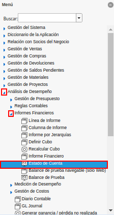
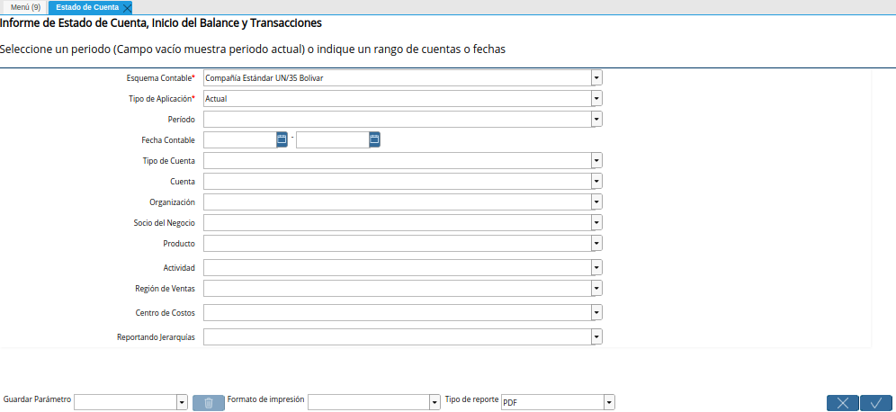
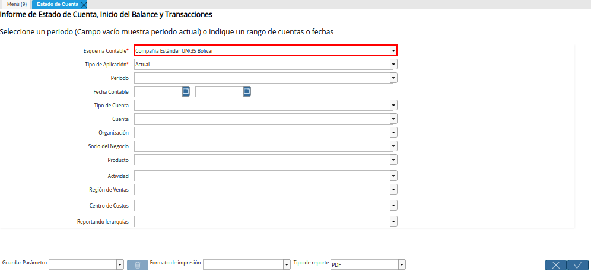
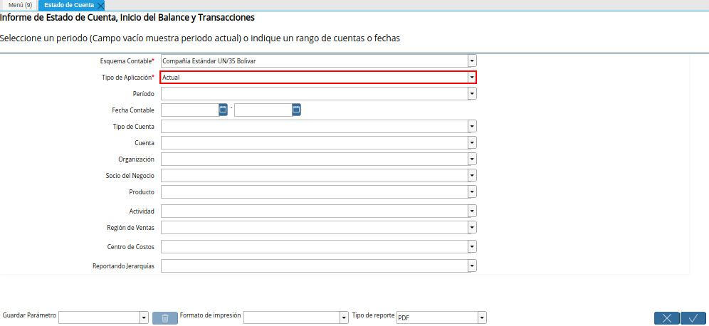
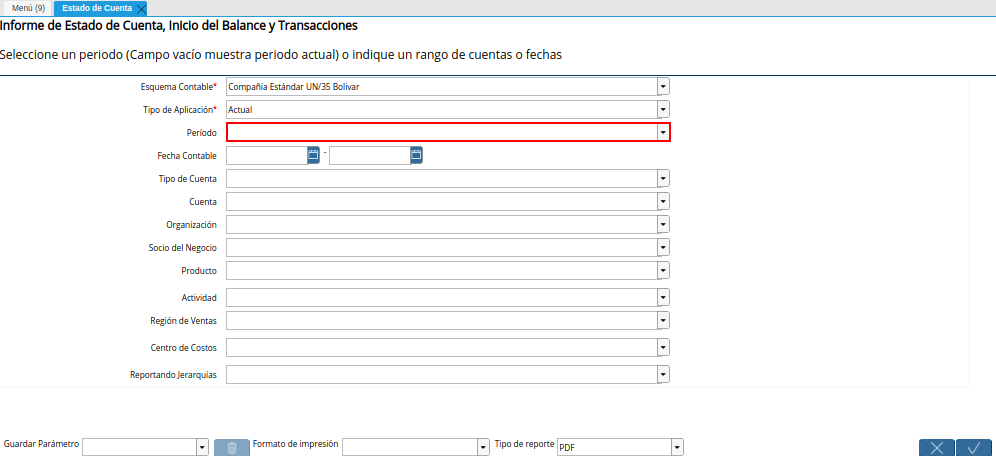
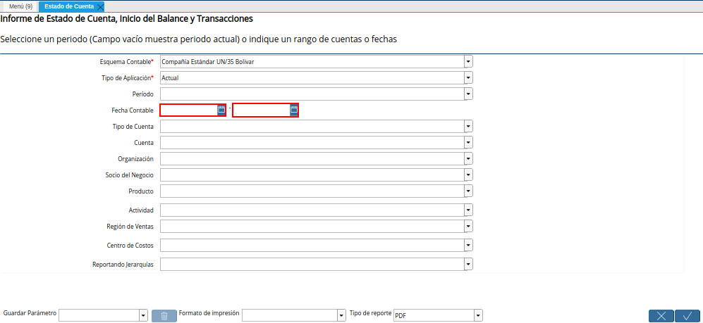
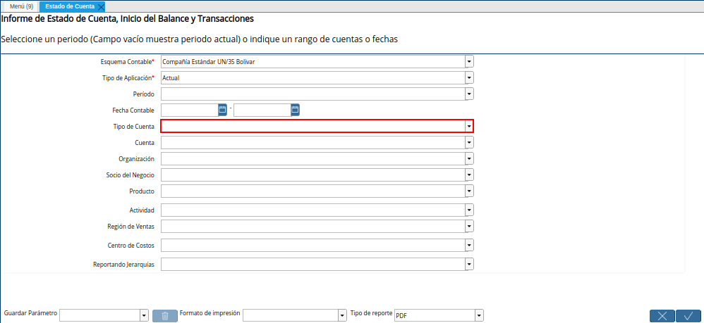
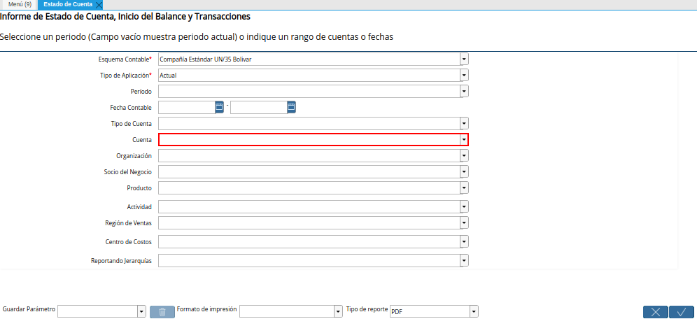
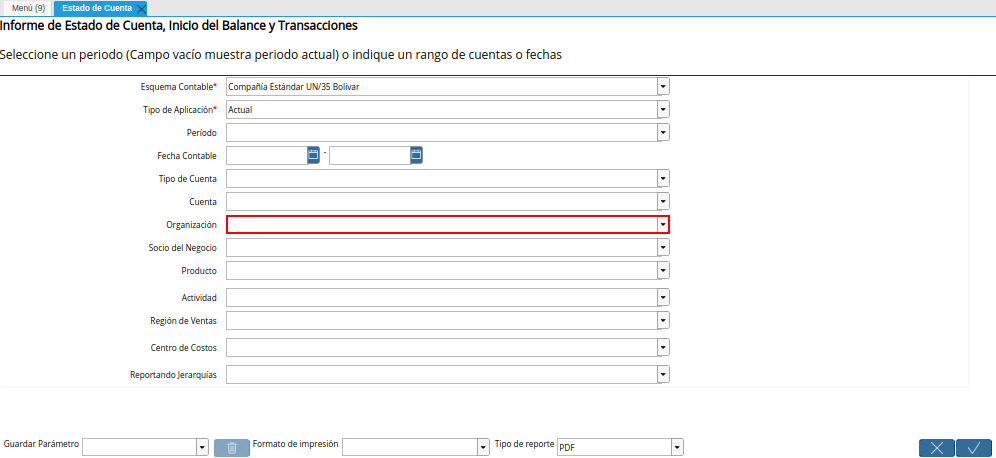
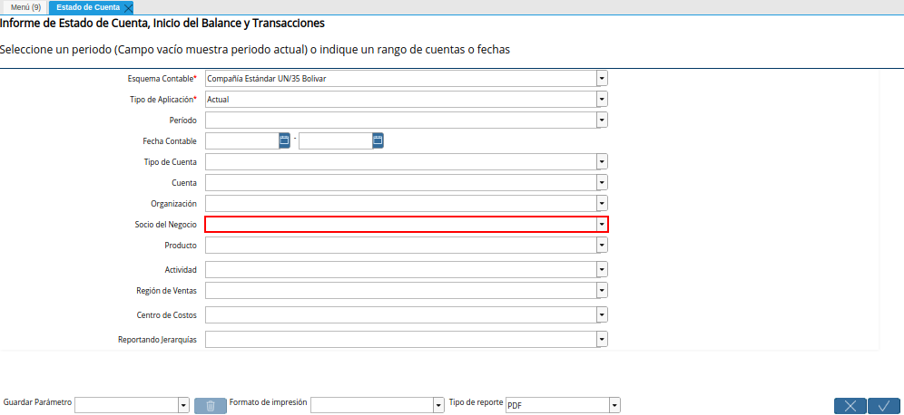
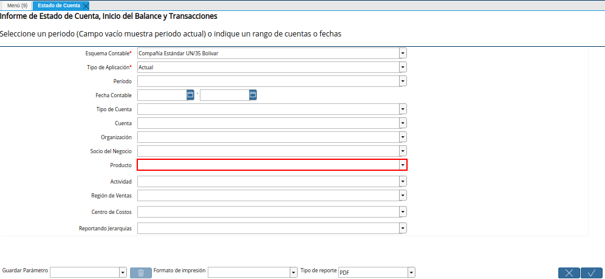
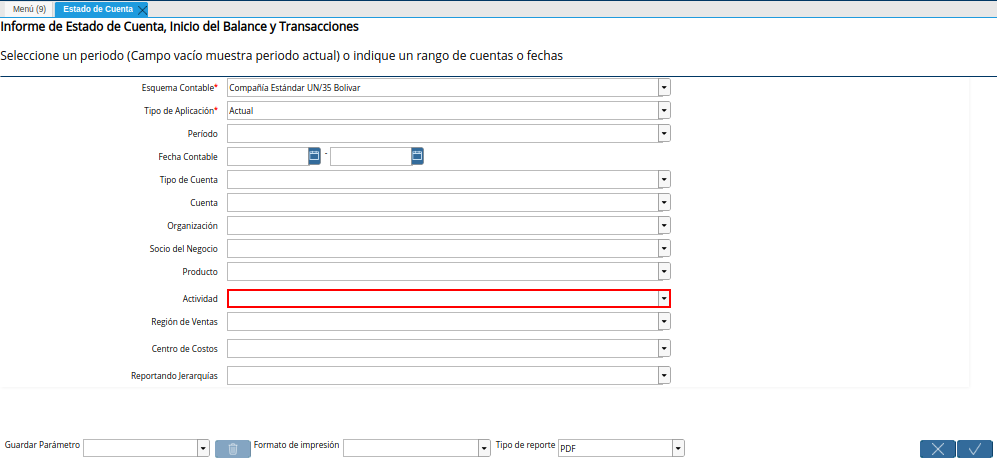
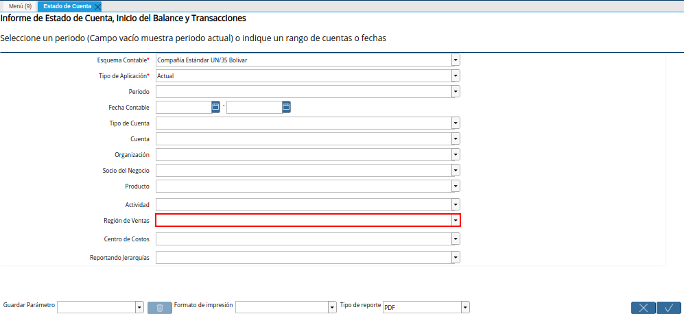
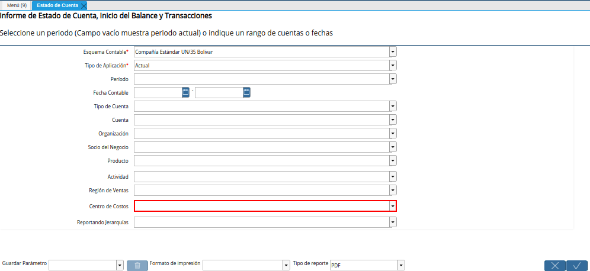
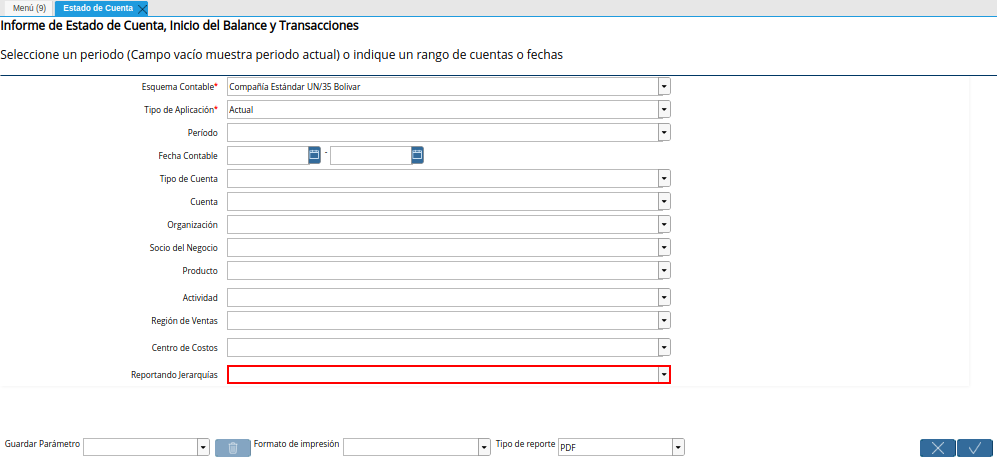
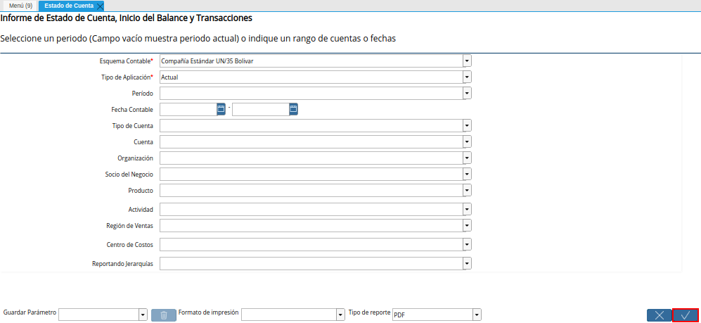
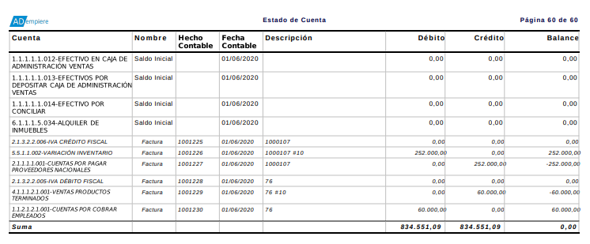

.. _documento/estado-de-cuenta:

**Estado de Cuenta**
====================

- Para generar un estado de cuenta el usuario debe ubicarse en el menú de ADempiere. Debe seleccionar la carpeta "**Análisis de Desempeño**", luego debe seleccionar la carpeta "**Informes Financieros**" y por último el reporte "**Estado de Cuenta**".

    |Menú de ADempiere|

    Imagen 1. Menú de ADempiere

- Podrá visualizar la ventana del reporte "**Estado de Cuenta**", con diferentes campos que le permiten al usuario en base a lo seleccionado, generar el reporte según lo requerido por el mismo.

    |Ventana Estado de Cuenta|

    Imagen 2. Ventana Estado de Cuenta

    .. note::

        Un reporte de estado de cuenta permite generar un informe detallado de las transacciones de una empresa, el mismo puede ser generado en base a las restricciones que sean seleccionadas en los diferentes campos que contiene la ventana "**Estado de Cuenta**". 

- Seleccione en el campo "**Esquema Contable**", el esquema contable previamente definido para contabilizar las cuentas.

    |Campo Esquema Contable de la Ventana Estado de Cuenta|

    Imagen 3. Campo Esquema Contable de la Ventana Estado de Cuenta

- Seleccione en el campo **Tipo de Aplicación**, el tipo de aplicación por el cual requiere filtrar la información.

    |Campo Tipo de Aplicación de la Ventana Estado de Cuenta|

    Imagen 4. Campo Tipo de Aplicación de la Ventana Estado de Cuenta

- Seleccione en el campo "**Período**", el rango de tiempo para filtrar la búsqueda de la información.

    |Campo Período de la Ventana Estado de Cuenta|

    Imagen 5. Campo Período de la Ventana Estado de Cuenta

- Seleccione en el campo "**Fecha Contable**", el rango de tiempo en el cual fueron realizadas las transacciones y de las cuales requiere el reporte. 

    |Campo Fecha Contable de la Ventana Estado de Cuenta|

    Imagen 6. Campo Fecha Contable de la Ventana Estado de Cuenta

- Seleccione en el campo "**Tipo de Cuenta**", el tipo de cuenta para filtrar la búsqueda de la información.

    |Campo Tipo de Cuenta de la Ventana Estado de Cuenta|

    Imagen 7. Campo Tipo de Cuenta de la Ventana Estado de Cuenta

- Seleccione en el campo "**Cuenta**", la cuenta de la cual requiere el reporte.

    |Campo Cuenta de la Ventana Estado de Cuenta|

    Imagen 8. Campo Cuenta de la Ventana Estado de Cuenta

- Seleccione en el campo **Organización**, la organización para la cual esta generando el reporte de estado de cuenta. 

    |Campo Organización de la Ventana Estado de Cuenta|

    Imagen 9. Campo Organización de la Ventana Estado de Cuenta

- Seleccione en el campo "**Socio del Negocio**", el socio del negocio por el cual requiere filtrar la información.

    |Campo Socio del Negocio de la Ventana Estado de Cuenta|

    Imagen 10. Campo Socio del Negocio de la Ventana Estado de Cuenta

- Seleccione en el campo "**Producto**", el producto por el cual requiere filtrar la información. 

    |Campo Producto de la Ventana Estado de Cuenta|

    Imagen 11. Campo Producto de la Ventana Estado de Cuenta

- Seleccione en el campo "**Actividad**", la actividad por la cual requiere filtrar la información.

    |Campo Actividad de la Ventana Estado de Cuenta|

    Imagen 12. Campo Actividad de la Ventana Estado de Cuenta
    
- Seleccione en el campo **Región de Ventas**, la región de ventas por la cual requiere filtrar la información.

    |Campo Región de Ventas de la Ventana Estado de Cuenta|

    Imagen 13. Campo Región de Ventas de la Ventana Estado de Cuenta

- Seleccione en el campo **Centro de Costos**, el centro de costos por la cual requiere filtrar la información.

    |Campo Centro de Costos de la Ventana Estado de Cuenta|

    Imagen 14. Campo Centro de Costos de la Ventana Estado de Cuenta

- Seleccione en el campo **Reportando Jerarquías**, la erarquía por la cual requiere filtrar la información.

    |Campo Reportando Jerarquías de la Ventana Estado de Cuenta|

    Imagen 15. Campo Reportando Jerarquías de la Ventana Estado de Cuenta

- Seleccione la opción "**OK**" para generar el reporte de estado de cuenta.

    |Opción OK de la Ventana Estado de Cuenta|
    
    Imagen 16. Opción OK de la ventana Estado de Cuenta

- Podrá visualizar el reporte "**Estado de Cuenta**" de la siguiente manera.

    |Reporte Estado de Cuenta|

    Imagen 17. Reporte Estado de Cuenta