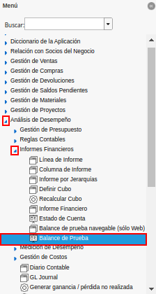
.. |Ventana Reporte Balance de Prueba| image:: resources/trial-balance-report-window.png
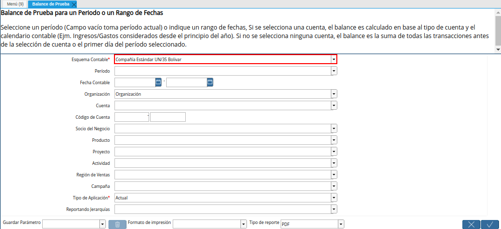
.. |Campo Período de la Ventana Balance de Prueba| image:: resources/trial-balance-window-period-field.png
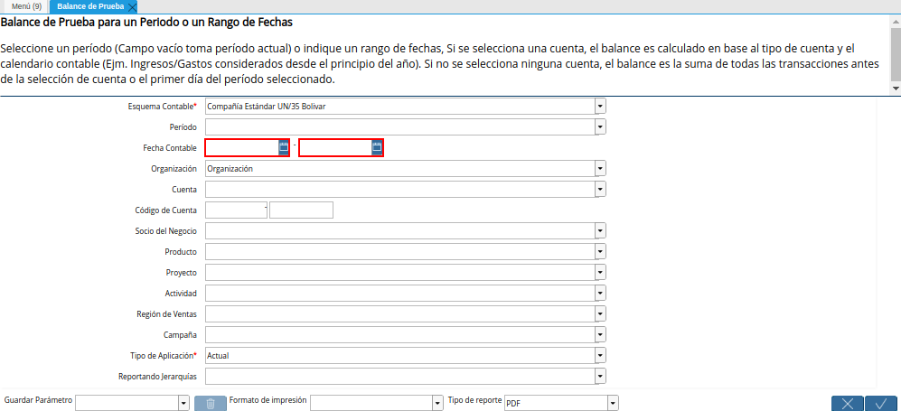
.. |Campo Organización de la Ventana Balance de Prueba| image:: resources/field-organization-of-the-test-balance-window.png
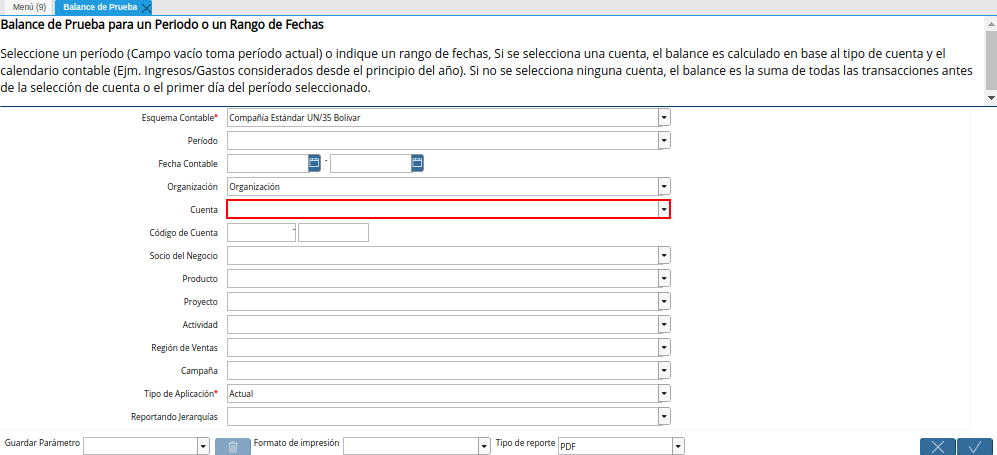
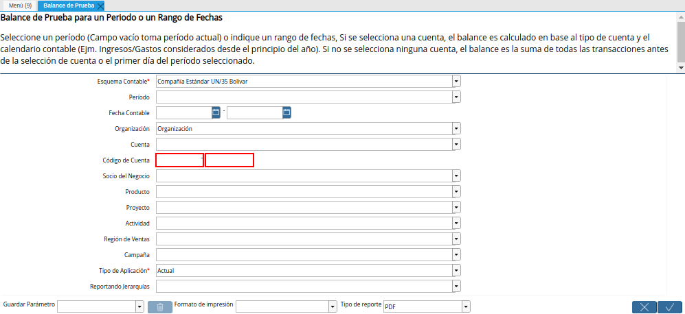
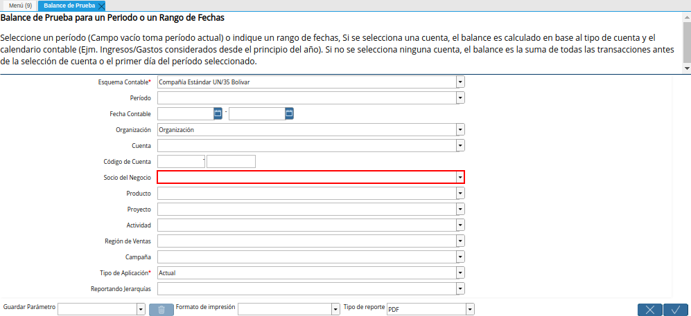
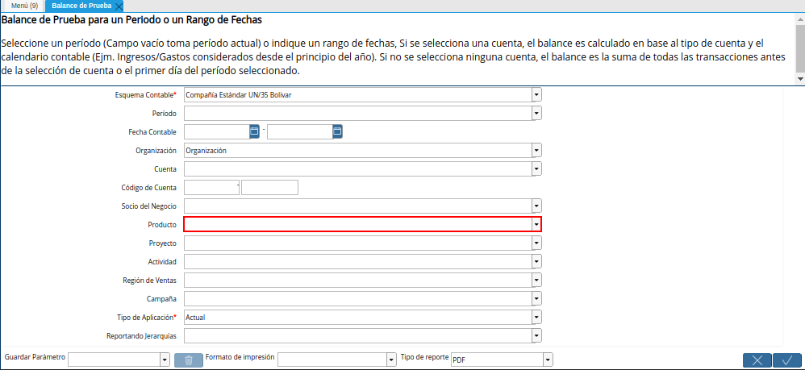
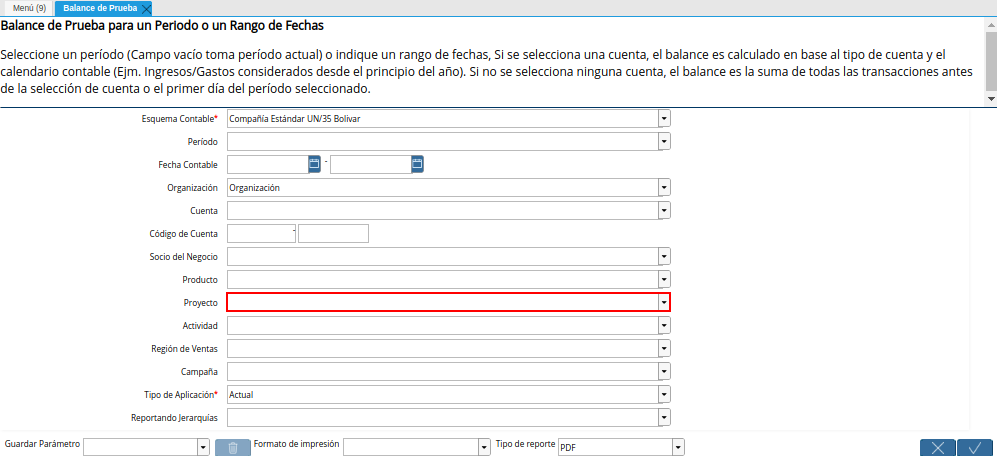
.. |Campo Actividad de la Ventana Balance de Prueba| image:: resources/test-balance-window-activity-field.png
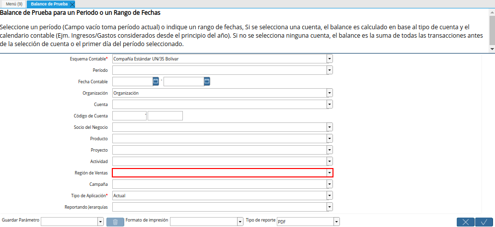
.. |Campo Campaña de la Ventana Balance de Prueba| image:: resources/campaign-field-of-the-trial-balance-window.png
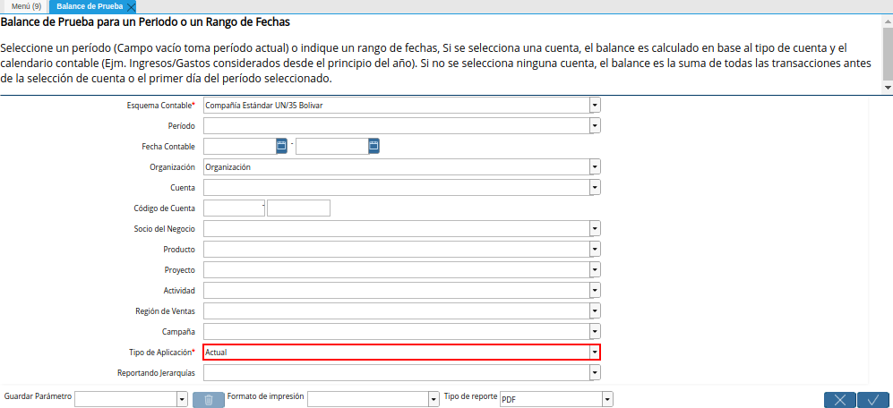
.. |Campo Reportando Jerarquías de la Ventana Balance de Prueba| image:: resources/field-reporting-hierarchies-of-the-trial-balance-window.png
.. |Opción Ok de la Ventana Balance de Prueba| image:: resources/trial-balance-window-ok-option.png
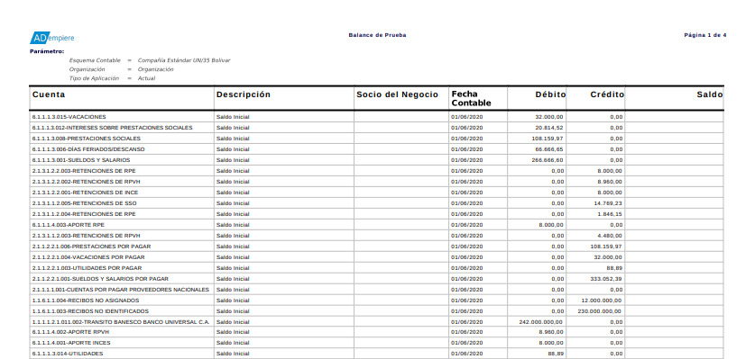

.. _documento/balance-de-prueba:

**Balance de Prueba**
=====================

- Ubique y seleccione en el menú de ADempiere, la carpeta "**Análisis de Desempeño**", luego seleccione la carpeta "**Informes Financieros**", por último seleccione el reporte "**Balance de Prueba**".

    |Menú de ADempiere|

    Imagen 1. Menú de ADempiere

- Podrá visualizar la ventana del reporte "**Balance de Prueba**", con diferentes campos que le permiten al usuario filtrar la búsqueda de la información para generar el reporte requerido.

    |Ventana Reporte Balance de Prueba|

    Imagen 2. Ventana Reporte Balance de Prueba

- Seleccione en el campo "**Esquema Contable**", el esquema contable por el cual requiere filtrar la información.

    |Campo Esquema Contable de la Ventana Balance de Prueba|

    Imagen 3. Campo Esquema Contable de la Ventana Balance de Prueba

- Seleccione en el campo "**Período**", el periodo por el cual requiere filtrar la información.

    |Campo Período de la Ventana Balance de Prueba|

    Imagen 4. Campo Período de la Ventana Balance de Prueba

- Seleccione en el campo "**Fecha Contable**", el rango de fecha por el cual requiere filtrar la información.

    |Campo Fecha Contable de la Ventana Balance de Prueba|

    Imagen 5. Campo Fecha Contable de la Ventana Balance de Prueba

- Seleccione en el campo "**Organización**", la organización por la cual requiere filtrar la información.

    |Campo Organización de la Ventana Balance de Prueba|

    Imagen 6. Campo Organización de la Ventana Balance de Prueba

- Seleccione en el campo "**Cuenta**", la cuenta por la cual requiere filtrar la información.

    |Campo Cuenta de la Ventana Balance de Prueba|

    Imagen 7. Campo Cuenta de la Ventana Balance de Prueba

- Introduzca en el campo "**Código de Cuenta**", el código de la cuenta por el cual requiere filtrar la información.

    |Campo Código de Cuenta de la Ventana Balance de Prueba|

    Imagen 8. Campo Código de Cuenta de la Ventana Balance de Prueba

- Seleccione en el campo "**Socio del Negocio**", el socio del negocio por el cual requiere filtrar la información.

    |Campo Socio del Negocio de la Ventana Balance de Prueba|

    Imagen 9. Campo Socio del Negocio de la Ventana Balance de Prueba

- Seleccione en el campo "**Producto**", el producto por el cual requiere filtrar la información.

    |Campo Producto de la Ventana Balance de Prueba|

    Imagen 10. Campo Producto de la Ventana Balance de Prueba

- Seleccione en el campo "**Proyecto**", el proyecto por el cual requiere filtrar la información.

    |Campo Proyecto de la Ventana Balance de Prueba|

    Imagen 11. Campo Proyecto de la Ventana Balance de Prueba

- Seleccione en el campo "**Actividad**", la actividad por la cual requiere filtrar la información.

    |Campo Actividad de la Ventana Balance de Prueba|

    Imagen 12. Campo Actividad de la Ventana Balance de Prueba

- Seleccione en el campo "**Región de Ventas**", la región de ventas por la cual requiere filtrar la información.

    |Campo Región de Ventas de la Ventana Balance de Prueba|

    Imagen 13. Campo Región de Ventas de la Ventana Balance de Prueba

- Seleccione en el campo "**Campaña**", la campaña por la cual requiere filtrar la información.

    |Campo Campaña de la Ventana Balance de Prueba|

    Imagen 14. Campo Campaña de la Ventana Balance de Prueba

- Seleccione en el campo "**Tipo de Aplicación**", el tipo de aplicación por el cual requiere filtrar la información.

    |Campo Tipo de Aplicación de la Ventana Balance de Prueba|

    Imagen 15. Campo Tipo de Aplicación de la Ventana Balance de Prueba

- Seleccione en el campo "**Reportando Jerarquías**", la jerarquía por la cual requiere filtrar la información.

    |Campo Reportando Jerarquías de la Ventana Balance de Prueba|

    Imagen 16. Campo Reportando Jerarquías de la Ventana Balance de Prueba

- Seleccione la opción "**OK**" para generar el reporte "**Balance de Prueba**" en base a lo seleccionado en los diferentes campos que contempla la ventana.

    |Opción Ok de la Ventana Balance de Prueba|

    Imagen 17. Opción OK de la Ventana Balance de Prueba

- Podrá visualizar el reporte "**Balance de Prueba**", de la siguiente manera.

    |Reporte Balance de Prueba|

    Imagen 18. Reporte Balance de Prueba
