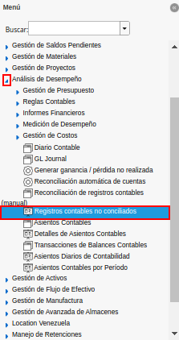
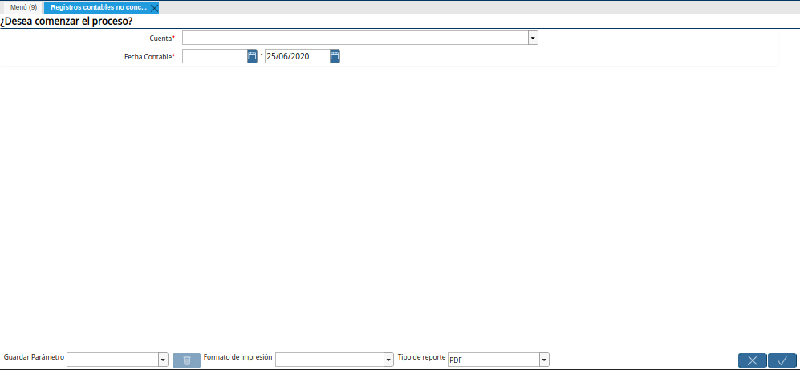
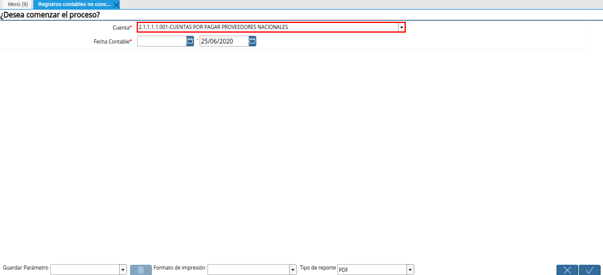
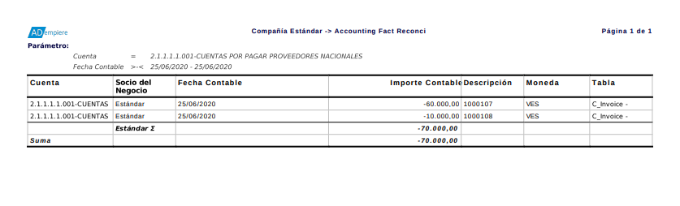

.. |Campo Fecha Contable de la Ventana Registros Contables No Conciliados| image:: resources/accounting-date-field-in-the-unreconciled-accounting-records-window.png
.. |Opción OK de la Ventana Registros Contables No Conciliados| image:: resources/unaccounted-accounting-records-window-ok-option.png

.. _documento/registros-contables-no-conciliados:

**Registros Contables No Conciliados**
======================================

- Ubique y seleccione en el menú de ADempiere, la carpeta "**Análisis de Desempeño**", luego seleccione el reporte "**Registros Contables No Conciliados**".

    |Menú de ADempiere|

    Imagen 1. Menú de ADempiere

- Podrá visualizar la ventana "**Registros Contables No Conciliados**", con diferentes campos que permiten filtrar la información para generar el reporte requerido.

    |Ventana Registros Contables No Conciliados|

    Imagen 2. Ventana Registros Contables No Conciliados

- Seleccione en el campo "**Cuenta**", la cuenta contable por la cual requiere filtrar la búsqueda de la información.

    |Campo Cuenta de la Ventana Registros Contables No Conciliados|

    Imagen 3. Campo Cuenta de la Ventana Registros Contables No Conciliados

- Seleccione en el campo "**Fecha Contable**", el rango de fechas en las que se realizaron los movimientos.

    |Campo Fecha Contable de la Ventana Registros Contables No Conciliados|

    Imagen 4. Campo Fecha Contable de la Ventana Registros Contables No Conciliados

- Seleccione la opción "**OK**", para generar el reporte "**Registros Contables No Conciliados**" en base a lo seleccionado en los campos explicados anteriormente.

    |Opción OK de la Ventana Registros Contables No Conciliados|

    Imagen 5. Opción OK de la Ventana Registros Contables No Conciliados

- Podrá visualizar de la siguiente manera el reporte "**Registros Contables No Conciliados**".

    |Reporte Registros Contables No Conciliados|

    Imagen 6. Reporte de Registros Contables No Conciliados