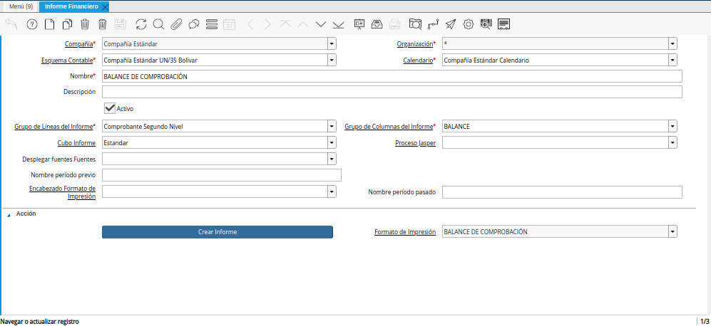

.. _ERPyA: http://erpya.com
.. |Menú de ADempiere| image:: resources/financial-report-menu.png

.. _documento/informe-financiero:

**Informe Financiero**
======================

#. Para generar un informe financiero el usuario debe ubicarse en el menú de ADempiere. Debe seleccionar la carpeta "**Análisis de Desempeño**", luego debe seleccionar la carpeta "**Informes Financieros**" y por último la ventana "**Informe Financiero**".

    |Menú de ADempiere|

    Imagen 1. Menú de ADempiere

    .. note::
    
        Dicha ventana cuenta con tres diferentes formatos de impresión previamente configurados por `ERPyA`_ y explicados en el documento :ref:`documento/informe-financiero-configurado`, con la finanlidad de que el usuario pueda visualizar tres diferentes informes que se adapten a los requerimientos del mismo.

#. El reporte de informe financiero es generado a través de la selección del proceso "**Crear Informe Financiero**", el cual se encuentra ubicado en la parte inferior de la ventana "**Informe Financiero**". 

    |Ventana Informe Financiero|

    Imagen 2. Ventana Informe Financiero

#. Al seleccionar el proceso, el usuario podrá visualizar la ventana "**Crear Informe**". Dicha ventana cuenta con diferentes campos que permiten filtrar la información en base a los campos que sean seleccionados.

    Por defecto la ventana contiene precargada la información del mes anterior en el campo período. De igual forma, no es obligatorio seleccionar ninguna información en otro campo de la ventana, sin embargo, se explica a continuación la utilidad de cada uno de dichos campos:

        - **Campo Período**: Le indica a ADempiere el rango de tiempo para la búsqueda de la información.

        - **Campo Organización**: Le indica a ADempiere la organización de la cual requiere el usuario la información.

        - **Socio del Negocio**: Permite filtrar la búsqueda de la información por el socio del negocio cliente, proveedor o empleado seleccionado, que se encuentre relacionado con las transacciones contempladas en el informe financiero que se requiere generar.

        - **Producto**: Permite filtrar la búsqueda de la información por el producto seleccionado, utilizado en alguna de la transacciones contempladas en el informe financiero que se requiere generar.

        - **Actividad**: Permite filtrar la búsqueda de la información por la actividad involucrada en alguna de las transacciones contempladas en el informe financiero que requiere generar.

        - **Región de Ventas**: Permite filtrar la búsqueda de la información por el área de cobertura de ventas involucrada en alguna de las transacciones contempladas en el informe financiero que requiere generar.

        - **Centro de Costos**: Permite filtrar la búsqueda de la información por el centro de costo involucrado en alguna de las transacciones contempladas en el informe financiero que requiere generar.

        - **Tipo de Aplicación**: Permite filtrar la búsqueda de la información por el tipo de aplicación involucrado en alguna de las transacciones contempladas en el informe financiero que requiere generar.

        - **Desplegar fuentes Fuentes**: Permite listar las cuentas fuentes para las cuentas totales seleccionadas. Al dejar el campo en blanco, ADempiere toma el valor "**Si**" por defecto, listando las cuentas en el informe financiero que requiere generar. La selección de la opción "**Si**" en este campo habilita el campo "**Lista Transacciones**".

            - **Lista Transacciones**: Permite listar los documentos involucrados en las transacciones contempladas en el informe financiero que requiere generar.

        - **Listas Fuentes Primero**: Organiza las cuentas fuentes primero y luego las cuentas generales (Activo, Pasivo, Patrimonio, Ingresos, Costos, Egresos, Otros Ingresos, Otros Egresos, Control).

        - **Reportando Jerarquias**: Indica en que orden de jerarquías se organizará el informe financiero que requiere generar. Al dejar el campo en blanco, se organizará en el orden de jerarquías predeterminado en ADempiere.

        - **Cubo Informe**: Permite guardar en la memoria de ADempiere el primer informe financiero generado, para una rapida ejecución la próxima vez que sea generado el informe.

    Luego de verificar los campos que contiene la ventana, el usuario debe seleccionar la opción "**OK**", para que sea generado el informe.

    |Ventana Crear Informe|

    Imagen 3. Ventana Crear Informe

#. A continuación podrá visualizar los tres diferentes informes financieros que pueden ser generados desde dicha ventana.