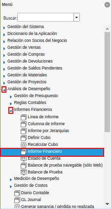
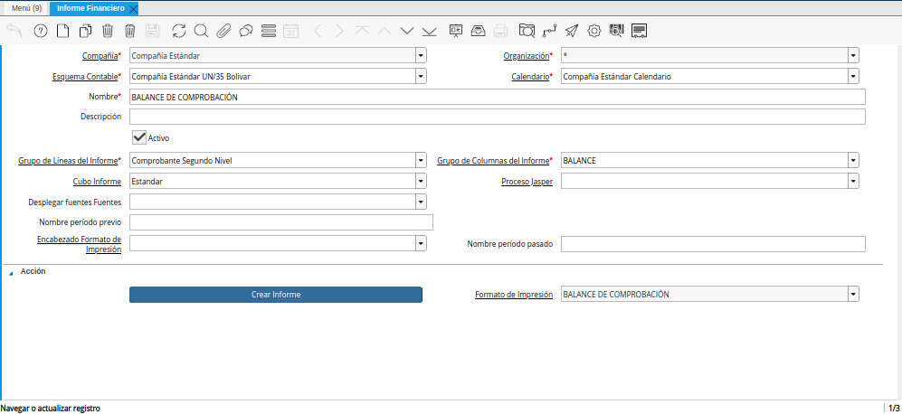
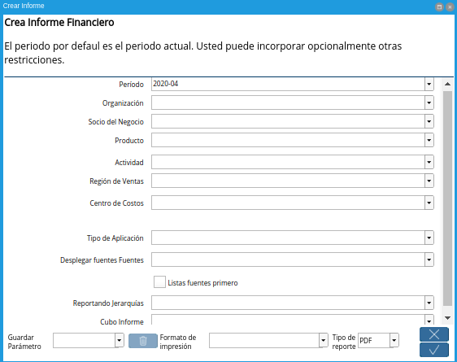

.. _ERPyA: http://erpya.com

.. _documento/informe-financiero:

**Informe Financiero**
======================

#. Para generar un informe financiero el usuario debe ubicarse en el menú de ADempiere. Debe seleccionar la carpeta "**Análisis de Desempeño**", luego debe seleccionar la carpeta "**Informes Financieros**" y por último la ventana "**Informe Financiero**".

    |Menú de ADempiere|

    Imagen 1. Menú de ADempiere

    .. note::
    
        Dicha ventana cuenta con tres diferentes formatos de impresión previamente configurados por `ERPyA`_ y explicados en el documento :ref:`documento/informe-financiero-configurado`, con la finanlidad de que el usuario pueda visualizar tres diferentes informes que se adapten a los requerimientos del mismo.

#. El reporte de informe financiero es generado a través de la selección del proceso "**Crear Informe Financiero**", el cual se encuentra ubicado en la parte inferior de la ventana "**Informe Financiero**". 

    |Ventana Informe Financiero|

    Imagen 2. Ventana Informe Financiero

#. Al seleccionar el proceso, el usuario podrá visualizar la ventana "**Crear Informe**". Dicha ventana cuenta con diferentes campos que permiten filtrar la información en base a los campos que sean seleccionados.

    Por defecto la ventana contiene precargada la información del mes anterior en el campo periodo. De igual forma, no es necesario seleccionar ninguna información en otro campo de la ventana. 

    Luego de verificar los campos que contiene la ventana, el usuario debe seleccionar la opción "**OK**", para que sea generado el informe.

    |Ventana Crear Informe|

    Imagen 3. Ventana Crear Informe

#. A continuación podrá visualizar los tres diferentes informes financieros que pueden ser generados desde dicha ventana.