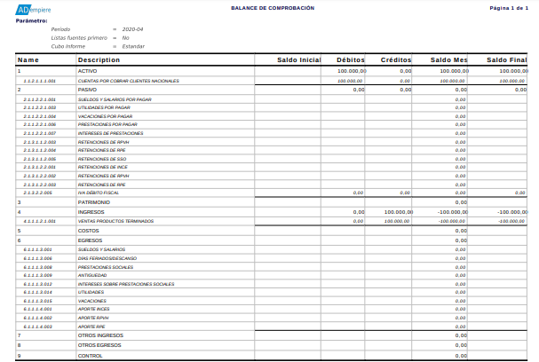

.. _ERPyA: http://erpya.com

.. _documento/balance-comprobación:

**Balance de Comprobación**
===========================

Un informe financiero de balance de comprobación es un reporte que muestra los débitos, créditos y los saldos iniciales y finales de las cuentas.

Para generar el reporte, debe realizar el procedimiento explicado en el documento :ref:`documento/informe-financiero`, elaborado por `ERPyA`_. Luego de que haya culminado el procedimiento, podrá visualizar la ventana "**Informe**" con el reporte financiero "**Balance de Comprobación**". 

    |Primer Reporte|

    Imagen 3. Balance de Comprobación

.. note::

    El reporte de balance de comprobación muestra la información en base al periodo de tiempo seleccionado en el campo "**Periodo**" de la ventana "**Crear Informe**". 
