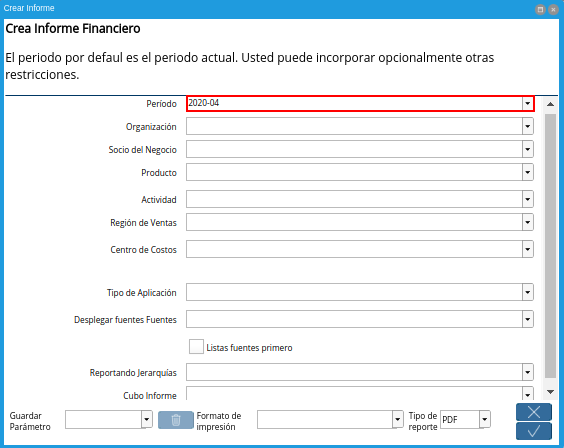
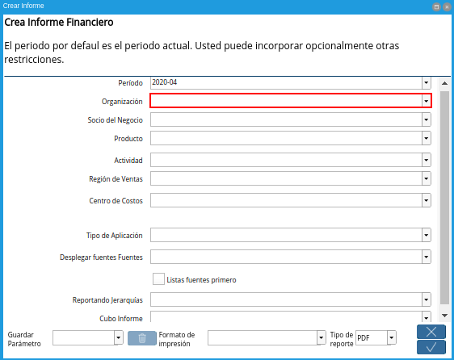
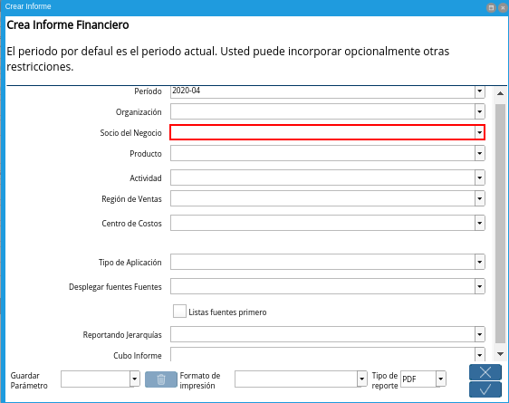
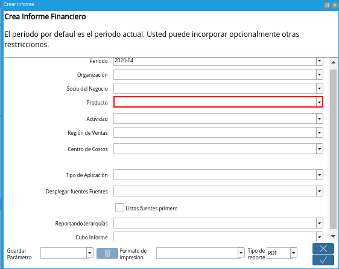
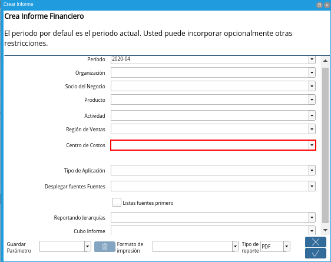
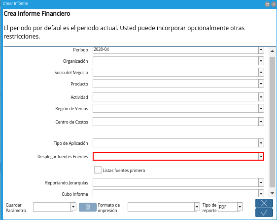

.. _ERPyA: http://erpya.com
.. |Menú de ADempiere| image:: resources/financial-report-menu.png
.. |Ventana Informe Financiero| image:: resources/financial-report-window.png

.. |Campo Actividad| image:: resources/financial-reporting-activity-field.png
.. |Campo Región de Ventas| image:: resources/sales-region-field-of-the-financial-report.png

.. |Campo Tipo de Aplicación| image:: resources/field-of-application-of-the-financial-report.png

.. |Campo Lista Transacciones| image:: resources/financial-report-transaction-list-field.png

.. |Campo Reportando Jerarquías| image:: resources/field-reporting-hierarchies-of-financial-reporting.png
.. |Campo Cubo Informe| image:: resources/financial-report-cube-field.png
.. |Ventana Crear Informe| image:: resources/create-report-window.png

.. _documento/informe-financiero:

**Informe Financiero**
======================

#. Para generar un informe financiero el usuario debe ubicarse en el menú de ADempiere. Debe seleccionar la carpeta "**Análisis de Desempeño**", luego debe seleccionar la carpeta "**Informes Financieros**" y por último la ventana "**Informe Financiero**".

    |Menú de ADempiere|

    Imagen 1. Menú de ADempiere

    .. note::
    
        Dicha ventana cuenta con tres diferentes formatos de impresión previamente configurados por `ERPyA`_ y explicados en los documentos :ref:`documento/balance-comprobación`, :ref:`documento/balance-general` y :ref:`documento/estado-resultado`, con la finanlidad de que el usuario pueda visualizar tres diferentes informes que se adapten a los requerimientos del mismo.

#. El reporte de informe financiero es generado a través de la selección del proceso "**Crear Informe**", el cual se encuentra ubicado en la parte inferior de la ventana "**Informe Financiero**". 

    |Ventana Informe Financiero|

    Imagen 2. Ventana Informe Financiero

#. Al seleccionar el proceso, el usuario podrá visualizar la ventana "**Crear Informe**". Dicha ventana cuenta con diferentes campos que permiten filtrar la información en base a los campos que sean seleccionados.

    .. warning::
    
        Por defecto la ventana contiene precargada la información del mes anterior en el campo período. De igual forma, no es obligatorio seleccionar ninguna información en otro campo de la ventana.

    #. Seleccione en el campo "**Período**", el rango de tiempo para filtrar la búsqueda de la información.

        |Campo Período|

        Imagen 3. Campo Período

    #. Seleccione en el campo **Organización**, la organización para la cual esta realizando el informe financiero.

        |Campo Organización|

        Imagen 4. Campo Organización

    #. Seleccione en el campo **Socio del Negocio**, el socio del negocio cliente, proveedor o empleado, por el cual se requiere filtrar la búsqueda de la información.

        |Campo Socio del Negocio|

        Imagen 5. Campo Socio del Negocio

    #. Seleccione en el campo **Producto**, el producto por el cual se requiere filtrar la búsqueda de la información.

        |Campo Producto|

        Imagen 6. Campo Producto

    #. Seleccione en el campo **Actividad**, la actividad utilizada en las transacciones y por la cual se requiere filtrar la búsqueda de la información.

        |Campo Actividad|

        Imagen 7. Campo Actividad

    #. Seleccione en el campo **Región de Ventas**, el área de cobertura de ventas involucrada en las transacciones y por la cual se requiere filtrar la información.

        |Campo Región de Ventas|

        Imagen 8. Campo Región de Ventas

    #. Seleccione en el campo **Centro de Costos**, el centro de costo por el cual requiere filtrar la información.

        |Campo Centro de Costos|

        Imagen 9. Campo Centro de Costos

    #. Seleccione en el campo **Tipo de Aplicación**, el tipo de aplicación por el cual requiere filtrar la información.

        |Campo Tipo de Aplicación|

        Imagen 10. Campo Tipo de Aplicación

    #. Seleccione en el campo **Desplegar fuentes Fuentes**, la opción para listar o no las cuentas fuentes.

        |Campo Desplegar fuentes Fuentes|

        Imagen 11. Campo Desplegar fuentes Fuentes
    
        .. note::
        
            Este campo permite listar las cuentas fuentes para las cuentas totales seleccionadas. Al dejar el campo en blanco, ADempiere toma el valor "**Si**" por defecto, listando las cuentas en el informe financiero que requiere generar. La selección de la opción "**Si**" en este campo habilita el campo "**Lista Transacciones**".

        #. Seleccione en el campo **Lista Transacciones**, la opción para listar o no las transacciones.

            |Campo Lista Transacciones|

            Imagen 12. Campo Lista Transacciones
        
        
            .. note::
            
                Este campo permite listar los documentos involucrados en las transacciones contempladas en el informe financiero que requiere generar.

        #. Seleccione el checklist **Listas Fuentes Primero**, para organizar en el reporte las cuentas fuentes primero y luego las cuentas generales (Activo, Pasivo, Patrimonio, Ingresos, Costos, Egresos, Otros Ingresos, Otros Egresos, Control).

            |Campo Lista Fuentes Primero|

            Imagen 13. Checklist Lista Fuentes Primero

    #. Seleccione en el campo **Reportando Jerarquías**, el orden de jerarquías para que sea organizado el reporte. 

        |Campo Reportando Jerarquías|

        Imagen 14. Campo Reportando Jerarquías
    
        .. note::
        
            Al dejar el campo en blanco, se organizará en el orden de jerarquías predeterminado en ADempiere.

    #. Seleccione en el campo **Cubo Informe**, el cubo informe configurado previamente por `ERPyA`_. 

        |Campo Cubo Informe|

        Imagen 15. Campo Cubo Informe
    
        .. note::
        
            Este campo permite guardar en la memoria de ADempiere el primer informe financiero generado, para una rápida ejecución la próxima vez que sea generado el informe.

#. Luego de verificar los campos que contiene la ventana, el usuario debe seleccionar la opción "**OK**", para que sea generado el informe.

    |Ventana Crear Informe|

    Imagen 16. Ventana Crear Informe

#. A continuación podrá visualizar los tres diferentes informes financieros que pueden ser generados desde dicha ventana.

.. toctree::
    :maxdepth: 1

    checking-balance
    balance-sheet
    statement-of-income