.. _ERPyA: http://erpya.com
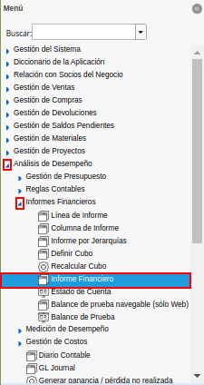
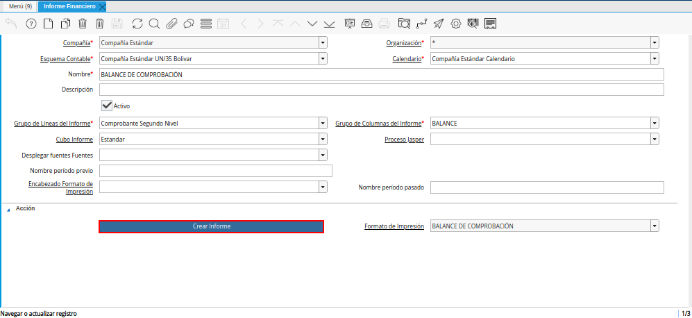
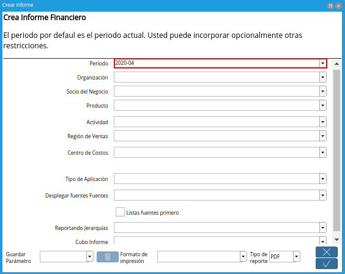
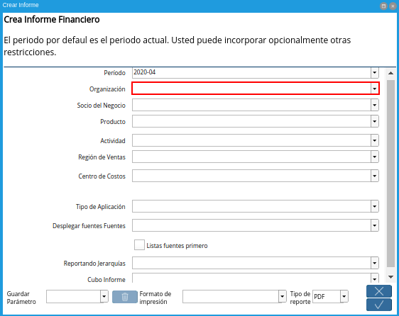
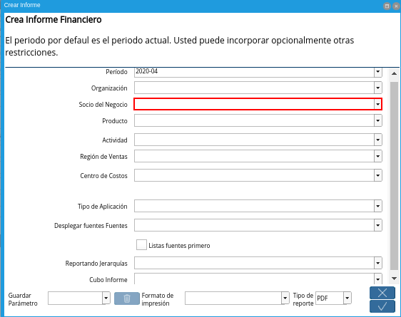
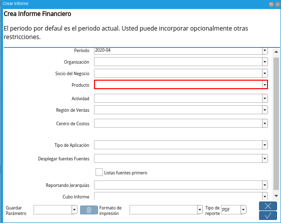
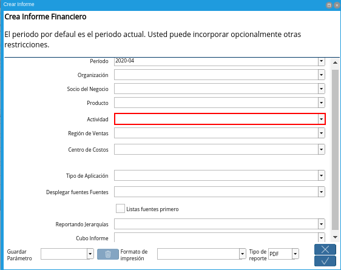
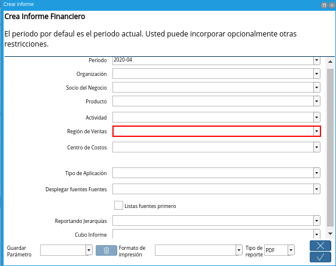
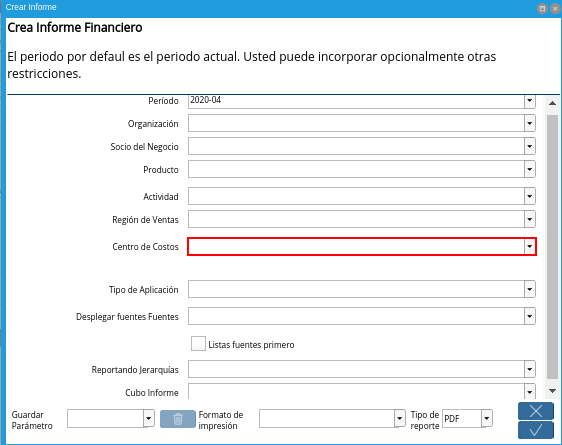
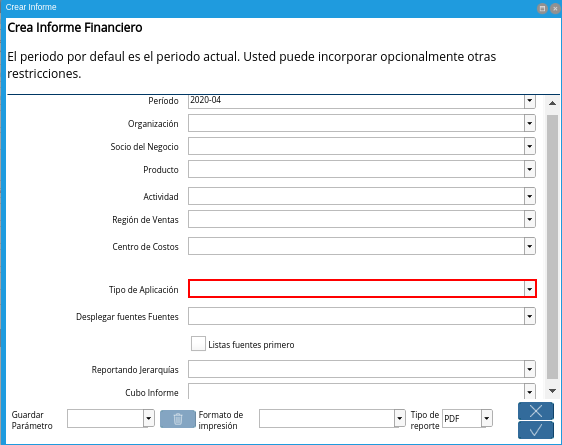
.. |Campo Desplegar fuentes Fuentes| image:: resources/field-display-sources-sources-of-the-financial-report.png
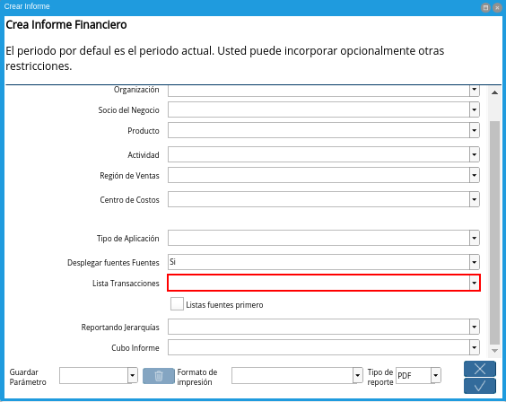
.. |Campo Lista Fuentes Primero| image:: resources/field-list-soaurces-first-of-the-financial-report.png
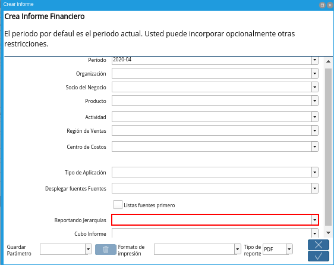
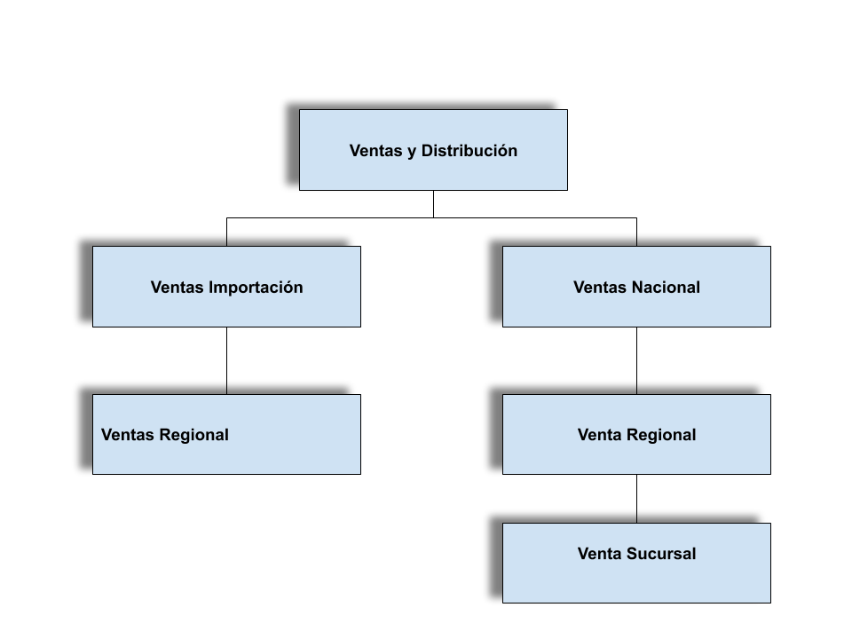
.. |Cubo de información| image:: resources/CubodeInformación.png
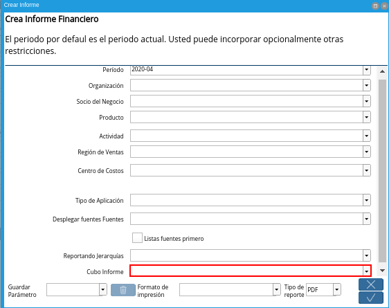
.. |Ventana Crear Informe| image:: resources/create-report-window.png

.. _documento/informe-financiero:

==============================
**Generar Informe Financiero**
==============================

#. Para generar un informe financiero el usuario debe ubicarse en el menú de ADempiere. Debe seleccionar la carpeta "**Análisis de Desempeño**", luego debe seleccionar la carpeta "**Informes Financieros**" y por último la ventana "**Informe Financiero**".

    |Menú de ADempiere|

    Imagen 1. Menú de ADempiere

#. El reporte de informe financiero es generado a través de la selección del proceso "**Crear Informe**", el cual se encuentra ubicado en la parte inferior de la ventana "**Informe Financiero**".

    |Ventana Informe Financiero|

    Imagen 2. Ventana Informe Financiero

#. Al seleccionar el proceso, el usuario podrá visualizar la ventana "**Crear Informe**", esta ventana cuenta con diferentes campos que permiten filtrar la información en base a los campos que sean seleccionados, a continuación detallaremos cada uno de los campos:

    #. Seleccione el periodo en el campo "**Período**".

        El periodo no es un campo obligatorio, sin embargo, le permite definir el rango de fecha en el cual desea emitir los saldos contables para su informe financiero,recordando que cada periodo está previamente configurado y representa un determinado tiempo en el cual se registran y se reconocen operaciones económicas.

        |Campo Período|

        Imagen 3. Campo Período

    #. Seleccione la organización en el campo "**Organización**".

        La organización no es un campo obligatorio, sin embargo, representa una dimensión contable y le permite filtrar la información por organización cuando existe más de una, es decir, el informe financiero podrá emitir saldos contables de una organización al seleccionarla, si por el contrario, el campo está vacío **ADempiere** mostrará la información contable de todas las organizaciones.

        |Campo Organización|

        Imagen 4. Campo Organización

    #. Seleccione el socio de negocio en el campo "**Socio de Negocio**".

        El socio de negocio no es un campo obligatorio, sin embargo, representa una dimensión contable y le permite filtrar la información por socio de negocio según su naturaleza, cliente, proveedor o empleado, es decir, el informe financiero podrá emitir saldos contables de un socio de negocio al seleccionarlo, si por el contrario, el campo está vacío **ADempiere** mostrará la información contable de todos los socios de negocios.

        |Campo Socio del Negocio|

        Imagen 5. Campo Socio del Negocio

    #. Seleccione el producto en el campo "**Producto**".

        El producto no es un campo obligatorio, sin embargo, representa una dimensión contable y le permite filtrar la información por producto, es decir, el informe financiero podrá emitir saldos contables de un producto al seleccionarlo, si por el contrario, el campo está vacío **ADempiere** mostrará la información contable de todos los productos.

        |Campo Producto|

        Imagen 6. Campo Producto

    #. Seleccione la actividad en el campo "**Actividad**".

        La actividad no es un campo obligatorio, sin embargo, representa una dimensión contable y le permite filtrar la información por actividad, que generalmente es utilizada en contabilidad para distribución de los costos y gastos según las actividades que se desarrollan en la empresa, es decir, el informe financiero podrá emitir saldos contables de una actividad al seleccionarla, si por el contrario, el campo está vacío **ADempiere** mostrará la información contable de todas las actividades.

        |Campo Actividad|

        Imagen 7. Campo Actividad

    #. Seleccione la región de venta en el campo "**Región de Venta**".

        La región de venta no es un campo obligatorio, sin embargo, representa una dimensión contable y le permite filtrar la información por región de venta, que generalmente es utilizada para clasificar las zonas en las cuales la empresa establece negocios, es decir, el informe financiero podrá emitir saldos contables de una región de venta al seleccionarla, si por el contrario, el campo está vacío **ADempiere** mostrará la información contable de todas las regiones.

        |Campo Región de Ventas|

        Imagen 8. Campo Región de Ventas

    #. Seleccione el centro de costo en el campo "**Centro de Costo**".

        El centro de costo no es un campo obligatorio, sin embargo, representa una dimensión contable y le permite filtrar la información por centro de costo, que generalmente es utilizado para segmentar los costos que genera una organización, permitiendo definir la ganancia o pérdida que le pueden añadir de forma directa o indirecta a una empresa, es decir, el informe financiero podrá emitir saldos contables de una región de venta al seleccionarla, si por el contrario, el campo está vacío **ADempiere** mostrará la información contable de todos los centros de costos.

        |Campo Centro de Costos|

        Imagen 9. Campo Centro de Costos

    #. Seleccione el tipo de aplicación en el campo "**Tipo de Aplicación**".

        El tipo de aplicación no es un campo obligatorio, sin embargo, le permite filtrar la información por tipo de aplicación, que generalmente es utilizado para clasificar el tipo de contabilidad aplicado, el tipo de aplicación establecido por defecto es actual, basado en la configuración previa en las "**Columnas de Informe**" asociada al informe financiero, no obstante, podrá seleccionar entre, actual, presupuesto, reserva, compromiso y estadística, es decir, el informe financiero podrá emitir saldos contables de un tipo de aplicación específico al seleccionarlo, si por el contrario, el campo está vacío **ADempiere** mostrará la información contable del tipo de aplicación "**Actual**".

        |Campo Tipo de Aplicación|

        Imagen 10. Campo Tipo de Aplicación

    #. Seleccione la opción **Si** o **No** en el campo "**Desplegar fuentes Fuentes**".

        Desplegar fuentes Fuentes no es un campo obligatorio, sin embargo, le permite visualizar el saldo de las cuentas detalle que dan origen al saldo de las cuentas acumulativas, también llamadas cuentas de mayor, es decir, si selecciona la opción "**Si**", el informe financiero mostrará el saldo de las cuentas de mayor y el saldo de las cuentas detalle que componen esta cuenta, si por el contrario, la opción seleccionada es "**No**" o el campo está vacío **ADempiere** mostrará el saldo contable únicamente de las cuentas definidas previamente en el "**Grupo de Líneas del Informe**" asociado al informe financiero.

        |Campo Desplegar fuentes Fuentes|

        Imagen 11. Campo Desplegar fuentes Fuentes

    #. Seleccione la opción **Si** o **No** en el campo "**Lista Transacciones**".

        Lista Transacciones es un campo dependiente del campo "**Desplegar fuentes Fuentes**", es decir solo estará habilitado cuando el campo "**Desplegar fuentes Fuentes**" esté establecido con la opción "**Si**","**Lista Transacciones**" no es un campo obligatorio, sin embargo, le permite visualizar el débito o crédito de las transacciones que dan origen al saldo de las cuentas detalles y a su vez a las cuentas acumulativas, también llamadas cuentas de mayor, es decir, si selecciona la opción "**Si**", el informe financiero mostrará el monto de las transacciones que componen cada cuenta, si por el contrario, la opción seleccionada es "**No**" o el campo está vacío **ADempiere** mostrará el saldo contable únicamente de las cuentas detalles.

        |Campo Lista Transacciones|

        Imagen 12. Campo Lista Transacciones

    #.  Seleccione la opción **Si** o **No** en el campo **Listas Fuentes Primero**.

        Listas Fuentes Primero se encuentra por defecto con la opción "**No**", no es un campo obligatorio, sin embargo, le permite organizar su informe financiero, organizando las cuentas fuentes(cuentas detalle) listadas desde la opción "**Desplegar fuentes Fuentes**" y "**Lista Transacciones**" de forma que si la opción seleccionada en el campo "**Listas Fuentes Primero**" es "**Si** las cuentas detalle junto a las transacciones irán precediendo a las cuentas definidas previamente en el "**Grupo de Líneas del Informe**" asociado al informe financiero, si por el contrario, el campo está vacío **ADempiere** mostrará las cuentas detalle junto a las transacciones sucediendo a las cuentas definidas previamente en el "**Grupo de Líneas del Informe**" asociado al informe financiero.

        |Campo Lista Fuentes Primero|

        Imagen 13. Checklist Lista Fuentes Primero

    #. Seleccione el informe por jerarquía en  el campo **Reportando Jerarquías**.

        Reportando Jerarquías no es un campo obligatorio, sin embargo, le permite generar un informe financiero basado en la configuración realizada en un informe por jerarquía previamente, para explicarlo mejor veamos el siguiente ejemplo:

            Imaginemos una organización cuya estructura en ventas está definida de la siguiente forma:

            |Organigrama Venta|

            Imagen 14. Organigrama Ventas

            Si se desea ver un informe para realizar un análisis de desempeño de la entidad en la organización seguramente se evaluarán resultados en cuentas como  ingresos, cuentas por cobrar, compromisos, costos y gastos asociado al departamento, región de ventas o incluso al empleado(gerente de ventas o vendedor), para esto **ADempiere** permite la creación de jerarquías para cualquier elemento seleccionado en el esquema contable y de esta forma reportar por estructuras y roles definidos previamente en "**Informe de Jerarquías**".

            Basados en lo anteriormente expuesto, en este ejemplo se crearía una jerarquía asociando los siguientes árboles:

                #. **Arbol de Actividad**: La actividad se refiere a la actividad realizada en la organización, podemos decir entonces que funge como un departamento, en este árbol se definirá la estructura del organigrama en cuestión.

                #. **Árbol de Cuentas**: Las cuentas contables a evaluar para el ejemplo son las cuentas de ingreso, cuentas por cobrar, compromisos, costos y gastos, se definirá entonces un árbol con estas cuentas.

            De esta forma se definirán todos los árboles necesarios para el ejemplo, para profundizar a cerca de la creación de un **Informe de Jerarquías** vaya al instructivo que `ERPyA`_ ha diseñado para usted.

            Al generar el informe financiero con esta definición usted podrá observar un reporte basado en la estructura del informe de jerarquías con el saldo de las cuentas y las actividades fijadas en el mismo.

        |Campo Reportando Jerarquías|

        Imagen 15. Campo Reportando Jerarquías

    #. Seleccione el cubo de informe en el campo **Cubo Informe**.

        El cubo de informe no es un campo obligatorio, sin embargo, le permite generar un informe financiero con una información analizada en línea en una base de datos multidimensional de gran volumen, es decir, muestra datos procesados con una gran agilidad y rapidez reduciendo a gran escala el tiempo y los recursos empleados en el análisis, para explicarlo mejor veamos el siguiente ejemplo:

            Imaginemos una empresa en la que requiere dentro de una escala de tiempo incluir datos de un periodo contable, este llevaría por nombre "**Junio 2020**", en el que se desean medir otras dimensiones del cubo para alcanzar información referente a un proyecto, los productos por categorías, y costos en los que incurre la empresa para alcanzar el proyecto.

            |Cubo de información|

            Imagen 16. Cubo de información

            Este cruce de la información permite analizar diversas situaciones y resultados llevando a cabo consultas de los datos masivos de manera eficiente y ligera para  tomar decisiones acertadas.

        |Campo Cubo Informe|

        Imagen 16. Campo Cubo Informe

#. Luego de verificar los campos que contiene la ventana, el usuario debe seleccionar la opción "**OK**", para que sea generado el informe.

    |Ventana Crear Informe|

    Imagen 16. Ventana Crear Informe
