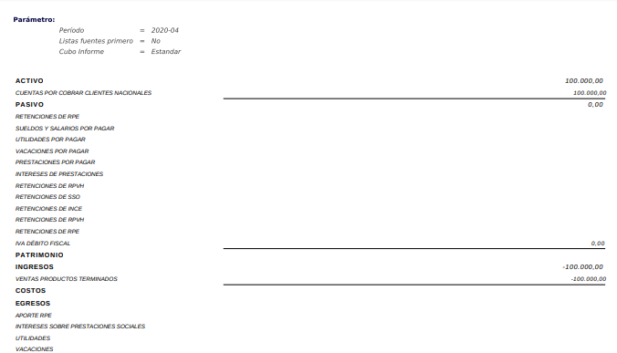

.. _ERPyA: http://erpya.com

.. _documento/estado-resultado:

**Estado de Resultado**
=======================

Un informe financiero de estado de resultado es un reporte que muestra los movimientos de los ingresos y egresos de la empresa.

#. Para generar el reporte, debe realizar el procedimiento explicado en el documento :ref:`documento/informe-financiero`, elaborado por `ERPyA`_. 

#. Luego de que haya culminado el procedimiento, podrá visualizar la ventana "**Informe**", donde debe seleccionar la opción "**Estado de Resultado**", en el campo "**Formato de Impresión**" para poder visualizar el reporte requerido.

    |Tercer Reporte|

    Imagen 1. Estado de Resultado

.. note::

    El reporte de estado de resultado muestra la información en base al periodo de tiempo seleccionado en el campo "**Periodo**" de la ventana "**Crear Informe**".