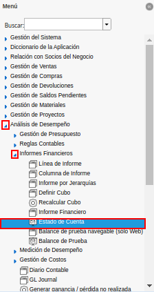
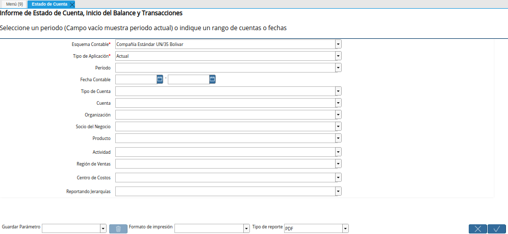

.. || image:: resources/
.. || image:: resources/
.. || image:: resources/
.. || image:: resources/
.. || image:: resources/

.. _documento/estado-de-cuenta:

**Estado de Cuenta**
====================

Un reporte de estado de cuenta permite generar un informe detallado de las transacciones de una empresa, el mismo puede ser generado en base a las restricciones que sean seleccionadas en los diferentes campos que contiene la ventana "**Estado de Cuenta**". A continuación

- **Esquema Contable**:
- **Tipo de Aplicación**:
- **Período**:
- **Fecha Contable**:
- **Tipo de Cuenta**:
- **Cuenta**:
- **Organización**:
- **Socio del Negocio**:
- **Producto**:
- **Actividad**:
- **Región de Ventas**:
- **Centro de Costos**:
- **Reportando Jerarquías**: