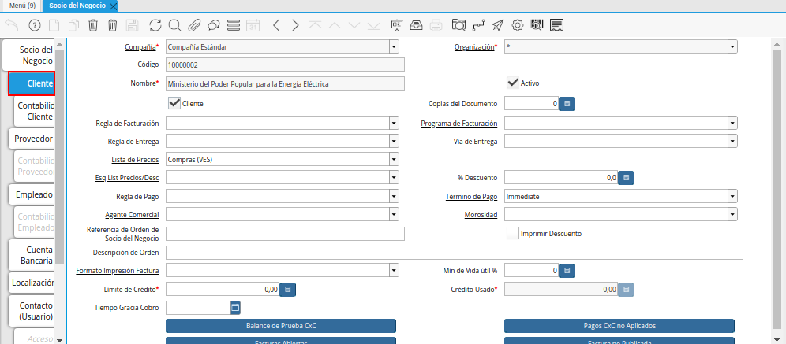
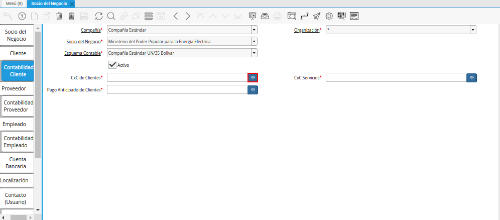
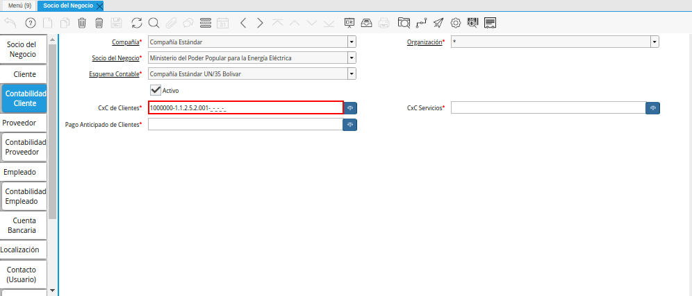
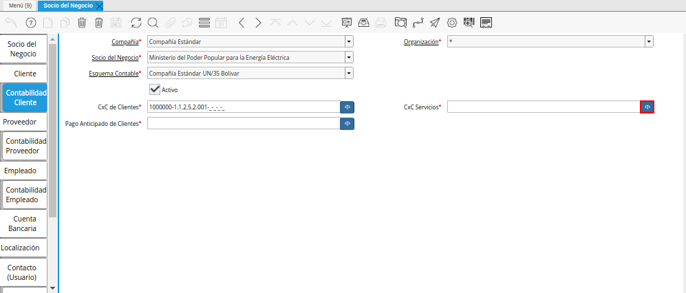
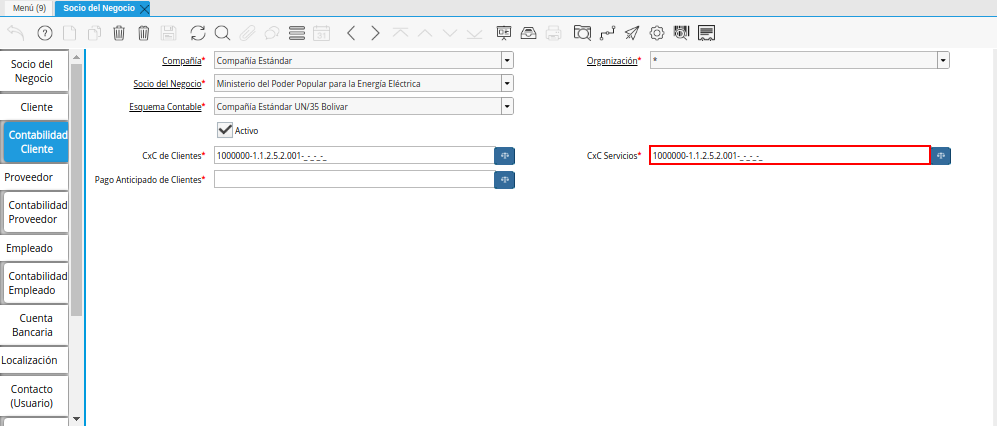
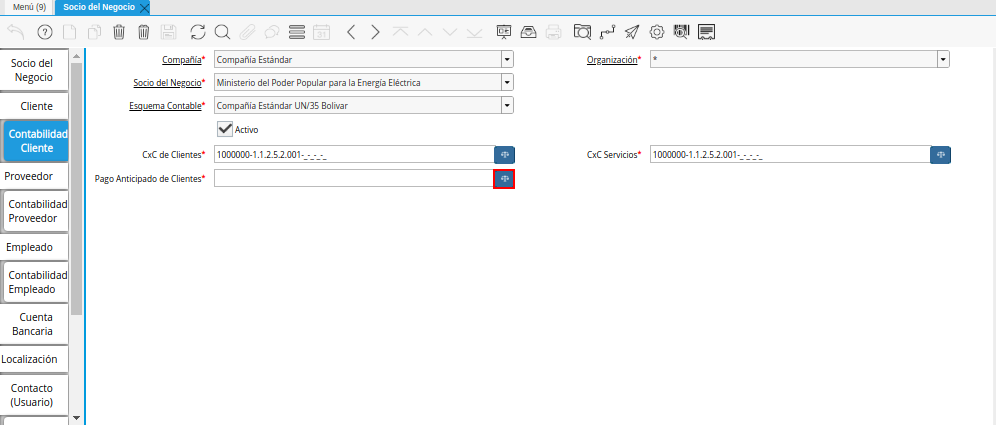
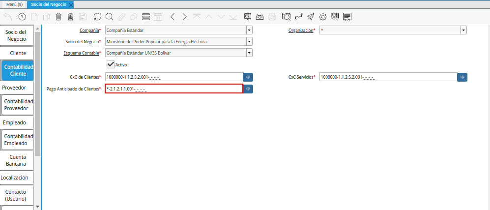

.. _ERPyA: http://erpya.com

.. |Menú de ADempiere| image:: resources/business-partner-menu.png
.. |Ventana Socio del Negocio| image:: resources/business-partner-window.png

.. _documento/configuración-contable-socio-del-negocio-cliente:

**Cliente**
===========

#. Ubique y seleccione en el menú de ADempiere, la carpeta "**Relación con Socios del Negocio**", luego seleccione la carpeta "**Reglas de Socios del Negocio**", por último seleccione la ventana "**Socio del Negocio**".

    |Menú de ADempiere|

    Imagen 1. Menú de ADempiere

#. Podrá visualizar la ventana "**Socio del Negocio**", con los diferentes registros de socios del negocio que contiene ADempiere.

    |Ventana Socio del Negocio|

    Imagen 2. Ventana Socio del Negocio

#. Luego de ubicar el registro del socio del negocio cliente al cual se le definirá la configuración contable, seleccione la pestaña "**Cliente**".

    |Pestaña Cliente de la Ventana Socio del Negocio|

    Imagen 3. Pestaña Cliente de la Ventana Socio del Negocio

#. Seleccione la pestaña "**Contabilidad Cliente**", para definir la configuración contable del socio del negocio cliente seleccionado.

    |Pestaña Contabilidad Cliente de la Ventana Socio del Negocio|

    Imagen 4. Pestaña Contabilidad Cliente de la Ventana Socio del Negocio

#. Seleccione el identificador ubicado del lado derecho del campo "**CxC de Clientes**" para definir la configuración contable del mismo.

    |Campo CxC de Clientes|

    Imagen 5. Identificador del Campo CxC de Clientes

    #. Realice el procedimiento regular para configurar una combinación contable, el mismo se encuentra explicado en el documento :ref:`documento/combinación-contable` elaborado por `ERPyA`_.

        |Combinación Contable del Campo CxC de Clientes|

        Imagen 6. Combinación Contable del Campo CxC de Clientes

#. Seleccione el identificador ubicado del lado derecho del campo "**CxC Servicios**" para definir la configuración contable del mismo.

    |Campo CxC Servicios|

    Imagen 7. Identificador del Campo CxC Servicios

    #. Realice el procedimiento regular para configurar una combinación contable, el mismo se encuentra explicado en el documento :ref:`documento/combinación-contable` elaborado por `ERPyA`_.

        |Combinación Contable del Campo CxC Servicios|

        Imagen 8. Combinación Contable del Campo CxC Servicios

#. Seleccione el identificador ubicado del lado derecho del campo "**CxC Pago Anticipado de Clientes**" para seleccionar la configuración contable del mismo.

    |Campo Pago Anticipado de Clientes|

    Imagen 9. Campo Pago Anticipado de Clientes

    #. Realice el procedimiento regular para configurar una combinación contable, el mismo se encuentra explicado en el documento :ref:`documento/combinación-contable` elaborado por `ERPyA`_.

        |Combinación Contable del Campo Pago Anticipado de Clientes|

        Imagen 10. Combinación Contable del Campo Campo Pago Anticipado de Clientes

.. note::

    Recuerde guardar el registro de los campos de la pestaña "**Contabilidad Cliente**", seleccionando el icono "**Guardar Cambios**", ubicado en la barra de herramientas de ADempiere.
