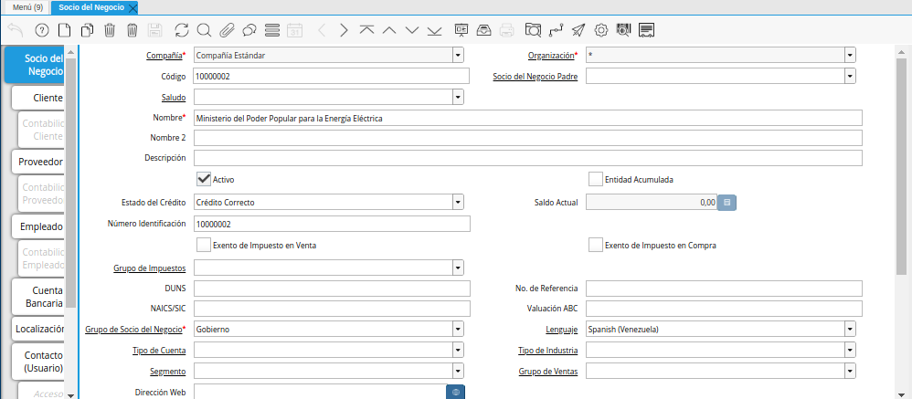

.. _ERPyA: http://erpya.com

.. |Menú de ADempiere| image:: resources/business-partner-menu.png

.. _documento/configuración-contable-socio-del-negocio-empleado:

**Empleado**
============

- Ubique y seleccione en el menú de ADempiere, la carpeta "**Relación con Socios del Negocio**", luego seleccione la carpeta "**Reglas de Socios del Negocio**", por último seleccione la ventana "**Socio del Negocio**".

    |Menú de ADempiere|

    Imagen 1. Menú de ADempiere

- Podrá visualizar la ventana "**Socio del Negocio**", con los diferentes registros de socios del negocio que contiene ADempiere.

    |Ventana Socio del Negocio|

    Imagen 2. Ventana Socio del Negocio

- Luego de ubicar el registro del socio del negocio empleado al cual se le definirá la configuración contable, seleccione la pestaña "**Empleado**".

    |Pestaña Empleado de la Ventana Socio del Negocio|

    Imagen 3. Pestaña Empleado de la Ventana Socio del Negocio

- Seleccione la pestaña "**Contabilidad Empleado**", para definir la configuración contable del socio del negocio empleado seleccionado.

    |Pestaña Contabilidad Empleado de la Ventana Socio del Negocio|

    Imagen 4. Pestaña Contabilidad Empleado de la Ventana Socio del Negocio

- Seleccione el identificador ubicado del lado derecho del campo "**Gastos de Empleados**" para definir la configuración contable del mismo.

    |Campo Gastos de Empleados|

    Imagen 5. Identificador del Campo Gastos de Empleados

    Realice el procedimiento regular para configurar una combinación contable, el mismo se encuentra explicado en el documento :ref:`documento/combinación-contable` elaborado por `ERPyA`_.

        |Combinación Contable del Campo Gastos de Empleados|

        Imagen 6. Combinación Contable del Campo Gastos de Empleados

- Seleccione el identificador ubicado del lado derecho del campo "**Pago Anticipado a Empleados**" para definir la configuración contable del mismo.

    |Campo Pago Anticipado a Empleados|

    Imagen 7. Identificador del Campo Pago Anticipado a Empleados

    Realice el procedimiento regular para configurar una combinación contable, el mismo se encuentra explicado en el documento :ref:`documento/combinación-contable` elaborado por `ERPyA`_.

        |Combinación Contable del Campo Pago Anticipado a Empleados|

        Imagen 8. Combinación Contable del Campo Pago Anticipado a Empleados

.. note::

    Recuerde guardar el registro de los campos de la pestaña "**Contabilidad Empleado**", seleccionando el icono "**Guardar Cambios**", ubicado en la barra de herramientas de ADempiere.