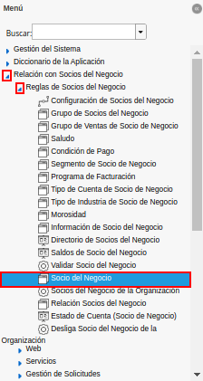
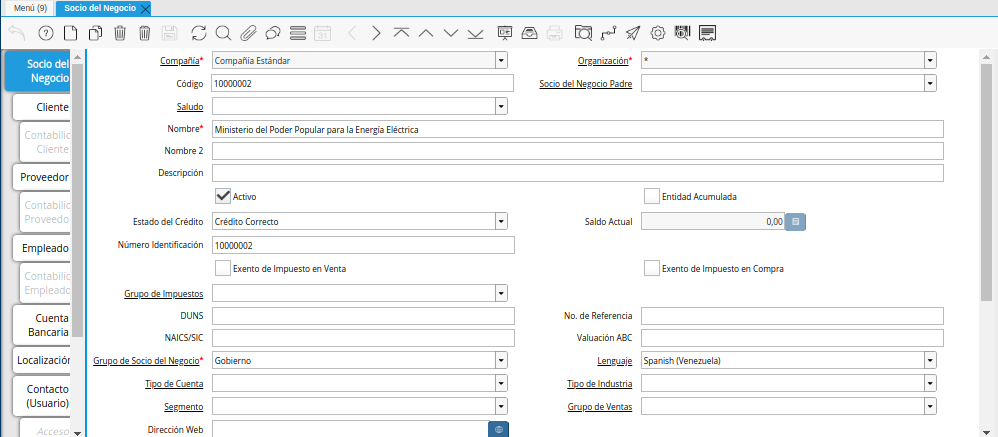
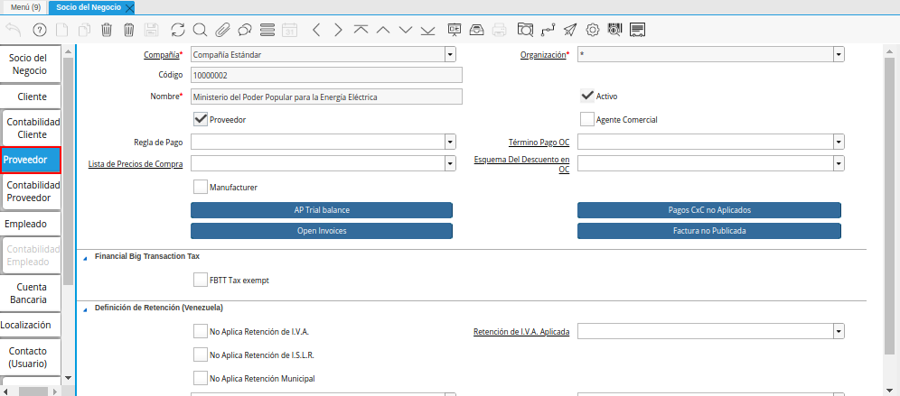
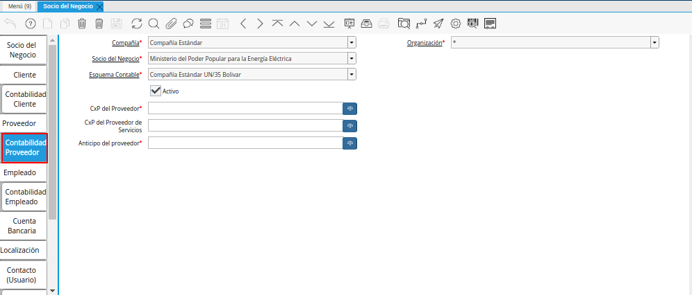
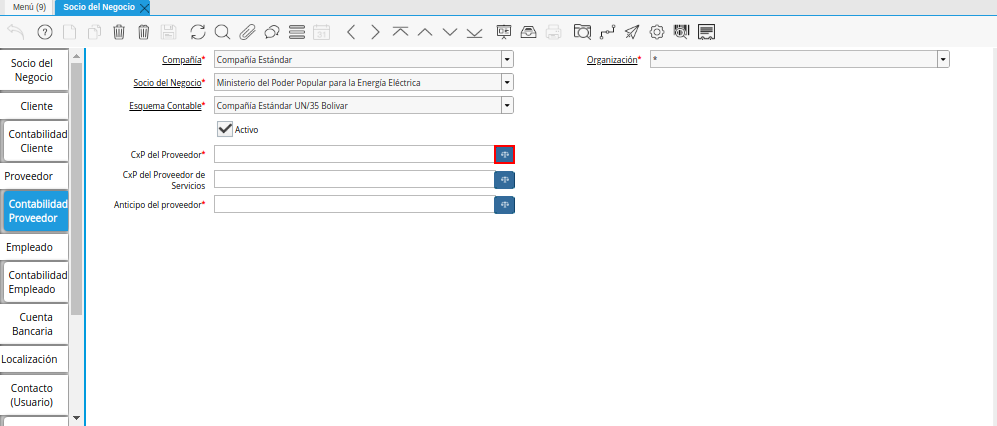
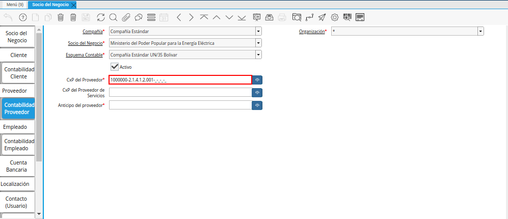
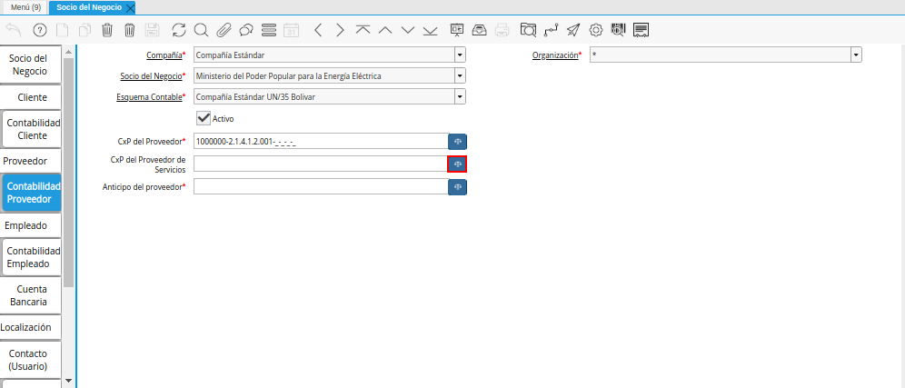
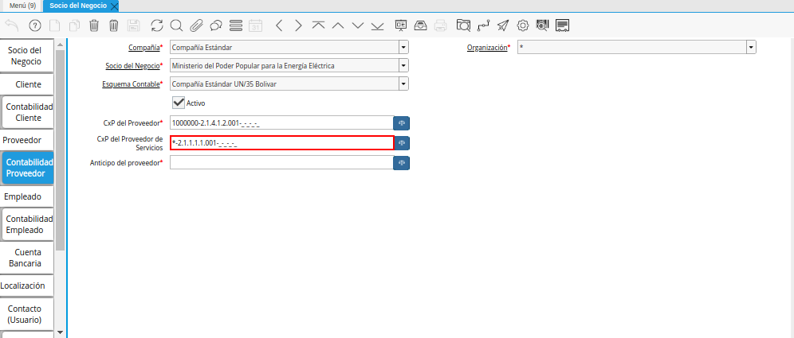
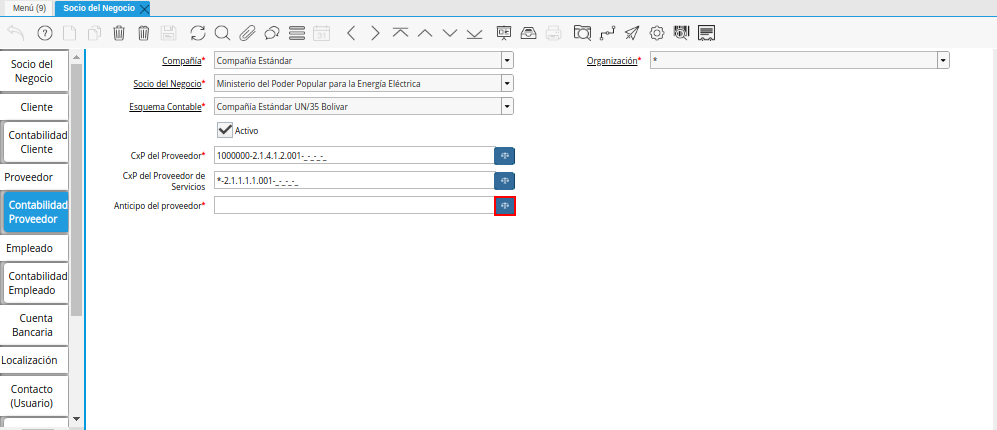
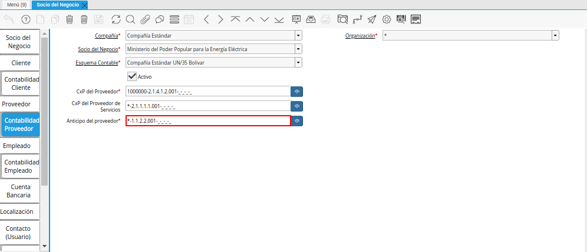

.. _ERPyA: http://erpya.com

.. _documento/configuración-contable-socio-del-negocio-proveedor:

**Proveedor**
=============

#. Ubique y seleccione en el menú de ADempiere, la carpeta "**Relación con Socios del Negocio**", luego seleccione la carpeta "**Reglas de Socios del Negocio**", por último seleccione la ventana "**Socio del Negocio**".

    |Menú de ADempiere|

    Imagen 1. Menú de ADempiere

#. Podrá visualizar la ventana "**Socio del Negocio**", con los diferentes registros de socios del negocio que contiene ADempiere.

    |Ventana Socio del Negocio|

    Imagen 2. Ventana Socio del Negocio

#. Luego de ubicar el registro del socio del negocio proveedor al cual se le definirá la configuración contable, seleccione la pestaña "**Proveedor**".

    |Pestaña Proveedor de la Ventana Socio del Negocio|

    Imagen 3. Pestaña Proveedor de la Ventana Socio del Negocio

#. Seleccione la pestaña "**Contabilidad Proveedor**", para definir la configuración contable del socio del negocio proveedor seleccionado.

    |Pestaña Contabilidad Proveedor de la Ventana Socio del Negocio|

    Imagen 4. Pestaña Contabilidad Proveedor de la Ventana Socio del Negocio

#. Seleccione el identificador ubicado del lado derecho del campo "**CxP del Proveedor**" para definir la configuración contable del mismo.

    |Campo CxP del Proveedor|

    Imagen 5. Identificador del Campo CxP del Proveedor

    #. Realice el procedimiento regular para configurar una combinación contable, el mismo se encuentra explicado en el documento :ref:`documento/combinación-contable` elaborado por `ERPyA`_.

        |Combinación Contable del Campo CxP del Proveedor|

        Imagen 6. Combinación Contable del Campo CxP del Proveedor

#. Seleccione el identificador ubicado del lado derecho del campo "**CxP del Proveedor de Servicios**" para definir la configuración contable del mismo.

    |Campo CxP del Proveedor de Servicios|

    Imagen 7. Identificador del Campo CxP del Proveedor de Servicios

    #. Realice el procedimiento regular para configurar una combinación contable, el mismo se encuentra explicado en el documento :ref:`documento/combinación-contable` elaborado por `ERPyA`_.

        |Combinación Contable del Campo CxP del Proveedor de Servicios|

        Imagen 8. Combinación Contable del Campo CxP del Proveedor de Servicios

#. Seleccione el identificador ubicado del lado derecho del campo "**Anticipo del Proveedor**" para seleccionar la configuración contable del mismo.

    |Campo Anticipo del Proveedor|

    Imagen 9. Campo Anticipo del Proveedor

    #. Realice el procedimiento regular para configurar una combinación contable, el mismo se encuentra explicado en el documento :ref:`documento/combinación-contable` elaborado por `ERPyA`_.

        |Combinación Contable del Campo Anticipo del Proveedor|

        Imagen 10. Combinación Contable del Campo Campo Anticipo del Proveedor

.. note::

    Recuerde guardar el registro de los campos de la pestaña "**Contabilidad Proveedor**", seleccionando el icono "**Guardar Cambios**", ubicado en la barra de herramientas de ADempiere.