.. _ERPyA: http://erpya.com

.. |Menú de ADempiere| image:: resources/cash-journal-definition-menu.png
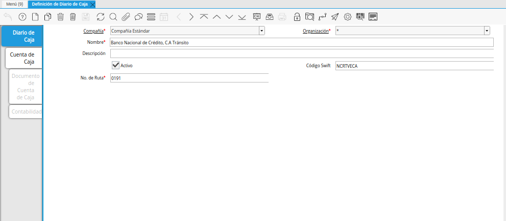
.. |Pestaña Cuenta de Caja de la Ventana Definición de Diario de Caja| image:: resources/cash-account-tab-of-the-cash-journal-definition-window.png
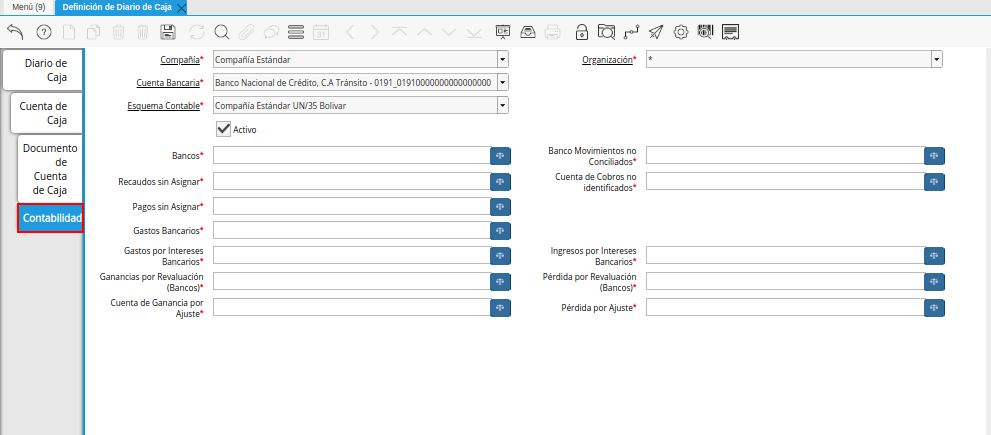
.. |Campo Bancos de la Pestaña Contabilidad de la Ventana Definición de Diario de Caja| image:: resources/banks-field-of-the-accounting-tab-of-the-cash-journal-definition-window.png
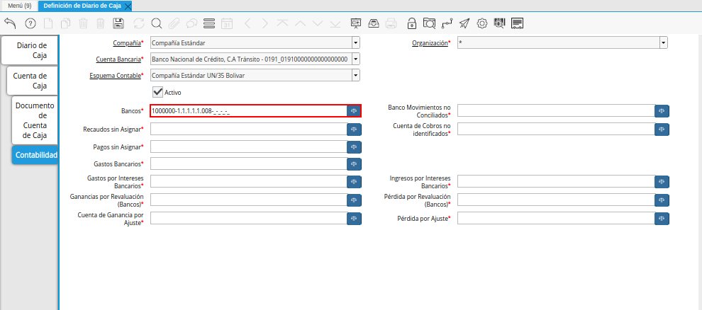
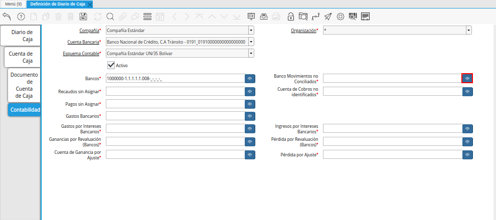
.. |Combinación Contable del Campo Banco Movimientos no Conciliados de la Pestaña Contabilidad de la Ventana Definición de Diario de Caja| image:: resources/combination-of-the-bank-unreconciled-transactions-field-from-the-accounting-tab-of-the-cash-journal-definition-window.png
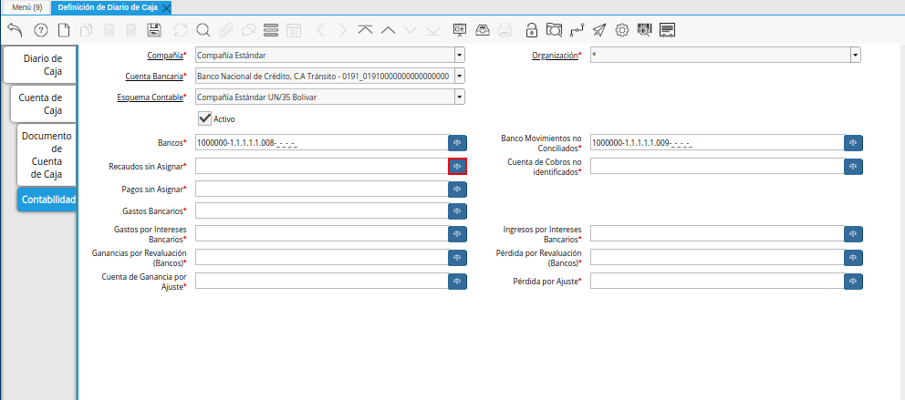
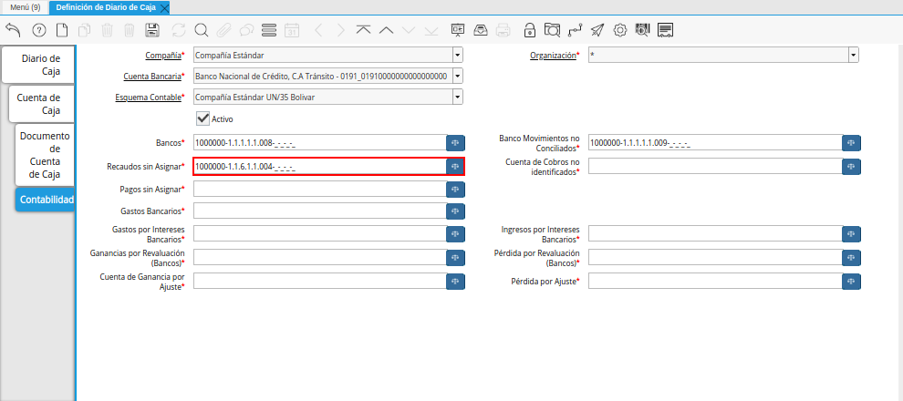
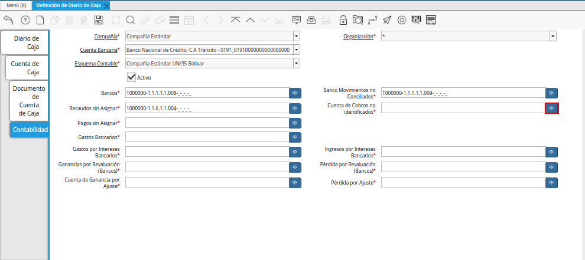
.. |Combinación Contable del Campo Cuenta de Cobros no identificados de la Pestaña Contabilidad de la Ventana Definición de Diario de Caja| image:: resources/accounting-combination-of-the-unidentified-collections-account-field-from-the-accounting-tab-of-the-cash-journal-definition-window.png
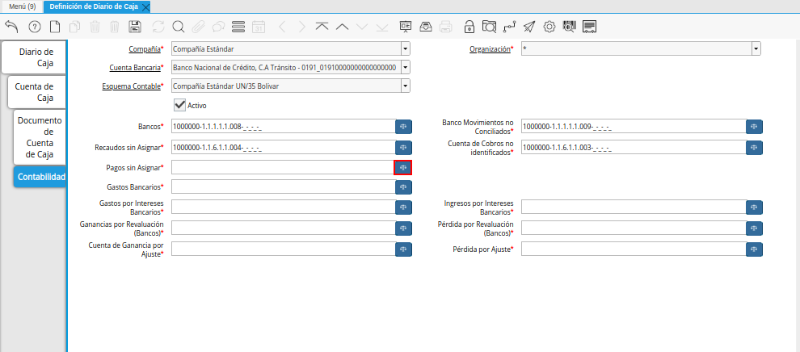
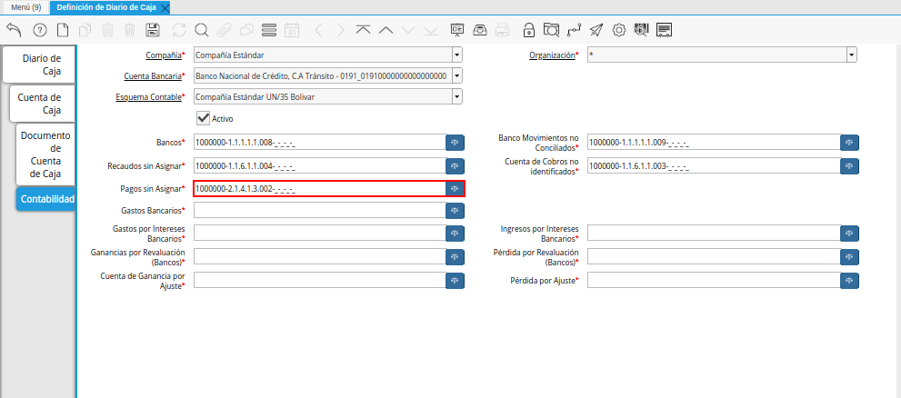
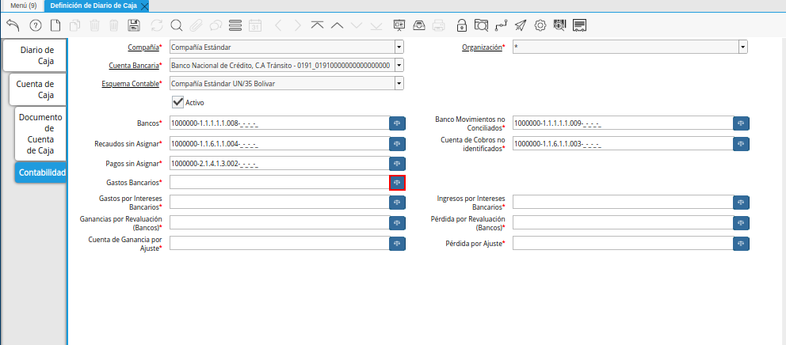
.. |Combinación Contable del Campo Gastos Bancarios de la Pestaña Contabilidad de la Ventana Definición de Diario de Caja| image:: resources/accounting-combination-from-the-bank-charges-field-of-the-accounting-tab-of-the-cash-journal-definition-window.png
.. |Campo Gastos por Intereses Bancarios de la Pestaña Contabilidad de la Ventana Definición de Diario de Caja| image:: resources/bank-interest-expense-field-in-the-accounting-tab-of-the-cash-journal-definition-window.png
.. |Combinación Contable del Campo Gastos por Intereses Bancarios de la Pestaña Contabilidad de la Ventana Definición de Diario de Caja| image:: resources/accounting-combination-of-the-bank-interest-expense-field-on-the-accounting-tab-of-the-cash-journal-definition-window.png
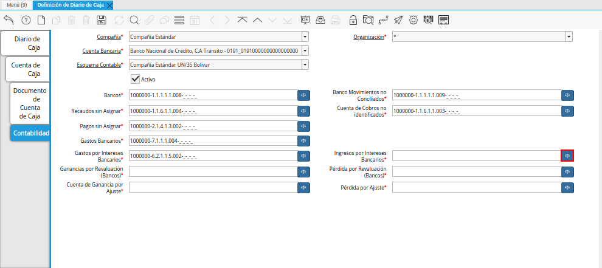
.. |Combinación Contable del Campo Ingresos por Intereses Bancarios de la Pestaña Contabilidad de la Ventana Definición de Diario de Caja| image:: resources/accounting-combination-from-the-bank-interest-income-field-on-the-accounting-tab-of-the-cash-journal-definition-window.png
.. |Campo Ganancias por Revaluación (Bancos) de la Pestaña Contabilidad de la Ventana Definición de Diario de Caja| image:: resources/banks-revaluation-gains-field-in-the-accounting-tab-of-the-cash-journal-definition-window.png
.. |Combinación Contable del Campo Ganancias por Revaluación (Bancos) de la Pestaña Contabilidad de la Ventana Definición de Diario de Caja| image:: resources/accounting-combination-of-the-bank-revaluation-gains-field-from-the-accounting-tab-of-the-cash-journal-definition-window.png
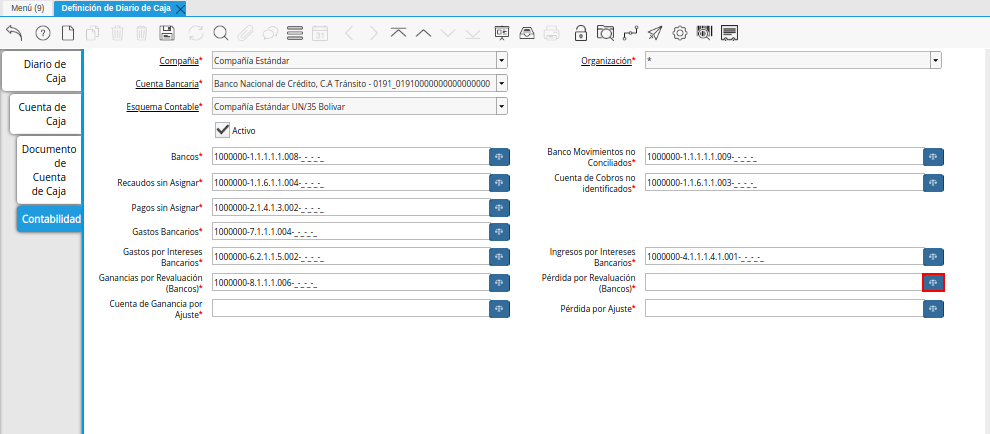
.. |Combinación Contable del Campo Pérdida por Revaluación (Bancos) de la Pestaña Contabilidad de la Ventana Definición de Diario de Caja| image:: resources/accounting-combination-of-the-bank-revaluation-loss-field-from-the-accounting-tab-of-the-cash-journal-definition-window.png
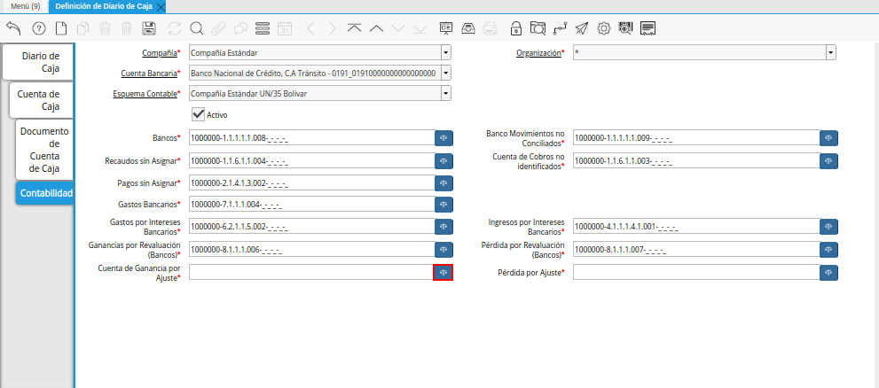
.. |Combinación Contable del Campo Cuenta de Ganancia por Ajuste de la Pestaña Contabilidad de la Ventana Definición de Diario de Caja| image:: resources/accounting-combination-of-the-adjustment-profit-account-field-of-the-accounting-tab-of-the-cash-journal-definition-window.png
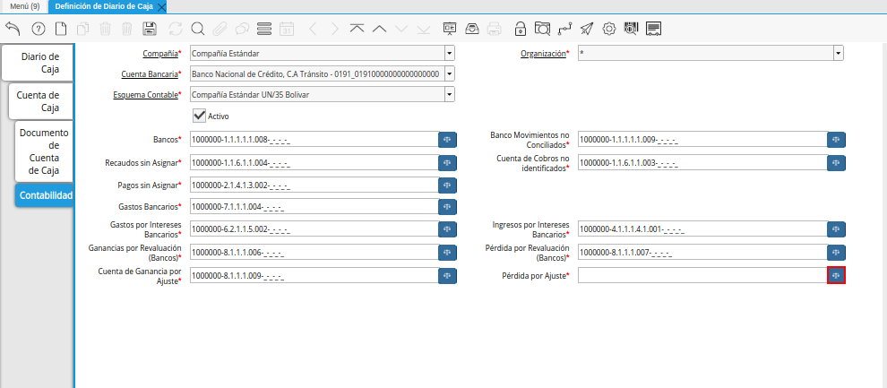
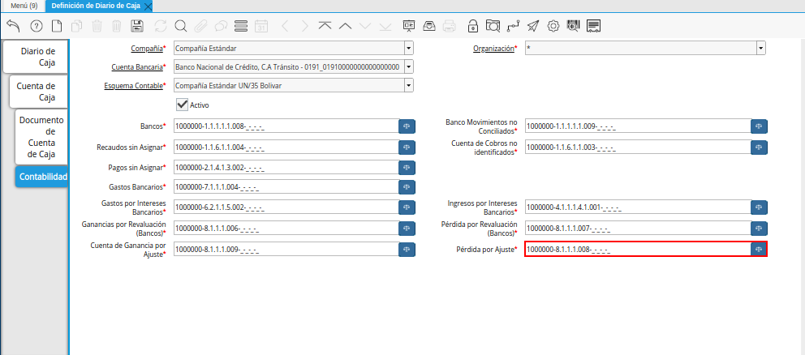

.. _documento/configuración-contable-caja:

**Caja**
========

#. Ubique y seleccione en el menú de ADempiere, la carpeta "**Gestión del Sistema**", luego seleccione la carpeta "**Reglas de la Organización**", por último seleccione la ventana "**Definición de Diario de Caja**".

    |Menú de ADempiere|

    Imagen 1. Menú de ADempiere

#. Podrá visualizar la ventana "**Definición de Diario de Caja**", con los diferentes registros de cajas que se encuentran en ADempiere.

    |Ventana Definición de Diario de Caja|

    Imagen 2. Ventana Definición de Diario de Caja

#. Seleccione la pestaña "**Cuenta de Caja**", con el registro de la cuenta correspondiente a la caja seleccionada en la pestaña principal "**Definición de Diario de Caja**".

    |Pestaña Cuenta de Caja de la Ventana Definición de Diario de Caja|

    Imagen 3. Pestaña Cuenta de Caja de la Ventana Definición de Diario de Caja

#. Seleccione la pestaña "**Contabilidad**", para configurar la contabilidad de la caja seleccionada en la pestaña "**Cuenta de Caja**".

    |Pestaña Contabilidad de la Ventana Definición de Diario de Caja|

    Imagen 4. Pestaña Contabilidad de la Ventana Definición de Diario de Caja

    #. Seleccione el identificador ubicado del lado derecho del campo "**Bancos**" para definir la configuración contable del mismo.

        |Campo Bancos de la Pestaña Contabilidad de la Ventana Definición de Diario de Caja|

        Imagen 5. Identificador del Campo Bancos de la Pestaña Contabilidad de la Ventana Definición de Diario de Caja

        #. Realice el procedimiento regular para configurar una combinación contable, el mismo se encuentra explicado en el documento :ref:`documento/combinación-contable` elaborado por `ERPyA`_.

            |Combinación Contable del Campo Bancos de la Pestaña Contabilidad de la Ventana Definición de Diario de Caja|

            Imagen 6. Combinación Contable del Campo Bancos de la Pestaña Contabilidad de la Ventana Definición de Diario de Caja

    #. Seleccione el identificador ubicado del lado derecho del campo "**Banco Movimientos no Conciliados**" para definir la configuración contable del mismo.

        |Campo Banco Movimientos no Conciliados de la Pestaña Contabilidad de la Ventana Definición de Diario de Caja|

        Imagen 7. Identificador del Campo Banco Movimientos no Conciliados de la Pestaña Contabilidad de la Ventana Definición de Diario de Caja

        #. Realice el procedimiento regular para configurar una combinación contable, el mismo se encuentra explicado en el documento :ref:`documento/combinación-contable` elaborado por `ERPyA`_.

            |Combinación Contable del Campo Banco Movimientos no Conciliados de la Pestaña Contabilidad de la Ventana Definición de Diario de Caja|

            Imagen 8. Combinación Contable del Campo Banco Movimientos no Conciliados de la Pestaña Contabilidad de la Ventana Definición de Diario de Caja

    #. Seleccione el identificador ubicado del lado derecho del campo "**Recaudos sin Asignar**" para definir la configuración contable del mismo.

        |Campo Recaudos sin Asignar de la Pestaña Contabilidad de la Ventana Definición de Diario de Caja|

        Imagen 9. Identificador del Campo Recaudos sin Asignar de la Pestaña Contabilidad de la Ventana Definición de Diario de Caja

        #. Realice el procedimiento regular para configurar una combinación contable, el mismo se encuentra explicado en el documento :ref:`documento/combinación-contable` elaborado por `ERPyA`_.

            |Combinación Contable del Campo Recaudos sin Asignar de la Pestaña Contabilidad de la Ventana Definición de Diario de Caja|

            Imagen 10. Combinación Contable del Campo Recaudos sin Asignar de la Pestaña Contabilidad de la Ventana Definición de Diario de Caja

    #. Seleccione el identificador ubicado del lado derecho del campo "**Cuenta de Cobros no identificados**" para definir la configuración contable del mismo.

        |Campo Cuenta de Cobros no identificados de la Pestaña Contabilidad de la Ventana Definición de Diario de Caja|

        Imagen 11. Identificador del Campo Cuenta de Cobros no identificados de la Pestaña Contabilidad de la Ventana Definición de Diario de Caja

        #. Realice el procedimiento regular para configurar una combinación contable, el mismo se encuentra explicado en el documento :ref:`documento/combinación-contable` elaborado por `ERPyA`_.

            |Combinación Contable del Campo Cuenta de Cobros no identificados de la Pestaña Contabilidad de la Ventana Definición de Diario de Caja|

            Imagen 12. Combinación Contable del Campo Cuenta de Cobros no identificados de la Pestaña Contabilidad de la Ventana Definición de Diario de Caja

    #. Seleccione el identificador ubicado del lado derecho del campo "**Pagos sin Asignar**" para definir la configuración contable del mismo.

        |Campo Pagos sin Asignar de la Pestaña Contabilidad de la Ventana Definición de Diario de Caja|

        Imagen 13. Identificador del Campo Pagos sin Asignar de la Pestaña Contabilidad de la Ventana Definición de Diario de Caja

        #. Realice el procedimiento regular para configurar una combinación contable, el mismo se encuentra explicado en el documento :ref:`documento/combinación-contable` elaborado por `ERPyA`_.

            |Combinación Contable del Campo Pagos sin Asignar de la Pestaña Contabilidad de la Ventana Definición de Diario de Caja|

            Imagen 14. Combinación Contable del Campo Pagos sin Asignar de la Pestaña Contabilidad de la Ventana Definición de Diario de Caja

    #. Seleccione el identificador ubicado del lado derecho del campo "**Gastos Bancarios**" para definir la configuración contable del mismo.

        |Campo Gastos Bancarios de la Pestaña Contabilidad de la Ventana Definición de Diario de Caja|

        Imagen 15. Identificador del Campo Gastos Bancarios de la Pestaña Contabilidad de la Ventana Definición de Diario de Caja

        #. Realice el procedimiento regular para configurar una combinación contable, el mismo se encuentra explicado en el documento :ref:`documento/combinación-contable` elaborado por `ERPyA`_.

            |Combinación Contable del Campo Gastos Bancarios de la Pestaña Contabilidad de la Ventana Definición de Diario de Caja|

            Imagen 16. Combinación Contable del Campo Gastos Bancarios de la Pestaña Contabilidad de la Ventana Definición de Diario de Caja

    #. Seleccione el identificador ubicado del lado derecho del campo "**Gastos por Intereses Bancarios**" para definir la configuración contable del mismo.

        |Campo Gastos por Intereses Bancarios de la Pestaña Contabilidad de la Ventana Definición de Diario de Caja|

        Imagen 17. Identificador del Campo Gastos por Intereses Bancarios de la Pestaña Contabilidad de la Ventana Definición de Diario de Caja

        #. Realice el procedimiento regular para configurar una combinación contable, el mismo se encuentra explicado en el documento :ref:`documento/combinación-contable` elaborado por `ERPyA`_.

            |Combinación Contable del Campo Gastos por Intereses Bancarios de la Pestaña Contabilidad de la Ventana Definición de Diario de Caja|

            Imagen 18. Combinación Contable del Campo Gastos por Intereses Bancarios de la Pestaña Contabilidad de la Ventana Definición de Diario de Caja
        
    #. Seleccione el identificador ubicado del lado derecho del campo "**Ingresos por Intereses Bancarios**" para definir la configuración contable del mismo.

        |Campo Ingresos por Intereses Bancarios de la Pestaña Contabilidad de la Ventana Definición de Diario de Caja|

        Imagen 19. Identificador del Campo Ingresos por Intereses Bancarios de la Pestaña Contabilidad de la Ventana Definición de Diario de Caja

        #. Realice el procedimiento regular para configurar una combinación contable, el mismo se encuentra explicado en el documento :ref:`documento/combinación-contable` elaborado por `ERPyA`_.

            |Combinación Contable del Campo Ingresos por Intereses Bancarios de la Pestaña Contabilidad de la Ventana Definición de Diario de Caja|

            Imagen 20. Combinación Contable del Campo Ingresos por Intereses Bancarios de la Pestaña Contabilidad de la Ventana Definición de Diario de Caja

    #. Seleccione el identificador ubicado del lado derecho del campo "**Ganancias por Revaluación (Bancos)**" para definir la configuración contable del mismo.

        |Campo Ganancias por Revaluación (Bancos) de la Pestaña Contabilidad de la Ventana Definición de Diario de Caja|

        Imagen 21. Identificador del Campo Ganancias por Revaluación (Bancos) de la Pestaña Contabilidad de la Ventana Definición de Diario de Caja

        #. Realice el procedimiento regular para configurar una combinación contable, el mismo se encuentra explicado en el documento :ref:`documento/combinación-contable` elaborado por `ERPyA`_.

            |Combinación Contable del Campo Ganancias por Revaluación (Bancos) de la Pestaña Contabilidad de la Ventana Definición de Diario de Caja|

            Imagen 22. Combinación Contable del Campo Ganancias por Revaluación (Bancos) de la Pestaña Contabilidad de la Ventana Definición de Diario de Caja

    #. Seleccione el identificador ubicado del lado derecho del campo "**Pérdida por Revaluación (Bancos)**" para definir la configuración contable del mismo.

        |Campo Pérdida por Revaluación (Bancos) de la Pestaña Contabilidad de la Ventana Definición de Diario de Caja|

        Imagen 23. Identificador del Campo Pérdida por Revaluación (Bancos) de la Pestaña Contabilidad de la Ventana Definición de Diario de Caja

        #. Realice el procedimiento regular para configurar una combinación contable, el mismo se encuentra explicado en el documento :ref:`documento/combinación-contable` elaborado por `ERPyA`_.

            |Combinación Contable del Campo Pérdida por Revaluación (Bancos) de la Pestaña Contabilidad de la Ventana Definición de Diario de Caja|

            Imagen 24. Combinación Contable del Campo Pérdida por Revaluación (Bancos) de la Pestaña Contabilidad de la Ventana Definición de Diario de Caja

    #. Seleccione el identificador ubicado del lado derecho del campo "**Cuenta de Ganancia por Ajuste**" para definir la configuración contable del mismo.

        |Campo Cuenta de Ganancia por Ajuste de la Pestaña Contabilidad de la Ventana Definición de Diario de Caja|

        Imagen 25. Identificador del Campo Cuenta de Ganancia por Ajuste de la Pestaña Contabilidad de la Ventana Definición de Diario de Caja

        #. Realice el procedimiento regular para configurar una combinación contable, el mismo se encuentra explicado en el documento :ref:`documento/combinación-contable` elaborado por `ERPyA`_.

            |Combinación Contable del Campo Cuenta de Ganancia por Ajuste de la Pestaña Contabilidad de la Ventana Definición de Diario de Caja|

            Imagen 26. Combinación Contable del Campo Cuenta de Ganancia por Ajuste de la Pestaña Contabilidad de la Ventana Definición de Diario de Caja

    #. Seleccione el identificador ubicado del lado derecho del campo "**Pérdida por Ajuste**" para definir la configuración contable del mismo.

        |Campo Pérdida por Ajuste de la Pestaña Contabilidad de la Ventana Definición de Diario de Caja|

        Imagen 27. Identificador del Campo Pérdida por Ajuste de la Pestaña Contabilidad de la Ventana Definición de Diario de Caja

        #. Realice el procedimiento regular para configurar una combinación contable, el mismo se encuentra explicado en el documento :ref:`documento/combinación-contable` elaborado por `ERPyA`_.

            |Combinación Contable del Campo Pérdida por Ajuste de la Pestaña Contabilidad de la Ventana Definición de Diario de Caja|

            Imagen 28. Combinación Contable del Campo Pérdida por Ajuste de la Pestaña Contabilidad de la Ventana Definición de Diario de Caja

.. note::

    Recuerde guardar el registro de los campos de la pestaña "**Contabilidad**", seleccionando el icono "**Guardar Cambios**", ubicado en la barra de herramientas de ADempiere.