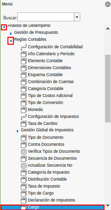
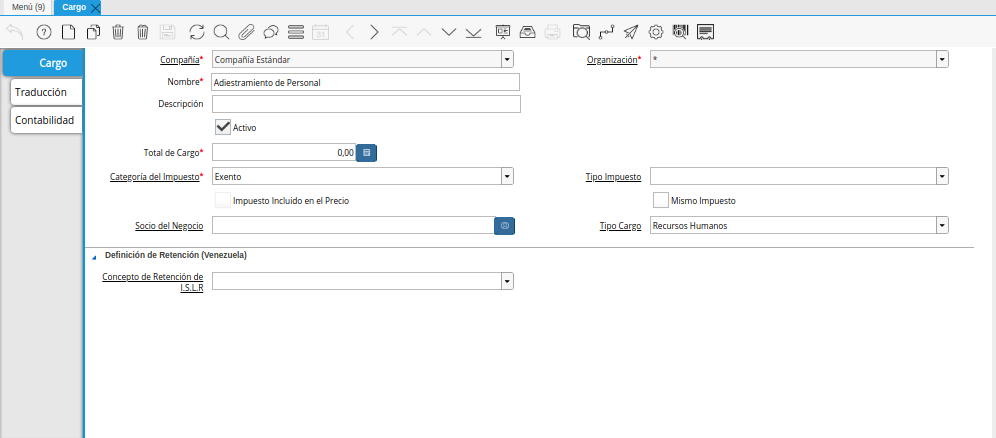
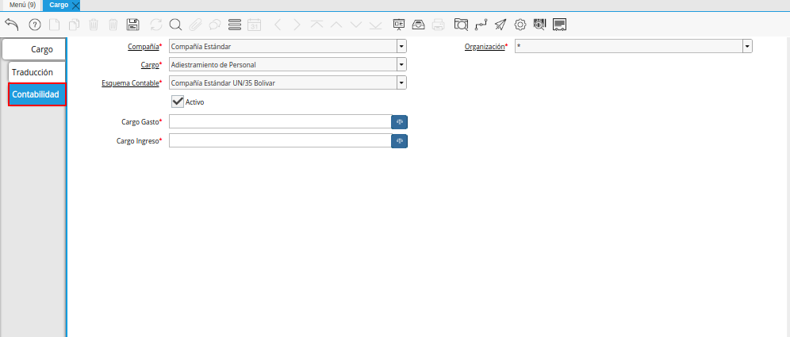
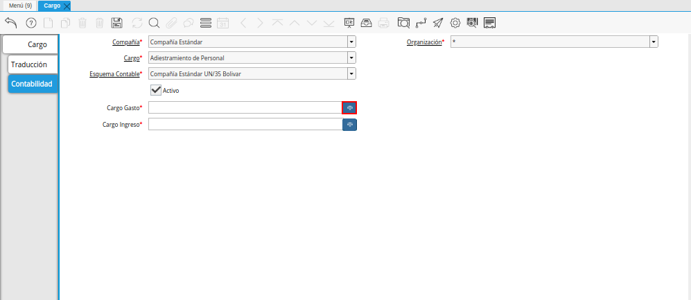
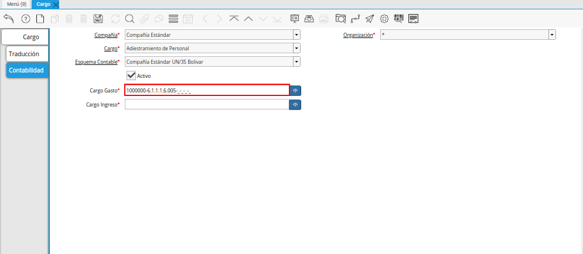
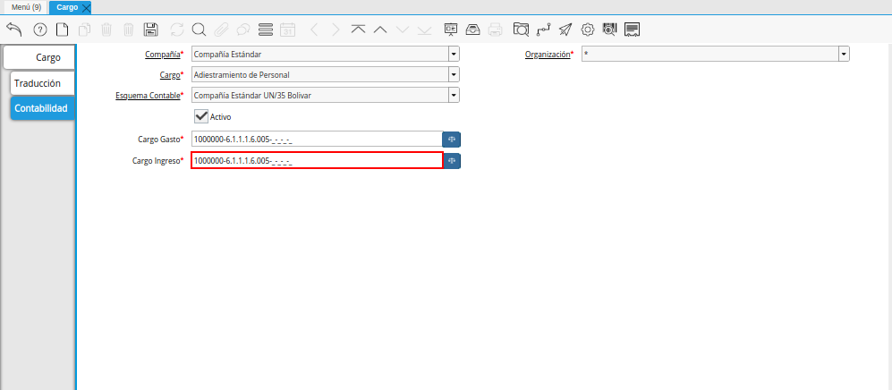
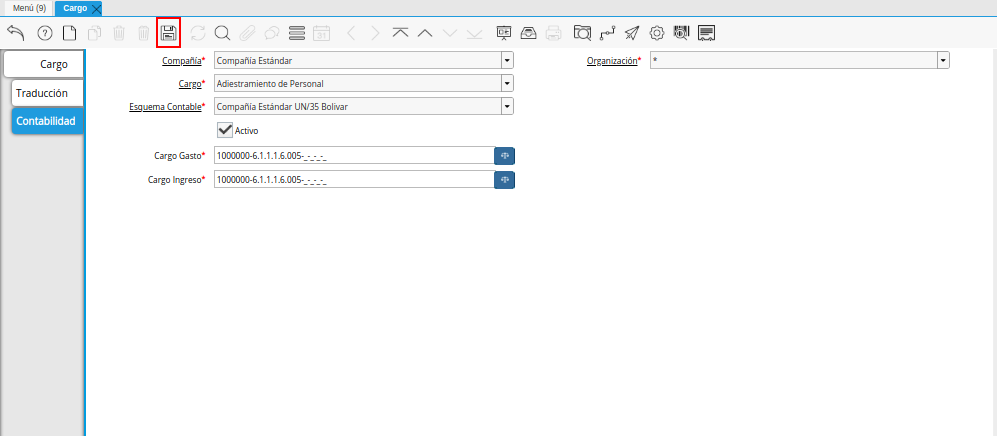

.. _ERPyA: http://erpya.com

.. _documento/configuración-contable-cargo:

**Cargo**
=========

#. Ubique en el menú de ADempiere, la carpeta "**Análisis de Desempeño**", luego seleccione la carpeta "**Reglas Contables**", por último seleccione la ventana "**Cargo**".

    |Menú de ADempiere|

    Imagen 1. Menú de ADempiere

#. Podrá visualizar la ventana "**Cargo**" con todos los registros de los cargos utilizados en la empresa. 

    |Ventana Cargo|

    Imagen 2. Ventana Cargo

#. Seleccione la pestaña "**Contabilidad**" para definir la configuración contable del cargo seleccionado.

    |Pestaña Contabilidad de la Ventana Cargo|

    Imagen 3. Pestaña Contabilidad de la Ventana Cargo

#. Seleccione el icono ubicado del lado derecho del campo "**Cargo Gasto**", para seleccionar la combinación contable del mismo.

    |Campo Cargo Gasto de la Ventana Cargo|

    Imagen 4. Campo Cargo Gasto de la Pestaña Contabilidad de la Ventana Cargo

    #. Realice el procedimiento regular para configurar una combinación contable, el mismo se encuentra explicado en el documento :ref:`documento/combinación-contable` elaborado por `ERPyA`_.

        |Combinación Contable del Campo Cargo Gasto|

        Imagen 5. Combinación Contable del Campo Cargo Gasto

#. Seleccione el icono ubicado del lado derecho del campo "**Cargo Ingreso**", para seleccionar la combinación contable del mismo.

    |Campo Cargo Ingreso de la Ventana Cargo|

    Imagen 6. Campo Cargo Ingreso de la Pestaña Contabilidad de la Ventana Cargo

    #. Realice el procedimiento regular para configurar una combinación contable, el mismo se encuentra explicado en el documento :ref:`documento/combinación-contable` elaborado por `ERPyA`_.

        |Combinación Contable del Campo Cargo Ingreso|

        Imagen 7. Combinación Contable del Campo Cargo Ingreso

#. Seleccione el icono "**Guardar Cambios**", para guardar el registro de los campos de la pestaña "**Contabilidad**".

    |Icono Guardar Cambios de la Combinación Contable del Cargo|

    Imagen 8. Icono Guardar Cambios de la Combinación Contable del Cargo