.. _ERPyA: http://erpya.com
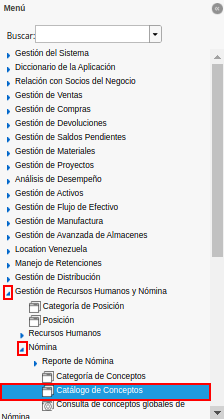
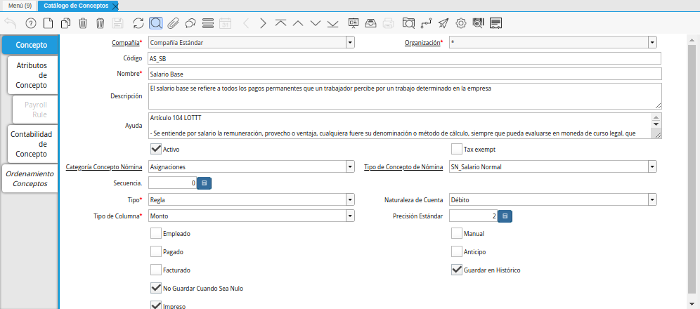
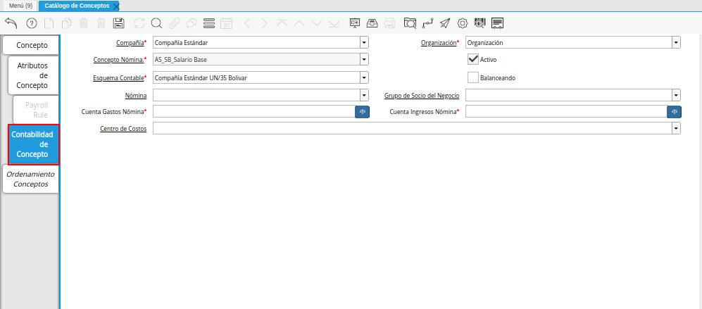
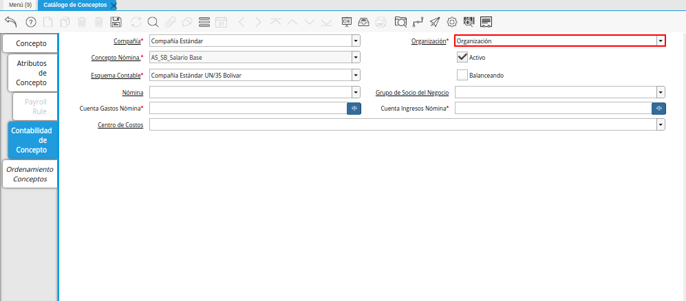

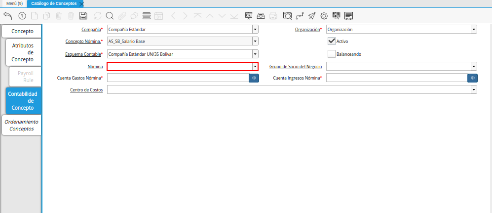
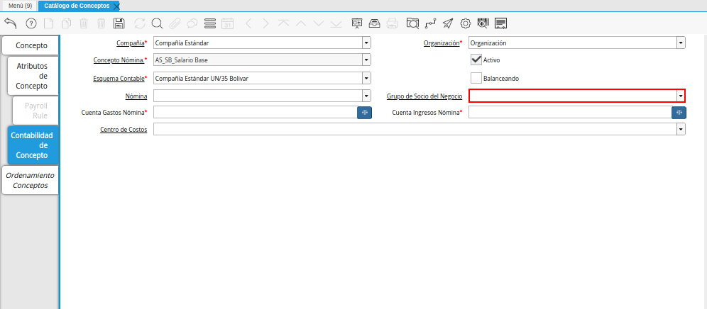

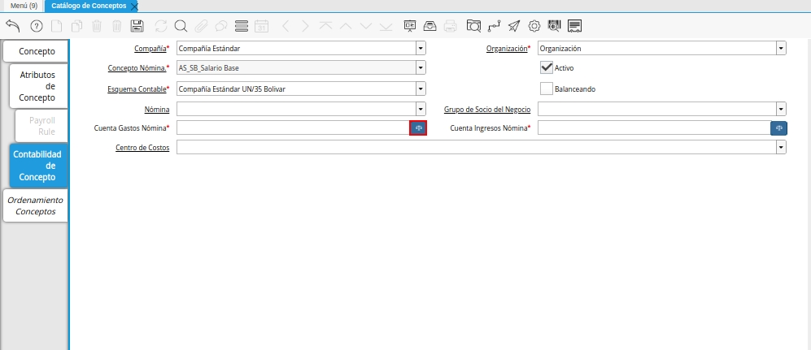
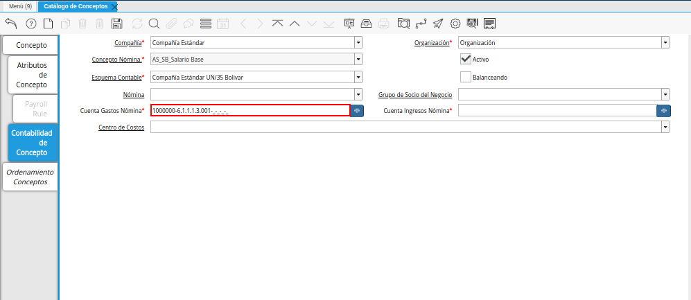
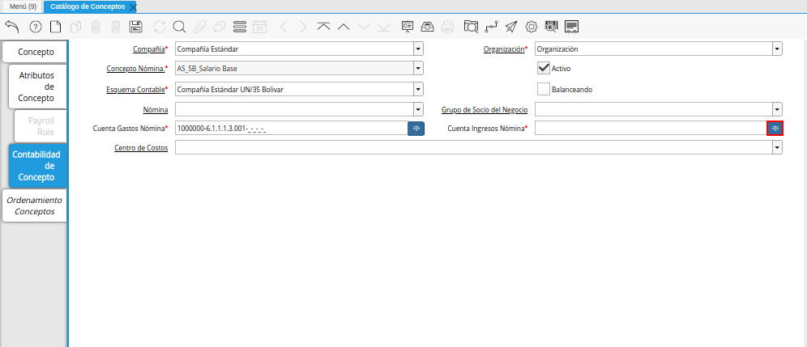
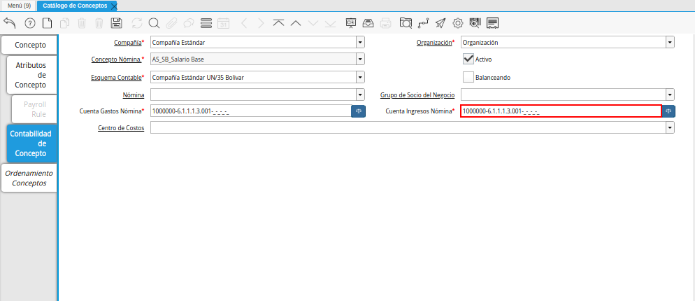
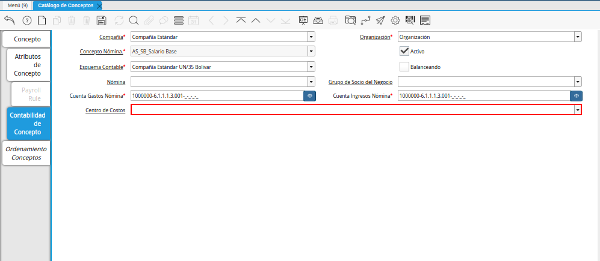
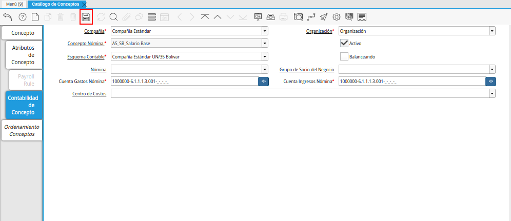
.. _documento/configuración-contable-del-catálogo-de-conceptos:

**Configuración Contable del Catálogo de Conceptos**
====================================================

#. Ubique y seleccione en el menú de ADempiere, la carpeta "**Gestión de Recursos Humanos y Nómina**", luego seleccione la carpeta "**Nómina**", por último seleccione la ventana "**Catálogo de Conceptos**".

    |Menú de ADempiere|

    Imagen 1. Menú de ADempiere

#. Podrá visualizar la ventana "**Catálogo de Concepto**", con los diferentes registros de conceptos de nómina que contiene ADempiere.

    |Ventana Catálogo de Concepto|

    Imagen 2. Ventana Catálogo de Concepto

    .. note::

        Todo concepto de asignación debe tener en el campo "**Naturaleza de Cuenta**", la opción "**Débito**". De igual manera, todo concepto de deducción debe tener en el campo "**Naturaleza de Cuenta**", la opción "**Crédito**".

#. Luego de ubicar el registro del concepto de nómina al cual se le definirá la configuración contable, seleccione la pestaña "**Contabilidad de Concepto**".

    |Pestaña Contabilidad de Concepto de la Ventana Catálogo de Concepto|

    Imagen 3. Pestaña Contabilidad de Concepto de la Ventana Catálogo de Concepto

#. Seleccione en el campo "**Organización**", la organización para la cual esta configurando la contabilidad del concepto seleccionado.

    |Campo Organización de la Pestaña Contabilidad de Concepto|

    Imagen 4. Campo Organización de la Pestaña Contabilidad de Concepto

#. Seleccione en el campo "**Esquema Contable**", el esquema contable con el cual esta configurando la contabilidad del concepto seleccionado.

    |Campo Esquema Contable de la Pestaña Contabilidad de Concepto|

    Imagen 5. Campo Esquema Contable de la Pestaña Contabilidad de Concepto

#. Seleccione en el campo "**Nómina**", la nómina para la cual esta configurando la contabilidad del concepto seleccionado.

    |Campo Nómina de la Pestaña Contabilidad de Concepto|

    Imagen 6. Campo Nómina de la Pestaña Contabilidad de Concepto

#. Seleccione en el campo "**Grupo de Socio del Negocio**", el grupo de socio del negocio para el cual esta configurando la contabilidad del concepto seleccionado.

    |Campo Grupo de Socio del Negocio de la Pestaña Contabilidad de Concepto|

    Imagen 7. Campo Grupo de Socio del Negocio de la Pestaña Contabilidad de Concepto

#. Seleccione el identificador ubicado del lado derecho del campo "**Cuenta Gastos Nómina**" para definir la configuración contable del mismo.

    |Campo Cuenta Gastos Nómina de la Pestaña Contabilidad de Concepto|

    Imagen 8. Identificador del Campo Cuenta Gastos Nómina de la Pestaña Contabilidad de Concepto

    #. Realice el procedimiento regular para configurar una combinación contable, el mismo se encuentra explicado en el documento :ref:`documento/combinación-contable` elaborado por `ERPyA`_.

        |Combinación Contable del Campo Cuenta Gastos Nómina de la Pestaña Contabilidad de Concepto|

        Imagen 9. Combinación Contable del Campo Cuenta Gastos Nómina de la Pestaña Contabilidad de Concepto

#. Seleccione el identificador ubicado del lado derecho del campo "**Cuenta Ingresos Nómina**" para seleccionar la configuración contable del mismo.

    |Campo Cuenta Ingresos Nómina de la Pestaña Contabilidad de Concepto|

    Imagen 10. Campo Cuenta Ingresos Nómina de la Pestaña Contabilidad de Concepto

    #. Realice el procedimiento regular para configurar una combinación contable, el mismo se encuentra explicado en el documento :ref:`documento/combinación-contable` elaborado por `ERPyA`_.

        |Combinación Contable del Campo Cuenta Ingresos Nómina de la Pestaña Contabilidad de Concepto|

        Imagen 11. Combinación Contable del Campo Campo Cuenta Ingresos Nómina de la Pestaña Contabilidad de Concepto

#. Seleccione en el campo "**Centro de Costos**", el centro de costos por el cual esta configurando la contabilidad del concepto seleccionado.

    |Campo Centro de Costos de la Pestaña Contabilidad de Concepto|

    Imagen 12. Campo Centro de Costos de la Pestaña Contabilidad de Concepto

#. Seleccione el icono "**Guardar Cambios**", ubicado en la barra de herramientas de ADempiere para guardar el registro de los campos de la pestaña "**Contabilidad de Concepto**".

    |Icono Guardar Cambios de la Pestaña Contabilidad de Concepto|

    Imagen 13. Icono Guardar Cambios de la Pestaña Contabilidad de Concepto